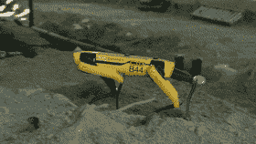
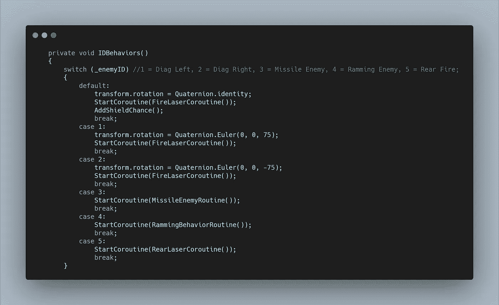
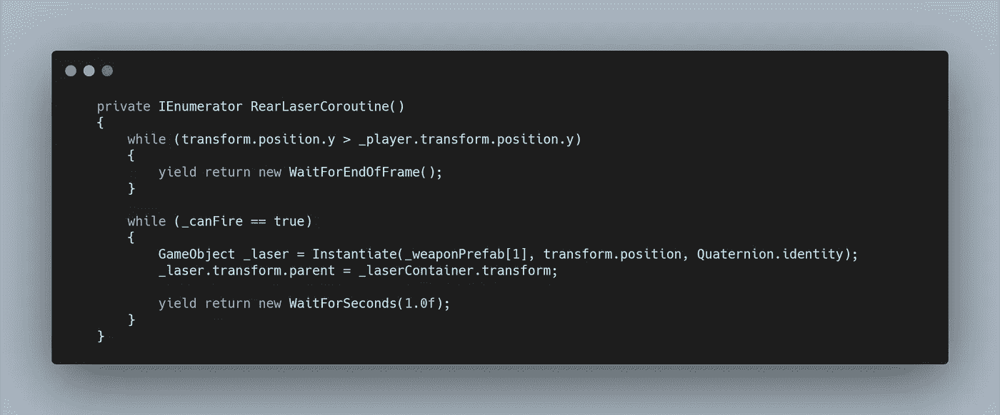
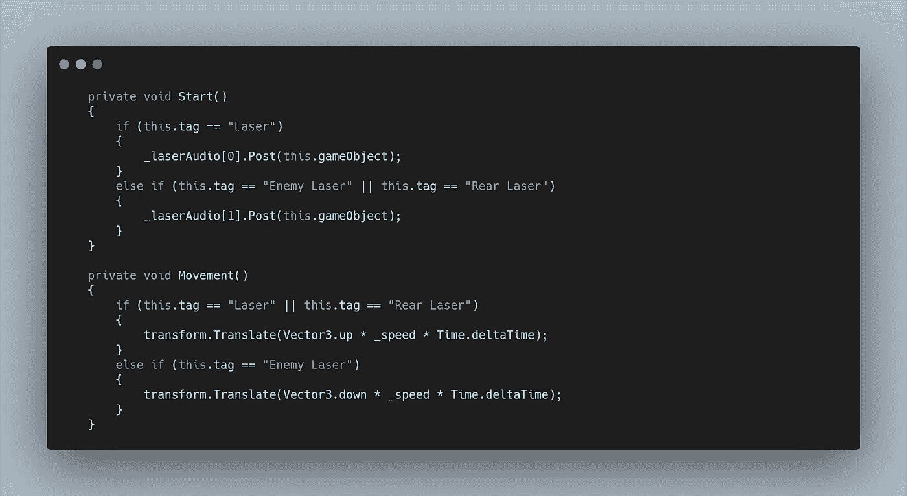
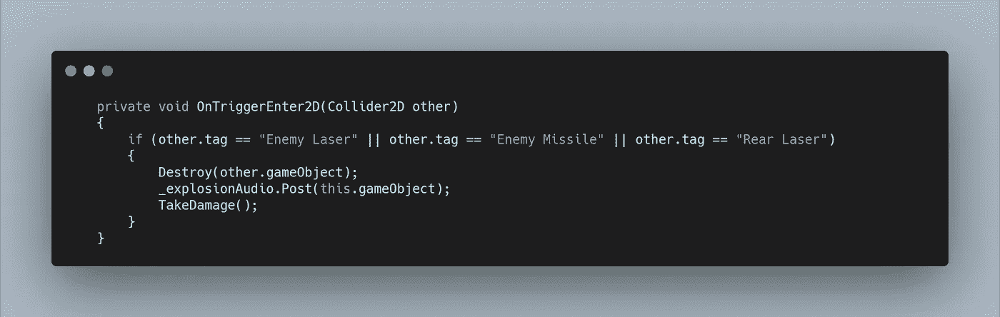
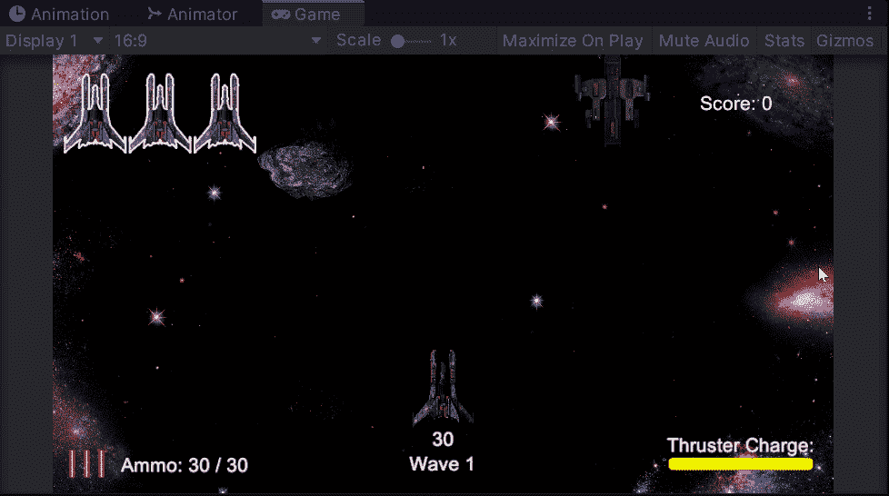

# 太空射击挑战:聪明的敌人类型

> 原文：<https://medium.com/geekculture/space-shooter-challenge-smart-enemy-type-bee7cce600da?source=collection_archive---------35----------------------->

今天的挑战是创造一个聪明的敌人，它知道玩家在它后面，然后向后开枪。首先，我找到了一个合适的敌人，看起来它的后面可能有枪，然后开始工作。

在 **ID 行为切换语句中，**我启动了一个新的**协程。**此外，像昨天的敌人一样，我允许运行**标准移动方法**，以及**移动界限方法**，传入**假**以防止这个新的敌人再次出现在屏幕顶部。

对于行为本身，我运行了一个 **while 循环**，重复每一帧来检测**敌人**何时到达比**玩家更低的 Y 位置，从那里**它运行另一个 **while 循环**，该循环触发我创建的一个新的**激光预设**。由于敌人在开始开火时已经接近屏幕底部，我选择让它每秒开火一次。

新的**激光预置**是一个需要向上移动的双镜头，我利用**标签**在**激光脚本中控制它的功能。**设置张贴**敌方激光音频，**并向上移动。

最后，我需要给**玩家碰撞方法**添加**标签**，这样新的敌人激光也能造成伤害。

正如你在下面看到的，使用双摄，它是一个致命的敌人，可以迅速降低你的健康。我也可能在将来让它掉一个地雷，但是需要先做一些测试来确定难度。

