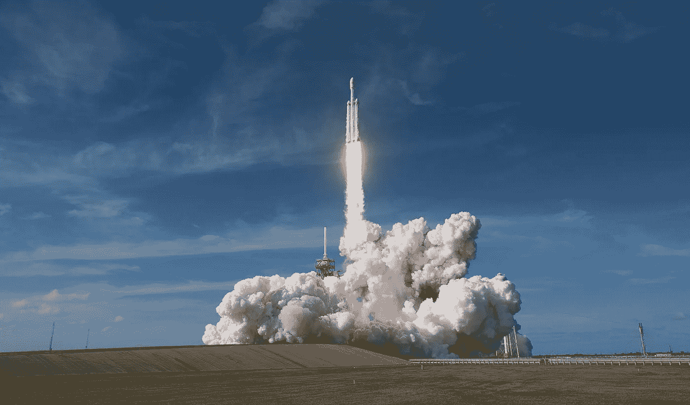

# SpaceX vs. NASA:成本

> 原文：<https://medium.com/geekculture/spacex-vs-nasa-cost-4fae454823ac?source=collection_archive---------1----------------------->

## 在将有效载荷送入太空方面，SpaceX 比 NASA 便宜 10 倍，成本超支低 30 倍。为什么？因为 SpaceX 是基于平台的，NASA 不是。

作者:阿提夫·安萨尔和本特·弗莱布杰

Source: Wikipedia

《经济学人》(2018 年 10 月 18 日)声称:“太空竞赛由新的竞争者主导。”。其中最主要的是 SpaceX，它已经从…