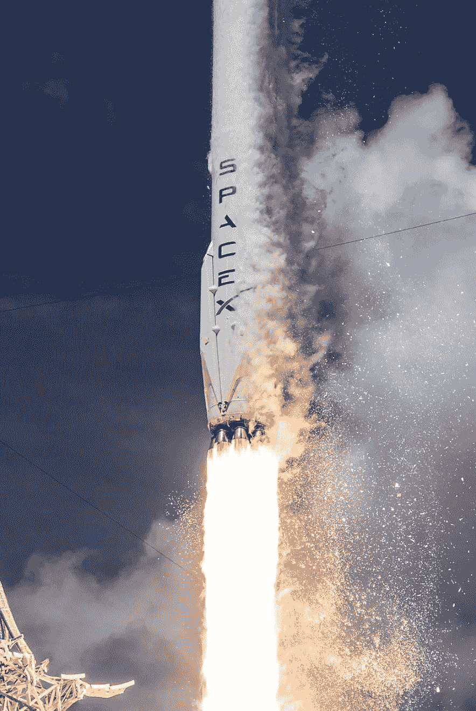

# SpaceX vs. NASA:可扩展性

> 原文：<https://medium.com/geekculture/spacex-vs-nasa-scalability-a60d233dc3e2?source=collection_archive---------4----------------------->

## SpaceX 速度快、成本低、可扩展。美国国家航空航天局缓慢、昂贵，而且是定制的。

作者:阿提夫·安萨尔和本特·弗莱布杰

Source: [Wikipedia](https://en.wikipedia.org/wiki/SpaceX#/media/File:Launch_of_Falcon_9_carrying_ORBCOMM_OG2-M1_(16601442698).jpg)

## **什么是可扩展性？**

我们将可伸缩性定义为在不崩溃或不需要过多额外资源的情况下处理增加的工作量和各种工作负载的能力。的…