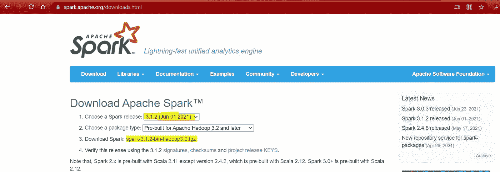
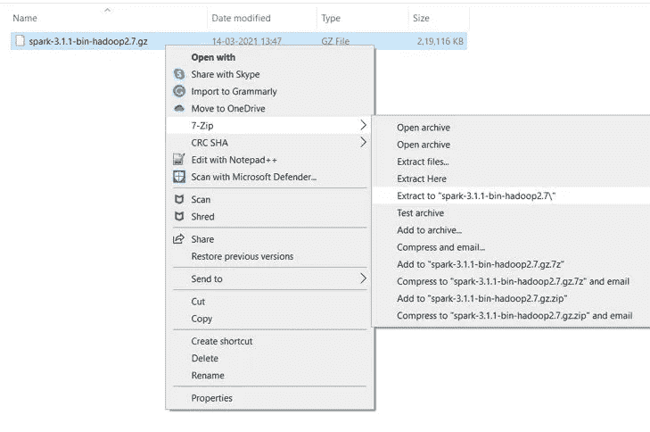
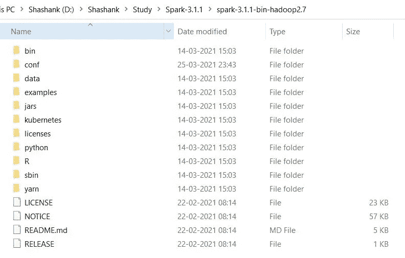
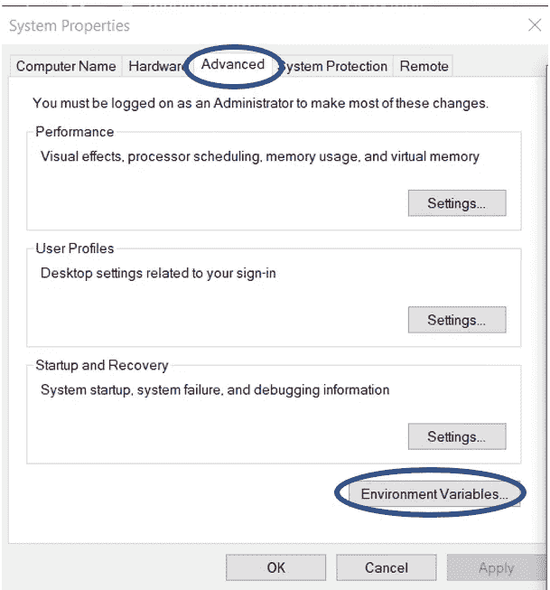
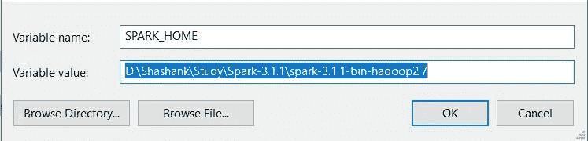
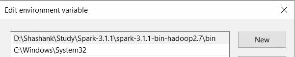
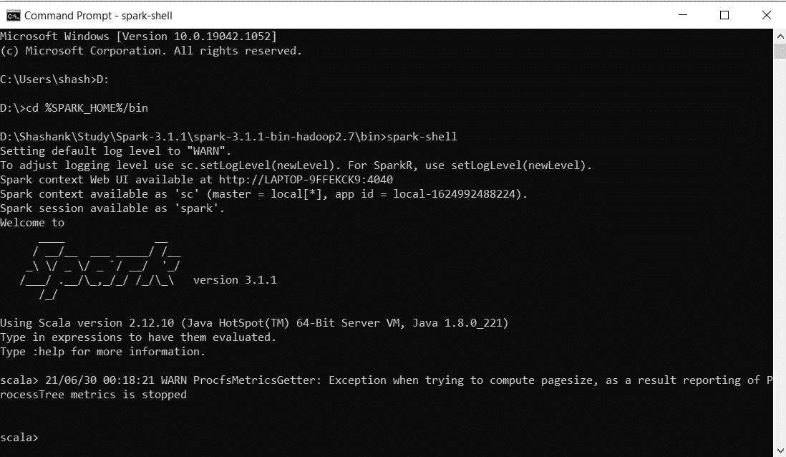
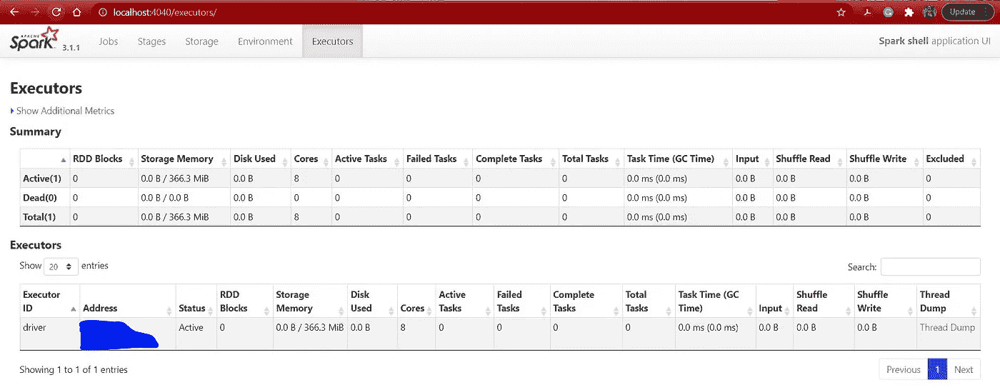

# spark——如何在 Windows 10 中通过 5 个步骤进行安装

> 原文：<https://medium.com/geekculture/spark-how-to-install-in-5-steps-in-windows-10-9336f289139?source=collection_archive---------13----------------------->

在 Windows 10 中安装 Spark 的简单指南。

Image taken from Google images

# 1.先决条件

*   **硬件要求** * RAM — Min。8GB，如果您的系统中有 SSD，那么 4GB RAM 也可以。
    * CPU —最小值。四核，至少 1.80GHz
*   [**JRE 1.8**](https://www.java.com/en/download/windows_offline.jsp)**——**JRE 离线安装程序
*   [**Java 开发套件— 1.8**](https://www.oracle.com/java/technologies/javase/javase-jdk8-downloads.html#license-lightbox)
*   如**[**7Zip**](https://www.7-zip.org/download.html)**或**[**Win Rar**](https://www.win-rar.com/download.html?L=0)*我将使用 64 位 windows 进行处理，请检查并下载您的系统 x86 或 x64 支持的版本。******
*   ****[**Hadoop**](https://archive.apache.org/dist/hadoop/core/hadoop-2.9.2/)*我使用的是 Hadoop-2.9.2，你也可以使用其他任何稳定版本的 Hadoop。
    *如果没有 Hadoop，可以参考从 [Hadoop:如何在 Windows 10 中 5 步安装](https://quickdatascienceds.blogspot.com/2021/06/hadoop-how-to-install-in-5-steps-in.html)安装。****
*   ****[**MySQL 查询浏览器**](https://dev.mysql.com/downloads/mysql/)****
*   ****[**下载 Spark Zip**](https://spark.apache.org/downloads.html)
    *我用的是 Spark 3.1.1，你也可以用其他任何稳定版 for Spark。
    * Spark 的最新版本是 2021 年 6 月发布的 3.1.2(如下图所示)****

********

******Fig 1:- Download Spark-3.1.2******

# ****2.解压并安装 Spark****

****下载完 Spark 之后，我们需要解压 spark-3.1.1-bin-hadoop2.7.gz 文件。****

********

****Fig 2:- Extracting Spark Step-1****

****一旦提取，我们会得到一个新的文件 spark-3.1.1-bin-hadoop2.7.tar
现在，我们再次需要提取这个焦油文件。****

********

******Fig 3:- Extracting Spark Step-2******

****现在，我们可以组织我们的 Spark 安装，我们可以创建一个文件夹，并将最终提取的文件移动到其中。比如说****

********

******Fig 4:- Spark Directory******

*   ****请注意在创建文件夹时，**不要在文件夹名称**之间添加空格。(这可能会在以后引起问题)****
*   ****我把我的火花放在 D: drive 中，你也可以使用 C:或任何其他驱动器。****

# ****3.设置环境变量****

****设置工作环境的另一个重要步骤是设置系统环境变量。****

****要编辑环境变量，请进入控制面板>系统>点击“高级系统设置”链接
，或者，我们可以右键单击该电脑图标，点击属性，然后点击“高级系统设置”链接
，或者，最简单的方法是在搜索栏中搜索环境变量，这样就可以了…😉****

********

****Fig. 5:- Path for Environment Variable****

********

****Fig. 6:- Advanced System Settings Screen****

******3.1 设定火花 _ 首页******

*   ****打开环境变量，点击“用户变量”中的“新建”。****

********

****Fig. 7:- Adding Environment Variable****

*   ****单击“新建”，我们会看到下面的屏幕。****

********

****Fig. 8:- Adding SPARK_HOME****

*   ****现在如图所示，在变量名中添加 SPARK_HOME，在变量值中添加 SPARK 的路径。****
*   ****单击 OK，我们就完成了 SPARK_HOME 设置的一半。****

## ****3.2 设置路径变量****

*   ****设置环境变量的最后一步是在系统变量中设置路径。****

********

******Fig. 9:- Setting Path Variable******

*   ****在系统变量中选择路径变量，然后点击“编辑”。****

********

****Fig. 10:- Adding Path****

*   ****现在我们需要将这些路径添加到路径变量:-
    * %SPARK_HOME%\bin****
*   ****单击确定和确定。&我们已经完成了环境变量的设置。****

## ****3.3 验证路径****

*   ****现在我们需要验证我们所做的是正确的，并且得到了反映。****
*   ****打开一个**新的**命令窗口****
*   ****运行以下命令****

> ****echo %SPARK_HOME%****

*****注意:-如果您想为所有用户设置路径，您需要从系统变量中选择“新建”。*****

# ****4.不使用 Hadoop 进行配置****

****我们中的许多人认为 Hadoop 的安装对于运行 Spark 是必要的，这就变成了安装 Hadoop 和 Spark 的另一项任务。****

****这里可以参考 [Hadoop:如何在 Windows 10](https://quickdatascienceds.blogspot.com/2021/06/hadoop-how-to-install-in-5-steps-in.html) 中 5 步安装。****

****等等…这里有一个特别的提示…注意到了你的 Spark 下载文件中的 Hadoop 部分..！！！****

> ****spark-3 . 1 . 1-bin-**Hadoop 2.7**。地面零点****

****我们实际上可以在不安装 Hadoop 的情况下运行 Spark，只需在 Spark 的 bin 文件夹中添加 1 个文件(winutils.exe)。****

****[**为您各自的 Hadoop 版本下载 winutil.exe**](https://github.com/steveloughran/winutils)**，并将文件放在 Spark bin 文件夹中。******

*******请注意:-每个 Hadoop 版本的 winutils.exe 是不同的，下载 winutils.exe 文件时要特别小心。*******

# ******5.发射火花******

******祝贺..！！！！！
我们已经完成了在系统中设置火花的工作。******

******现在我们需要检查是否一切顺利…******

******打开一个 cmd 窗口，移动到%SPARK_HOME%/bin 目录&运行下面的命令来测试连接和 SPARK。******

********更改目录:-********

> ****cd %SPARK_HOME%/bin****

******启动火花壳:-******

> ****火花壳****

********

****Fig 11:- Running Spark****

****Spark 还默认提供了一个 WebUI，我们可以在****

> ****[http://localhost:4040](http://localhost:4040/)****

********

****Fig12:- Spark Web UI****

# ****6.恭喜..！！！！🎉****

****恭喜你！我们已经成功安装了 Spark。****

****有可能我们中的一些人可能会面临一些问题…不要担心，这很可能是由于一些小失误或不兼容的软件。如果您遇到任何此类问题，请仔细访问所有步骤，并验证正确的软件版本。****

****如果你仍然不能让 Spark 启动并运行，请不要犹豫，在评论区描述你的问题。****

****学习[5 步安装 Hadoop](https://quickdatascienceds.blogspot.com/2021/06/hadoop-how-to-install-in-5-steps-in.html)****

****学习[蜂箱安装的 5 个步骤](https://quickdatascienceds.blogspot.com/2021/06/hive-how-to-install-in-5-steps-in.html)****

****通过 5 个步骤学习[清管器安装](https://quickdatascienceds.blogspot.com/2021/06/pig-how-to-install-in-5-steps-in.html)****

****通过 5 个步骤学习 [Sqoop 安装](https://quickdatascienceds.blogspot.com/2021/06/sqoop-how-to-install-in-5-steps-in.html)****

****快乐学习…😊****