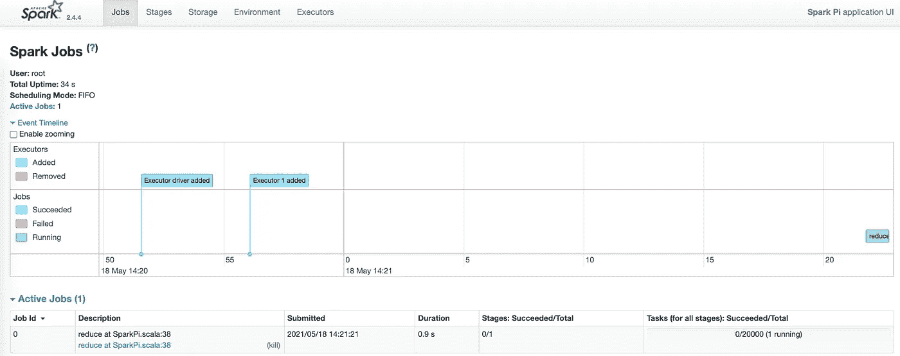
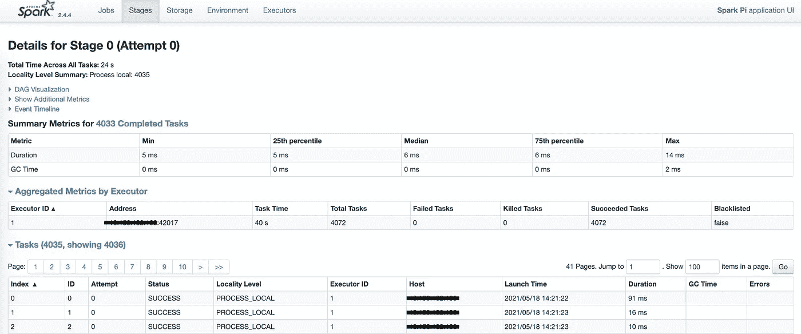
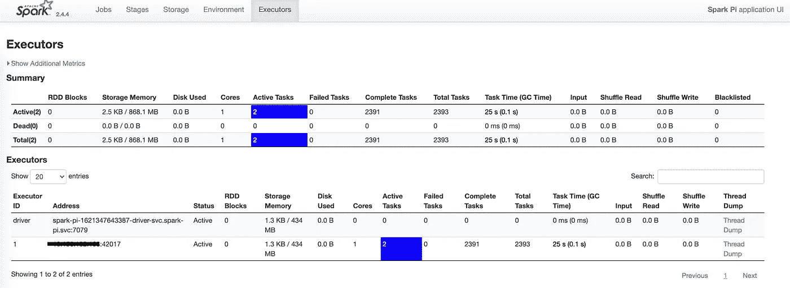
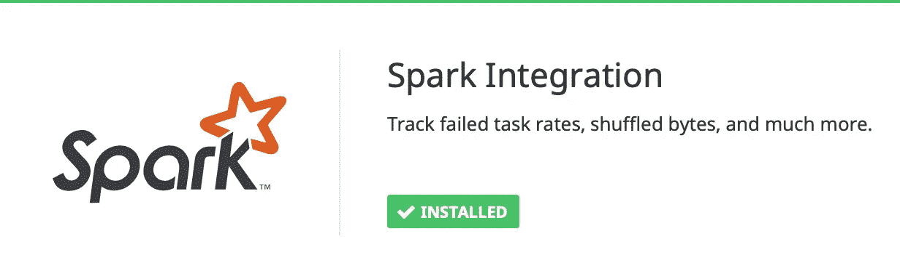
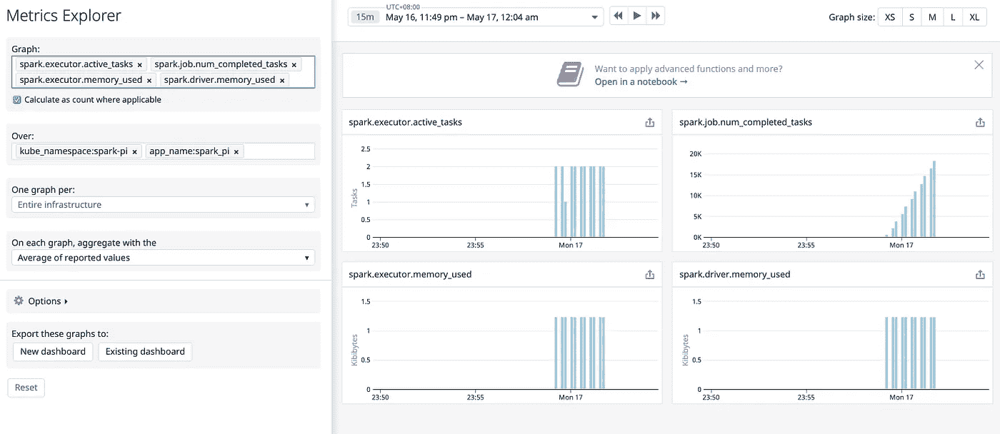

# K8s 上的 Spark—使用自动发现将 Spark 作业的指标发送到 DataDog

> 原文：<https://medium.com/geekculture/spark-on-k8s-send-spark-jobs-metrics-to-datadog-using-autodiscovery-fc10488ecdc9?source=collection_archive---------9----------------------->

今天，我将分享我们如何将 Kubernetes 上的 Spark 作业指标发送到 DataDog，这些指标将用于为 Spark 应用程序创建监视器或仪表板。

# 要求

我建议你花些时间阅读我以前的博客，以了解 K8s 上的 Spark 和 DataDog:

*   [如何在亚马逊 EKS 集群上运行 Spark 作业](https://tunguyen9889.medium.com/how-to-run-spark-job-on-eks-cluster-54f73f90d0bc)。
*   [如何用 IRSA 在亚马逊 EKS 集群上运行 Spark 作业](/swlh/how-to-perform-a-spark-submit-to-amazon-eks-cluster-with-irsa-50af9b26cae)。
*   [用 DataDog](https://tunguyen9889.medium.com/observability-on-k8s-monitor-kubernetes-clusters-with-datadog-14c597def537) 监控 Kubernetes 集群。
*   [DataDog 自动发现和 DogStatsD](/geekculture/observability-on-k8s-datadog-autodiscovery-and-dogstatsd-3404c605fcb7) 。

在本教程中，我将使用 DataDog 自动发现功能来收集 Spark 指标并将其发送到 DataDog。

# 为什么使用自动发现？

DataDog 支持 [450+集成](https://docs.datadoghq.com/integrations/)，包括 [Spark](https://docs.datadoghq.com/integrations/spark/?tab=host) ，可以收集以下指标:

*   驱动程序和执行器:RDD 块，内存使用，磁盘使用，持续时间等。
*   RDDs:分区计数、使用的内存和使用的磁盘。
*   任务:活动、跳过、失败和总计的任务数。
*   作业状态:活动、已完成、跳过和失败的作业数。

当 Spark 安装到主机(EC2、VMs 等)时，DataDog 代理可以轻松收集这些指标。)或 EMR、Mesos、YARN 或独立集群。

但是当 Spark 作业被提交并在 Kubernetes 上运行时，它的行为是不同的:Spark 驱动程序和执行程序作为 Kubernetes pods 运行。每个 Spark 作业通过 driver pod 公开一个 SparkUI 端点，可以用来检查 Spark 的应用程序和状态。



Spark driver UI — 1



Spark driver UI — 2



Spark driver UI — 3

这里的问题是 driver pod 的 IP 地址是由 Kubernetes 网络随机分配的，所以我们无法在 Spark integration 配置文件中定义正确的`spark_url`值。这里的另一个问题是，当我们在 Kubernetes 集群中运行成百上千个 Spark 作业时，我们不能将所有的`spark_url`定义到 DataDog 代理配置文件中。这就是为什么自动发现最适合 K8s 上的这个火花。

# 执行样品火花工作

在这篇文章中，我将重用 Docker 图像，*vitamingaugau/spark:spark-2 . 4 . 4-irsa*，它是在我的[以前的博客](/swlh/how-to-perform-a-spark-submit-to-amazon-eks-cluster-with-irsa-50af9b26cae)中构建的。

首先，确保已在 DataDog 中启用 Spark 集成:



Screenshoot taken in DataDog integrations console

找到 API 控制平面 URL:

```
➜  ~ kubectl cluster-info
Kubernetes control plane is running at https://E3C<hidden>626.yl4.ap-southeast-1.eks.amazonaws.com
CoreDNS is running at https://E3C<hidden>626.yl4.ap-southeast-1.eks.amazonaws.com/api/v1/namespaces/kube-system/services/kube-dns:dns/proxyTo further debug and diagnose cluster problems, use 'kubectl cluster-info dump'.
```

记下 Kubernetes 控制平面的 URL，它将用于 *spark-submit* 。

如下创建文件`spark-pi.yaml`:

```
---
apiVersion: v1
kind: Namespace
metadata:
  name: spark-pi
---
apiVersion: v1
kind: ServiceAccount
metadata:
  name: spark-pi
  namespace: spark-pi
automountServiceAccountToken: true
---
apiVersion: rbac.authorization.k8s.io/v1
kind: Role
metadata:
  name: spark-pi-role
  namespace: spark-pi
rules:
- apiGroups: [""]
  resources: ["pods", "services", "configmaps"]
  verbs: ["get", "list", "watch", "create", "delete", "update", "patch"]
---
apiVersion: rbac.authorization.k8s.io/v1
kind: RoleBinding
metadata:
  name: spark-pi-role-binding
  namespace: spark-pi
subjects:
- kind: ServiceAccount
  name: spark-pi
  namespace: spark-pi
roleRef:
  kind: Role
  name: spark-pi-role
  apiGroup: rbac.authorization.k8s.io
```

然后运行`kubectl apply -f spark-pi.yaml`为 Spark 创建名称空间和 RBAC。

创建一个跳转 pod 来运行 *spark-submit* :

```
➜  ~ cat <<EOF | kubectl apply -f -
apiVersion: v1
kind: Pod
metadata:
  labels:
    run: tmp
  name: tmp
  namespace: spark-pi
spec:
  containers:
  - image: vitamingaugau/spark:spark-2.4.4-irsa
    imagePullPolicy: Always
    name: tmp
    args:
    - sleep
    - "1000000"
    resources: {}
  serviceAccountName: spark-pi
EOF
```

查看[样本 spark.d/conf.yaml](https://github.com/DataDog/integrations-core/blob/master/spark/datadog_checks/spark/data/conf.yaml.example) 了解所有可用的配置选项。您需要将 YAML 转换成 JSON 单行格式，以生成自动发现配置，并将其放入 *spark-submit* 。我为这个测试创建了一个示例`spark-conf.yaml`文件，如下所示(稍后我会解释为什么我们要放入这些值):

```
init_config:instances:
  - spark_url: http://%%host%%:4040
    spark_cluster_mode: spark_driver_mode
    cluster_name: spark-k8s
```

然后将文件转换成 JSON 格式:

```
➜  ~ pip3 install PyYAML
➜  ~ alias yaml2json="python3 -c 'import sys, yaml, json; y=yaml.load(sys.stdin.read(), Loader=yaml.FullLoader); print(json.dumps(y))'"
➜  ~ cat spark-conf.yaml | yaml2json
{"init_config": null, "instances": [{"spark_url": "http://%%host%%:4040", "spark_cluster_mode": "spark_driver_mode", "cluster_name": "spark-k8s"}]}
```

我们将使用下面的`--conf`作为*火花提交*的自动发现配置。记得在双引号`"`前加转义`\`字符，将`null`替换为`[{}]`。

```
 --conf "spark.kubernetes.driver.annotation.ad.datadoghq.com/spark-kubernetes-driver.check_names=[\"spark\"]" \
    --conf "spark.kubernetes.driver.annotation.ad.datadoghq.com/spark-kubernetes-driver.init_configs=[{}]" \
    --conf "spark.kubernetes.driver.annotation.ad.datadoghq.com/spark-kubernetes-driver.instances=[{\"spark_url\": \"http://%%host%%:4040\", \"spark_cluster_mode\": \"spark_driver_mode\", \"cluster_name\": \"spark-k8s\"}]"
```

执行进入跳跃舱`kubectl -n spark-pi exec -it -- bash`并执行*火花提交*:

```
bash-4.4# export K8S_CONTROL_PLANE="https://E3C<hidden>626.yl4.ap-southeast-1.eks.amazonaws.com"bash-4.4# /opt/spark/bin/spark-submit \
    --master=k8s://$K8S_CONTROL_PLANE:443 \
    --deploy-mode cluster \
    --name spark-pi \
    --class org.apache.spark.examples.SparkPi \
    --conf spark.kubernetes.driver.pod.name=spark-pi-driver \
    --conf spark.kubernetes.container.image=vitamingaugau/spark:spark-2.4.4-irsa \
    --conf spark.kubernetes.namespace=spark-pi \
    --conf spark.kubernetes.authenticate.driver.serviceAccountName=spark-pi \
    --conf spark.kubernetes.authenticate.executor.serviceAccountName=spark-pi \
    --conf spark.kubernetes.authenticate.submission.caCertFile=/var/run/secrets/kubernetes.io/serviceaccount/ca.crt \
    --conf spark.kubernetes.authenticate.submission.oauthTokenFile=/var/run/secrets/kubernetes.io/serviceaccount/token \
    --conf "spark.kubernetes.driver.annotation.ad.datadoghq.com/spark-kubernetes-driver.check_names=[\"spark\"]" \
    --conf "spark.kubernetes.driver.annotation.ad.datadoghq.com/spark-kubernetes-driver.init_configs=[{}]" \
    --conf "spark.kubernetes.driver.annotation.ad.datadoghq.com/spark-kubernetes-driver.instances=[{\"spark_url\": \"http://%%host%%:4040\", \"spark_cluster_mode\": \"spark_driver_mode\", \"cluster_name\": \"spark-k8s\"}]" \
    local:///opt/spark/examples/target/scala-2.11/jars/spark-examples_2.11-2.4.4.jar 20000
```

在等待作业运行时，打开另一个终端并验证 Spark driver pod:

```
➜  ~ kubectl -n spark-pi get pod spark-pi-driver -o yaml
apiVersion: v1
kind: Pod
metadata:
  annotations:
    ad.datadoghq.com/spark-kubernetes-driver.check_names: '["spark"]'
    ad.datadoghq.com/spark-kubernetes-driver.init_configs: '[{}]'
    ad.datadoghq.com/spark-kubernetes-driver.instances: '[{"spark_url": "http://%%host%%:4040",
      "spark_cluster_mode": "spark_driver_mode", "cluster_name": "spark-k8s"}]'
    kubernetes.io/psp: eks.privileged
  labels:
    spark-app-selector: spark-2c5bbb79941748be83d62c978e862d6e
    spark-role: driver
  name: spark-pi-driver
  namespace: spark-pi
  ...
spec:
  containers:
  - args:
    - driver
    - --properties-file
    - /opt/spark/conf/spark.properties
    - --class
    - org.apache.spark.examples.SparkPi
    - spark-internal
    - "20000"
    env:
    - name: SPARK_DRIVER_BIND_ADDRESS
      valueFrom:
        fieldRef:
          apiVersion: v1
          fieldPath: status.podIP
    - name: SPARK_LOCAL_DIRS
      value: /var/data/spark-d89cc767-0f63-425c-88ef-44c7fe6d21d1
    - name: SPARK_CONF_DIR
      value: /opt/spark/conf
    image: vitamingaugau/spark:spark-2.4.4-irsa
    imagePullPolicy: IfNotPresent
    name: spark-kubernetes-driver
    ports:
    - containerPort: 7078
      name: driver-rpc-port
      protocol: TCP
    - containerPort: 7079
      name: blockmanager
      protocol: TCP
    - containerPort: 4040
      name: spark-ui
      protocol: TCP
  ...
  nodeName: ip-10-150-123-100.ap-southeast-1.compute.internal
```

我们可以看到 Spark driver pod 具有以下配置:

*   容器名为`spark-kubernetes-driver`，因此 DataDog 自动发现集成模板遵循此格式`ad.datadoghq.com/<container_name>`
*   `spark-ui`端口暴露在端口`4040`上，因此`spark_url`具有值`http://%%host%%:4040`，其中`%%host%%`由 DataDog 代理转换为 pod/container 的 IP 地址。
*   作业以`cluster`模式运行，因此`spark_cluster_mode`具有值`spark_driver_mode`。
*   `cluster_name`是一个标签，将被添加到所有收集的具有值`spark-k8s`的指标中。

现在，我们需要找到与`spark-pi-driver`在同一个节点中运行的 DataDog 代理 pod，以验证集成检查:

```
➜  ~ kubectl get pods --all-namespaces -o wide --field-selector spec.nodeName=ip-10-150-123-100.ap-southeast-1.compute.internal | grep -E "spark-pi-driver|datadog"
addons         datadog-p9fj6       1/1     Running     0     48d    10.150.123.67   ip-10-150-123-100.ap-southeast-1.compute.internal   <none>      <none>
spark-pi       spark-pi-driver     1/1     Running     0     106s   10.150.123.45   ip-10-150-123-100.ap-southeast-1.compute.internal   <none>      <none>
```

运行此命令以验证自动发现是否正常工作，以及代理是否开始收集指标:

```
➜  ~ kubectl -n addons exec -it datadog-p9fj6 -- agent check spark
...
=========
Collector
=========Running Checks
  ==============spark (1.15.0)
    --------------
      Instance ID: spark:a83f2f65603a7da0 [OK]
      Configuration Source: kubelet:docker://e5848a0a8e2c99444ca8095a9eebd17f8a02d5dcf516abbf8aebd5f65fec92e1
      Total Runs: 1
      Metric Samples: Last Run: 0, Total: 0
      Events: Last Run: 0, Total: 0
      Service Checks: Last Run: 1, Total: 1
      Average Execution Time : 8ms
      Last Execution Date : 2021-05-16 16:01:06.000000 UTC
      Last Successful Execution Date : 2021-05-16 16:01:06.000000 UTC2021-05-16 16:01:07 UTC | CORE | INFO | (pkg/collector/python/datadog_agent.go:122 in LogMessage) | spark:c6e4a79673c9e1fe | (spark.py:311) | Returning running apps {'spark-***************************863b5': ('Spark Pi', '[http://10.150.123.45:4040'](http://10.150.123.45:4040'))}
=== Series ===
{
  "series": [
    {
      "metric": "spark.executor.active_tasks",
      "points": [
        [
          1621180867,
          2
        ]
      ],
      "tags": [
        "app_name:Spark Pi",
        "cluster_name:spark-k8s",
        "docker_image:vitamingaugau/spark:spark-2.4.4-irsa",
        "image_name:vitamingaugau/spark",
        "image_tag:spark-2.4.4-irsa",
        "kube_container_name:spark-kubernetes-driver",
        "kube_namespace:spark-pi",
        "kube_service:spark-pi-1621180711634-driver-svc",
        "pod_name:spark-pi-driver",
        "pod_phase:running",
        "short_image:spark"
      ],
      "host": "i-00200eb5d332e4263",
      "type": "count",
      "interval": 0,
      "source_type_name": "System"
    },
...
    {
      "metric": "spark.job.num_completed_tasks",
      "points": [
        [
          1621180867,
          13223
        ]
      ],
      "tags": [
        "app_name:Spark Pi",
        "cluster_name:spark-k8s",
        "docker_image:vitamingaugau/spark:spark-2.4.4-irsa",
        "image_name:vitamingaugau/spark",
        "image_tag:spark-2.4.4-irsa",
        "job_id:0",
        "kube_container_name:spark-kubernetes-driver",
        "kube_namespace:spark-pi",
        "kube_service:spark-pi-1621180711634-driver-svc",
        "pod_name:spark-pi-driver",
        "pod_phase:running",
        "short_image:spark",
        "stage_id:0",
        "status:running"
      ],
      "host": "i-00200eb5d332e4263",
      "type": "count",
      "interval": 0,
      "source_type_name": "System"
    },
...
    {
      "metric": "spark.executor.memory_used",
      "points": [
        [
          1621180867,
          1256
        ]
      ],
      "tags": [
        "app_name:Spark Pi",
        "cluster_name:spark-k8s",
        "docker_image:vitamingaugau/spark:spark-2.4.4-irsa",
        "image_name:vitamingaugau/spark",
        "image_tag:spark-2.4.4-irsa",
        "kube_container_name:spark-kubernetes-driver",
        "kube_namespace:spark-pi",
        "kube_service:spark-pi-1621180711634-driver-svc",
        "pod_name:spark-pi-driver",
        "pod_phase:running",
        "short_image:spark"
      ],
      "host": "i-00200eb5d332e4263",
      "type": "count",
      "interval": 0,
      "source_type_name": "System"
    },
...
    {
      "metric": "spark.driver.memory_used",
      "points": [
        [
          1621180867,
          1256
        ]
      ],
      "tags": [
        "app_name:Spark Pi",
        "cluster_name:spark-k8s",
        "docker_image:vitamingaugau/spark:spark-2.4.4-irsa",
        "image_name:vitamingaugau/spark",
        "image_tag:spark-2.4.4-irsa",
        "kube_container_name:spark-kubernetes-driver",
        "kube_namespace:spark-pi",
        "kube_service:spark-pi-1621180711634-driver-svc",
        "pod_name:spark-pi-driver",
        "pod_phase:running",
        "short_image:spark"
      ],
      "host": "i-00200eb5d332e4263",
      "type": "count",
      "interval": 0,
      "source_type_name": "System"
    },
...
=== Service Checks ===
[
  {
    "check": "spark.driver.can_connect",
    "host_name": "i-00eb5d3e43",
    "timestamp": 1621180867,
    "status": 0,
    "message": "Connection to Spark driver \"[http://10.150.123.45:4040\](http://10.150.123.45:4040\)" was successful",
    "tags": [
      "cluster_name:spark-k8s",
      "docker_image:vitamingaugau/spark:spark-2.4.4-irsa",
      "image_name:vitamingaugau/spark",
      "image_tag:spark-2.4.4-irsa",
      "kube_container_name:spark-kubernetes-driver",
      "kube_namespace:spark-pi",
      "kube_service:spark-pi-1621180711634-driver-svc",
      "pod_name:spark-pi-driver",
      "pod_phase:running",
      "short_image:spark",
      "url:[http://10.150.123.45:4040](http://10.150.123.45:4040)"
    ]
  },
  {
    "check": "spark.application_master.can_connect",
    "host_name": "i-00eb5d3e43",
    "timestamp": 1621180867,
    "status": 0,
    "message": "Connection to ApplicationMaster \"[http://10.150.123.45:4040\](http://10.150.123.45:4040\)" was successful",
    "tags": [
      "cluster_name:spark-k8s",
      "docker_image:vitamingaugau/spark:spark-2.4.4-irsa",
      "image_name:vitamingaugau/spark",
      "image_tag:spark-2.4.4-irsa",
      "kube_container_name:spark-kubernetes-driver",
      "kube_namespace:spark-pi",
      "kube_service:spark-pi-1621180711634-driver-svc",
      "pod_name:spark-pi-driver",
      "pod_phase:running",
      "short_image:spark",
      "url:[http://10.150.123.45:4040](http://10.150.123.45:4040)"
    ]
  }
]
=========
Collector
=========Running Checks
  ==============spark (1.15.0)
    --------------
      Instance ID: spark:c6e4a79673c9e1fe [OK]
      Configuration Source: kubelet:docker://ea263fdb3ad10e8485c9c0ac92f4721652c75879eee1eafc858cffc569b6f8ee
      Total Runs: 1
      Metric Samples: Last Run: 50, Total: 50
      Events: Last Run: 0, Total: 0
      Service Checks: Last Run: 3, Total: 3
      Average Execution Time : 71ms
      Last Execution Date : 2021-05-16 16:01:07.000000 UTC
      Last Successful Execution Date : 2021-05-16 16:01:07.000000 UTC
      metadata:
        version.major: 2
        version.minor: 4
        version.patch: 4
        version.raw: 2.4.4
        version.scheme: semver
```

答对了，DataDog 代理能够检测到`spark-pi-driver` pod 中的自动发现配置( *podAnnotations* )。现在，让我们在 DataDog 指标资源管理器中进行验证，以找到这些指标:



Spark metrics in DataDog

查看[该页面](https://docs.datadoghq.com/integrations/spark/?tab=host#data-collected)以查看 Spark 集成的所有支持指标。

# 结论

在这篇文章中，我们学习了如何使用 *spark-submit* 为 K8s 作业上的 spark 定义 *podAnnotation* ，以及如何配置 DataDog 自动发现来收集 Spark 应用程序指标。这些指标将有助于调试 Spark 作业，或者基于它们创建仪表板和监视器。

希望你喜欢阅读我的博客，并随时留下评论或问题。

查看我的 K8s 系列 Spark 教程:

[](https://tunguyen9889.medium.com/how-to-run-spark-job-on-eks-cluster-54f73f90d0bc) [## 如何在 EKS 集群上运行 Spark 作业

### 在本教程中，我将展示如何在 EKS 集群上运行一个样本 Spark 作业。

tunguyen9889.medium.com](https://tunguyen9889.medium.com/how-to-run-spark-job-on-eks-cluster-54f73f90d0bc) [](/swlh/how-to-perform-a-spark-submit-to-amazon-eks-cluster-with-irsa-50af9b26cae) [## 如何执行 Spark-提交到亚马逊 EKS 集群与 IRSA

### 在上一篇文章中，我介绍了如何向 EKS 集群提交 Spark 作业。只要我们使用其他 AWS…

medium.com](/swlh/how-to-perform-a-spark-submit-to-amazon-eks-cluster-with-irsa-50af9b26cae) [](https://about.me/tunguyen9889) [## 詹姆斯·nguyễn 关于我

### 我是新加坡的云基础设施工程师。看我的博客。

关于我](https://about.me/tunguyen9889)