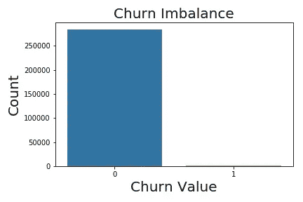
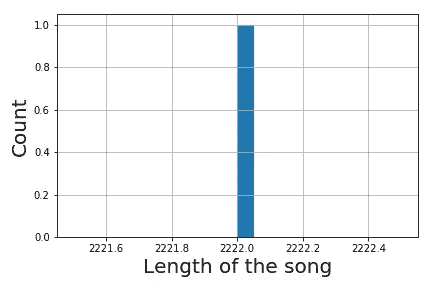
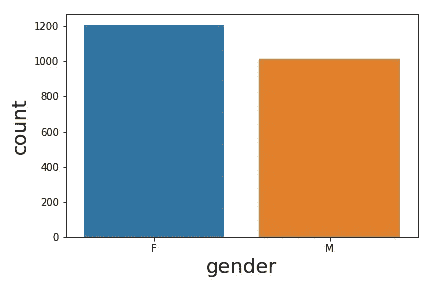
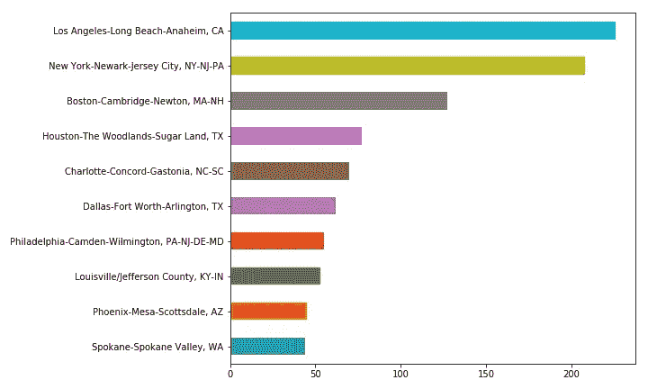
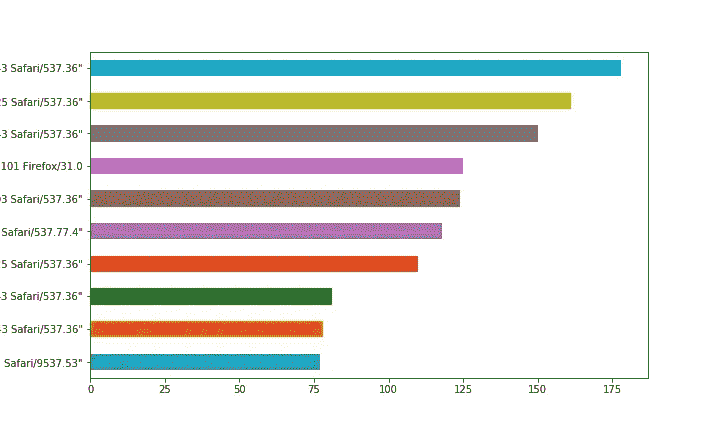
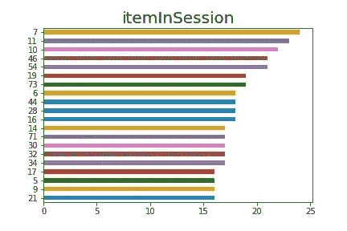
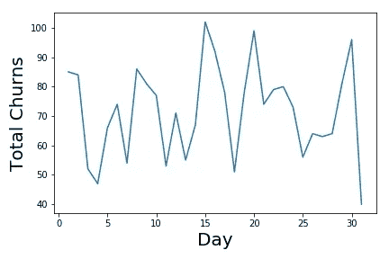
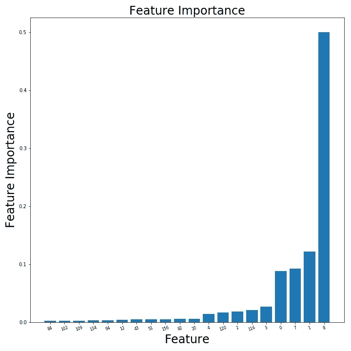

# Sparkify:使用 PySpark 预测客户流失

> 原文：<https://medium.com/geekculture/sparkify-using-pyspark-to-predict-customer-churn-10060cff9d71?source=collection_archive---------24----------------------->


# **简介**

在这个故事中，我将展示一项数据科学研究，该研究基于一家名为 *Sparkify* (就像[Spotify](https://www.spotify.com/br/premium/?utm_source=br-pt_brand_contextual-desktop_text&utm_medium=paidsearch&utm_campaign=alwayson_latam_br_premiumbusiness_core_brand+contextual-desktop+text+exact+br-pt+google&gclid=CjwKCAjw7J6EBhBDEiwA5UUM2lnJCIHXJXj2WF7vHlTtfuPrnFMmTZSCZzAz2lkktDmSA7vdZlXRGRoC9OQQAvD_BwE&gclsrc=aw.ds))的虚构企业，旨在通过模拟音乐流媒体现实世界数据的数据集来预测客户流失。当客户决定取消或降级某个计划的订购时，就会发生客户流失。这个项目是我个人选择的 Udacity 的 Nanodegree [数据科学家](https://www.udacity.com/course/data-scientist-nanodegree--nd025)的顶点项目。

# **项目目标**

这个项目的主要目标是创建一个机器学习模型来预测在给定时间哪个客户将(可能)流失。如果机器学习模型能够高度可靠地预测哪个客户可能会流失，那么应用于数百万客户的相同模型应该能够通过联系这些客户并向他们提供折扣来为(虚构的) *Sparkify* 节省数百万美元，从而潜在地避免预测的流失发生。探索性数据分析、特征工程和机器学习建模将派上用场，在 PySpark 中找到解决这个问题的好方法。当在测试数据中验证机器学习模型时，所选择的度量将是 [f1 分数](https://towardsdatascience.com/multi-class-metrics-made-simple-part-ii-the-f1-score-ebe8b2c2ca1)，因为它是精确度和召回率的加权度量。

# **了解数据**

为了在 *Udacity* 集群中运行该数据集，提供了一个由 *286500* 行和 *18* 列组成的迷你版本。数据集显示没有重复，但是有许多 *NaN 的*在其中，它们被适当地处理，正如这里将显示的。完整代码可以在下面的 GitHub 资源库 [***这里***](https://github.com/vzeizer/Uda_Capstone_Sparkify) 下载。

让我们首先打印 Dataframe 的模式(可用的小型数据集):

```
|-- artist: string (nullable = true)
 |-- auth: string (nullable = true)
 |-- firstName: string (nullable = true)
 |-- gender: string (nullable = true)
 |-- itemInSession: long (nullable = true)
 |-- lastName: string (nullable = true)
 |-- length: double (nullable = true)
 |-- level: string (nullable = true)
 |-- location: string (nullable = true)
 |-- method: string (nullable = true)
 |-- page: string (nullable = true)
 |-- registration: long (nullable = true)
 |-- sessionId: long (nullable = true)
 |-- song: string (nullable = true)
 |-- status: long (nullable = true)
 |-- ts: long (nullable = true)
 |-- userAgent: string (nullable = true)
 |-- userId: string (nullable = true)
```

数据框架的列是不言自明的，对本项目最重要的列将在下面详细研究。值得强调的是，由于 Dataframe 包含时间(*‘ts’*)作为其列之一，因此它由一个 [*时间序列*](https://towardsdatascience.com/time-series-analysis-in-python-an-introduction-70d5a5b1d52a) 组成。

在搜索数据集中的空值和*NaN 的*时，我们发现

```
+------+----+---------+------+-------------+--------+------+-----+--------+------+----+------------+---------+-----+------+---+---------+------+
|artist|auth|firstName|gender|itemInSession|lastName|length|level|location|method|page|registration|sessionId| song|status| ts|userAgent|userId|
+------+----+---------+------+-------------+--------+------+-----+--------+------+----+------------+---------+-----+------+---+---------+------+
| 58392|   0|     8346|  8346|            0|    8346| 58392|    0|    8346|     0|   0|        8346|        0|58392|     0|  0|     8346|     0|
+------+----+---------+------+-------------+--------+------+-----+--------+------+----+------------+---------+-----+------+---+---------+------+
```

考虑到数据的整体大小，这是相当多的缺失数据。因此，删除丢失的数据不是一个好主意。因此，我们通过在分类列的 *NaN 的*中插入 *"missing_val"* ，并将相应列的平均值放在数字列中来解决这个问题。清理后的数据集不再有*南的*。

下一步是创建**流失**列，可以通过考虑页面列来计算，并考虑当我们有“提交降级”或“降级”或“取消确认”或“取消”时，流失已经发生。这导致了数据集中不平衡的列“变动”。

现在，我们准备进入我们故事的下一个阶段，即探索性数据分析，这将在 [Pandas](/swlh/the-mastery-of-pandas-i-50156db42125) 中完成！

# 探索性数据分析

在下面显示的*探索性数据分析*中，我将调查有过不愉快经历的客户，从这些数据中获得见解。

1.  流失*失衡*:

图 1 显示了数据集中无顾客(零)和有顾客(一)的总数:

```
0    284278
1      2222
```



**Figure 1.** it is shown the imbalance of the churn values, zero's represent customers which did not churn and the one's represent customers who churned.

流失不平衡显示在上面的直方图中，可以看出这是一个非常不平衡的数据集。从某种程度上来说，这应该会使预测变得更加困难。

2.搅动*长度*:

下面的直方图(图 2)显示了翻唱客户的歌曲长度。有趣的是，它们都有相同的长度！！这与客户的艺术家和歌曲在原始给定的迷你数据集中全部是南的事实有关。



**Figure 2.** It shows a histogram of the length of the song for customers who churned.

3.按*性别*分类的客户流失:

下面的图 3 显示了顾客的性别直方图。



**Figure 3.** This figure shows a histogram for each gender for customers who churned.

可以看出，更多的女性比男性翻腾。Sparkify 宣布对女性的*折扣*似乎是合适的，以减少这种明显的“女性流失”。

4.通过*位置*搅动:

下图 4 显示了按*位置*划分的搅拌总数。



**Figure 4.** It shows the top 10 locations where churn took place.

从该图可以看出，洛杉矶、纽约和波士顿的客户流失率最高。因此，为 Sparkify 的计划提供折扣是适当的，以便最大限度地减少这些地方的客户流失(最好是在图中所示的前 10 个地方应用此折扣)。

5.用户代理:

下面的图 5 显示了用户代理的客户流失总数。



**Figure 5.** This figure shows the total number of customers who churned by userAgent.

如前所述，我们可以研究前 10 名用户代理，尽量减少客户流失。

6.搅动*项目插入*:

下图(图 6)显示了 *itemInSession* 的客户流失总数。



**Figure 6.** It shows the top 20 itemInSession from which customer churn takes place.

从上图中可以看出，与前面提到的功能相同的讨论也成立，为了尽量减少客户流失，应该对这 20 个最重要的项目进行研究。

*7。时态探索性数据分析*

现在，该数据集的时态分析开始了。

图 7 显示了给定时间段内每天的客户流失总数。



**Figure 7.** It shows total churns by day.

这个时间序列很有趣，它有一个几乎明确定义的模式，总搅动次数几乎周期性地达到最大值和最小值。

# 特征工程

在本次会议中，我将总结通过管道创建机器学习模型的特征工程流程。

我们发现对预测无用的列(它们被删除):

*to_drop_cols=['艺术家'，'验证'，'名字'，'姓氏'，'页面'，'注册'，'会话 Id '，'歌曲'，'小时']*

因为*【艺术家】*【歌曲】*【名字】**【姓氏】【注册】【会话 Id】【小时】*(定义为时间的函数)不携带关于顾客的重要信息。

列 *['gender '，' level '，' method']* 是通过使用 StringIndexer 和 OneHotEncoder 进行功能设计的，而列 *['location '，' userAgent']* 只是通过 StringIndexer 进行功能设计的，因为它们包含了太多的分类值。从这些工程特征中产生了一个矢量汇编器。

# 机器学习模型

为了避免这个[时间](https://towardsdatascience.com/how-data-leakage-affects-machine-learning-models-in-practice-f448be6080d0) [系列](https://mlopshowto.com/data-leakage-part-i-think-you-have-a-great-machine-learning-model-think-again-ad44921fbf34)的*数据泄露*，首先将微型数据集按时间顺序排序，分割成**训练** (80%)和**测试**(剩余 20%)数据帧。测试了几个机器学习模型以及参数调整，以便找到最合适的模型。

我们已经在所有的机器学习模型中设置了合理数量的交叉验证折叠，等于 4。如前所述，我们的最大化指标(越接近 1.0 越好)被选为 f1 分数。对于一些模型，参数网格被详尽地评估以改进结果，而对于一些更方便的模型，我们直接且容易地得到好的模型，而不需要详尽的网格搜索，但是计算成本更高。

总之，我们测试了以下模型:

1.  *Logistic 回归* (LR):正则化参数等于 0.05 和 0.15，弹性网参数等于 0.25 和 0.75，最大迭代次数等于 5 和 10；最佳参数为:regParam: 0.05，elasticNetParam: 0.25，maxIter:5；
2.  *线性回归* (LReg):正则化参数从 0.0 到 0.8，弹性网参数从 0.0 到 0.75；最佳参数为:regParam: 0.0，elasticNetParam:0.0；
3.  *随机森林* (RF):树木数量从 50 到 100，最大深度从 10 到 20；最佳参数为:numTrees: 50，max depth:15；
4.  [*OneVsRest 分类器* (OVR)](https://spark.apache.org/docs/latest/ml-classification-regression.html#one-vs-rest-classifier-aka-one-vs-all) 是用于执行多类分类的机器学习简化的示例，给出了可以有效执行二分类的基础分类器:正则化参数从 0.05 变化到 0.15；值为 0.25 和 0.75 的弹性网络参数；最大迭代次数等于 5 或 10；
5.  *支持向量机* (SVM):用从 0.05 到 0.4 变化的正则化参数运行；最佳参数 regParam 等于 0.1；
6.  *梯度提升树分类器* (GBT):使用默认参数运行。当然，最好的参数是默认的。

下表总结了我们对每个型号测试数据的最佳发现:

**f1 车型-得分**

0.98829

LReg 0.00000

射频 0.98829

OVR 0.98829

SVM 0.98829

*GBT* 0.98799

随机森林被选为最适合这个问题的机器学习模型。可以选择在测试数据上具有类似 f1 分数的其他模型，但是我们选择了随机森林，因为它在决策树上的特性和相对较快的训练速度。图 8 显示了从该分类器中获得的前 10 个最重要的特征:



**Figure 8.** It shows the top 10 feature importances for the random forest classifier.

最重要的特性是指列有' *userAgent* '、' *itemInSession* '和 *'ts'* (时间)。

# 模型评估和验证

最佳模型，随机森林，在训练数据(0.98796)和测试数据(0.98829)上呈现出相当好的结果，最佳树数量等于 50，最大深度等于 15。更多的树或更大的最大深度不会使算法执行得更好。这些值对于随机森林分类器来说非常好，并且训练相对更快。进行了 K=2 或 K=3 的交叉验证，发现了类似的结果。此外，如前所述，该模型的前 3 个特征对于负责客户流失非常有意义。此外，正如将在下面的*调整*部分中讨论的，随机森林适用于大型数据集。

# 正当理由；辩解

随机森林是我目前的选择，作为这个问题的最佳机器学习模型，因为它容易理解，因为它的本质是决策树和相对较快的训练速度。尽管比决策树更复杂，随机森林在测试数据中不容易出现[过度拟合](https://www.datacamp.com/community/tutorials/random-forests-classifier-python#advantages)。此外，Random Forest 对于海量数据的强大功能和[可伸缩性](https://link.springer.com/chapter/10.1007/978-3-642-30217-6_12)使其适合在集群中运行，如[*Amazon Web Services*](https://aws.amazon.com/free/?all-free-tier.sort-by=item.additionalFields.SortRank&all-free-tier.sort-order=asc&awsf.Free%20Tier%20Types=*all&awsf.Free%20Tier%20Categories=categories%23compute&trk=ps_a134p000006gXvEAAU&trkCampaign=acq_paid_search_brand&sc_channel=PS&sc_campaign=acquisition_BR&sc_publisher=Google&sc_category=Cloud%20Computing&sc_country=BR&sc_geo=LATAM&sc_outcome=acq&sc_detail=amazon%20cloud&sc_content=Cloud%20Hosting_e&sc_matchtype=e&sc_segment=490489331981&sc_medium=ACQ-P|PS-GO|Brand|Desktop|SU|Cloud%20Computing|Solution|BR|EN|Text&s_kwcid=AL!4422!3!490489331981!e!!g!!amazon%20cloud&ef_id=CjwKCAjwm7mEBhBsEiwA_of-TPX4tzrRPT8UKvcMYMHMrPDp-h5Mnave-vI5_BuDa3NdRxyYAhKHChoCnR0QAvD_BwE:G:s&s_kwcid=AL!4422!3!490489331981!e!!g!!amazon%20cloud)或 [*IBM Cloud*](https://cloud.ibm.com/login) 。

# 讨论

我们已经成功地在测试数据上训练了几个模型，达到了非常好的 f1 分数。这可能是由于数据较小。运行完整的 12 GB 数据集应该是一种更好的方法，可以获得 f1 分数的真实值。然而，我们的模型没有过度拟合，从这些分析中可以得出许多有趣的结论，正如这里所示。线性回归，最简单的模型，在训练和预测中惨败，其他模型也达到了类似的结果。

# 结论

总之，我们通过 PySpark 和 Pandas 详细研究了一个数据集，它模仿了一个名为 Sparkify 的真实音乐流媒体服务。

我们的 **EDA 结果**已经指出，一小部分客户流失，而且女性比男性流失更多。调查了位置、项目插入、用户代理，通过正确处理这些特征，可以最大限度地减少客户流失。

**当前机器学习模型结果**已经表明，人们可以认为随机森林是最适合这个问题的。这种模式在测试数据上有很高的 f1 分数，因此当应用于数百万用户时，它可能会为 Sparkify 节省数百万美元的资金，从而尽量减少客户流失。该模型最具预测性的列是' *userAgent* '、 *itemInSession* '和 *'ts'* (time)。这非常有趣，因为前两个特征在*探索性数据分析*部分进行了探索，它们在客户流失中扮演着重要角色。因此，开发这些功能非常重要，值得(虚拟)企业 *Sparkify* 的强烈关注。

# 进一步的改进

作为对*探索性数据分析的进一步改进，*可以对*时间序列进行更深入的数据分析。*例如，我们致力于按分钟分析客户流失总数，就像这里展示的几天一样。

*特征工程*可以以不同的方式完成(基于 Kaggle 的[笔记本](https://www.kaggle.com/dhirajrai87/feature-engineering-with-pyspark/notebook)):

1.  使用**缩放和归一化** : StandardScaler 和 MinMaxScaler，以及许多其他工具。
2.  **分桶**用于将连续变量转换为分类变量。之后，我们可以通过 StringIndexer 和 OneHotEncoder 来解决这个问题。
3.  使用 **PCA** 使用特征的维度。
4.  而且，**特征选择**由卡方选择器完成。
5.  测试模型像 [***多层感知器***](https://spark.apache.org/docs/latest/ml-classification-regression.html#multilayer-perceptron-classifier) ***，xgboost 和 catboost*** 分类器也可以测试。然而，为了训练 xgboost 和 catboost，你必须使用 [*PySpark 包装器*](https://databricks.com/blog/2020/11/16/how-to-train-xgboost-with-spark.html) 。
6.  [*堆叠*](https://www.kaggle.com/arthurtok/introduction-to-ensembling-stacking-in-python) :一旦对几个模型进行监督学习，可以使用堆叠，以便从其他预测中获得更好的模型。堆叠使用几个基本分类器的预测作为第一级(基础)，然后在第二级使用另一个模型来预测早期第一级预测的输出。

我希望这是对你有深刻见解的阅读:)

随时加我在[***LinkedIn***](https://www.linkedin.com/in/vagner-zeizer-carvalho-paes-31494b43/)。

欢迎建设性的批评。

如果你喜欢它，请给它一些掌声。