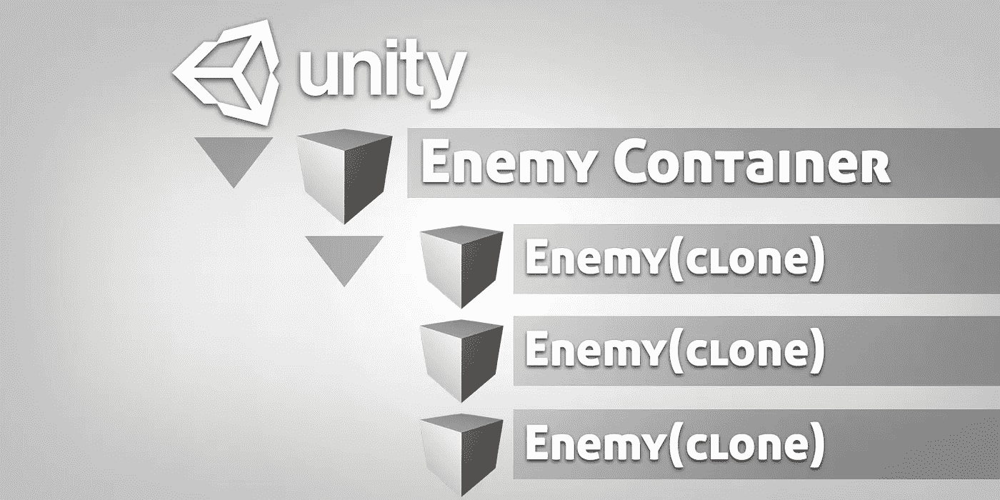

# 在 Unity 中生成对象，没有杂乱

> 原文：<https://medium.com/geekculture/spawning-objects-in-unity-without-the-clutter-3eda8ec0feaa?source=collection_archive---------23----------------------->

当通过 spawn manager 游戏对象在 Unity 中繁殖多个敌人时，用不了多久,**层级**窗口就会被不断增加的敌人游戏对象列表淹没。很容易想象添加多种敌人类型以及其他各种各样的**游戏对象**会很快造成一个非常混乱的层级。在你的场景中滚动所有的游戏对象变得很困难…