# 实体框架某些弱点的特殊解决方案

> 原文：<https://medium.com/geekculture/special-solutions-for-some-weaknesses-of-entity-framework-f4c39e19ec76?source=collection_archive---------0----------------------->


今天我想谈谈我在实体框架上查询原始 SQL 时遇到的困难。首先是。Net 6.0，你可以用 Linq Query 做任何事情。但是如果您需要原始 SQL 呢？例如，如果你需要 SAP 集成，你可能会使用 Hana 库。而且不支持 Hana。Net 6.0 带 Linq 查询还没。所以你必须写原始的 SQL。

在下面的例子中，你可以看到一些简单的自定义查询。结果来自“用户”和“用户地址”表。实体框架需要一个针对查询结果的特定模型" ***DbSet < T >。*【SQL query()】T3。但是如果您的查询结果返回的不是 DB 表呢？如果它从两个或多个表中返回一个定制模型，如下所示。之前在。Net Core 2.0，你可以使用 ***dbData。database . SQL query<some model>****没有任何类型的声明。但是之后。网芯 3.1，可惜不可能。***

> *DbSet <tentity>。SqlQuery() => DbSet <customuservirtualdbmodel>。SqlQuery()</customuservirtualdbmodel></tentity>*

*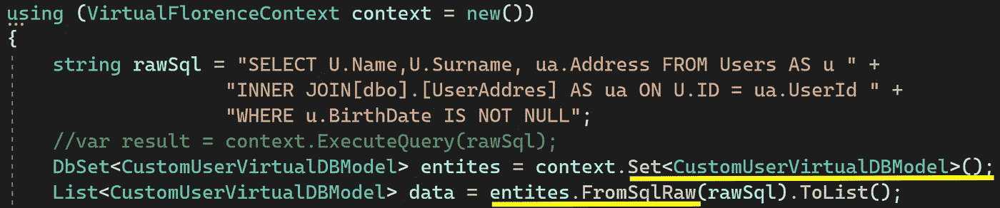*

*Entity Supports RawSql But With One Condition*

```
*using (VirtualFlorenceContext context = new())
{
    string rawSql = "SELECT U.Name,U.Surname, ua.Address FROM Users AS u " + "INNER JOIN[dbo].[UserAddres] AS ua ON U.ID = ua.UserId " +
"WHERE u.BirthDate IS NOT NULL"; DbSet<CustomUserVirtualDBModel> entites = context.Set<CustomUserVirtualDBModel>(); List<CustomUserVirtualDBModel> data = entites.FromSqlRaw(rawSql).ToList();
}*
```

*1。 **解决方案:**可以在 SqlDB“CustomUserVirtualDBModel”上创建一个视图，如下图所示。当然，这不是我的首选，但是您可以在“FromSqlRaw()”方法中使用“View”作为“Entity”。毕竟，您可以将 rawSql 与您的 ViewModel 一起使用，如上所示。但我认为这太疯狂了。为什么，因为我们必须为每个定制模型创建一个 DB 视图。*

*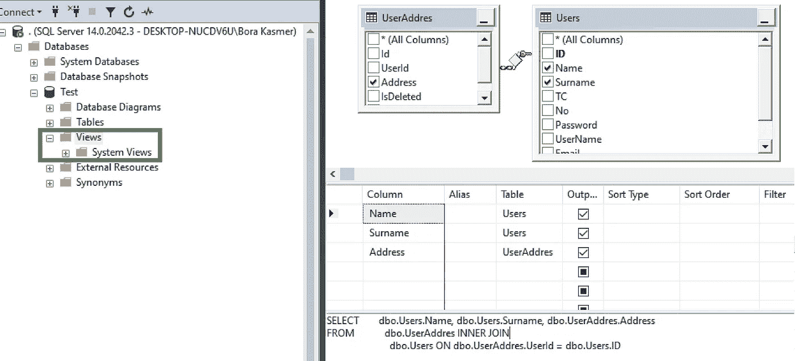*

*Sql Test DB Create CustomUserVirtualDBModel View*

*如果您在 SQLDB 上创建“CustomUserVirtualDBModel”视图，并且如果您不必编写 rawSQL，您可以编写一个简单的 Linq 查询，如下所示。这是额外的奖金信息！*

> ****“生活中充满了艰难的决定，胜利者就是做出这些决定的人。”—丹·布朗****

```
*var result = (from u in Users
join ua in UserAddres on u.ID equals ua.UserId
where u.BirthDate != null
select new CustomUserVirtualDBModel
{
   Name = u.Name,
   Surname = u.Surname,
   Address = ua.Address
}).ToList();*
```

*2。 **解决方案:**可以创建一个 ViewModel 类，并将其添加到 DBContext 中，就好像 SqlDB 中有这样的表一样。这就是我们将如何愚弄 DBContext。*

***这是我们的视图模型:***

```
*namespace DAL.VirtualModels
{
   public partial class CustomUserVirtualDBModel
   {
      public string Name { get; set; }
      public string Surname { get; set; }
      public string Address { get; set; }
   }
}*
```

*这是我们的虚拟 DBContext。真正的 DBContext 是“TestDBContext”。如果我想做一些虚假的更新，我会避免在根 DBContext 上进行更改。我更喜欢更新继承的 VirtualDBContext。*

*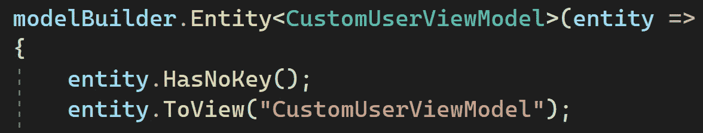*

*   *"*公共类 VirtualTestContext:TestDBContext*":我们从 testdb context 继承了 VirtualTestContext。*
*   **" public DbSet<CustomUserVirtualDBModel>CustomUserVirtualDBModel { get；设置；}"* :我们将像数据库上的表一样将“CustomUserVirtualDBModel”声明为 DbSet。*
*   *"*protected override void on model creating()*":在运行时创建模型时，我们必须对 CustomUserVirtualDBModel 进行一些声明。*
*   *******实体。HasNoKey()* ":我们必须为我们的虚拟实体调用 HasNoKey()方法。因为实体总是需要“主键”，除非我们另外指定。*

```
*namespace DAL.PartialEntities
{
   public class VirtualTestContext : **TestDBContext**
   {
      public VirtualTestContext() { }
      public VirtualTestContext(DbContextOptions <TestDBContext> options): base(options){} ** *public DbSet<CustomUserVirtualDBModel> CustomUserVirtualDBModel { get; set; }*** protected override void **OnModelCreating**(ModelBuilder modelBuilder)
      {
         base.OnModelCreating(modelBuilder);
         modelBuilder.Entity<CustomUserVirtualDBModel>(entity =>
         {
            ***entity.HasNoKey();***
         });
      }
   }
}*
```

*现在我们可以用“ **FromSqlRaw()** ”方法调用我们的 RawSql。我们的假“CustomUserVirtualDBModel”已经准备好了。*

> ****别忘了，实际上 SqlDB 上并没有“CustomUserVirtualDBModel”名称的表。****

```
*using (TestDBContext context = new())
{
    string rawSql = "SELECT U.Name,U.Surname, ua.Address FROM Users AS u " + "INNER JOIN[dbo].[UserAddres] AS ua ON U.ID = ua.UserId " + "WHERE u.BirthDate IS NOT NULL"; DbSet<CustomUserVirtualDBModel> entites = context.Set<***CustomUserVirtualDBModel***>(); List<CustomUserVirtualDBModel> data = entites.***FromSqlRaw(rawSql)***.ToList(); return data;
}*
```

> ****“人生就是一个选择的问题，你做出的每一个选择都造就了你。”—约翰·C·麦斯威尔****

*3。 **解决方案:**如果您不想在 SqlDB 上创建视图或者不想向 DBContext 添加假的 DBSet，您可以为 rawSQL 创建自己的工具。*

***DbContextExtensions . cs:**这是 DBContext 扩展类 DbContextExtensions。我们有两个自定义的 ExtensionQuery()方法。同步和异步方法。*

*   *我们将从当前上下文创建“命令”。数据库，并将“rawSql”设置为“CommandText”属性的值。“DBCommand”是老歌，但永远是金玉类:)*

*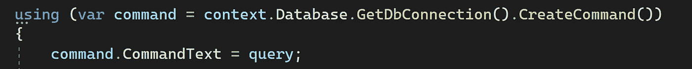*

*DbCommand and CommandText*

*   *如果您执行一个过程并具有任何参数，则可以向 DBCommand 添加参数。*

*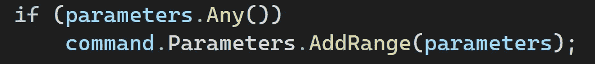*

*Add Parameters to the Command*

*   *我们将使用"命令获取 DbDataReader。ExecuteReader()"并将其作为参数发送给 ReadData()方法。我们后面会讲到 ReadData()方法。最后，我们将关闭 connection，用 dataRow 返回“ *IEnumerable <字典<字符串，对象> >* ”。*

*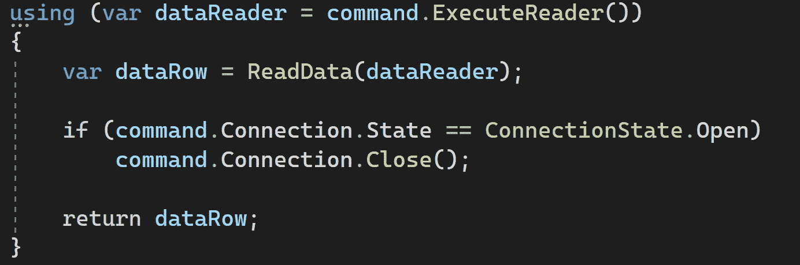*

*DbDataReader & ReadData()*

*   *我们将从阅读器获取所有结果数据，并返回字典列表。首先我们将创建“*列表<字典<字符串，对象> >* ”。我们将循环进入 reader 对象。*

*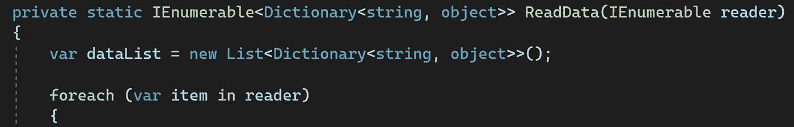*

*   *我们将创建 ExpandoObject()。我们将通过使用反射来获得每一项的属性。我们将把名称设置为字典的键和值，并将它添加到 expando 对象中。*

*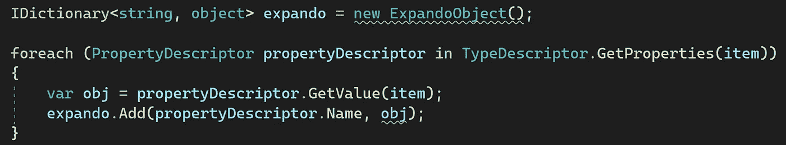*

*   *我们将把每一行添加到数据表中。expando 对象的每个列表项在一行中表示，列表的每个字典项在原始 SQL 结果的一列中表示。最后，我们将返回字典数据表列表。*

*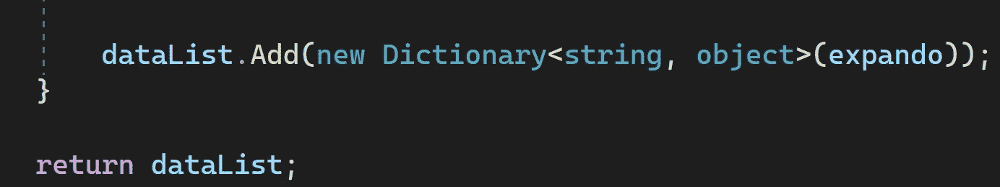**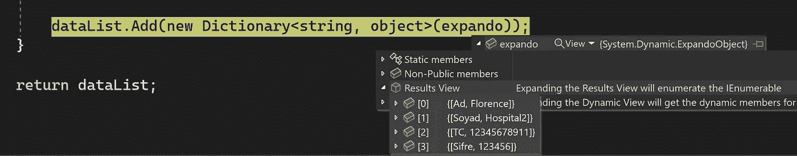*

***dbcontextextensions . cs:***

> ****“知道自己的价值观是什么，就不难做决定。”—罗伊·迪士尼****

# ***converter . cs:***

*是时候将结果“IEnumerable <dictionary>>”转换成“List <t>”了，可以使用 AutoMapper 之类的自定义映射模式。</t></dictionary>*

*   *"*转换器*"类是通用的 IDisposable 类。我们可以在最后用“using(){}”来调用 GC。*
*   **ColumnMatchTable* 用于匹配 DBModel 到 ViewModel 之间的列。*

*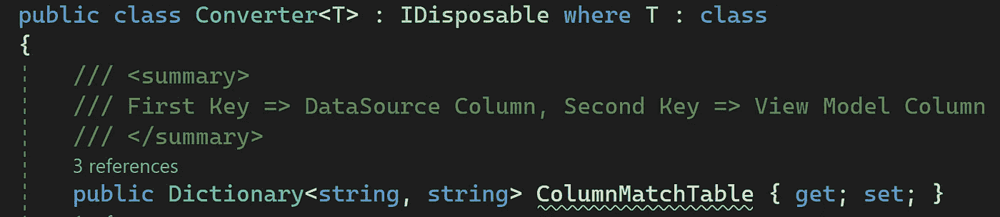*

*   *DictionaryToList()是我们的主要方法。我们将得到一个字典作为参数。“列表”项是我们的返回对象。我们将在字典中循环并获取每一行项目。每一行都是一个模型。每个模型都有很多属性。我们将得到所有这些，并将它们放入“列表<t>”</t>*

*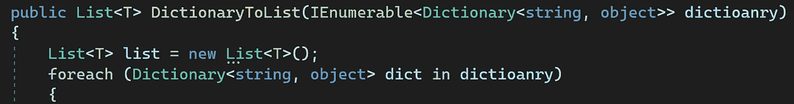*

*Loop into the Dictionary for Every Row*

*   *我们将创建一个<t>模型的实例。我们将循环进入模型属性。我们将获取每个属性，并将值设置为实例模型。</t>*

*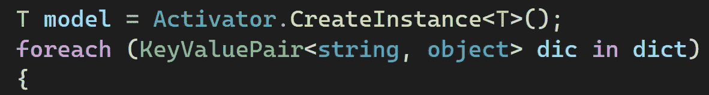*

*Loop into The Model Columns*

*   *字典键是我们的列名，值是我们的列值。我们将从带有反射的列名中获得“PropertyInfo”。我们将在下一节讨论“CheckedMapedKey()”。我们将勾选“*可空。GetUnderlyingType(t)？？t* “可空列类型，我们将检查”系统。DBNull”并获取该属性的值。最后，我们将设置值的模型，并添加到列表中。*

**

*   ***CheckedMapedKey():** 这是我们的 ViewModel 和 DBModel 列匹配模板。我们将把所有 colum match 关键字放入字典中，并将它们设置为 Converter 类的 ColumnMatchTable 字典属性。它的工作方式有点像“*自动映射器*”)*

*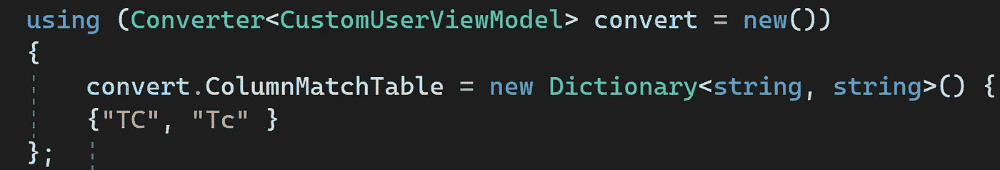*

*Setting ColumnMatchTable Property*

*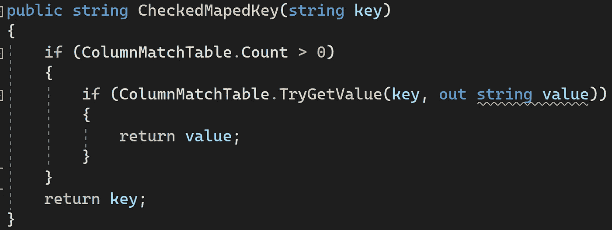*

*Finding Matched Column Word*

***Converter.cs:** 最后我们得到了作为字典的 rawSql 结果，现在我们将把它转换成 List < T >并返回结果。第一个 foreach 循环获取原始 SQL 查询结果的行，第二个 foreach 循环获取每一行的列。*

***Converter.cs:***

# ***如何使用:***

***program.cs:** 我们将准备原始 SQL 查询。稍后，我们将用下面的“***execute query()***”方法得到结果。最重要的是，我们不必再声明任何模型。( ***DbSet < T >)。SqlQuery()*** )*

> *“语境。ExecuteQuery(rawSql)"*

*我们将声明" Converter<customuserviewmodel>" convert class for converting " List<dictionary>> " to " List<t>"。稍后我们将为 ViewModel 和 DBModel 之间的映射列设置“ColumnMatchTable”属性。最后，我们将返回列表<t>数据模型。</t></t></dictionary></customuserviewmodel>*

***program.cs:***

```
*using (DAL.PartialEntities.VirtualTestContext context = new())
{
    try
    {
       string rawSql = "SELECT Name as Ad, Surname as Soyad, TC, " +
       "Password as Sifre FROM [dbo].[Users]";
       rawSql += txtUserID.Text.Trim() != "" ? $" WHERE Id = {txtUserID.Text} AND " + $"BirthDate is not null" : " WHERE BirthDate is not null"; var resultList = context.***ExecuteQuery(rawSql)***;    

      using (Converter<CustomUserViewModel> convert = new())
      {
         convert.ColumnMatchTable = new Dictionary<string, string>(
         {
            {"TC", "Tc" }
         };
         var data = convert.DictionaryToList(resultList);
         return data;
      }
    }
    catch (Exception ex)
    {
       MessageBox.Show(ex.Message);
    }
}*
```

> *“除了我们自己，没有人能拯救我们。没有人可以，也没有人可以。我们自己必须走这条路。”—佛陀*

*我知道 DbDataReader，DbCommand 类是历史的。但它们是非常好的性能工具。在紧急情况下，它们可以成为救命稻草。*

# *如何用字符串 TableName 编写 Linq 查询:*

*在这种情况下,“DB_USER”表将每年重新创建一次。而旧的那个名字，每年过年都像这样用年份标签改“DB_USER2019”。*

*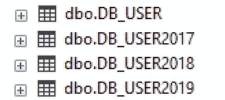*

*Current and Old DB_USER Table*

*如果我们想得到一个包含过去几年的 DB_USER 表记录的报告呢？我们必须获得“DB_USER”表名作为字符串参数。当然下面的代码是不工作的。因为字符串“tableName”在这个查询中没有意义。*

```
*public ServiceResponse<CustomUserModel> GetAllUsersByTable(string tableName)
{
    var response = new ServiceResponse<CustomUserModel>(null);
    try
    {
        var users = from u in ***"tableName"***
          .Where(u=>u.Deleted!=true)
          .Select(cus => new CustomUserModel
          {
             Name = cus.Name,
             LastName = cus.LastName,
             UserName = cus.UserName,
             Password = cus.Password,
             Email = cus.Email,
             Gsm = cus.Gsm,
             IdUser = cus.IdUser,
          }).ToList();
    }
}*
```

*我们必须将这个字符串表名转换成实体。我们有一个第三方库。感谢上帝， ***Linq2DB。EntityFrameworkCore*** ”是当时的救命库:)*

**

*[https://github.com/linq2db/linq2db.EntityFrameworkCore](https://github.com/linq2db/linq2db.EntityFrameworkCore)*

```
*var users = _context.Set<DbUser()
            ***.ToLinqToDBTable().TableName(tableName)***
            .Where(u=>u.Deleted!=true)
            .Select(cus => new CustomUserModel
            {
                 Name = cus.Name,
                 LastName = cus.LastName,
                 UserName = cus.UserName,
                 Password = cus.Password,
                 Email = cus.Email,
                 Gsm = cus.Gsm,
                 IsAdmin = cus.IsAdmin,
                 IdUser = cus.IdUser,
                 CreDate = cus.CreDate
            }).ToList();*
```

*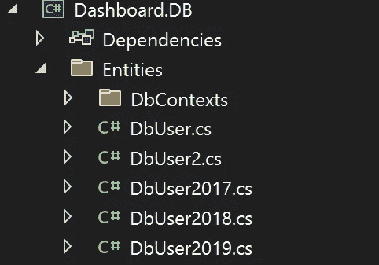*

*Old DB_USER Tables are inculde in DBContext*

*下面的方法将字符串参数转换为实体。当然，您必须在 DBContext 中拥有上述备份实体。并且所有备份实体必须具有相同的属性。*

> *。ToLinqToDBTable()。表名(表名)*

*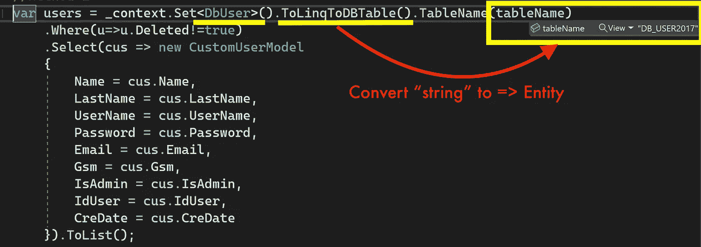*

*Use string parameter in Linq Query With ToLinqToDBTable() Method*

***结论:***

*在本文中，我们试图修复实体中的一些缺陷。我认为(EF)核心产品组尽量避免使用 RawSql。我认为他们有很好的理由这样做。但是有时候，如果没有原始 SQL，我们开发人员就没有任何机会进行编写。像汉纳 SAP 集成或执行一些外部程序。*

*因此，在这一点上，我们可能不得不通过使用定制工具，如" *DBContextExtensions，Converter* **"** 类，走自己的路。或者我们可以在 SqlDB 上为每个 ViewModel 创建视图，或者我们可以创建假的 DBSet 并添加到 DBContext 中。*

*在最后一种情况下，我们尝试在 Linq Query 中使用字符串变量，并在不编写原始 SQL 的情况下获得结果。当我不得不从备份表中获取报告，直到 linq2db 来帮助我时，我很痛苦。*

*下一篇文章再见。*

**“如果你读到现在，首先感谢你的耐心和支持。欢迎大家来我的博客*[](http://www.borakasmer.com/)****了解更多！”*****

****来源:****

*   **[https://learn . Microsoft . com/en-us/ef/core/modeling/keyless-entity-types？tabs =数据-注释](https://learn.microsoft.com/en-us/ef/core/modeling/keyless-entity-types?tabs=data-annotations)**
*   **[https://www . plural sight . com/courses/entity-framework-core-2-getting-started](https://www.pluralsight.com/courses/entity-framework-core-2-getting-started)**
*   **[https://www . thereformedprogrammer . net/ef-core-in-depth-soft-deleting-data-with-global-query-filters/](https://www.thereformedprogrammer.net/ef-core-in-depth-soft-deleting-data-with-global-query-filters/)**
*   **[https://stack overflow . com/questions/26749429/anonymous-type-result-from-SQL-query-execution-entity-framework](https://stackoverflow.com/questions/26749429/anonymous-type-result-from-sql-query-execution-entity-framework)**