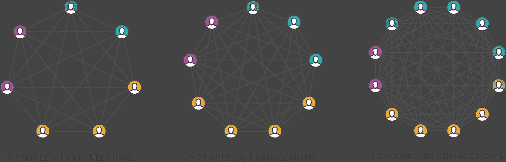

# 3 节产品课，介绍如何提高速度并更快地运送产品

> 原文：<https://medium.com/geekculture/speed-is-everything-3-product-lessons-on-how-to-gain-velocity-and-ship-product-faster-a76ebd158955?source=collection_archive---------9----------------------->

# 第一课:从小处着手，范围永远比你想象的要大。

想法不会完全形成，只有当你在上面时，它们才会变得清晰。当你开始剥洋葱的时候，在显微镜下，事情开始变得不同。

想象你正在尝试做一块饼干。饼干的核心成分只是糖、面粉和黄油。从厨房抓起这些材料需要 30 秒。然而，当你开始做的时候，你开始质疑什么是黄油的最佳比例，并花一个小时看别人的食谱来比较。你可能会发现你用错了面粉。你意识到黄油应该是不加盐的，而不是加盐的。现在你以为一个小时就能完成的事情变成了一整个下午。

> 80%的正确需要 20%的努力。但是，剩下的要付出 80%的努力才能得到。永远为计划外的事情留有余地，从小处着手。

# 第二课:组织结构可以成就或毁灭一个产品。

有两种类型的产品团队:组件团队和特性团队。

组件团队就像一条装配线，每个团队负责香肠制作过程的一部分。这样做的好处是，团队可以专注于他们自己的泳道，并随着时间的推移高质量地交付。然而，鉴于每个团队只拥有解决方案的一部分，他们不能直接将成功与产品的最终结果联系起来。这产生了一些问题:

1.  难以激励:团队成为完成流程的任务承担者，而不是掌握产品的命运。
2.  **缓慢的开发过程:**引入新功能而不影响整个公司的多个团队变得不可能。
3.  **优先级错位:**组件团队开始优化他们自己的部分，这些部分可能不适合整体解决方案，甚至可能没有解决真正的客户问题。

尽可能将你的组织组织成功能团队。特性团队的成功与他们能否解决客户的问题直接相关，这是非常有益和激励的。

> 一个功能团队拥有解决现实世界问题的所有要素，而不必涉及整个公司。

这给了特性团队关注效果、高度激励、快速行动的能力。

# 第三课:人多≠速度快。

通常情况下，当项目缺少员工时，人们会立即求助于招聘作为解决方案。然而，只有当您拥有合适的系统时，获得更多资源才是可行的。

> 如果你操作一个组件团队结构。你添加的人越多，你移动得越慢。

让我们回到饼干制作的例子。如果你让一个人负责糖，一个人负责黄油，一个人负责面粉。每当你引入一个新的变化，你必须让所有 3 个人在同一个房间里调整新的食谱。

我曾在两家公司工作过，其中一家将产品团队构建为功能团队，另一家构建为组件团队。在特性团队中，每个团队都是自己的小公司，他们完全有能力创建端到端的产品。在组件团队中，每个团队都专注于他们自己领域，并要求每个团队一起工作来输出一个产品。

特色团队知道糖、黄油和面粉是如何相互作用的，并负责产品的最终味道和外观。一个组件团队让每个人专门负责一个领域，并且通常需要许多检查和平衡来确保每个组件正确地进入，以通知装配线上的其他团队。如果你想推出一个新产品，为了承担更多的工作，你必须增加所有 3 个团队的人员。

与其把人扔向问题，不如评估并做出系统的改变。有时候你不需要更多的人，你只需要一个重组。