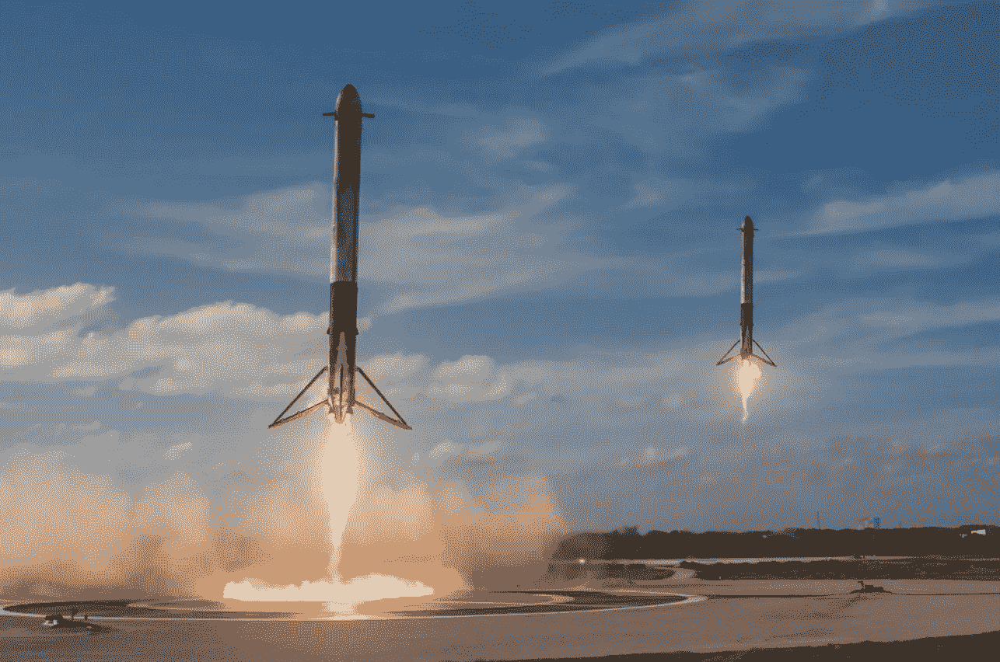

# SpaceX vs. NASA:上市速度

> 原文：<https://medium.com/geekculture/speed-to-market-for-spacex-and-nasa-d409ee8a1f6?source=collection_archive---------0----------------------->

## NASA 在市场推广和迭代方面显然比 SpaceX 慢。

作者:阿提夫·安萨尔和本特·弗莱布杰

Source: [https://unsplash.com/s/photos/spacex](https://unsplash.com/s/photos/spacex)

在上市速度和迭代更新方面，SpaceX 平均比 NASA 快近一倍。就实际交付时间而言，SpaceX 项目从决定建造到完成的实际持续时间更短。†