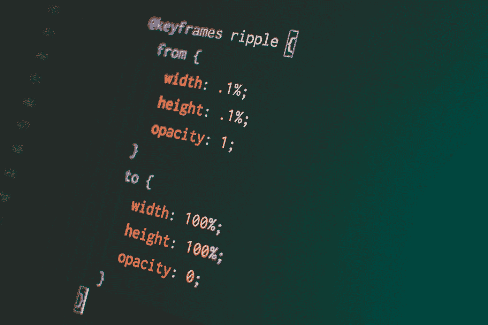

# 用绘制和填充动画增加 Svg 图标的趣味

> 原文：<https://medium.com/geekculture/spicing-up-your-svg-icons-with-draw-and-fill-animations-a178871bc9b?source=collection_archive---------26----------------------->

## 不费吹灰之力就能获得令人印象深刻的效果

A CSS animation, which we will use later

现代用户界面利用 SVG 来显示图标和图像，因为它们在不同的屏幕尺寸上很灵活，但是让它们弹出到你的页面上很无聊。幸运的是，我们可以通过动画做得更好，如果你不想，甚至不需要添加任何特殊的东西——只需要 SVG 元素和 CSS 就可以完成！

跟随我的 CodePen 示例(全部在 React 中)来学习如何操作。

# 什么样的动画？

SVG 或多或少是定义计算机应该如何绘制图像的方式，所以我们创建动画来使它看起来像是 SVG 被绘制到页面中是非常合适的，对吗？

Example of an animation that draws in SVGs

我把动画分成两部分:画线和填充形状。在轮廓完成之前填充形状不仅不协调，而且两者的实现也非常不同。

# 绘制 SVG 线条的动画

我知道我说过你不需要 JavaScript，但 TLDR 版本是[你应该只使用像 Vivus](https://maxwellito.github.io/vivus/) 这样的库，因为它已经是轻量级和配置的，所以不值得你自己制作副本的麻烦。看这支笔，我用它从上面画了一个 5 方块的图案:

Simple animation that draws in lines of an SVG shape using Vivus

但是，如果您是好奇型的，想知道它是如何工作的，或者在没有 JS 的情况下它是如何工作的，我将在本节的剩余部分中介绍它。否则，请随意跳到下一部分。

我并不是第一个创作画 SVG 线条的动画的人。我完全相信这篇博文教会了我这背后的机制。这是我的快速总结:

SVG 支持两个相关的属性，当这两个属性结合在一起时，会产生一种在其中绘制 SVG 的错觉:

*   `stroke-dasharray`，定义 SVG 线中虚线图案的实线和空白部分的长度
*   `stroke-dashoffset`，定义虚线图案的移动量

交互是这样进行的:

1.  通过将`stroke-dasharray`设置为线的精确长度(在下面的例子中为 240)，将会有一条实线，后面跟着相同长度的空白部分。
2.  当`stroke-dashoffset`被设置为线的精确长度(再次为 240)时，仅显示空白部分。
3.  随着`stroke-dashoffset`减少到 0，空行移动得越来越多，显示出越来越多的实线部分，使它看起来像正在被绘制。

因为它和`stroke`一起工作，你画的线必须有`stroke` 定义。正如你在下面看到的，这只用 CSS 就能做到！

Simple animation that draws in lines of an SVG shape using only CSS

# 动画填充

动画填充需要 SVG 元素而不是 CSS 元素:

*   `linearGradient` 允许我们定义多种颜色来填充一个形状。是的，一个梯度。
*   `stop` 定义在线性渐变中放置颜色的方式和位置
*   `animate` 定义了如何在 SVG 中逐渐改变属性

交互是这样进行的:

1.  当一个`linearGradient` 中的两个`stop` 元素有相同的`offset` 属性时，它有一个硬边框而不是渐变，所以我们可以设置一种颜色为白色或透明，另一种为填充色。
2.  如果动画元素同等地改变两个停止点的偏移属性，则线条会移动，导致 SVG 被填充的错觉。
3.  我们可以通过属性`fill=”url(#linear-gradient-id)”`使用`linearGradient`制作形状

同样，不需要 JavaScript！

您可以将线条绘制和填充与`animate`中的`begin`属性结合使用，这将延迟`animate`的生效。看看两者的合作:

Animation that draws SVG shapes and then fills in the shapes afterwards

# 进一步的改进

虽然上面两个例子可以涵盖很多用例，但最后一个例子仍然不够完美。每个矩形同时填充。如果矩形在画好之后就开始填充，那就更好看了。我想出了一个方法来做到这一点，但我们需要一些 JavaScript 和 SVG 操作。

为了便于解释，请参见代码笔:

Animation that draws the shape and immediately starts filling it in when the shape is drawn

1.  我将每个`path`的值放到它自己的字符串中，并将它们放入一个数组中。
2.  然后，我为每个字符串呈现一个`path`和一个`linearGradient`。渐变有一个唯一的`id`，它被`path`唯一地用作它的`fill`。
3.  基于索引，线性梯度具有不同的`begin`值，因此每个值都有自己的延迟。

就是这样！真的就这么简单！(假设您计算出每个`stop`的正确延迟，即……)

# 结束语

每当您想在加载时向页面添加一些光晕时，可以考虑使用这些 SVG 动画来实现。很多这些都可以在没有 JS 的情况下完成，甚至这些库都是相当轻量级的，所以您可以在不增加包大小的情况下自由地完成。如果没有别的，我展示的人们称这种效果为“**华丽**”(他们的话，不是我的)所以你至少会用它给一些人留下深刻印象！