# C++中机器人的螺旋曲线

> 原文：<https://medium.com/geekculture/spiral-curves-for-robotics-in-c-9c3d80abe4d1?source=collection_archive---------4----------------------->


Google.com

[螺线](https://en.wikipedia.org/wiki/Spiral)是曲线或图案，自然界存在。数学关系可以表达植物、动物的形状和物理自然现象。

在本文中，我将展示几个螺旋方程，它们用于模拟机器人运动轨迹的曲率、机器人路径上各路点之间的过渡曲线或路径平滑目的。

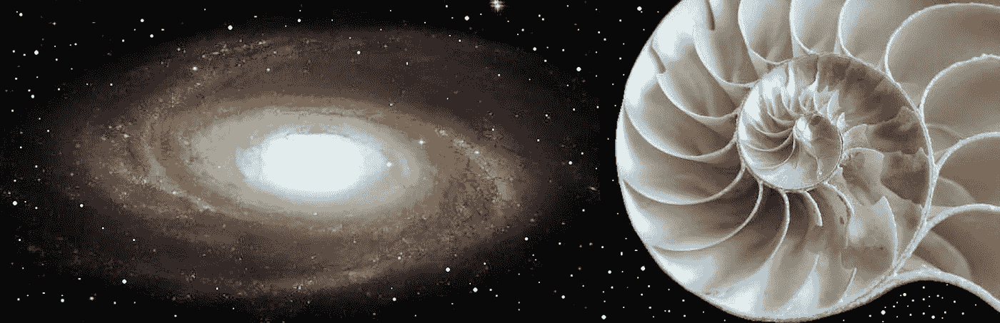

google.com

**轨迹应该是足够平滑的时间函数，并且
它应该考虑关节速度、加速度、急动和扭矩的任何给定限制。**

当机器人路径规划器计算无障碍路径时——关节空间协调系统中的一组节点(对于机械手)。之后，为了确保机器人运动的平滑性(例如，机器人必须无颠簸地移动)，有必要计算连接无障碍节点的平滑路径。

大自然创造了非凡的形状，伟大的人类用数学方程式描述了这些形状。
在机器人领域，这些等式经常被使用。下面的曲线绘制了很长一段时间，并使用特定的常数参数。通常在机器人学中，我们使用弧、长度或曲率的特定部分。所有这些参数都与机器人运动相关。这里我给你一个如何用 C++绘制这些曲线的一般描述(所有源代码都在我的 [GitHub](https://github.com/markusbuchholz/Spiral_Curves_for_Robotics_in_Cpp) 上)。

[头文件](https://github.com/lava/matplotlib-cpp)(用于绘图库)必须与你的 cpp(一个你可以从我的库克隆的文件)在同一个文件夹中。
你的程序可以编译如下:

```
//compile
g++ my_prog.cpp -o my_prog -I/usr/include/python3.8 -lpython3.8// //run
./my_prog//folder tree
├── my_prog
├── my_prog.cpp
├── matplotlibcpp.h
```

关于螺旋曲线的所有其他具体信息，你可以在维基百科[上找到。](https://en.wikipedia.org/wiki/Spiral)

# **阿基米德螺旋**

[阿基米德螺线](https://en.wikipedia.org/wiki/Archimedean_spiral)，参数方程可推导如下:

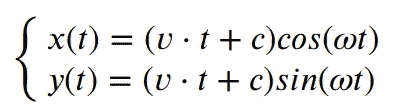

这里 *vt* + *c* 是质点在任意时刻 *t.* 的[位置矢量](https://en.wikipedia.org/wiki/Position_(vector))

解决方案如下，

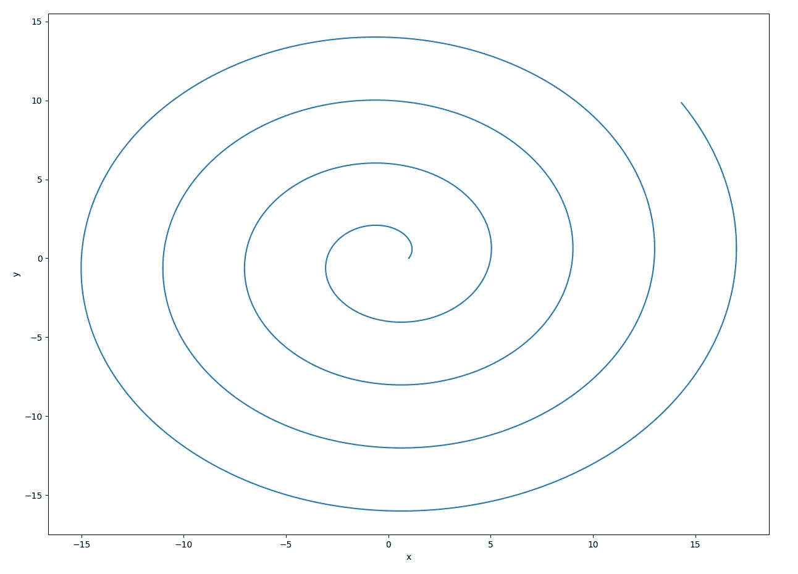

Archimedean spiral

# 双曲线螺旋

[双曲螺线](https://en.wikipedia.org/wiki/Hyperbolic_spiral)，参数方程可推导如下:

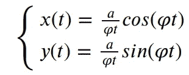

双曲螺线(在 XY-平面中)接近作为渐近点的原点 *φ* → ∞。对于 *φ* → 0，曲线有一条渐近线。

解决方案如下，

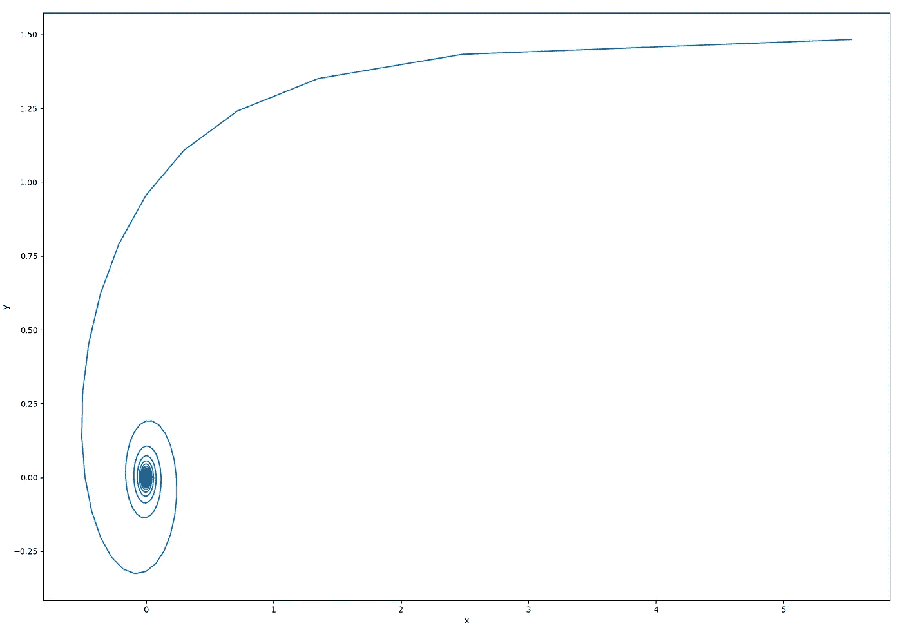

Hyperbolic spiral

# 费马螺旋

[费马螺线](https://en.wikipedia.org/wiki/Fermat%27s_spiral)，参数方程可以推导如下:

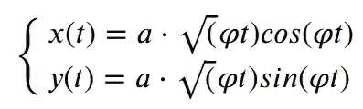

其在参数𝜑在正实数上变化时生成曲线。

解决方案如下(同一地块上的正负方向)，

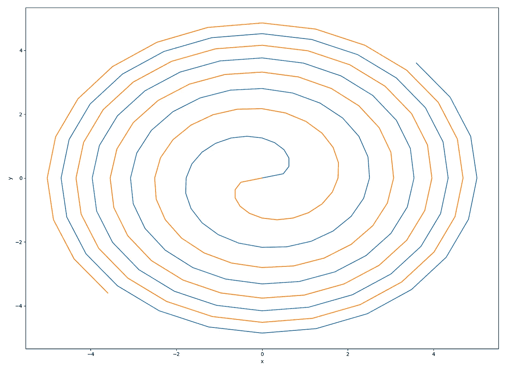

Fermat’s spiral

# 李图斯螺旋

[李图斯螺旋线](https://en.wikipedia.org/wiki/Lituus_(mathematics))，参数方程可推导如下:

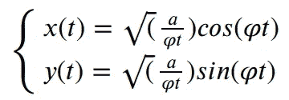

解如下(曲线渐近逼近参数 a)。

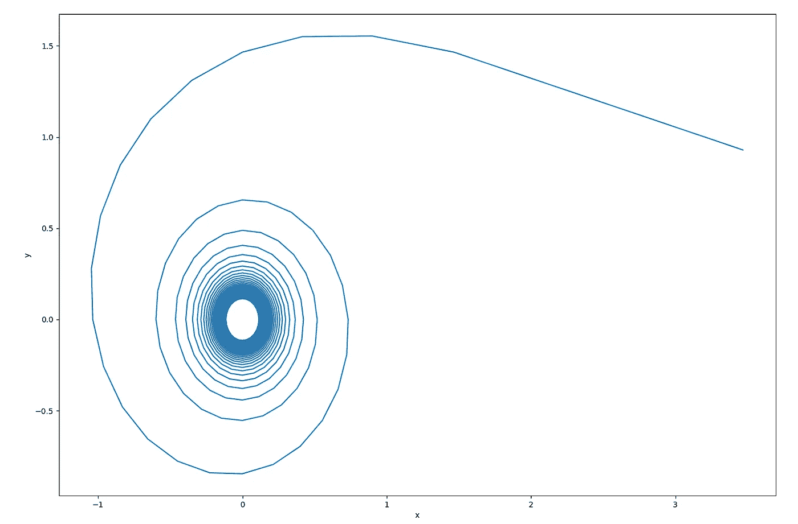

Lituus spiral

# 对数螺线

对数螺线，参数方程可以导出如下:

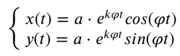

**e** 代表[自然对数](https://en.wikipedia.org/wiki/Natural_logarithm)的底数， **a，k** 为实常数。

解决方案如下，

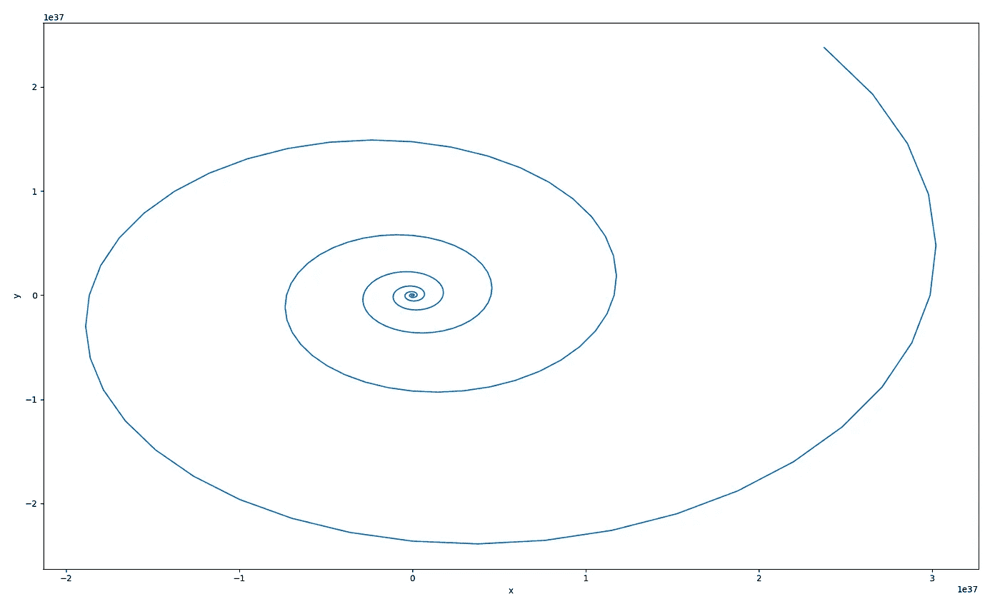

Logarithmic spiral

# **考努螺旋，**欧拉螺旋

[科纽螺线](https://en.wikipedia.org/wiki/Euler_spiral)，参数方程可推导如下([菲涅耳积分](https://en.wikipedia.org/wiki/Fresnel_integral))

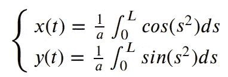

解决方案如下，

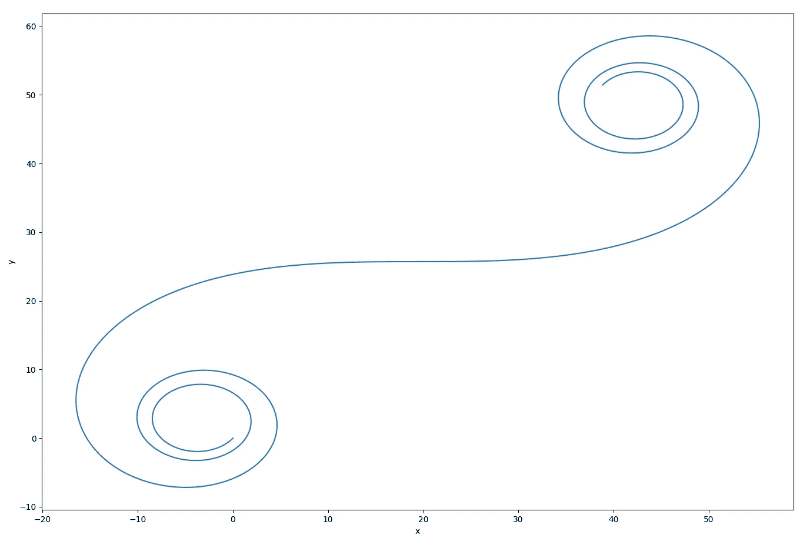

Cornu spiral, Euler spiral

# 多普勒螺旋

多普勒螺旋的灵感来自于[多普勒效应](https://en.wikipedia.org/wiki/Doppler_effect) t。参数方程可以推导如下:

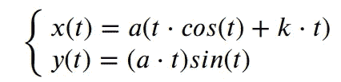

解决方案如下，

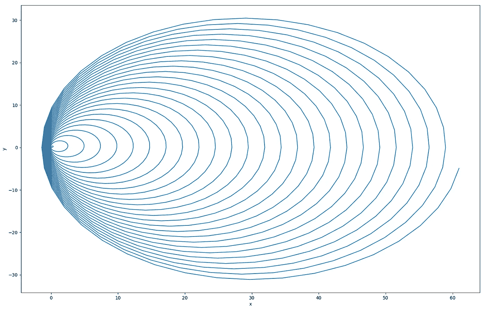

Doppler Spiral

我们也可以在 3D 空间中找到解决方案。这里有一些例子。

# 球形螺旋

球形螺线的参数方程可以推导如下:

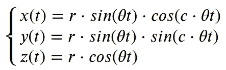

其中 c 是一个参数，

解决方案如下，

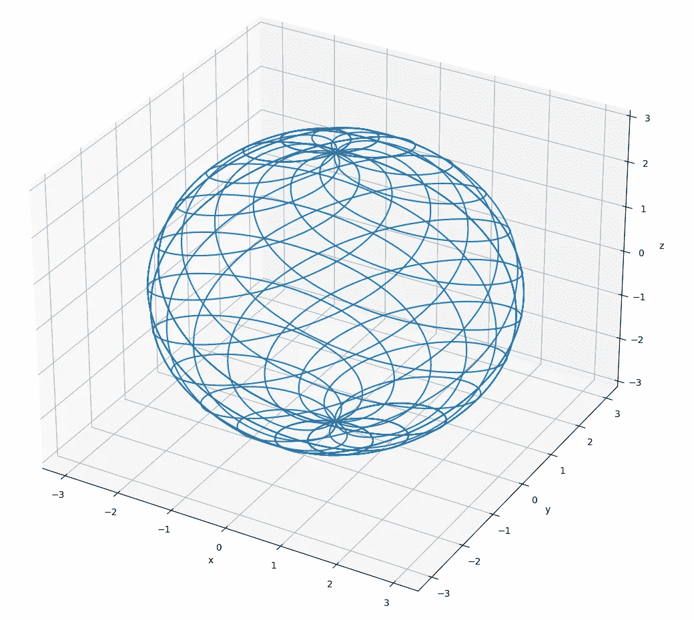

Spherical spirals

# 锥形螺旋

球形螺线的参数方程可以推导如下:

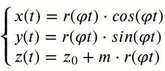

其中 m 是一个参数。

解决方案如下，

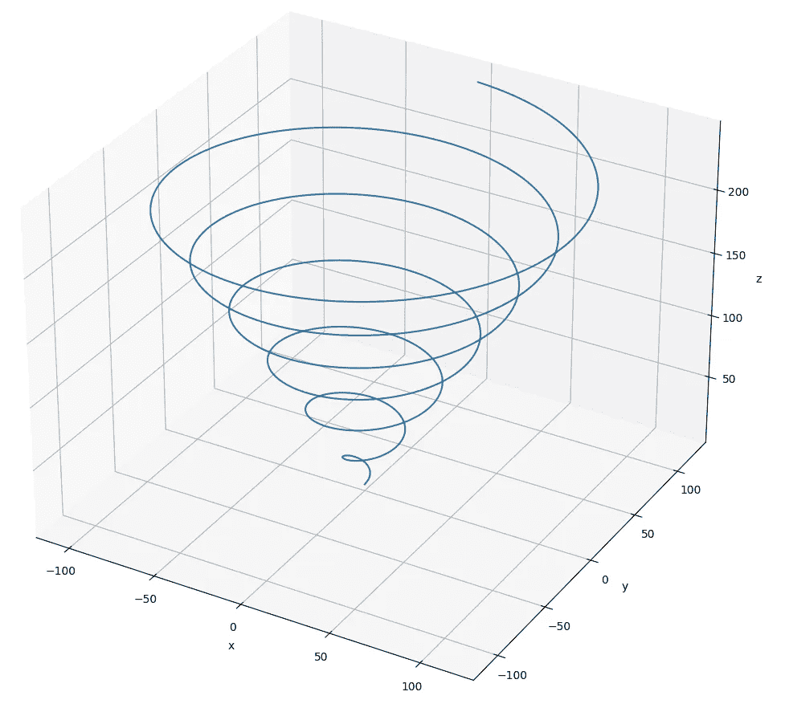

Conical spirals

感谢您的阅读。