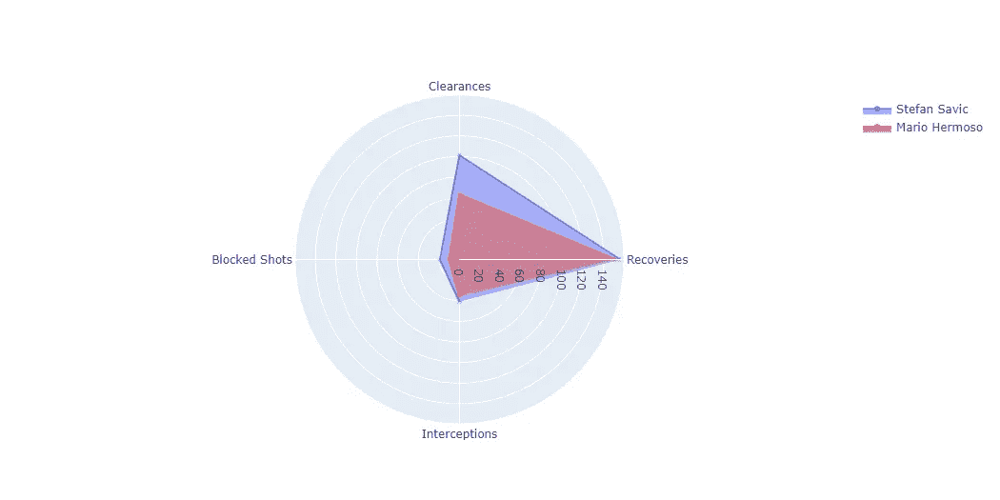
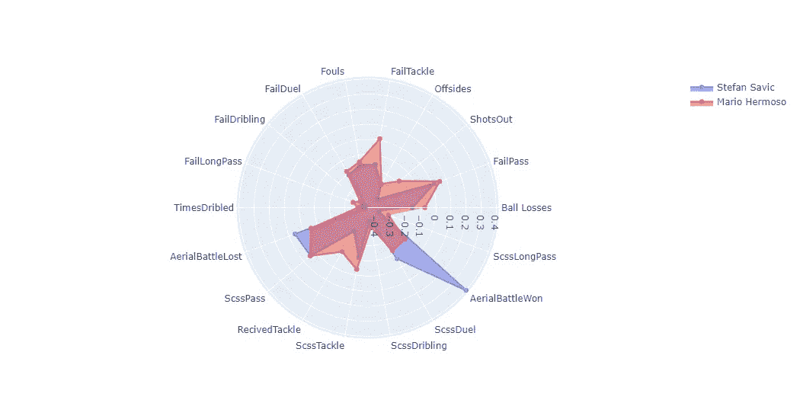
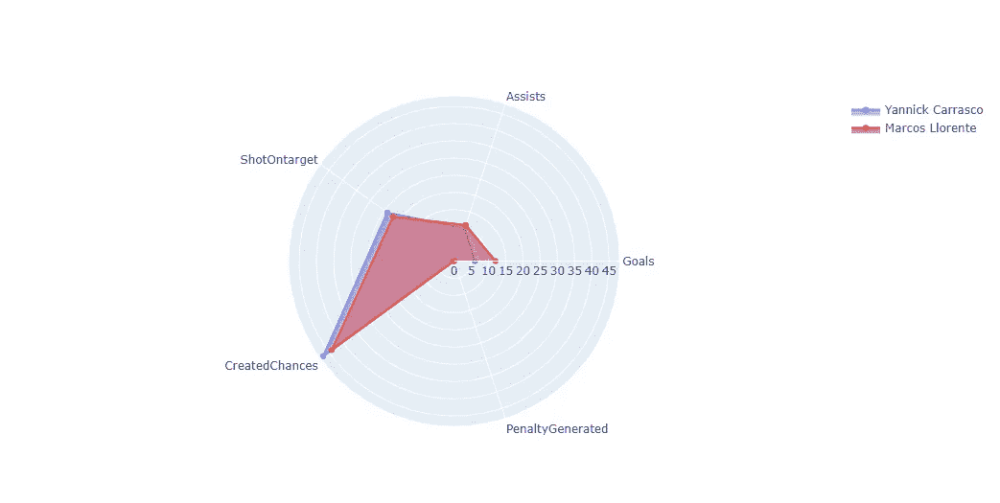
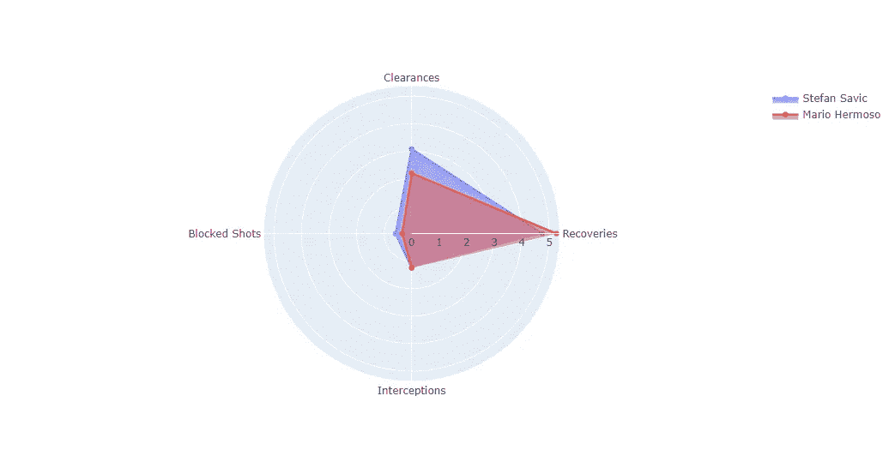
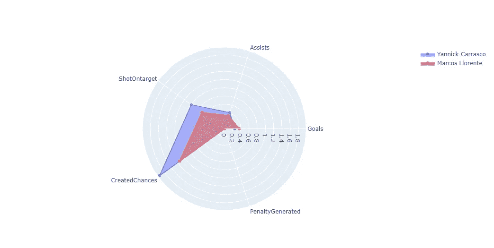

# 运动员赛季分析。

> 原文：<https://medium.com/geekculture/sports-analytics-player-season-analysis-b8e5bb953411?source=collection_archive---------33----------------------->

马德里竞技一直是国家足球联赛的冠军，但是球员们在联赛中的影响力如何呢？


# 0.我们有什么数据？

首先，我想谈谈数据集。该数据集包含 22 名马德里竞技球员(但不包括守门员)的信息，这是因为 GK 影响力是用其他不同的指标衡量的。

该数据集包含每个球员的下一个信息和相应的值:“ID”、“位置”、“俱乐部”、“进球”、“助攻”、“恢复”、“T0”、“球损失”、“ScssPass”、“失误传球”、“ShotOntarget”、“ShotsOut”、“T1”、“越位”、“ScssTackle”、“失误铲球”、“RecivedTackle”、“犯规”、“T2”、“ScssDuel”、“失误决斗”、“CreatedChances”、“ScssDribling”、“T3”、“FailDribling”、“ScssLongPass”、“失误传球”、“解围”、“T4”、“TimesDribled”、“罚”

正如我们所看到的，我们有很多一般信息，我们可以计算赛季中的一般影响，因为我们可以计算俱乐部的总价值。例如，如果我们想计算一个球员的进球影响力，我们会这样做:(player goals/totalteagoals)X100。知道了这些，我们就可以计算出每个玩家在游戏中的影响力，也可以和其他玩家进行信息对比。

# 1.在赛季中的影响力。

这个分析的第一部分是关于获得球员在全球赛季的影响力，这是:一个球员在进攻和防守中的影响力有多大？

**1.1 防御性影响。**

我将从防御影响开始。为了计算它，我选择了一些指标，这是:恢复，盖帽，解围和拦截。为了计算防御影响，我使用了下一个公式:

*防守影响=(恢复+盖帽+解围+拦截)/(团队恢复+团队盖帽+团队解围+团队拦截)*

使用的代码如下:

```
def defensive_influence(name):
    try:
        cols = ['Recoveries', 'Clearances', 'Blocked Shots',             'Interceptions']sumpdi = data.loc[name, cols].sum() #Player defense influence

        totpdi = data.loc['Total', cols].sum() #Team defense influencePDIE = round((sumpdi/totpdi)*100, 2) #Defensive influence estimated
        return PDIE

    except:
        print('Something was wrong, try again.')
```

这段代码返回作为参数传递的球员的防守影响估计值，如果我们想计算每个球员的防守影响，我们可以这样做:

```
for name in data.index:
    tot = defensive_influence(name)
    print('Player:', name, ', Influence: ', tot)#OUTPUT:
Player: Felipe Monteiro , Influence:  10.39
Player: Jose María Giménez , Influence:  5.98
Player: Stefan Savic , Influence:  10.83
Player: Mario Hermoso , Influence:  8.89
Player: Kieran trippier , Influence:  8.1
Player: Renan Lodi , Influence:  3.55
Player: Sime Vrsaljko , Influence:  1.3
Player: Ricard Sánchez , Influence:  0.07
Player: Kondogbia , Influence:  2.9
Player: Héctor Herrera , Influence:  2.8
Player: Koke , Influence:  10.25
Player: Lucas Torreira , Influence:  2.05
Player: Marcos Llorente , Influence:  8.1
Player: Saúl Ñíguez , Influence:  5.5
Player: Lemar , Influence:  3.08
Player: Vitolo , Influence:  0.48
Player: Yannick Carrasco , Influence:  6.08
Player: João Félix , Influence:  2.39
Player: Ángel Correa , Influence:  5.23
Player: Moussa Dembele , Influence:  0.1
Player: Luis Suárez , Influence:  1.91
Player: Total , Influence:  100.0
```

如果你对足球有基本的了解，你就会知道球员在不同的位置上有不同的专长，有些球员是防守球员，有些球员是进攻球员，因此球员在防守行动中有不同的影响力。你可以推断出像马里奥·埃尔莫索或斯蒂芬·萨维奇这样的球员擅长防守。

我们可以把这个球员和这个防守值进行比较，但是如果想要做一个更好的比较，比如说比较公式中的四个值呢？为了做到这一点，我构建了一个函数，用这个比较显示一个径向图。



Defensive comparison.

正如我们在图中看到的，斯蒂芬·萨维奇在所有数据上都比马里奥·埃尔莫索好，这意味着萨维奇在全球赛季中比埃尔莫索影响更大，但如果你想知道在一场比赛中会发生什么，请阅读文章的第二部分。

下面是执行此操作的代码:

```
def compare_defense_plot(first, second):
    try:
        import plotly.graph_objects as go
        cols = ['Recoveries', 'Clearances','Blocked Shots', 'Interceptions']

        fig = go.Figure()
        fig.add_trace(go.Scatterpolar(r = data.loc[first, cols],
                                      theta = cols, 
                                      fill = 'toself',
                                      name = first))

        fig.add_trace(go.Scatterpolar(r = data.loc[second, cols],
                                      theta = cols, 
                                      fill = 'toself',
                                      name = second))

        fig.update_layout(polar = dict(radialaxis = dict (visible = True),), showlegend = True)

fig.show()

except:
        print('Something was wrong.')
```

斯蒂芬·萨维奇在防守统计上赢了，但也许我们正在做更深入的分析，我们想要一个不仅防守好，而且在比赛中有影响力的防守球员。为了直观显示这些信息，我们绘制了下一个图:



有了这个情节我们可以比较两个玩家在游戏中的影响力。请注意，数值从-0.4 到 0.4，这并不是因为玩家赢了 0。无论在整个赛季的 x，这是由于以前的数据标准化，以更好地看到图形。

显示最后一个图的代码如下:

```
def compare_global_plot(first, second):
    try:
        import plotly.graph_objects as go
        cols = ['Ball Losses','FailPass','ShotsOut', 'Offsides', 'FailTackle','Fouls', 'FailDuel', 'FailDribling', 'FailLongPass', 
                'TimesDribled','AerialBattleLost', 'ScssPass', 'RecivedTackle', 'ScssTackle', 'ScssDribling', 
                'ScssDuel', 'AerialBattleWon','ScssLongPass']

        fig = go.Figure()
        fig.add_trace(go.Scatterpolar(r = data_ok.loc[first, cols],
                                      theta = cols, 
                                      fill = 'toself',
                                      name = first))

        fig.add_trace(go.Scatterpolar(r = data_ok.loc[second, cols],
                                      theta = cols, 
                                      fill = 'toself',
                                      name = second))

        fig.update_layout(polar = dict(radialaxis = dict (visible = True),), showlegend = True)
        fig.show()

    except:
        print('Something was wrong.')
```

**1.2 攻击影响。**

现在我们知道了更多关于马德里竞技球员在防守部分的信息，我们想知道更多进攻方面的信息。为了做到这一点，我们将按照我们之前在防守统计中所做的方式进行。

为了计算攻击影响，我使用了下面的公式:

*AttackInfluence =(进球+助攻+shoton target+generated chances+PenaltyGenerated)/(总进球+总助攻+totalshoton target+totalgenerated chances+TotalPenaltyGenerated)*

用于计算该值的代码如下:

```
def attack_influence(name):
    try:
        cols = ['Goals', 'Assists', 'ShotOntarget', 'CreatedChances', 'PenaltyGenerated']

        sumpai = data.loc[name, cols].sum() #Player attack influence

        totpai = data.loc['Total', cols].sum() #Total attack influence

        AIE = round((sumpai/totpai)*100, 2) #Attack influence estimated

        return AIE

    except:
        print('Something was wrong, try again.')
```

为了查看估计的攻击影响，我使用了下面的代码:

```
for name in data.index:
    tot = attack_influence(name)
    print('Player:', name, ', Influence: ', tot)OUTPUT:
Player: Felipe Monteiro , Influence:  0.93
Player: Jose María Giménez , Influence:  1.39
Player: Stefan Savic , Influence:  0.77
Player: Mario Hermoso , Influence:  2.63
Player: Kieran trippier , Influence:  6.34
Player: Renan Lodi , Influence:  2.78
Player: Sime Vrsaljko , Influence:  0.0
Player: Ricard Sánchez , Influence:  0.0
Player: Kondogbia , Influence:  0.77
Player: Héctor Herrera , Influence:  1.24
Player: Koke , Influence:  7.42
Player: Lucas Torreira , Influence:  0.77
Player: Marcos Llorente , Influence:  13.76
Player: Saúl Ñíguez , Influence:  6.34
Player: Lemar , Influence:  5.72
Player: Vitolo , Influence:  0.62
Player: Yannick Carrasco , Influence:  13.45
Player: João Félix , Influence:  7.73
Player: Ángel Correa , Influence:  12.06
Player: Moussa Dembele , Influence:  0.46
Player: Luis Suárez , Influence:  14.84
Player: Total , Influence:  100.0
```

正如我们可以预期的那样，防守球员对进攻的影响很小，例如，我们现在知道斯蒂芬·萨维奇是一名防守球员，因此他的进攻影响很小。但在马里奥·埃尔莫索(也是一名防守球员)的情况下，进攻的影响很大(对于一名防守球员来说)。如果我们正在寻找一名拥有进攻技能的优秀防守球员，马里奥·埃尔莫索将是一个不错的选择。

现在让我们来比较两个进攻球员，首先让我们用图表来看看他的数据。



Offensive influence comparison.

看到这个图，我们可以看到扬尼克·卡拉斯科比马科斯·略伦特创造了更多的机会，但洛伦特助攻和进球更多，我们可以推断出他们是相似的球员，但马科斯更具决定性。

执行此操作的代码与防御性比较中的代码相同，只是修改了列。

# 2.每场比赛的影响力。

在上面的章节中，我们已经讨论了球员在赛季末的影响，但这并不客观，因为一名球员可能会因为受伤而运气不好，只打了 10 场比赛，而替换受伤球员的球员则打了另外 28 场比赛。在赛季末，打了 28 场比赛的球员可能会更有影响力，但这意味着这个球员比受伤的球员更好吗？为此，需要对每场比赛进行分析，或者同样，计算 90 分钟内的统计数据。

**场均 2.1 防守统计。**

如果我们想计算每场比赛的回收率，公式如下:

*RecoveriesPerMatch =(recoveries * 90)/min played*



Defensive influece per match.

正如我们所看到的，现在属性平衡了，这意味着我们没有一个玩家的属性比另一个玩家高很多。在赛季防守分析中，我们看到斯蒂芬·萨维奇有更多的恢复和更多的拦截，但如果我们在这个统计中看到马里奥·埃尔莫索每场比赛的得分，这意味着马里奥·埃尔莫索在一场比赛中有更多的恢复和更多的拦截，斯蒂芬·萨维奇比马里奥打更多的分钟。

再现该图的代码如下:

```
#Calculate the defensive influence in one match
def match_defense_influence(name): 
    try:
        values = np.empty(7, dtype = float)
        count = 0
        #cols = ['Recoveries', 'ScssTackle', 'ScssDuel', 'Clearances', 'AerialBattleWon', 'Blocked Shots', 'Interceptions']
        cols = ['Recoveries', 'Clearances', 'Blocked Shots', 'Interceptions']

        for col in cols:
            value = data.loc[name, col]
            mins = data.loc[name, 'MinutesPlayed']
            match = round((value*90)/mins,2)
            #print('Variable:', col, 'Average per match: ', match)
            values[count] = match
            count+=1
        return values

    except:
        print('Something was wrong')#Plot the results obtained in the above function.
def plot_defense_influence(first, second):
    data_first = match_defense_influence(first)
    data_second = match_defense_influence(second)
    cols = ['Recoveries', 'Clearances', 'Blocked Shots', 'Interceptions']

    try:
        import plotly.graph_objects as go
        fig = go.Figure()
        fig.add_trace(go.Scatterpolar( r = data_first,
                                       theta = cols,
                                       fill = 'toself',
                                       name = first))

        fig.add_trace(go.Scatterpolar( r = data_second,
                                       theta = cols, 
                                       fill = 'toself',
                                       name = second))

        fig.update_layout(polar = dict(radialaxis=dict(visible=True),), showlegend = True)
        fig.show()

    except:
        print('Something was wrong.')
```

我们可以对攻击做同样的事情:



Attack Influence per match.

在进攻中我们有同样的情况，在防守中，马科斯·略伦特在全球赛季中有更好的统计，但比赛扬尼克卡拉斯科比略伦特更具决定性。

# 结论。

我们已经完成了，我希望你已经了解了更多关于如何计算球员在足球中的影响力，以及如何用 python 来做这件事。如果你有关于如何做的其他想法，或者有问题，或者你想对这篇文章说些什么，我很高兴通过电子邮件或类似的方式与你讨论。谢谢你阅读它。