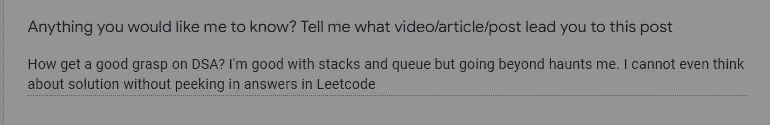
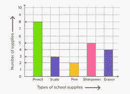
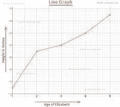
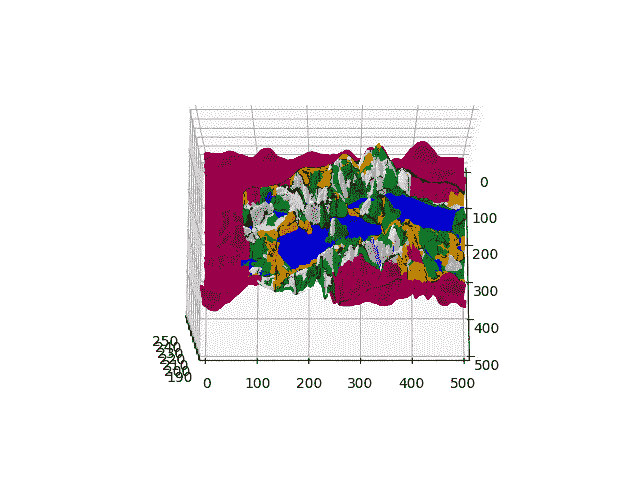
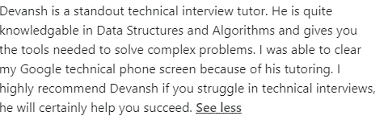
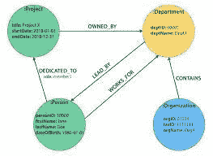
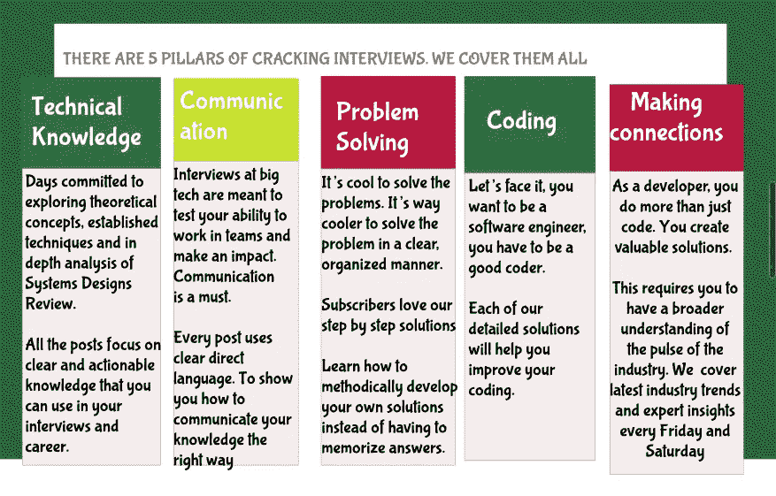
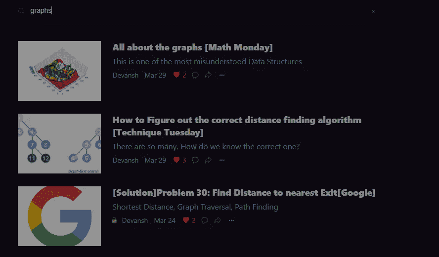

# 编码面试中的斑点图

> 原文：<https://medium.com/geekculture/spot-graphs-in-your-coding-interviews-354c49732b4e?source=collection_archive---------8----------------------->

## 太多的人纠结于此。这是我推荐的系统

最近，我作品的一位读者/观众给我发来了以下信息。他们的措辞是如此完美，以至于我不得不回应他们的内容要求。

Technically they left this response in the survey. This is why you should fill out the user survey I leave at the end of every article. You can find it by scrolling down

学习 DSA 对你的准备非常重要，不幸的是，互联网上充斥着关于如何更好地接近他们的毫无价值的建议。我将很快介绍如何解决这些问题，所以请确保您与我保持联系，不要错过。我所有的相关链接都会在文末。在本文中，我将重点介绍图，这是每个人都难以学习的数据结构。

图表是很多人都很纠结的东西。在学习图表时，人们经常会误解它为什么存在/如何有效地使用它。不要担心，我们现在将涵盖图表背后的哲学。我将保持这个相对较轻的理论，因为互联网上有很多很好的资源(特别是 FreeCodeCamp)。[我已经在这里介绍了如何选择最佳的图遍历算法，所以请确保您也阅读了这些算法](https://codinginterviewsmadesimple.substack.com/p/how-to-figure-out-the-correct-distance?r=4tnbw&s=w&utm_campaign=post&utm_medium=web)。在这里，我们将关注图形背后的原理，以及如何识别它们。

# 图表:更好的视角

当我说图形这个词的时候，你的脑海中会出现三个图像中的一个。

1.  如果你是一个统计兄弟，你会想到图表和情节。大多数专注于编码的资源完全忽略了这一点。这是一个巨大的错误
2.  如果你是一个图论迷，你会想到旅行推销员问题的地图。这有助于您可视化各种(通常很复杂)图形算法的效用。
3.  如果你是那种很少接触另外两种语言的计算机科学人士，你会想到用邻接表定义的东西。这有助于编码。

自然，你首先想到的将取决于你对图表的最初接触和它们是什么。这里是人们真正纠结于图表的第一个原因:**所有这些定义都是真实而有用的。**不幸的是，大多数课程/在线资源在谈论图形时通常坚持 2 和 3。他们完全忽略了 1。为什么 1 对编码很重要？

This is a simple graph. Notice how we are able to condense a lot of information in a concise manner. Very good for your coding interviews. Not a prank bro.

1 是图作为数据结构的真正用途。图表和绘图完成一项简单的任务，*它们以一种直接的方式向我们传达各方面之间的某种关系*。想一个简单的相关图。这是我在人工智能/统计分析/机器学习工作中经常使用的东西。它们允许我检查多个特征之间的关系，而不必做大量的数学计算和处理大量的数字。

You always want to be careful with these charts though. You can make some very interesting and wrong conclusions if you just blindly look at the graphs w/o context.

变量之间关系的这种表达不仅仅是数字。想想表示地图的图形(类型 2)。在这里，我们真正表示的是各个位置之间的距离(这很微妙，但在这种情况下，这种关系变成了距离)。

Here are our graph/map will need to take into account the terrains when coming up with paths.

如果地图对各种各样的景观更加细致入微，那么这种关系就变成了在两个地方之间往来的努力(而不仅仅是距离)。你看到我们是如何把一个图形的三种解释捆绑在一个单一的解释中了吗？这正是对你的编码/编码面试重要的。你需要能够在这三个视角之间切换(实际上，所有其他类型都是类型 1 的子集，但对于像我这样的非数学人员来说，这可能非常抽象)。一定要重读这一部分，直到你理解了核心要点:*图表可以从不同的角度来看。并且每个透视图对于图形的实现都有一些独特之处。*

# 为什么你一直纠结于图表

现在我们来回顾一下你纠结于图表的主要原因。这不是你的错。图是真正的硬数据结构。它们的实现并不简单，做出正确的决策可能是一个挑战。难怪，你(和)许多其他人都在挣扎。看看一位读者发给我的这条消息。

If you struggle with these topics, you are not alone. Check out my newsletter, [Coding Interviews Made Simple](https://codinginterviewsmadesimple.substack.com/p/faqs-and-about-this-newsletter?r=4tnbw&s=w&utm_campaign=post&utm_medium=web), to learn how to handle these. I have helped a lot of people overcome their problems.

除此之外，人们还没有以正确的方式教授图表。人们不再关注*为什么图表很重要*，而是把时间花在图表的许多*方式上*。这就是为什么当我们解决问题时，我从我的学生那里得到的最常见的反馈之一不是他们发现编码或算法具有挑战性，而是他们根本不可能知道他们必须在问题中使用图表。回想一下这句话。他们不会纠结于算法(案例 2)或编码(案例 3)。相反，让他们犯错的是图表的用法(案例 1)。看到趋势了吗？那么如何才能做得更好呢？

Everyone can get better. It’s a matter of doing things the right way. Follow the advice I give you, and you will ace everything. [This student didn’t even have a computer science or math degree](/geekculture/how-i-helped-a-non-computer-science-student-nail-a-faang-software-dev-job-86a4e41f95b7). And she got her roles.

# 如何更好地识别图表

如前所述，有大量精彩的资源会教你如何实际实施细节，并教你理论。 [FCC 的技术访谈图](https://www.youtube.com/watch?v=tWVWeAqZ0WU&ab_channel=freeCodeCamp.org)是一个可爱的视频。他们也有一个 9 小时的图论课程，但是我怀疑你们大多数人会关心采访/编码环境之外的图表。就投资回报率而言，分享的视频将为您提供所需的详细信息。

没人教你的是如何识别一个问题是否是图的问题。这就是我将在这里讨论的内容。一旦我给你框架，我们将在你的采访中用一些最棘手的问题来测试它。一旦你看到这个框架很好地处理了它们，你就可以开始练习自己使用它了。因为我是一个优等生，所以我也给你我推荐的练习计划。

# 你的图形定位框架

信不信由你，这比你想象的要简单。为此，回想一下我们之前的陈述:图是编码和表示实体间关系的一种非常有效的方式。

Imagine how inefficient it would be using Linear Data Structures for encoding this. And it would be impossible to scale (for mutation purposes).

我想让你改变对图表的看法。节点、边和权重都是正确的概念，但它们没有用。我们关心的是它们代表了什么。**图表代表一个系统。节点是该系统中的实体/公民。边缘代表市民之间的关系。而这些边的权重正好告诉我们一段关系有多牢固。未加权的图呢？就当它们是加权图吧，所有的边权重都是一样的。这有助于评估正确的遍历算法。**

那么这个框架看起来怎么样呢？简单来说，我们将尝试看看问题是否可以被视为包含所有这些组件。如果没有，问题很有可能涉及到图形。如果我们需要同时考虑多个实体，就更是如此。听起来太简单了？让我们在一些最困难的图形问题上看看这一点。

# 压力测试我们的框架

为了验证这种方法的有效性，我们将只从 Leetcode 中提取一些困难的问题，这些问题并不表明我们必须使用图表。

# 外星人字典问题

有一种新的外星语言使用拉丁字母。然而，你不知道字母之间的顺序。您从字典中收到一个**非空**单词的列表，其中**单词按照这种新语言**的规则按字典顺序排序。推导出这种语言中字母的顺序。

**实体**:我们知道我们想要字母的字母顺序。因此，很自然地想象，我们提出的任何系统都将字母作为公民。

**关系**:我们想要字母的排序。给定一个字母，知道它后面是什么是很重要的(这很好，因为我们有一个排序列表)。

**权重**:相隔相同距离的两对字母没有区别。如果在我们的外星字母表中排序是 s，v，g，那么距离 s & v==距离 b/w v & g。

这里我们得到了一个清晰的指示，一个图是可行的。这个解决方案实际上涉及到了图表。要了解此问题的最新解决方案，请确保您订阅了 premium。[使用此链接可以获得全年 20%的收益](https://codinginterviewsmadesimple.substack.com/subscribe?coupon=1e0532f2)

[Coding Interviews Made Simple focuses on all the aspects of interview preparation. This gives you true mastery over the concepts. Get more information at our FAQs here](https://codinginterviewsmadesimple.substack.com/p/faqs-and-about-this-newsletter?s=w)

# 2 SAT 问题

给定一个`2-CNF`公式，想办法分配真值来满足它，如果不可能，返回`False`。

[我对这个问题的解决方案可以在这里找到](https://codinginterviewsmadesimple.substack.com/p/solutionproblem-25-boolean-satisfiabilitydropbox?r=4tnbw&s=w&utm_campaign=post&utm_medium=web)。查看解决方案的详细信息(这是一个非常复杂的问题)。在进入图表方面之前，我们做了一些数学计算。所以请务必查看详细信息。但是从图表的角度来看:

**实体**:不同的文字。

**关系**:文字之间的含义。

**权重**:再一次，没有暗示的程度。所有的含义都一样“沉重”。因此，该图在所有边上都具有相等的权重(未加权)

# 词梯问题

使用字典`wordList`从单词`beginWord`到单词`endWord`的**转换序列**是单词序列`beginWord -> s1 -> s2 -> ... -> sk`，使得:

*   每对相邻的单词只相差一个字母。
*   每个`1 <= i <= k`的`si`都在`wordList`中。注意`beginWord`不需要在`wordList`里。
*   `sk == endWord`

给定两个单词，`beginWord`和`endWord`以及一个字典`wordList`，返回从 `beginWord` *到* `endWord` *的* ***最短变换序列*** *中的****字数，如果没有这样的序列，则返回* `0` *。*****

*例如，给定 begin=cat 和 end=bag，我们可以走[cat→bat→bag]。我们想退掉这个。*

***实体**:这里的实体是给定单词列表中的单词。我们约束列表中的单词，因为我们知道路径中的所有单词都必须在列表中。*

*关系:我们被告知一次只能改变一个字母。因此，用一个字母连接单词是有意义的。*

*权重:和前面一样，相隔一个字母的两个不同的对没有区别。因此，未加权的图在这里是可行的。*

*如果你想让我报道这个问题，请在下面的评论中告诉我。我总是乐于报道困扰我的读者的问题。*

# *练习图形定位*

*这是一种技能。技能也需要培养。以下是我推荐的做法。从简单的问题开始。开始识别图形问题的组成部分，以及你将如何设置解决方案(不要把重点放在编码上)。一旦你能在 2-3 分钟内完成 1，你就可以进入下一个阶段。对于较难的问题，你最多可以花 5 分钟。*

**

*You can search for posts by topic in my newsletter. Use this feature to focus on ideas.*

*做这件事时要记住的重要事情是不要做过头。重点是建立你对图表的熟悉度，并识别它们。这就是我们的目标。不要试图编写解决方案，因为那会花费太多时间。目标是快速浏览大量示例。一旦你能够可靠地发现隐藏在问题中的简单/中级图表，你就已经达到了你所需要的。一旦你到了这个阶段，就开始编码。记得做许多简单的问题。*

*本文到此为止。使用这个系统，你会发现自己能够快速有效地识别图表。相信我，这通常是战斗中最棘手的部分。*

**

*The newsletter has helped a lot of people land their dream jobs. You could be next.*

*显然，你需要将这个系统与实际的技术知识和编码能力结合起来。我的每日时事通讯，[编码采访变得简单](https://codinginterviewsmadesimple.substack.com/)涵盖了算法设计、数学、最近的科技事件、软件工程等主题，让你成为更好的开发者。[我目前全年都在打八折，所以一定要去看看。](https://codinginterviewsmadesimple.substack.com/subscribe?coupon=1e0532f2)*

**

*我创建了[编码面试，使用通过指导多人进入顶级科技公司而发现的新技术，使面试变得简单](https://codinginterviewsmadesimple.substack.com/p/faqs-and-about-this-newsletter?r=4tnbw&s=w&utm_campaign=post&utm_medium=web)。时事通讯旨在帮助你成功，避免你在 Leetcode 上浪费时间。[您可以阅读常见问题解答，并在此了解更多信息](https://codinginterviewsmadesimple.substack.com/p/faqs-and-about-this-newsletter?r=4tnbw&s=w&utm_campaign=post&utm_medium=web)*

*为了帮助我写更好的文章和了解你[填写这份调查(匿名)](https://forms.gle/7MfQmKhEhyBTMDUD7)。最多花 3 分钟，让我提高工作质量。*

*如果你也有任何有趣的工作/项目/想法给我，请随时联系我。总是很乐意听你说完。*

*以下是我的 Venmo 和 Paypal 对我工作的金钱支持。任何数额都值得赞赏，并有很大帮助。捐赠解锁独家内容，如论文分析、特殊代码、咨询和特定辅导:*

*https://account.venmo.com/u/FNU-Devansh*

*贝宝:【paypal.me/ISeeThings *

# *向我伸出手*

*使用下面的链接查看我的其他内容，了解更多关于辅导的信息，或者只是打个招呼。另外，查看免费的罗宾汉推荐链接。我们都得到一个免费的股票(你不用放任何钱)，对你没有任何风险。**所以不使用它只是失去免费的钱。***

*查看我在 Medium 上的其他文章。:[https://rb.gy/zn1aiu](https://rb.gy/oaojch)*

*我的 YouTube:[https://rb.gy/88iwdd](https://rb.gy/88iwdd)*

*在 LinkedIn 上联系我。我们来连线:[https://rb.gy/m5ok2y](https://rb.gy/f7ltuj)*

*我的 insta gram:[https://rb.gy/gmvuy9](https://rb.gy/gmvuy9)*

*我的推特:[https://twitter.com/Machine01776819](https://twitter.com/Machine01776819)*

*如果你正在准备编码/技术面试:[https://codinginterviewsmadesimple.substack.com/](https://codinginterviewsmadesimple.substack.com/)*

*获得罗宾汉的免费股票:[https://join.robinhood.com/fnud75](https://www.youtube.com/redirect?redir_token=QUFFLUhqa0xDdC1jTW9nSU91WXlCSFhEVkJ0emJvN1FaUXxBQ3Jtc0ttWkRObUdfem1DZzIyZElfcXVZNGlVNE1xSUc4aVhSVkxBVGtHMWpmei1lWWVKNzlDUXVJR24ydHBtWG1PSXNaMlBMWDQycnlIVXNMYjJZWjdXcHNZQWNnaFBnQUhCV2dNVERQajFLTTVNMV9NVnA3UQ%3D%3D&q=https%3A%2F%2Fjoin.robinhood.com%2Ffnud75&v=WAYRtSj0ces&event=video_description)*