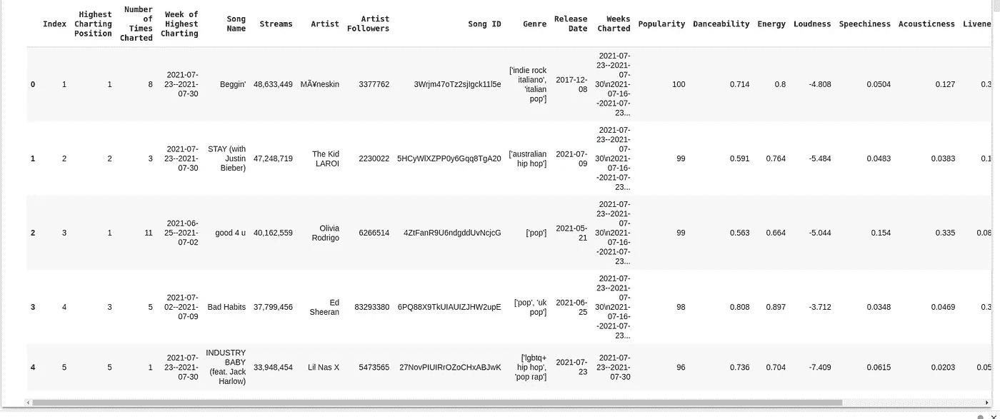
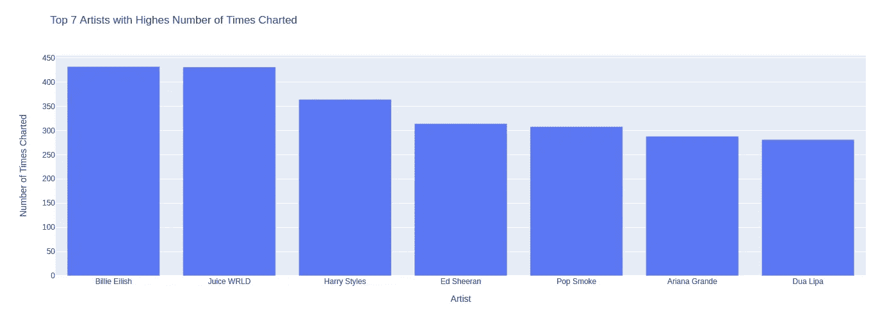
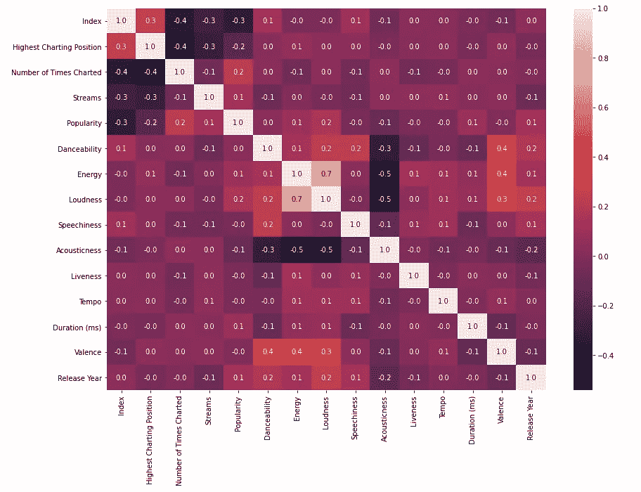
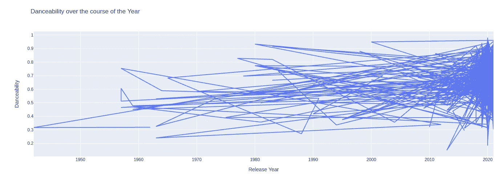
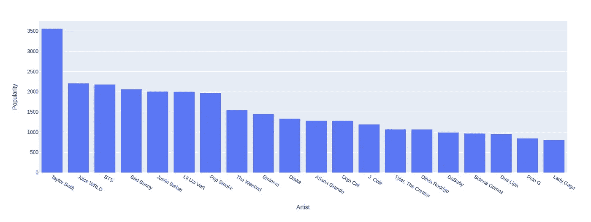
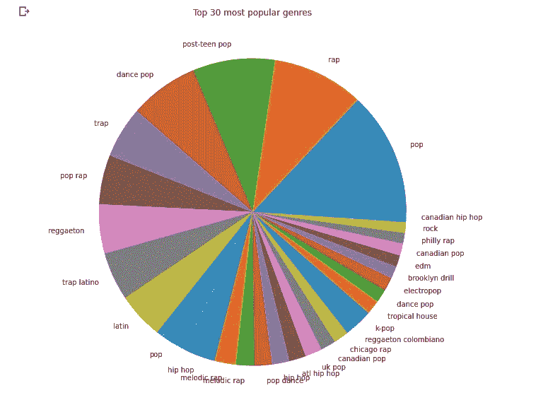

# 使用 Python 的 Spotify 数据可视化和分析

> 原文：<https://medium.com/geekculture/spotify-data-visualization-and-analysis-using-python-4af81c5531a7?source=collection_archive---------7----------------------->

## 初级和中级数据分析项目。


Spotify data analysis using python

大多数歌曲爱好者都在 Spotify 上听歌。它是最受欢迎的歌曲流媒体平台之一。如果你是一名程序员，你就会知道代码和歌曲之间的关系。所以，我们先从一杯咖啡开始在 Spotify 上做一些分析。

# 代码和分析

*   导入下列库

```
#for mathematical computationimport numpy as np
import pandas as pd
import scipy.stats as stats#for data visualizationimport seaborn as sns
import matplotlib.pyplot as plt
from matplotlib.pyplot import figure
import plotly 
import plotly.express as px% matplotlib inline
```

*   让我们加载数据，先睹为快。下载数据集并将其添加到路径中。之后，渲染数据集的前 5 个数据。

```
df = pd.read_csv("/content/spotify_dataset.csv", encoding='latin-1')
df.head()
```

现在运行这个单元，你会在屏幕上看到这样的东西。



Spotify data analysis

*   获取更多关于数据的信息

```
#data info
df.info()#Check missing values
df.isnull().sum()
```

检查每一列中的空值。幸运的是，我们的数据集中没有空值。
之后，用每一列的类型属性获得更多关于我们数据集的信息。

*   **艺术家绘制的次数**

```
#number of times charted by artistdf_numbercharted=df.groupby('Artist').sum().sort_values('Number of Times Charted', ascending=False)
df_numbercharted=df_numbercharted.reset_index()
df_numbercharted
```

为此，我们选取一位艺术家，将绘制的次数相加，并按降序排列。

```
px.bar(x='Artist', y='Number of Times Charted', data_frame=df_numbercharted.head(7), title="Top 7 Artists with Highes Number of Times Charted")
```



Spotify Data Analysis

当您运行该单元时，您将看到类似于上图的内容。Billie Elish 是排行榜上次数最多的人。上面的条形图只有前 7 名艺术家。你可以查看前 10 名或更多的艺术家。试着玩代码就好了。

*   列之间的相关性

让我们看看各列之间的相关性，并检查我们是否能找到任何有趣的东西。为此，我们先清理一下现有的数据。之后，将所有列转换为数字。

```
#clean data firstdf=df.fillna('')
df=df.replace(' ', '')
df['Streams']=df['Streams'].str.replace(',','')#convet all numeric columns to numericdf[['Highest Charting Position', 'Number of Times Charted', 'Streams', 'Popularity', 'Danceability', 'Energy', 'Loudness', 'Speechiness',
       'Acousticness', 'Liveness', 'Tempo', 'Duration (ms)', 'Valence',
       ]] = df[['Highest Charting Position', 'Number of Times Charted', 'Streams','Popularity', 'Danceability', 'Energy', 'Loudness', 'Speechiness',
       'Acousticness', 'Liveness', 'Tempo', 'Duration (ms)', 'Valence',
       ]].apply(pd.to_numeric)
```

让我们将年份从“发布日期”列中分离出来，以便能够分析其相关性。

```
df['Release Year'] = pd.DatetimeIndex(df['Release Date']).year
```

现在，绘制热图。

```
%matplotlib inlinef,ax = plt.subplots(figsize=(14,10))
sns.heatmap(df.corr(),annot = True,fmt = ".1f",ax = ax)
plt.show()
```



Spotify Data Analysis

众所周知，原声音乐往往比较安静，需要仔细聆听。这就是为什么它与能量和响度成负相关，这是有道理的。

现在，在代码中，“annot”用于显示立方体中的数字。“fmt”用于表示数字，如果您设置 fmt="0.2% "那么在立方体中，数字将以百分比的形式出现，并带有两位小数。显然，我们不希望这样，因为这会使可读性变得模糊。

*   可跳舞性

```
px.line(x='Release Year', y='Danceability', data_frame=df, title="Danceability over the course of the Year")
```

现在，看看这些年来可跳舞性是如何变化的。当您使用上面的命令运行单元时，您将在屏幕上看到类似这样的内容。



Spotify Data Analysis

*   图表显示的次数与年数相关

```
dfyear = df.groupby('Release Year').sum().sort_values('Number of Times Charted', ascending=False)
dfyear=dfyear.reset_index()
```

很简单，将数据按“发布年份”分组，并按每年的“图表次数”进行排序。

绘制图表。

```
px.bar(x='Release Year', y='Number of Times Charted', data_frame=dfyear.head(7))
```


Spotify Data Analysis

由于 2021 年正在进行，我们对 2021 年的数据了解较少。大多数数据来自 2020 年。

*   20 位最受欢迎的艺术家

```
artistbypop = df.groupby('Artist').sum().sort_values('Popularity' ,ascending=False)[:20]
artistbypop=artistbypop.reset_index()#plot the graphpx.bar(x='Artist', y='Popularity', data_frame=artistbypop)
```



Spotify Data Analysis

在这里，我们也做了同样的事情，我们根据受欢迎程度对艺术家进行分类。泰勒斯威夫特名列榜首，其次是果汁 WRLD 和其他人。我最喜欢的艺术家在第九位。

*   最受欢迎的流派

```
df['Genre']=df['Genre'].astype(str)
df["Genre"][df["Genre"] == "[]"] = np.nan
df["Genre"] = df["Genre"].fillna(0)
#here we get rid of useless symbols to be able to separate genresdf.Genre=df.Genre.str.replace("[", "")
df.Genre=df.Genre.str.replace("]", "")
df.Genre=df.Genre.str.replace("'", "")
#now we devide genre strings by commadf["Genre"] = df["Genre"].str.split(",")

df=df.explode('Genre')df
```

首先，我们去掉无用的符号，以便能够区分流派。

之后，用逗号分隔流派字符串。

下一个命令根据流派分隔行。每首包含一种以上风格的歌曲都有多行，每行包含一种风格。例如，如果一首歌有 2 种风格，那么同一首歌将有 2 行，每行有不同的风格。

现在简单地画出 30 个最流行的流派的饼状图。

```
fig = plt.figure(figsize = (10, 10))
ax = fig.subplots()
df.Genre.value_counts()[:30].plot(ax=ax, kind = "pie")
ax.set_ylabel("")
ax.set_title("Top 30 most popular genres")
plt.show()
```



Spotify Data Analysis

嗯，就是这样。恭喜你，你分析了 Spotify 数据集。你可以自己多挖掘。因为你可以用数据做很多事情。你得到的信息是有价值的。

**完整的 Github 代码和数据集访问都是** [**这里**](https://github.com/imrohit007/Spotify-Data-Analysis) **。**

感谢您的阅读。如果这篇文章内容丰富，那么一定要鼓掌，与你的社区分享，并关注更多。