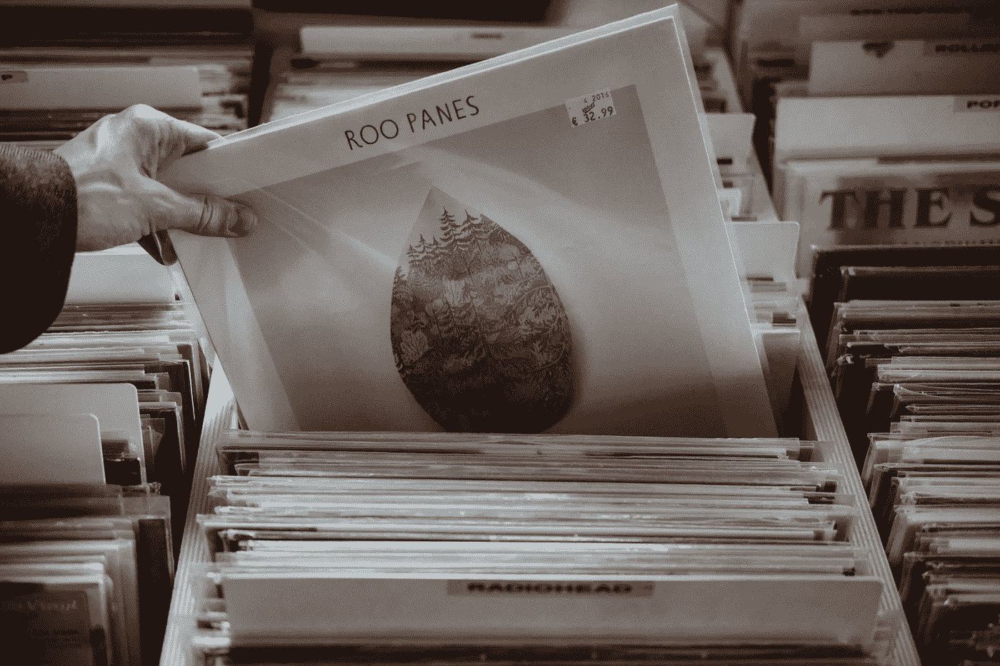

# Spotify 正在扼杀音乐

> 原文：<https://medium.com/geekculture/spotify-is-killing-music-20145d4d2155?source=collection_archive---------40----------------------->

## 音乐世界并非一切都好

技术可能意味着更好、更快的工具，但它意味着更好的音乐吗？随着音乐行业继续从 CD 的死亡中慢慢恢复，我们必须问:“*它会从 Spotify* 中恢复过来吗？

[音乐](https://hackernoon.com/tagged/music)产业在[度过了梦幻般的 2020 年](https://www.ifpi.org/ifpi-issues-annual-global-music-report-2021/)，主要由其主&救星**流媒体收入**推动。全球唱片收入增长了 7.4%，而…