# 我做了一个人工智能，比 Spotify 自己的人工智能更好地向你推荐歌曲。

> 原文：<https://medium.com/geekculture/spotifys-song-recommendation-ai-wasnt-good-enough-so-i-made-an-ai-better-than-it-38b8528f14bd?source=collection_archive---------5----------------------->

是的，你没看错标题，我有证据支持我的主张。那么，我怎么会有这个想法呢？问题是我没有我的一个朋友有。很久以前他建议我做这个。

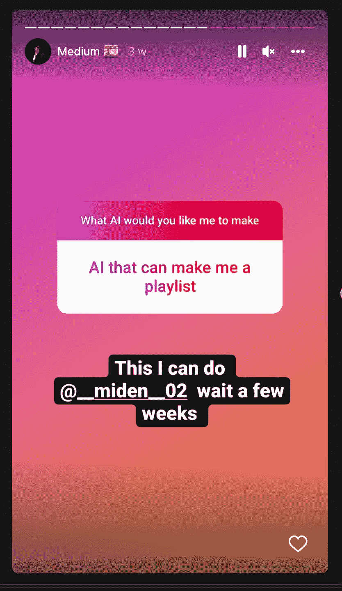

是的，在我得到这个建议后，我也想过如果它已经存在，为什么还要做这个，但在用更专业的眼光使用 Spotify 后，我发现只有 40%的推荐歌曲是我真正喜欢的，而且大多数只是广告推荐的。因此，我制作了自己的歌曲推荐系统，它完全基于我喜欢的歌曲，完全是为使用它的用户定制的。

那么，人工智能将如何工作？

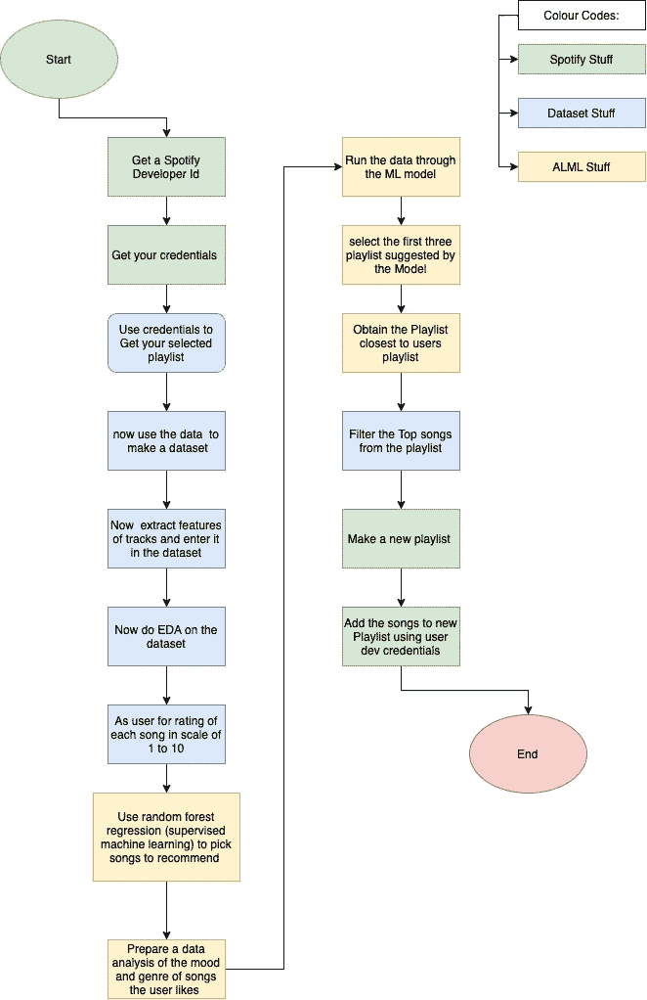

上面的工作流程图显示了该系统将如何工作。

我将详细介绍每一步，并在编写代码时逐一解释。

**让我们先获取 Spotify 开发者证书:**

首先前往 https://developer.spotify.com[的](https://developer.spotify.com)，使用您的 Spotify ID 登录:

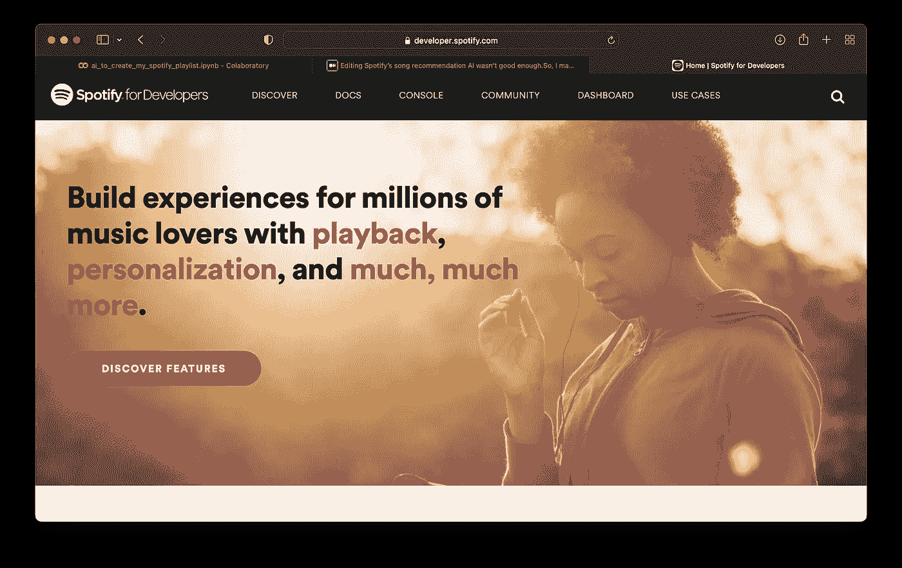

[Link](https://developer.spotify.com)

登录后创建一个新应用程序:

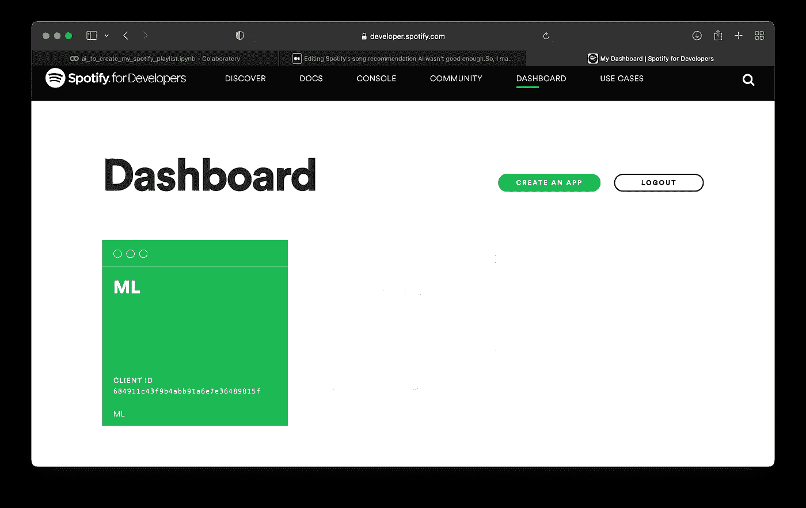

将重定向 URL 设置为“ [http://localhost:8000](http://localhost:8000) ”:

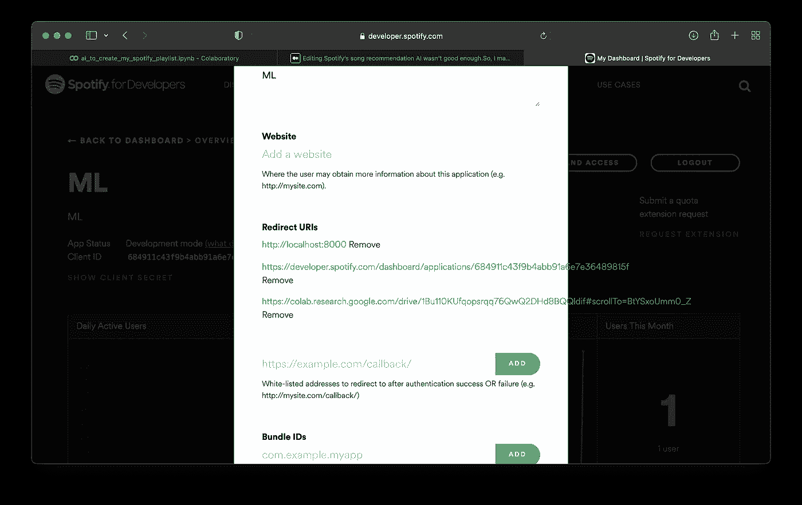

获取您的客户 ID 和密码:

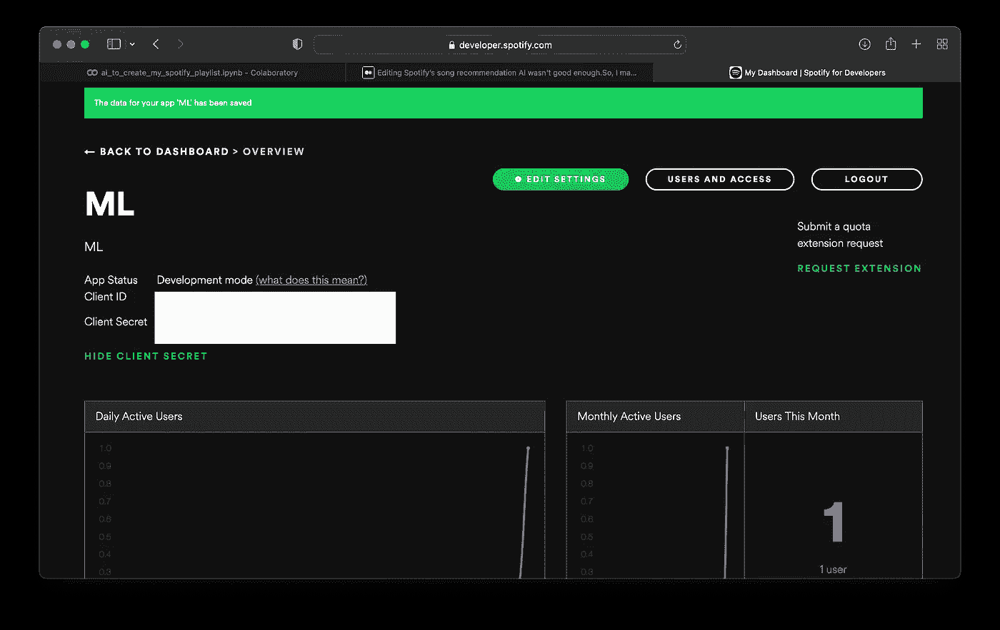

**获得证书后，让我们从代码开始:**

在**您的系统上运行此程序的第一个程序块:**

在本地系统中运行此代码后，您将被重定向到一个网站，复制该网站的 url。

现在在 Google Colab 上运行相同的代码，并在它要求时粘贴 url:

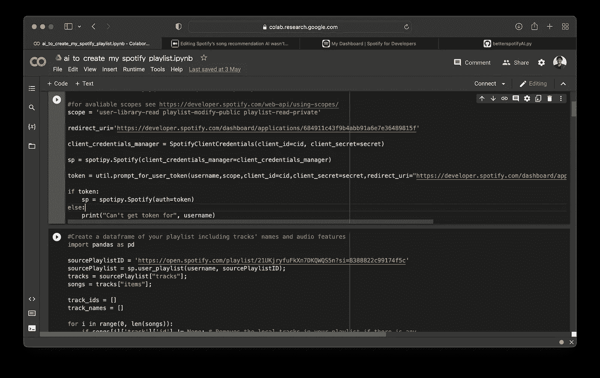

Paste url where asked

上述过程获取您的 OAuth 令牌，并验证您的代码以使用 Spotify 功能。

**现在让我们获取用户指定的播放列表，并使其成为一个数据帧:**

我将使用的播放列表是我的播放列表，其中包含我最喜欢的所有歌曲:

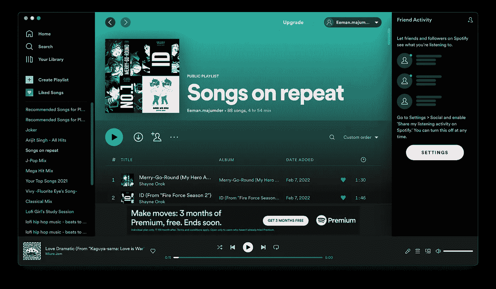

My Playlist

现在我们有了播放列表的数据框架，让我们看看它是什么样子的:

输出是:

现在让我们修改数据帧，只保留我们需要的值:

**我们将使用的算法称为** [**随机森林回归**](https://www.geeksforgeeks.org/random-forest-regression-in-python/\) **是一种监督机器学习算法。**

让我们准备要放入算法的数据。

**现在让我们对特征进行矢量化，并对名字进行拟合变换:**

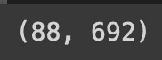

The shape output is this

现在到了无聊的部分，我们要给播放列表中的歌曲打分，分数从 1 到 10，1 分是最差的，10 分是最好的。我知道这需要时间，但这是一次性的工作，一旦你做了，你就再也不用做了

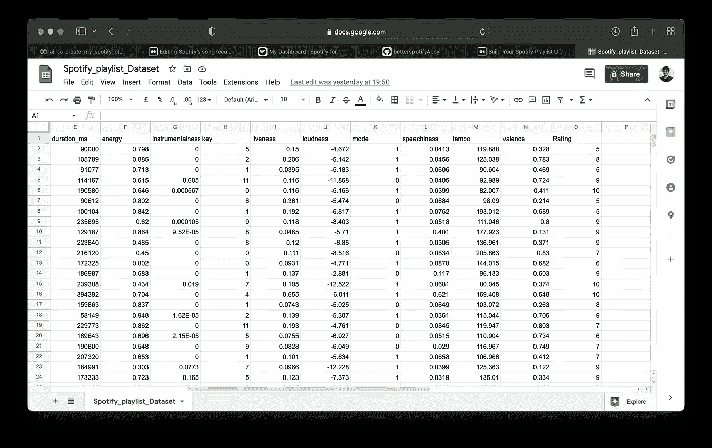

see I had to do it too

**现在让我们使用随机森林分类器来分析特征重要性并打印出来:**

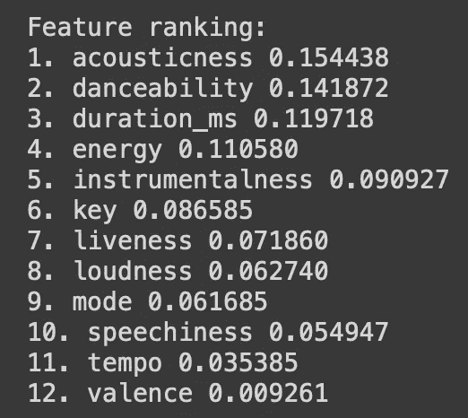

My Output

**让我们将** [**PCA(主成分分析)**](https://www.datacamp.com/community/tutorials/principal-component-analysis-in-python) **添加到缩放的训练集上，并可视化解释的方差到成分图的数量:**

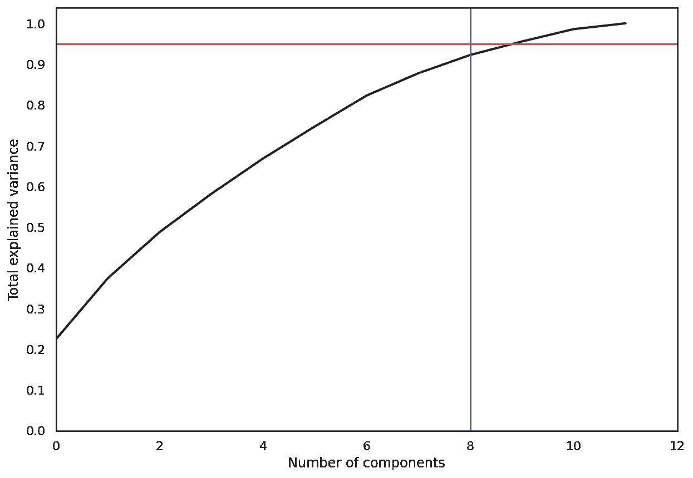

The output

**让我们将数据集放入最佳主成分分析:**

**让我们安装并构建 sklearn:**

**让我们检查一下**[**TSNE**](https://scikit-learn.org/stable/modules/generated/sklearn.manifold.TSNE.html)**(t 分布随机邻居嵌入)结果:**

**设置:**

**首先创建决策树:**

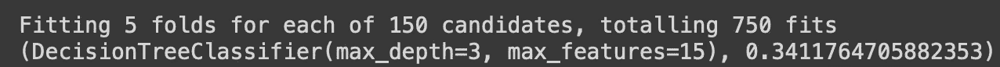

Big decision tree

**现在应用随机森林:**

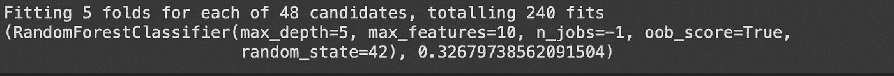

The Output

**最后套用**[**KNN**](https://en.wikipedia.org/wiki/K-nearest_neighbors_algorithm)**:**

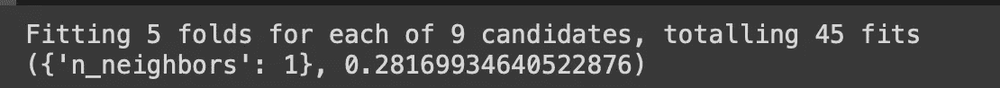

The Output

**现在让我们建立我们的测试集，并为推荐的曲目生成一个新的数据帧:**

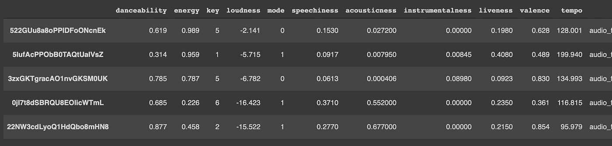

The Tracks in new dataset

**设置预测:**

**让我们预测一下我会给推荐歌曲的评分:**

**让我们根据人工智能给出的评级过滤掉歌曲:**

**查看推荐给你的歌曲数量:**

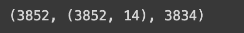

(suggested tracks,(shape),songs that will be added to the playlist)

**重塑数据，以便一次只将< 100 首歌曲添加到播放列表:**

**在用户 Spotify 帐户中创建一个新的空播放列表:**

**让我们最后将曲目添加到播放列表:**

现在终于完成了！！让我看看我的 Spotify

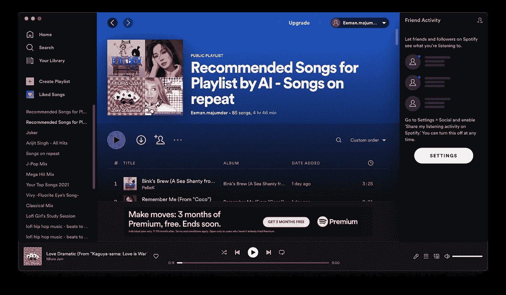

my first Playlist it has 85 song and I love them all

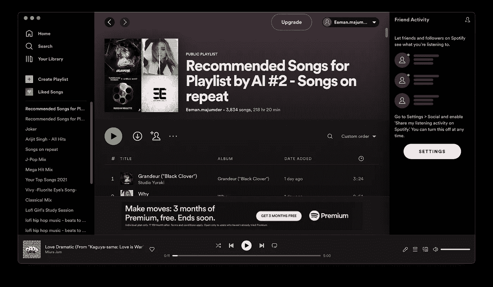

3834 songs and a new playlist 😁

让我告诉你，我喜欢几乎所有推荐的歌曲，比 Spotify 的推荐更好。

让我们做一个适当的调查来证明这比 Spotify 的推荐更好。

**这是人工智能被训练的播放列表:**

这包含了我所有喜欢的歌曲。

**这是 AI 给我建议的播放列表:**

**这是 Spotify 给我建议的播放列表:**

所以我让我的[朋友](https://www.instagram.com/adityavijayraj__vjr/)听我喜欢的歌曲播放列表，然后这两个播放列表作为播放列表 1 和播放列表 2。1 个是 AI，2 个是 spotify，他们不知道哪个是哪个，在他们听完之后，我让他们填写了这张表格:

Feel free to fill the for if you wanna give your reviews too

这是填表后的数据:

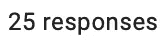

Number of responses

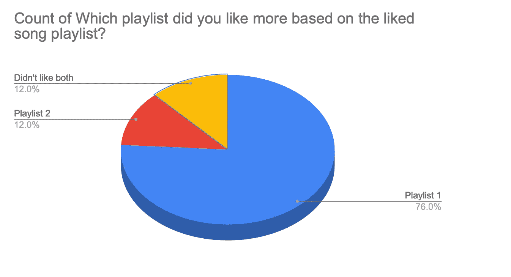

[The Graph updates real time](https://docs.google.com/spreadsheets/d/e/2PACX-1vTCcT0XIronMsEoJd_cuVIcWHpGMjwthqmAO9iCGKB0mlfgugaLJlgGkkajKwwRHkdQqx4hOWKhwSIq/pubchart?oid=708403559&amp;format=interactive)

在写这篇文章的时候，超过 75%的人更喜欢人工智能的推荐，而不是 Spotify 的。

因此，我可以放心地看到人工智能比 Spotify 的推荐人工智能表现更好。

**在这里为你自己检查播放列表:**

我喜欢编码，这太酷了😁。

[😁这很有帮助。](/@eeman.majumder)

**完整的代码请点击这里:**

 [## Better_Spotify_AI

### Eeman_Majumder

colab.research.google.com](https://colab.research.google.com/drive/1Bu110KUfqopsrqq76QwQ2DHd8BQQldif?usp=sharing) 

查看我的 Github 了解更多信息:

 [## better _ Song _ reccomendetar _ than _ Spotify/ai _ to _ create _ my _ Spotify _ playlist . ipynb 在主…

### 人工智能为我制作播放列表。为 eeman 1113/Better _ Song _ reccomendetar _ than _ Spotify 开发做出贡献，创建一个…

github.com](https://github.com/Eeman1113/Better_Song_reccomendetar_than_spotify/blob/main/ai_to_create_my_spotify_playlist.ipynb) 

在 twitter 上关注我的每日 AIML 研究更新:

感谢阅读😁，下周见👋🏼