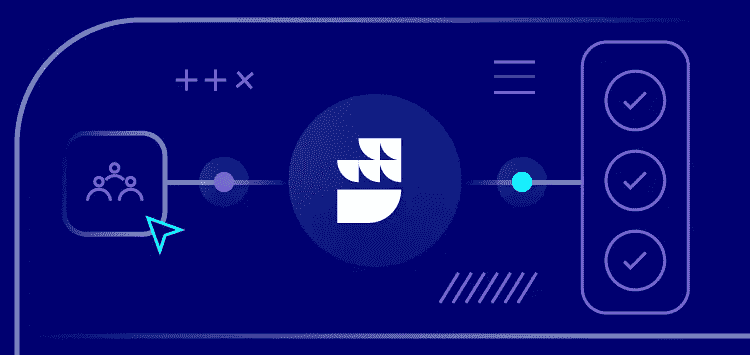

# 聚焦:为活动流提供一个非常数据化的假日促销

> 原文：<https://medium.com/geekculture/spotlight-have-a-very-data-holiday-promotion-for-event-streams-ab8bf194b997?source=collection_archive---------27----------------------->

在 RudderStack，我们希望更多的人看到实时事件流可以是无痛的，他们可以毫不费力地将所有数据同步到仓库或从仓库中同步出来。这就是为什么我们很兴奋地宣布我们的新[有一个非常数据的假期宣传片](https://rudderstack.com/have-a-very-data-holiday-promo/)。从今天开始，我们将实施一项价格促销活动，在 2022 年底之前，将所有新老用户的免费活动流量从每月 50 万增加到 500 万。*在 2021 年 12 月 31 日前免费注册，即可获得这份礼物！

# 方向舵堆栈事件流的好处

RudderStack 事件流使团队能够在供应商 SDK 实现、自定义 API 集成和维护上花费更少的时间，这样开发人员团队就可以将时间花在为其业务带来真正价值的活动上。我们的事件流产品使团队能够集成他们的整个堆栈，并随着您的业务随时间的推移而扩展。

**使用方向舵堆栈事件流，您可以:**

*   跨设备识别用户
*   实时交付事件
*   链接到每个应用和网站的[12+SDK](https://rudderstack.com/docs/stream-sources/)
*   发送数据到 150+云和仓库[目的地](https://rudderstack.com/docs/destinations/)

# 免费注册，从今天开始每月发送 500 万个数据流

开始测试我们的事件流、ELT 和反向 ETL 管道。使用我们的 HTTP 源在不到 5 分钟的时间内发送数据，或者在您的网站或应用程序中安装我们 12 个 SDK 中的一个。[免费试用 RudderStack】。](https://app.rudderlabs.com/signup?type=freetrial/)

*   [*条款和条件*](https://userimg-bee.customeriomail.com/images/client-env-103842/editor_images/Have%20a%20Very%20Data%20Holiday%20Promotion%20Terms%20and%20Conditions.pdf/) *适用*

*本博客最初发表于:* [*https://rudder stack . com/blog/have-a-very-data-holiday-promotion-for-event-streams*](https://rudderstack.com/blog/have-a-very-data-holiday-promotion-for-event-streams)