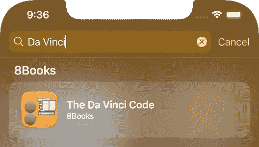
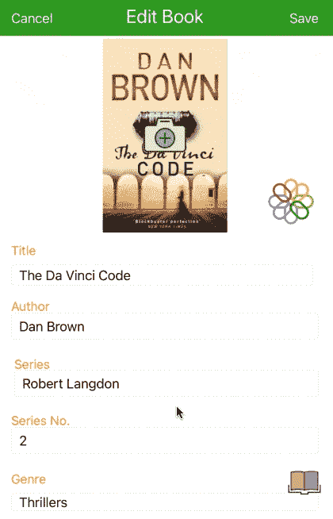
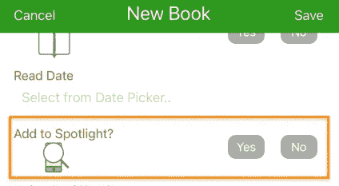
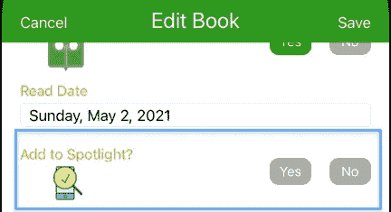
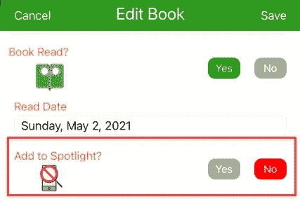

# Spotlight 搜索您的索引 Swift 应用程序记录

> 原文：<https://medium.com/geekculture/spotlight-search-for-your-indexed-swift-app-records-601864abf51b?source=collection_archive---------9----------------------->

Spotlight Search 允许用户从 iPhone / iPad 原生搜索栏中找到你的应用记录

Spotlight Search Finding a Book in the 8Bookss App

# 方案

我们的应用程序将允许用户在原生 iPhone / iPad Spotlight 搜索中添加或删除特定的记录字段。在我们的图书应用程序示例中，书名将是我们的 Spotlight 搜索词。用户可以选择在新书或编辑图书视图中将标题添加到 Spotlight，也可以选择在编辑图书视图中将标题从 Spotlight 中删除。

# 技术

Swift 使用特定的 Spotlight 功能和方法来索引(添加)或删除(删除)可搜索的项目(如书名)。可搜索项目值被称为“**标识符**”，您的域名被称为“**域名标识符**”，您的应用程序名称通常被称为“**内容描述**”。

**索引**功能:

CSSearchableItem(..)，CSSearchableIndex.default()。indexSearchableItems(..)

**删除**功能:

CSSearchableIndex.default()。deleteSearchableItems(..)

# 观众

本文面向寻求完整、成熟、以代码为中心的解决方案来加速开发项目的 Swift 开发人员。下面的代码片段可以通过最小的定制来使用。

# 应用模型

我们的文章基于苹果应用商店发布的[apps gam Books](https://appsgym.com/projects/books/)模型应用，你可以在 AppsGym.com 上免费下载完整的 [Xcode 项目](https://appsgym.com/appsgym-books-swift-xcode-project-tour/)。

# 用户界面

我们利用是/否对话框，使用按钮出口和动作来索引或删除 Spotlight 搜索项目。当用户点击相关按钮时，按钮颜色变为绿色(是)或红色(否)。我们还使用一个图像来表示 Spotlight 搜索的状态；复选标记表示已编入索引，红色圆圈表示未编入索引。当然，你可以选择在你的应用程序和不同的图像中使用开关。

**newbooktableviewcontroller . swift**显示两个灰色按钮，分别代表“是”和“否”。如果用户点击“是”,则在保存图书记录时，图书标题会被索引(添加)到 Spotlight 中。否则，不执行任何操作。

New Book Add to Spotlight Dialogue

**editbooktableviewcontroller . swift**显示 Spotlight 搜索的当前状态(复选标记表示书名已编入索引)以及“是”和“否”两个灰色按钮。如果用户点击“否”,则从 Spotlight 搜索中移除(删除)书名。如果用户点击“是”,并且图书标题尚未在 Spotlight 中，则在保存图书记录时，图书标题会被索引(添加)到 Spotlight 中。在你的应用程序中，你可以选择以不同的方式反映状态、按钮颜色和可能的操作。

Edit Book Shows Book Title Already Indexed

Edit Book Shows Book Title Not Indexed

# 逻辑

首先我们需要导入 2 个 Swift 库: **CoreSpotlight** 和 **MobileCoreServices** (后者必须配合 CoreSpotlight 使用)。

有两个主要的动作:索引(添加)和删除(删除)，使用相同的参数，书名**。因此，我们将使用两个独立的函数**addToSpotlightSearch**(_ title:String)和**removeFromSpotlightSearch**(_ title:String)，并根据 Yes 和 No 按钮的状态分别调用每个函数。**

**将“是”和“否”按钮连接到同一个**@ I action**并打开/关闭相关标志(布尔变量)以指示哪个按钮被点击。保存记录时，根据标志值执行索引(添加/是)或删除(删除/否)功能。**

# ****代码****

# ****代号:新书****

**下面的 Swift 代码片段摘自**newbooktableviewcontroller . Swift，**其中显示了是/否按钮出口、按钮动作和要添加的 Spotlight 功能(删除功能仅在编辑手册中使用)。在我们的示例图书应用程序中，我们使用一个核心数据属性 **isSpotlight** 来存储聚光灯状态。**

**newbooktableviewcontroller . swift**变量&按钮****

**newbooktableviewcontroller . swift**viewDidLoad()****

**newbooktableviewcontroller . swift**saverecortocoredata()****

**newbooktableviewcontroller . swift**addToSpotlightSearch(..)****

# **代码:编辑图书**

**以下 Swift 代码片段摘自**editbooktableviewcontroller . Swift，**，其中显示了是/否按钮出口、按钮操作和作为状态指示器的 Spotlight 图像。编辑图书使用这两种功能来添加和移除 Spotlight 搜索词。在我们的示例图书应用程序中，我们使用一个核心数据属性 **isSpotlight** 来存储聚光灯状态。**

**editbooktableviewcontroller . swift**变量&按钮****

**editbooktableviewcontroller . swift**vewDidLoad()****

**editbooktableviewcontroller . swift**saverecortocoredata()****

**editbooktableviewcontroller . swift**聚光灯功能****

**本文介绍了为新书向 Spotlight 添加新搜索词(书名)以及在编辑图书视图中向 Spotlight 添加或从中删除搜索词(书名)的完整设置、逻辑和代码。在您的应用程序中，您可以引用任何实体记录字段，并添加您自己的域名和应用程序名称。希望你觉得有用。感谢阅读！**