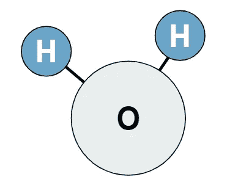
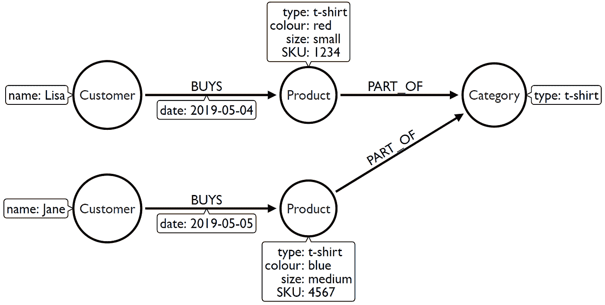
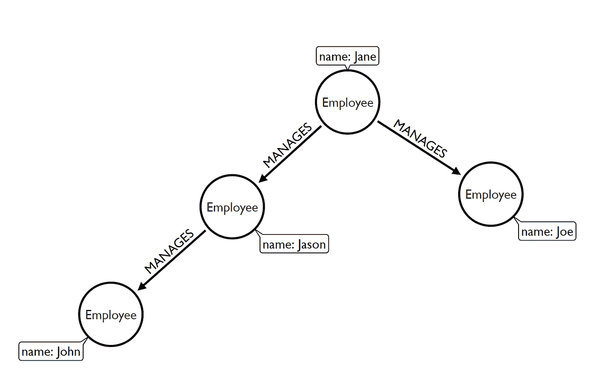
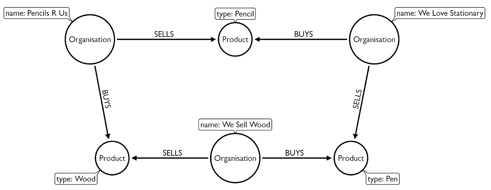
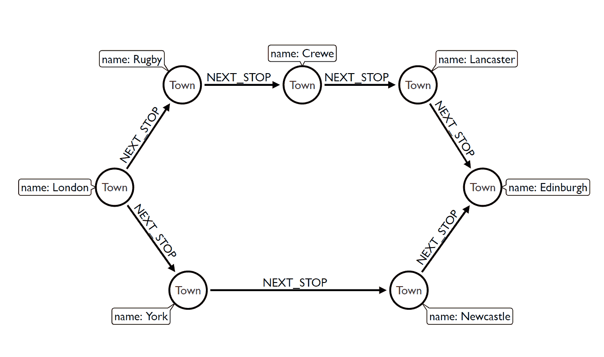

# 发现一个图形问题

> 原文：<https://medium.com/geekculture/spotting-a-graph-shaped-problem-b1f126bf8c03?source=collection_archive---------5----------------------->

## 如何判断您的数据是否会受益于不同的数据库

[Alina Grubnyak on Unsplash](https://unsplash.com/photos/ZiQkhI7417A)

# 介绍

听说过图形数据库，但不确定它们是什么？或者也许你有，但你不太确定他们适用于哪里。你是在正确的地方，我们将在这篇文章中看到这两者，并且在文章结束时，希望你将有那些创造性的图形汁流动！您也可以在之后查看[本次网络研讨会](https://www.youtube.com/watch?v=keZURbOo4-M)。

## **那么什么是图呢？**

源于数学的一个分支，图是一组离散的对象，每个对象可能与其他对象有一组关系。图论有许多重要的应用，例如路线规划、寻找依赖关系和管理拓扑。要阅读更多关于图形和图论的内容，请查看[维基百科页面](https://en.wikipedia.org/wiki/Graph_theory)。

图表非常强大——几乎任何东西都可以用图表来表示。

Connections in the Internet

例如，互联网可以用多种不同的方式表示为图形。我们可能会想我们是如何通过互联网相互联系的:我们相互发电子邮件，或者发送即时消息。也许我们正在进行 IP 语音通话，或者使用 Google Meet 或 Zoom 互相聊天。我们可以用一张图来表示互联网提供的所有不同的通信机制。或者，我们可以考虑使用和组成互联网的所有不同设备。我们连接的设备，如手机、平板电脑、笔记本电脑；其他系统，如智能扬声器、灯泡、冰箱、汽车和其他物联网(IoT)设备。它们通过 Wi-Fi、以太网电缆连接在一起，由路由器、交换机、负载平衡器、防火墙管理，一直到服务器，再到物理“锡和线”，这就是我们今天的互联网。

Water molecule.

另一个用图形表示事物的例子是考虑一个水分子。仅仅知道一个水分子由一个氧原子和两个氢原子组成是不够的，我们还需要知道它们之间的具体关系才能得到一个水分子。

## 什么是图形数据库？

图形数据库延续了这一理念，不仅捕获关于不同实体的信息，还捕获这些实体如何相互连接。定义数据整体结构和上下文的特定关系是什么。

图形数据库跨越了关系数据库和 NoSQL 数据库的世界——将数据结构与数据本身分离开来。数据之间的关系被认为与数据本身一样重要，因此，关系的存储被赋予同等的权重。

## 为什么图形数据库如此特殊？

图形数据库不是计算数据实体之间的连接可能位于何处，而是在知道连接后立即创建该连接的物理表现形式——想想“写时连接”。这允许通过这些关系从一个节点到另一个节点追踪指针来“遍历”图，而不是试图在运行时扫描外键索引来创建连接(想想“读取时连接”)，这是传统关系数据库管理系统(RDBMS)的典型做法。

这提供了卓越的查询性能，使图形数据库成为查询、解释和分析“图形”关联数据的终极存储系统。

# 如何发现图形数据库是一个很好的选择——图形形状问题

虽然在绝大多数用例中，图形数据库可以用来代替 RDBMS 系统，但对于解决“图形”问题，它们确实有一个明确的最佳点。让我们来看四个场景来帮助我们识别它们:

*   我们的问题包括理解实体之间的关系吗？
*   问题是否涉及到对同一类型实体的大量自引用？
*   这个问题探索不同深度或未知深度的关系吗？
*   我们的问题包括发现许多不同的路线或路径吗？

## 场景 1:我们的问题包括理解实体之间的关系吗？

让我们看一个例子，在这里我们想要理解实体之间的关系。下图 1 描述了顾客的购买行为。虽然顾客购买了两件不同的 t 恤衫，但它们属于同一类别的 t 恤衫。如果我们看看正在购买的其他类别的产品，我们可以根据这些关系开始形成行为的观点。例如，如果丽莎也买了一条短裤，棒球帽和太阳镜。这四个产品品类群被不同的人反复购买怎么办？通过了解这些关系，我们可以利用这些信息向 Jane 推荐产品

Figure 1 — understanding relationships between entities

我们通常在以下用例中看到这种场景:

*   推荐
*   下一个最佳行动
*   欺诈检测
*   身份解析
*   数据谱系

## 场景 2:问题是否涉及到对同一类型实体的大量自引用？

对于图数据库，我们通常强调通常有许多连接的查询的好处。即使所有数据都在同一个表上，对同一个实体的自引用仍然涉及连接。在图 2 中的下一个例子中，我们被问到这样一个问题，谁是 Jane 的直接和间接下属——这是查看组织层次结构时的一个常见问题。在这个数据集中，所有的节点都有一个“Employee”类型(或者在明确讨论图形时有一个标签！).在传统数据库中可能计算量很大的事情在图形数据库中却很快很容易，这是因为数据存储的方式不同，而且不同数据元素之间的关系与元素本身一样重要。

Figure 2 — self-referencing to the same entity type

我们通常在以下用例中看到这种场景:

*   组织层级
*   社会影响者
*   朋友的朋友
*   流失检测

## 场景 3:问题探索了不同深度或未知深度的关系吗？

另一个非常“图形化”的用例是查看供应链，其中在供应商、生产商、贸易商等之间有许多相互依赖和未知的深度。在图 3 中，铅笔研发公司为批发文具店生产铅笔。他们从我们出售木材的地方购买原材料木材来生产这些铅笔。我们爱文具出售各种不同的文具，包括出售笔，我们出售木材。我们出售木材，一个家族企业，已经决定到此为止，与目前的所有者决定进入退休和流动的业务。很快我们就能看到许多依赖关系——失去原材料来源的铅笔研发人员会怎么样？他们现在是否经历了产量和可销售产品的下降？我们爱文具潜在的双重影响，他们现在可能需要找到另一个来源的铅笔库存，以及(可能是最小的！)由于不再向我们出售木材的公司出售钢笔而造成的销售损失。

Figure 3 — exploring relationships of varying or unknown depths

我们通常在以下用例中看到这种场景:

*   供应链可见性
*   材料清单
*   网络管理

## 场景 4: 我们的问题是否包括发现许多不同的路线或路径？

我们将在图 4 中看到的最后一个场景让人想起我在 2019 年的一次旅行。以伦敦为基地，如果你想乘火车去爱丁堡，你大致有两条不同的路线可以选择:东海岸，途经约克和纽卡斯尔，或者西成本，途经拉格比、克鲁等。你选择哪条路线将取决于许多因素——伦敦和爱丁堡之间的最短距离是多少？哪条路线的火车票最便宜？或者可用性？或者一列火车在主要轨道上抛锚，这意味着我们需要选择一条完全不同的路线？发现路线和路径可以被认为是图形最典型的应用之一，这是有充分理由的！

Figure 4 — discovering different routes or paths

我们通常在以下用例中看到这种场景:

*   物流和路线
*   基础设施管理
*   依赖性跟踪

# 接下来呢？

希望这篇文章已经引发了一些思考，关于为什么图形数据库是特殊的，以及你如何能从它们中得到最好的。如果您想尝试一下上面讨论的一些预装数据场景，为什么不在 [Neo4j 沙箱](http://r.neo4j.com/try)中尝试以下可用用例，例如:

*   电影(包括推荐示例)
*   网络和 IT 管理
*   欺诈检测
*   开放街道地图
*   接触者追踪

如果你想了解更多关于图形的知识，为什么不去调查一下 Neo4j Graph Academy 呢，它为所有图形提供自定进度的培训。

如果你有关于你的问题是否是 graphy 的问题，来加入 [Neo4j 社区论坛](http://r.neo4j.com/forum)，或者 [Discord 服务器](http://r.neo4j.com/chat)。

制图快乐！