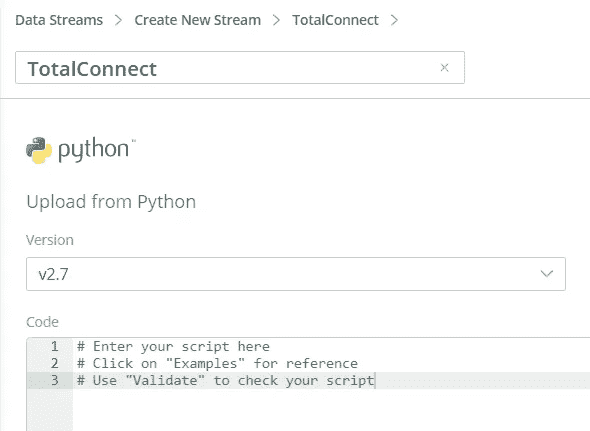
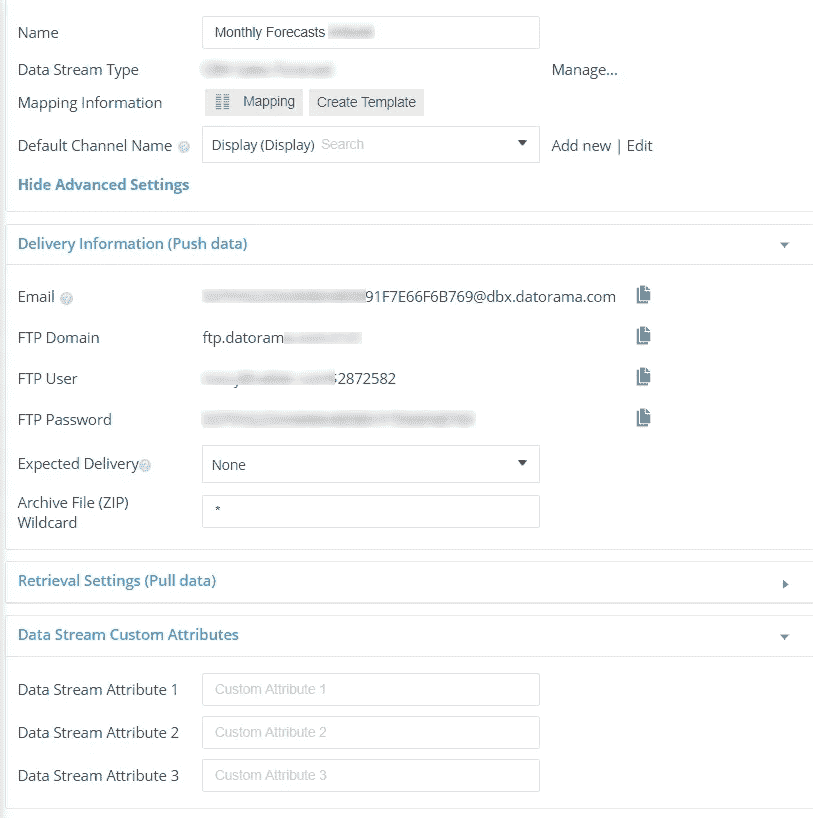
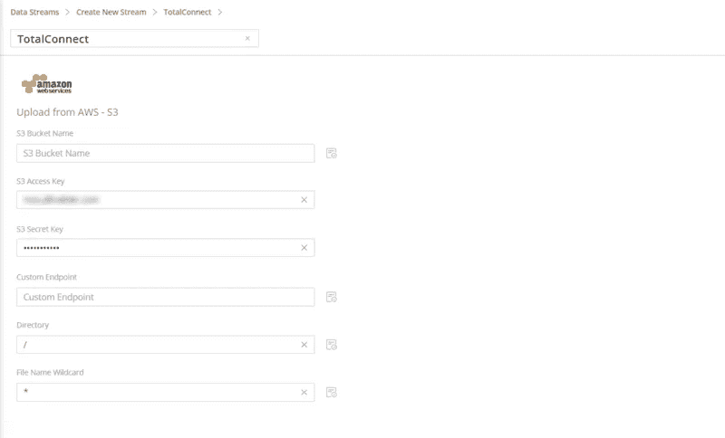
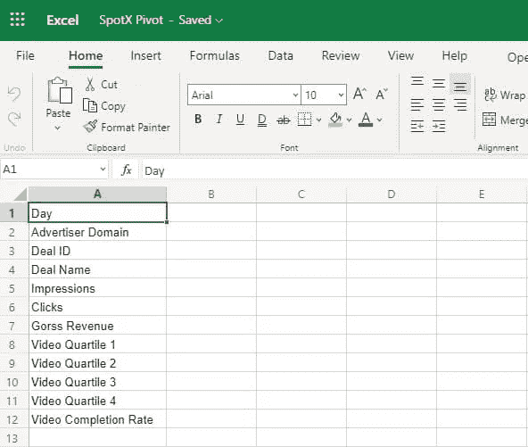
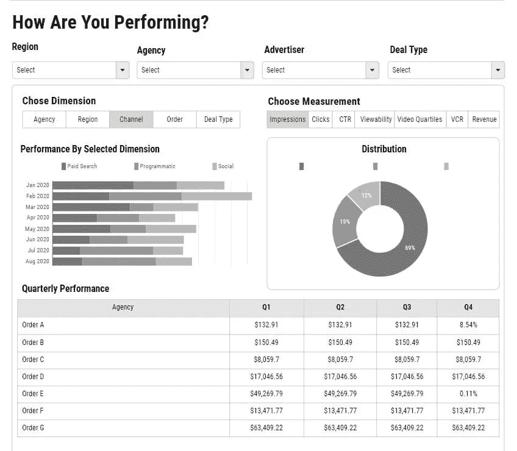
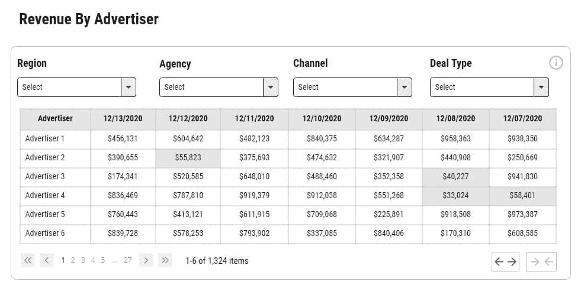

# SpotX 与 Datorama TotalConnect 的集成| Nabler

> 原文：<https://medium.com/geekculture/spotx-integration-with-datorama-totalconnect-nabler-e36dace95bc3?source=collection_archive---------58----------------------->

## datorama:sales force 的智能解决方案

## 克服数据集成挑战

[开发营销仪表板](https://www.nabler.com/customer-intelligence-dashboard-datorama-consulting/)、[解决持续的投放命名错误](https://www.nabler.com/url-generator-tool/)、计费和对账、[媒体支出优化](https://www.nabler.com/articles/optimize-marketing-budget-using-datorama-mcc/)、ETL 支持和自动化报告是任何行业的常见客户需求。然而，由于缺乏执行业务所需的标准 API 连接和自定义业务规则，出版商经常会遇到持续的数据集成挑战。

对于出版商来说，通常需要 50 个或更多的数据源来完成最基本的报告项目。我们的合作涵盖了许多最受欢迎的 SSP 数据提供商，如 Pubmatic、Google Ads Manager、OpenX、Appnexus 和 Rubicon。但是，像 SpotX 这样的一些 ssp 提出了独特的集成挑战，使报告自动化更加复杂。据 Datanyze 称，SpotX 的市场份额为 10%，但我们的经验表明，我们的出版商客户中有整整 30%使用流行的 SSP，特别是在联网电视业务中。

幸运的是，Datorama 和 SpotX 为出版商提供了必要的工具来克服各种形式和规模的数据集成挑战，下面我们将带您详细了解这个用例。

**利用 Datorama TotalConnect 克服 SpotX 集成和自动化营销仪表板的挑战**

SpotX 是一个视频广告服务平台(DSP/SSP ),用于希望通过各种设备和媒体格式将内容货币化的出版商和广告商。SpotX 帮助发行商联系需求合作伙伴并销售视频广告空间，从而最大限度地提高收益，并因其标题竞价解决方案、视频货币化报告和有效的程序性直接跟踪而广受欢迎。

> “Datorama 的 [TotalConnect](https://datorama.com/blog/2021/02/02/introducing-datorama-totalconnect-enhancements/) 是一种数据上传方法，允许您通过 Datorama 数据模型将任何平面文件上传到系统中，从而定制数据接收。当您需要从数据源上传数据并且不存在 API 连接器时，可以使用 Datorama 的 TotalConnect。

不幸的是，仅仅存在一个 API 连接并不一定能解决每个自动化项目的需求，对于寻求板载 SSP 数据的出版商来说尤其如此。无论您是为大型媒体控股公司、五大出版商工作，还是为小型程序化媒体购买者工作，您的业务需求都是独特的，支持报告自动化需求的数据结构和业务规则也是如此。

在撰写本文时，Datorama 缺少 SpotX 的原生连接器。但是，有两种方法可以在平台内集成数据——即使没有公开可用的 API 连接。

首先是用 Datorama 的 TotalConnect。如果你是出版商，TotalConnect 可能是你新的最好的朋友。这是 Datorama 的标准平面文件集成方法，例如，当缺少本地连接和/或可以通过电子邮件检索计划报告时。

当您在 Datorama 中创建一个 [TotalConnect](https://www.nabler.com/articles/what-is-datorama/) 数据流时，您上传了一个摄取数据的样本文件。这样，您可以(通过数据模型)识别和验证数据所属的适当数据流类型，然后将源字段映射到相应的 Datorama 字段。

第二种选择是构建一个定制的连接器。尽管这种方法提供了最大的灵活性，但是创建一个定制的数据连接器也有其挑战性，而且连接器的开发可能会非常昂贵和耗时，即使[数据提供商的文档](https://developer.spotxchange.com/content/local/docs/apiDocs/overview.md)是最佳的。

**Datorama TotalConnect 帮助出版商克服使用平面文件和手动报告流程的需求，这是大多数出版商的典型做法:**

Image by Nabler.com

**Datorama 通过脚本创建自定义数据连接器(API)的首选方法:**

Image by Nabler.com

【Datorama 如何帮助出版商克服数据集成挑战:

发布者可以在 SpotX 的报告控制台中构建自定义报告，并安排一个包含必要字段的平面文件集成到 Datorama 的总连接中。我们通常看到的一些领域包括对收入流、流量、广告商业绩、推荐和交易等的洞察。

在上船并将文件接收到 Datorama 后，可以在 SpotX 和 Datorama 之间建立一个自动检索流程或自定义工作流，以通过使用船上每个数据流唯一的可用流电子邮件 id 来避免手动上传。**参见下面 Datorama 中的数据交付方法示例:**

Image by Nabler.com

Datorama 经常使用这种检索方法来快速处理通过电子邮件收到的报告数据，就像它为数百个其他数据提供商所做的那样。对于许多出版商来说，TotalConnect 是通过电子表格或类似的昂贵且耗时的报告方法进行手动转换的受欢迎的替代方案。

然而，SpotX 为我们提供了一个独特的数据集成挑战。

幸运的是，可以在 SpotX 中创建定制报告并作为电子邮件发送，但是要访问平面文件，必须在检索和处理下载之前进行身份验证。因此，您通过 TotalConnect 在 SpotX 和 Datorama 之间建立自动连接的能力不会立即帮助您。请参见下面 SpotX 自动报告电子邮件中显示的安全链接:

然而，Datorama 和 SpotX 提供了另一种选择。

SpotX 可以将单独的定制报告发送到 AWS 等数据存储库，初始设置后不需要额外的身份验证。例如，发布者通常希望创建一份报告，将广告商的视频表现与四分位数或完成率的表现结合起来。这种关系可以创建为一个**自定义报告**，然后该报告可以发送到 AWS，然后可以快速检索并加载到 Datorama 中。

请参阅下面 Datorama 创建 AWS 连接字符串的方法。

Image by Nabler.com

我们的客户经常来找我们，因为他们的报告流程是手动的，容易出错，并且难以扩展。预先约定，典型的 SpotX 数据透视表可能完全位于 excel 数据透视表中:

Image by nabler.com

但是，作为 Salesforce Datorama 认证实施提供商，我们帮助我们的客户从电子表格转向性能可视化。我们可以获取平面文件，并在 Datorama 中将它们处理成如下所示:

Image by nabler.com

Image by nabler.com

作为[认证的 Datorama 实施合作伙伴](https://www.nabler.com/articles/nabler-a-datorama-salesforce-certification-partner/)，我们遵循既定的流程，同时一丝不苟地遵循客户的要求和批准的技术解决方案。然而，当我们的过程需要真正创造性的、战略性的思考时，出版商通常会提供例外。

[与 Datorama 出版商数据管理领域的领导者之一合作](https://www.nabler.com/customer-intelligence-dashboard-datorama-consulting/)。我们将为您记录、构建和自动化新的报告解决方案，或者扩展您现有报告基础架构的价值。

*原载于*[*https://www.nabler.com*](https://www.nabler.com/articles/datorama-totalconnect-solve-spotx-automated-reporting-challenges/)*。*