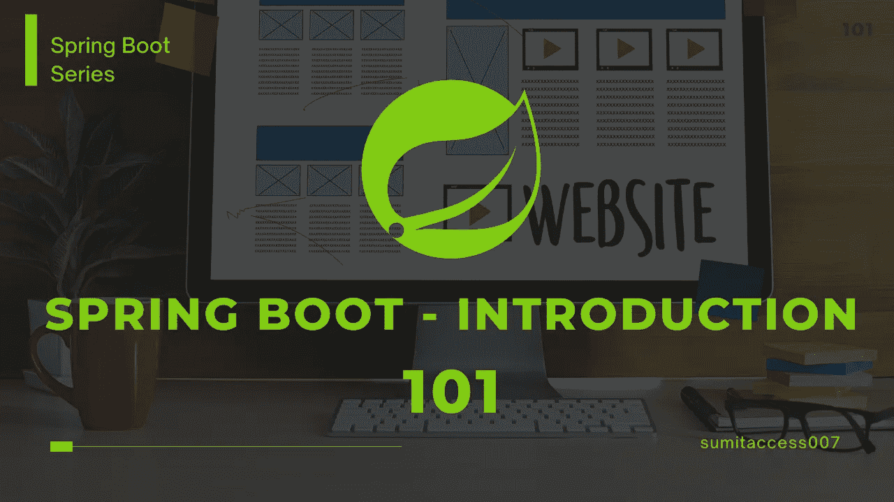
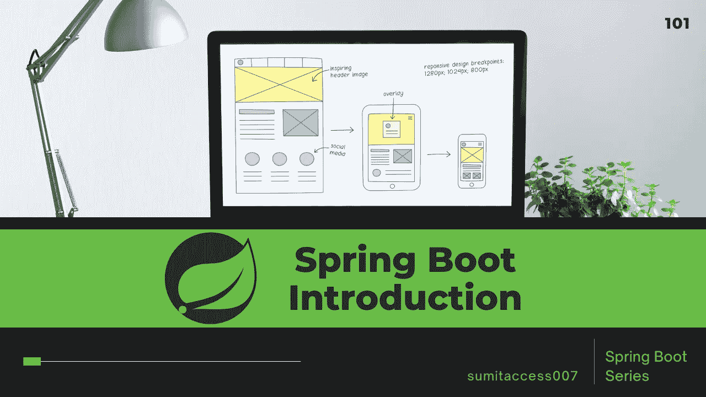
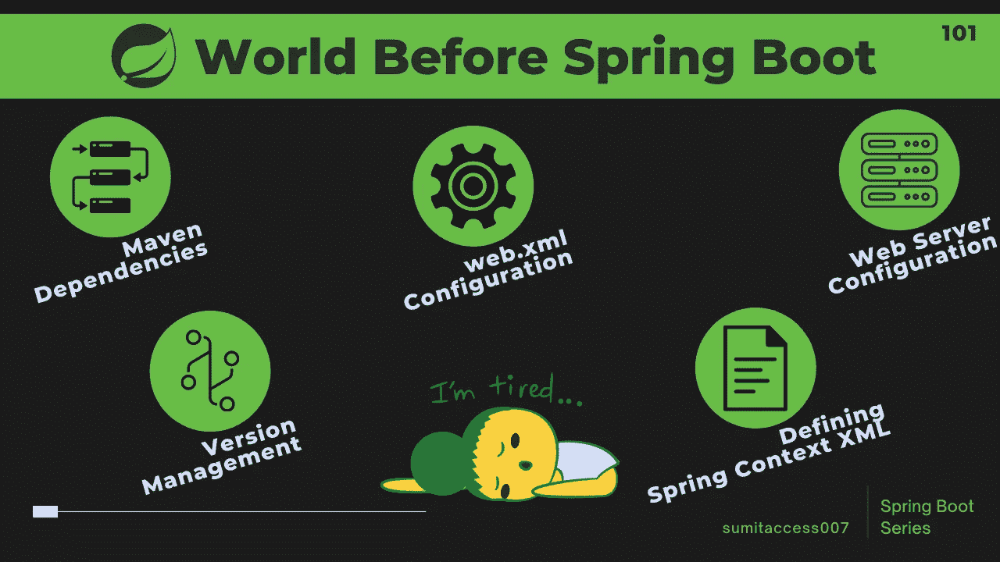
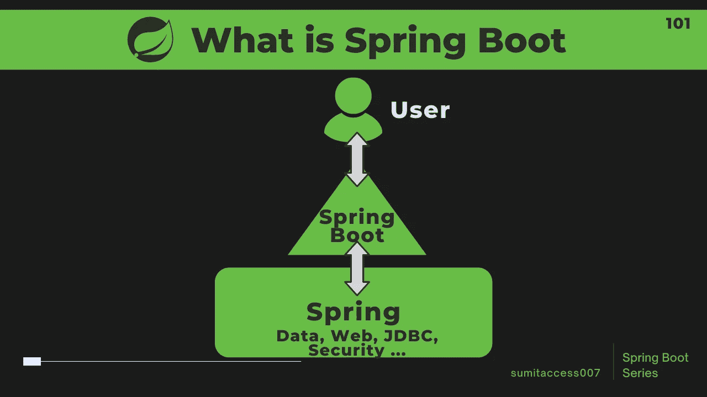
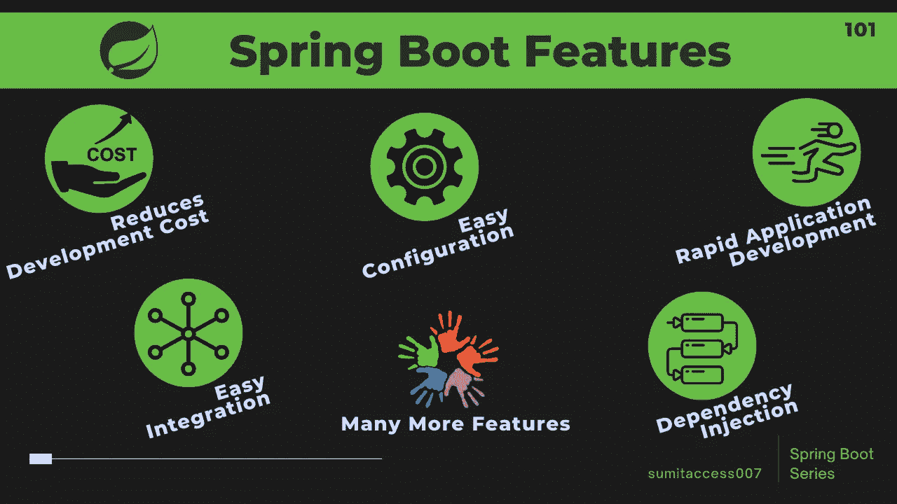

# Spring Boot 101-简介

> 原文：<https://medium.com/geekculture/spring-boot-101-introduction-6caef8b5a10?source=collection_archive---------15----------------------->

## React、Vue.js、Django 时代排名第一的 Web 框架

## Spring Boot——一个广泛使用的 Java 框架

N 开春之后，现在大家都在往 Spring Boot 迁移，因为它的优点有 ***自动配置*******嵌入式服务*******嵌入式数据源*******依赖管理*** *等等。所以在这个系列的* ***Spring Boot 博客*** *中，所有的****Spring Boot****的概念都用他们的* ***项目实现*** *从基础到进阶的水平涵盖了。****

****

****Spring Boot — Introduction****

**从 Spring Boot 博客的**系列开始，本文将对 **Spring Boot** 进行介绍，并对其一些基本概念进行解释。****

**如果你不知道上面提到的术语，不要沮丧，在下一个系列的博客中，所有这些都将在例子的帮助下用非常简单的语言解释。只要确保你阅读了完整的博客，并通过分叉来实现这些项目。**

**稍后，一旦你熟悉了 Spring Boot 的所有模块，开始为开源项目做贡献，这将有助于获得深入的知识并达到精通。我也分享了一些开源项目的列表，以及每个项目中可以学到的特性/模块的完整细节。**

****

**在直接进入 Spring Boot 的概念之前，让我们先了解一下在引入 Spring Boot 之前的世界是怎样的**

# **Spring Boot 之前的世界—**

**在 21 世纪初，组织使用 **Java Enterprise** 框架进行 **Web 应用程序**开发，其局限性是—**

*   **这很麻烦**
*   **它需要重型配置**
*   **创建像“Hello World”这样的简单应用程序需要很长的初始设置时间**

**为了克服所有的 Java EE 的限制，Rod Johnson 在 2002 年创建了 Spring 框架作为控制的反转。**

****

****World Before Spring Boot — Very Tiring****

**同样对于 **Spring** 框架，需要为框架定义 maven 依赖和管理版本，定义 web.xml 文件，定义 **Spring context XML** ，配置 web 服务器。**

****不要害怕**，关于所有这些限制的更详细的解释将在这个 **Spring Boot 系列**的下一篇博客中介绍。**

> ****Spring** 框架的主要特点是**依赖注入**和**控制反转**，有助于开发松耦合的应用。**

**随着时间的推移，Spring 也在成长，在引入了 **Spring Boot** 模块之后，Spring 现在是基于 Java 的应用程序开发中的主要 web 框架。或者我们可以说 **Spring Boot** 是**弹簧**框架的延伸，因为它实际上是建立在常规**弹簧**框架之上的。**

> ****Spring Boot** 的主要特点是**自动配置**，有助于根据需求自动配置类别。**

**为了了解更多关于**春天**和 **Spring Boot** 的信息，在这个系列的 **Spring Boot** 博客中有一个单独的专用博客。让我们快速浏览一下 **Spring** 和 **Spring Boot** 框架的历史——**

# **什么是 Spring Boot？**

****Spring Boot** 是一个**开源的基于 Java 的框架**，构建在 Spring 框架之上，用于创建微服务。**

> ****Spring Boot** 实际上是为了给 Spring 框架提供**快速应用开发**特性而构建的。**

****

****What Is Spring Boot****

****Spring Boot** 由 **Pivotal** 团队开发，用于构建独立的和生产就绪的 Spring 应用程序，因为它提供了一种更简单、更快速的方式来设置、配置和运行简单的和基于 web 的应用程序。**

# **为什么要使用 Spring Boot 框架？**

**由于 Spring Boot 提供的特性和好处，它使得开发应用程序变得简单快捷。Spring Boot 为我们提供了构建应用程序所需的一切。它的一些特征是-**

****

****Why To Use Spring Boot Framework****

*   **极具创新性和推广性的**控制反转**、**依赖注入**和**注释。**后来很多其他框架都使用了这些概念。**
*   **它的**快速应用开发**特性是应用开发领域中最好的特性之一，因为它减少了**开发时间**、**开发人员的工作量**并提高了生产率。**
*   **它减少了应用程序的成本和开发时间。**
*   **它提供了一种更加灵活的方式来配置 Java Beans、XML 配置和数据库事务 **(** 因为它具有强大的数据库事务管理功能)。**
*   **在 Spring Boot，一切都是自动配置的，不需要手动配置。**
*   **它简化了与其他 Java 框架的集成，如 JPA/Hibernate ORM、Struts 等。**

**除了 Spring Boot 框架，还有许多其他的辅助项目来帮助解决现实生活中的问题。一些附带项目是——Spring Data、Spring Batch、Spring Security、Spring Social、Spring Integration。等等。**

**总的来说，这是一个构建应用程序的令人惊叹的框架，无论我们是想使用 Java 还是 Kotlin 构建**后端应用程序**还是**全栈应用程序**， **Spring Boot** 都是可以选择的框架。**

# **结束语—**

**虽然 Java 和 Spring 没有被大肆宣传，但它们仍然是企业软件开发的首选。因此，在 React、Vue.js、Django 时代，Spring Boot 仍然是排名第一的 Web 框架之一。**

**敬请关注 Spring Boot 即将推出的博客，别走开，马上回来😊**

**苏米特·夏尔马**