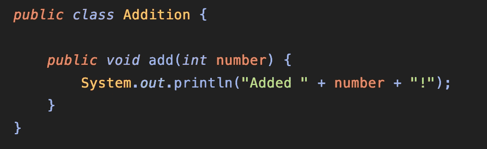
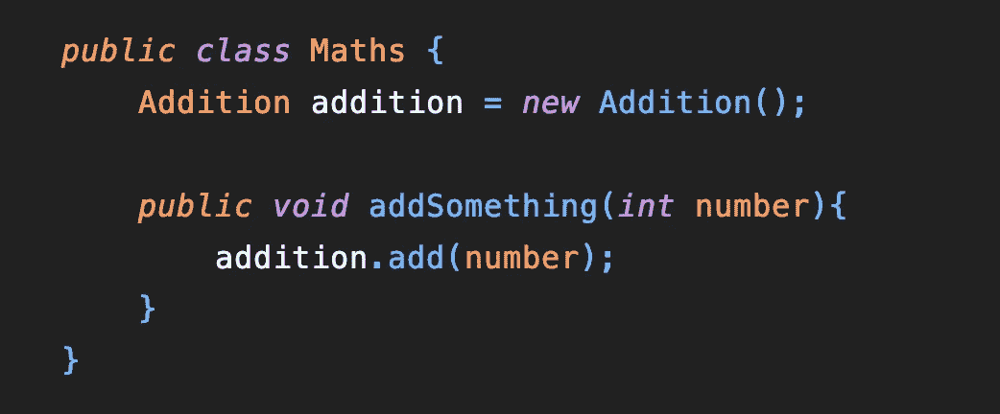
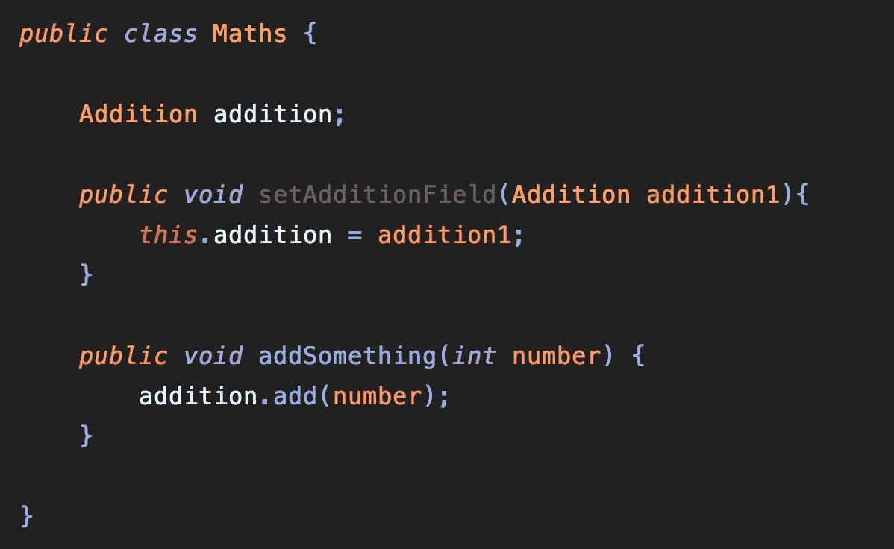
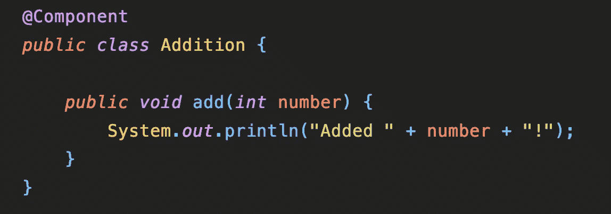
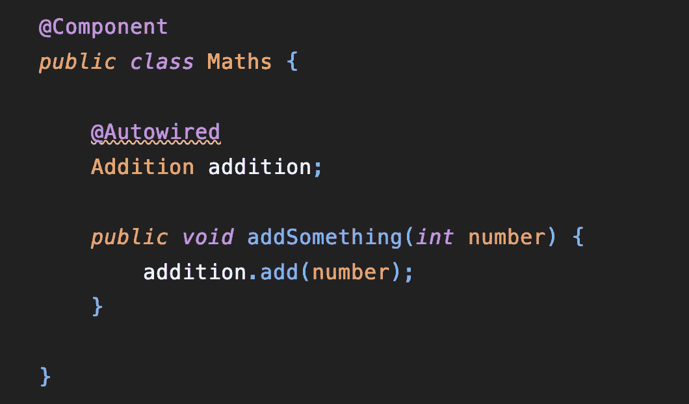
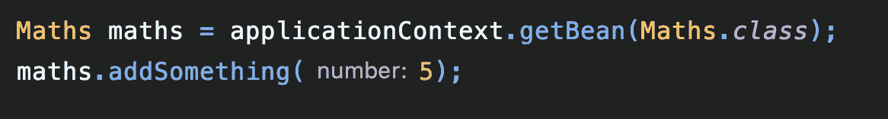

# Spring Boot 和豆子！🍃

> 原文：<https://medium.com/geekculture/spring-boot-and-beans-b2797b488fde?source=collection_archive---------4----------------------->

Spring boot 是后端开发中使用最广泛的框架之一。我最近加入了一个以 Spring Boot 为技术平台的项目，我从来没有使用过这个框架！所以我开始在网上学习，但是很多东西我都没有掌握。我了解了如何建立一个 spring boot 项目，如何创建一个 RESTful API，以及如何创建服务和存储库等等。等等。但我仍然对它实际上是如何实现自动布线的魔力感到困惑。所以我开始更多地探索这个框架，并试图理解 Spring 中的一个基本概念，即**bean**。这是我所理解的…

要了解*豆*，首先要了解一下弹簧使用的 ***反转控制*** 原理。

在普通编程范例中，我们使用 **new** 关键字来创建一个对象。这在两个类之间创建了依赖关系。

在本例中，数学类直接依赖于加法类，而
在创建数学类时，我们无法控制加法类。

在 ***反转控制*** 中，我们这样做:

在这种情况下，我们通过 setter 方法接收 addition class 类型的 Addition 对象。**这样就消除了数学课和加法课之间的依赖关系。**

现在我们已经**控制在实例化数学类时使用哪个加法类实现**。

这种实践也被称为**依赖注入**。Spring 中的自动布线也是基于同样的原理。

## 那么豆子基本上是什么呢？

Bean 是一个预定义、预配置和**预实例化的某个类的对象**。

用外行的话来说，

Bean 是一个我们可以注入到任何类中的对象，我们不需要担心它的实例化或者它的依赖，因为这是由框架本身来处理的。

Spring 中的 beans 存储在一个 **IoC(控制反转)容器**中，这个容器通常被称为 ***应用程序上下文。***

## 我们如何创建一个 Bean？

有很多方法可以创建一个 Bean。使用 **@Component** 注释就是其中之一。

让我们在上面的例子中使用 beans 和自动连接。

让我们创建一个加法类的 bean。

就是这样！现在，将创建一个添加类的 bean，并将**存储在应用程序上下文**中。

***由于应用程序上下文中存在添加类的 bean，我们现在可以使用@Autowired 注释在任何类中直接注入该 bean。***

正如我们所看到的，我们已经使用@Autowired annotation，**直接注入了 Addition 类型的对象，因为 Addition 类型的 Bean 出现在应用程序上下文**中。

我们得到了一个已经实例化的对象，所以我们不需要担心它的实例化。

但是，现在我们必须让数学类也成为 Bean，否则自动布线逻辑将无法工作。

此外，如果我们注意到，我们在这里使用了 IoC 或 DI(依赖注入)原则，因为我们是从外部注入所需的依赖，而不是在类本身中实例化相同的依赖。

@Autowired 注释负责搜索应用程序上下文，并自动找到所需类的 Bean。

如果你读了**，那么豆子基本上是什么**还是那句话，会更有意义。

我们还可以使用***application context***的 ***getBean*** 方法来验证我们的 Bean 是否存储在应用程序上下文中。

这将会很好的工作！

> 这里有一个指向相同代码的 github 链接，你可以随意克隆它，并开始自己进行实验，以消除你对 Spring bean 的疑虑:[https://github.com/yogeshnikam671/springioc](https://github.com/yogeshnikam671/springioc.git)