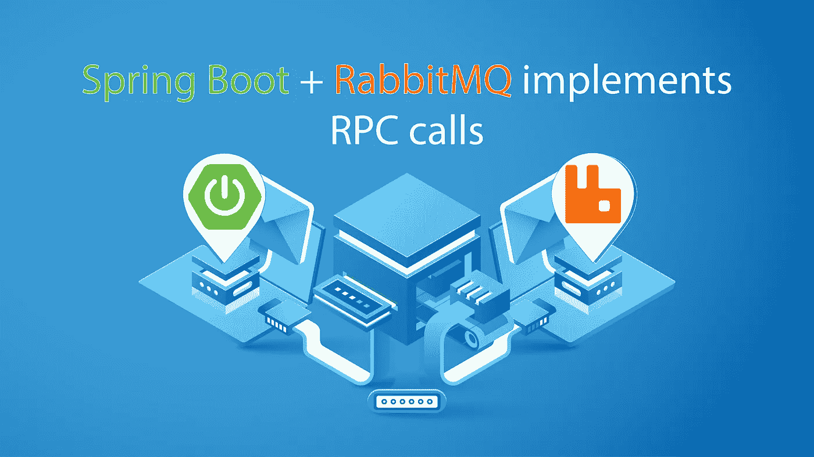

# Spring Boot + RabbitMQ 实现 RPC 调用

> 原文：<https://medium.com/geekculture/spring-boot-rabbitmq-implements-rpc-calls-f795e72e52d7?source=collection_archive---------2----------------------->

RabbitMQ 是一个队列处理程序，因此它允许保存消息并通过另一个任务读取它们。更深入的介绍将在另一篇文章中进行。在本文中，我们将关注 RabbitMQ 中的一个重要概念:RPC。RPC(远程过程调用)允许您向队列发送消息并等待响应。为了更好地理解这个概念，让我们从一个简单的例子开始:生成…