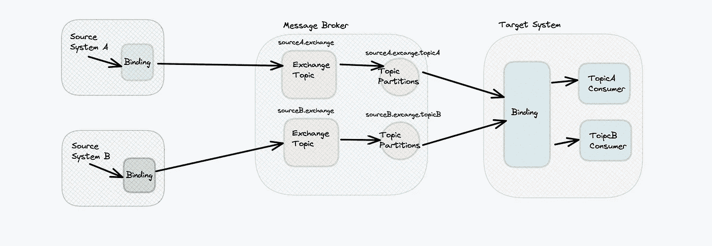
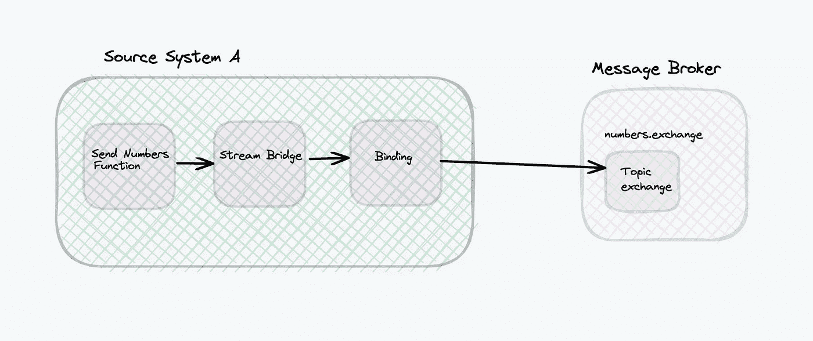
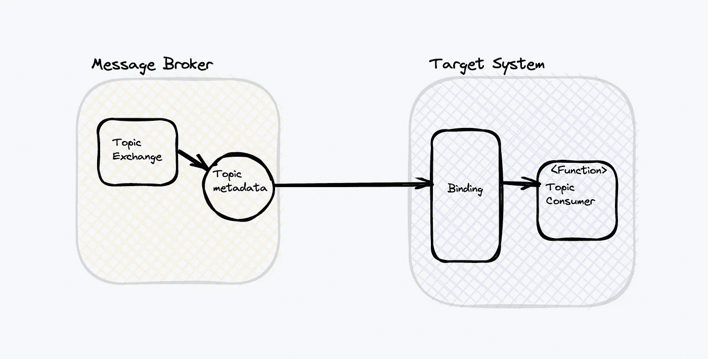

# 使用函数式编程模型的 Spring 云流

> 原文：<https://medium.com/geekculture/spring-cloud-streams-with-functional-programming-model-93d49696584c?source=collection_archive---------1----------------------->

这个故事讲的是用 Java 函数式程序编写 Spring 云函数。在此之前，我们可以使用@EnableBinding、@Input、@Output 来编写。但是从 3.1 开始，这些注释已经被*弃用*，取而代之的是*函数编程模型*。我们将看到如何使用 Java 函数式编程模型编写生产者、消费者。

消息驱动处理是基于服务的架构中广泛采用的设计模式。这种设计有效地支持大量的请求处理，因为服务集成是基于非阻塞消息通信的。

消息代理是在服务之间传递消息的关键基础设施组件。然而，对于开发人员来说，为了编写与消息代理集成的代码而学习特定消息代理的 API 是一件苦差事，因为业界有许多流行的消息代理，如 ActiveMQ、RabbitMQ 和 Kafka。

Spring Cloud Stream 是一个构建消息驱动的微服务应用的框架。Spring Cloud Stream 构建于 Spring Boot 之上，并使用 Spring 集成来提供与消息代理的连接。它提供了中间件的配置，引入了发布-订阅、使用者组和分区的概念。

# 基于注释的实现

如果您习惯于基于 Spring 框架构建应用程序，那么您应该熟悉注释的使用。通过添加注释，您可以简单地将特性添加到类和方法中。例如，annotation @Streamlistener 将指定由传入消息触发的方法。虽然在一段时间内注释仍然可以用于开发，但这种方法已经被 ***弃用，并且从 Spring Cloud Stream 3 . x***版本开始不再推荐。

# 函数编程模型

另一方面，函数式编程模型是一种新的方法。函数是函数式编程范例中的基本单位。每个功能都是解决特定问题的独立模块，而它们的组合可以解决复杂的问题。Java Stream 是函数式编程的典型例子。

**Sample Message Driven application overview**

为了扩展这一点，我们将提出一个简单的例子。， ***一个著名的***[***fizz buzz***](https://www.geeksforgeeks.org/fizz-buzz-implementation/)***问题在采访中问*** 。

不同的实现方式，消息驱动的应用程序使用任何消息代理，如 Kafka，RabbitMQ。Spring Cloud Stream 简化了消息驱动系统的开发，使得开发变得更加容易，并且有助于轻松地与消息代理集成。此外，该框架基于配置自动提供主题交换、消息队列和绑定，实现代码作为基础设施，这极大地减少了对环境设置的依赖。

**使用 Spring Cloud Stream 实现事件驱动应用的方法**

*   使用绑定器、输入和输出的基于注释的实现(这在 spring-cloud 版本 3x 中已被否决)
*   利用 Java 函数式编程的基于函数的实现。

***基于功能实现***

基于函数的实现不需要定义消息通道，因为框架直接将绑定链接到函数。

**Producer Configuration**

**Consumer Configuration**

我们没有使用@StreamListener 注释，而是使用消费者函数实现来定义消息处理程序，并将它们注册为 beans。

请在 [**GitHub**](https://github.com/ereshzealous/spring-cloud-stream-examples/tree/main/spring-cloud-stream-functional-programming) 链接上找到完整的源代码。

# **让我们定义函数**

在这里，为了演示的方便，我使用同一个应用程序作为生产者和消费者。

***fizzBuzzProducer***是每 5 秒生成一个范围内随机数的生成器。

***fizzBuzzProcessor***就是处理器就像中间件一样，生产者产生的数字。这个充当消费者的从先前产生的消息和过程的逻辑 ***和*** 逻辑又发布到另一个主题。

***fizzBuzzConsumer***将消费处理器发布并在控制台打印出来的消息。

> 这个用例看似简单，我的意图是展示谁可以用 Java 函数式编程来定义生产者、消费者在 Spring boot 应用程序中的多个主题。

# **配置**

配置类似于基于注释的方法，但是绑定名称是由框架基于以下命名约定确定的: ***<函数名称> -in- <索引>*** 其中 *<索引>* 在大多数情况下总是为 0，除非[函数具有多个输入和输出](https://docs.spring.io/spring-cloud-stream/docs/3.1.3/reference/html/spring-cloud-stream.html#_functions_with_multiple_input_and_output_arguments)。

其次，在**spring . cloud . function . definition**中注册函数名，使用流绑定。