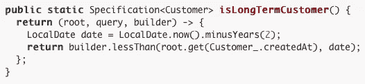

# Spring Data JPA:一种通用规范查询语言

> 原文：<https://medium.com/geekculture/spring-data-jpa-a-generic-specification-query-language-a599aea84856?source=collection_archive---------1----------------------->


Image from DataCentric.es

W 当使用 *Spring Framework* 特别是 *Spring Data JPA、*进行项目时，我们会遇到不同的策略来编写数据库查询，例如:

*   ***派生查询方法*** (从方法名创建查询)。
*   ***JPA 命名查询*** (在实体中)。
*   ***声明查询— @Query* 批注**(写成 *native* *SQL* 或 *JPQL* 查询)。

真正的问题是:框架提供的这些实用方法是否足以构建一个搜索和过滤实体的动态结构，并避免样板代码？。

在本文中，我们将回顾一个将 API 消费者搜索转换为动态构建的 SQL where 子句的策略，通过已经合并的**标准 API** 应用 Spring **谓词**和**规范**。


# 介绍

随着我们的应用程序的增长，我们遇到了满足 API 消费者搜索和过滤项目实体的需求。

在这种情况下，我们通常会问自己，*我们应该在存储库中手动编写每个过滤器查询吗？* *如果 API 消费者希望组合一个或多个属性来生成‘AND-OR’查询，该怎么办？*。

考虑每个属性过滤器的组合是不可能的，也是乏味的，会在我们的存储库中生成大量不同的不可维护的查询。

这里是**标准 API** 、**谓词**和**规范**出现的地方。

# 标准 Api、谓词和规范

**Criteria API** 提供了一种创建类型化查询的编程方式。**规范**接口可用于将一组**谓词**与SQL **和/或**操作符组合在一起。

让我们回顾一些[官方 Spring JPA 文档](https://docs.spring.io/spring-data/jpa/docs/current/reference/html/#specifications)部分:

> JPA 2 引入了一个**标准 API** ，您可以使用它以编程方式**构建查询**。通过编写一个`Criteria`，您为一个域类定义了一个查询的 **where 子句。再退一步，这些标准可以被视为 JPA 标准 API 约束所描述的实体**的谓词。
> 
> **规范可以很容易地用于在实体**之上构建一组可扩展的谓词，然后可以与`JpaRepository`组合使用，而不需要为每个需要的组合声明一个查询(方法)。



Spring Documentation Example: Specification for a Customer

完美！我们可以使用**标准 API** 为每个实体构建**规范**，作为**谓词**与各种 SQL 操作的组合(*小于*、*大于*、*等于*、*类似于*等)。).

为了达到我们的目的，我们需要通过构建一种通用的方法来整合这些概念，这种方法能够根据 API 消费者过滤器的需求动态地创建实体规范。

# **通用规范查询语言**

> **GitHub 资源库**:【https://github.com/msampietro/spring-spec-query-language 

## **查询语言结构和要求**

因为我们将使用伪语言从字符串输入中构造**谓词**，所以我们需要遵守特定的搜索格式，以便正确解释和解析搜索。

出于这个目的，我写了详细的文档，你可以在[项目 Wiki 部分](https://github.com/msampietro/spring-spec-query-language/wiki/Index)找到。

## 代码分析

我会尽量保持分析简单。

让我们开始吧。

## 例示

```
SpecificationBuilder<**Movie**> specificationBuilder = new SpecificationBuilderImpl<>(**objectMapper**, **Movie.class**);
```

***specification builder<T>***实现类接收两个参数:

*   ***对象映射器(Jackson)* :** 负责将输入值转换成与所请求的实体属性相关的所需值类型。方便在定义单例对象映射器时避免***specification builder<T>***实现每次创建它的一个新实例。
*   ***类< T >(实体返回类)* :** 主要用于判断实体主键是否定义为通用的可序列化 Id。考虑下面的例子:

```
@MappedSuperclass
@Getter
@Setter
public class **BaseEntity<I extends Serializable>** implements Serializable {

    @Id
    @GeneratedValue(strategy = GenerationType.*SEQUENCE*, generator =    "base_seq_gen")
    @Column(updatable = false, nullable = false)
    private **I id**;
}--------------------------------------------------------------------@Entity
@Table(name = "movie")
@Getter
@Setter
public class **Movie** extends **BaseEntity<Long>** {...}
```

## 使用

***Specification builder<T>***契约只包含一个方法***parseAndBuild***，，该方法解释来自查询语言的有效搜索字符串并返回相应的实体规范。

```
Optional<Specification<Movie>> specification = specificationBuilder.**parseAndBuild(search)**;
```

让我们解释一下***parseAndBuild***方法的主要步骤:

1.  解析搜索字符串。
2.  构建谓词。
3.  以谓词串联的形式返回规范。

## 1.解析搜索字符串

```
private static final List<ParseCommand> ***PARSE_COMMANDS***= new ArrayList<>(Arrays.*asList*(
        new **SimpleParseCommand**(),
        new **NestedParseCommand**(),
        new **ReferencedSimpleParseCommand**(),
        new **ReferencedCompoundParseCommand**()
));
```

***specification builder<T>***实现静态地实例化一个 ParseCommands 列表，该列表使用正则表达式评估每个搜索输入，并构建相应的 ***SearchCriteria*** 对象。

```
@Override
public Optional<Specification<T>> **parseAndBuild**(String search) {
    if (StringUtils.*isBlank*(search))
        return Optional.*empty*();
    var **params** = new ArrayList<SearchCriteria>();
    var **splitOperation** = SpecificationUtils.*determineSplitOperation*(search).orElse(null);
    var **isOrPredicate** = StringUtils.*equals*(splitOperation, *OR_PREDICATE_FLAG*);
    var **searchQueries** = SpecificationUtils.*splitSearchOperations*(search, splitOperation);
    for (var parseCommand : ***PARSE_COMMANDS***)
        params.addAll(**parseCommand.parse(searchQueries, isOrPredicate)**);
    return **build(params)**;
}
```

***SearchCriteria*** 是将原始搜索字符串转换为包含所有主要搜索数据的对象的结果:实体*键名*、搜索*值*、 *SQL 操作*本身(enum called***search operation***)以及作为 **splitOperation** 变量求值结果的 *isOrPredicate* 布尔值。

接下来，在 **parseAndBuild** 的最后一行中引用的 ***可选<规范< T > >构建(List<search criteria>params】***方法为请求的实体创建一个 ***规范工厂*** ，它将通过调用**来构造关于每个***search criteria***的搜索谓词**

```
public Specification<T> **getSpecification**(SearchCriteria searchCriteria) {
    BasePredicate<T> predicate = operationMap.get(searchCriteria.getOperation());
    predicate.setSearchCriteria(searchCriteria);
    return predicate;
}
```

## 2.构建谓词

specification factory***get specification***方法接收一个***search criteria***对象作为参数，并依靠其内部的***search operation***属性，应用相应的**谓词构建器类**。

可用的谓词生成器:

*   *EqualityPredicate.java*
*   *NegationPredicate.java*
*   *GreaterThanOrEqualPredicate.java*
*   *LessThanOrEqualPredicate.java*
*   *LikePredicate.java*
*   *ContainsPredicate.java*
*   *StartsWithPredicate*
*   *EndsWithPredicate.java*
*   *CollectionContainsPredicate.java*

**like 谓词示例:**

```
@Override
public Predicate **toPredicate**(Root<T> root, CriteriaQuery<?> query, CriteriaBuilder builder) {
    return builder.like(builder.upper(getCriteriaStringExpressionKey(root).as(String.class)), StringUtils.*upperCase*(getCriteriaObjectValue().toString()));
}
```

每个构建器将从已解析的***search criteria***和必要的 ***实体连接中自动确定相应的 SQL where 子句操作。***

**连接**操作使用**默认连接类型** ( **内部**)。我们可以搜索实体本身的属性，也可以搜索相关的*一对一*、*一对多*，甚至*多对多*嵌套关联的属性。

## 3.将规范作为谓词的串联返回

在最后一步中，回到第一步的**构建**方法，我们可以观察到下面的代码块:

```
**Specification<T> result = specFactory.getSpecification(params.get(0));**
for (var i = 1; i < params.size(); i++)
    result = params.get(i).isOrPredicate()
            ? **Objects.*requireNonNull*(Specification.*where*(result)).or(specFactory.getSpecification(params.get(i)))**
          **  : Objects.*requireNonNull*(Specification.*where*(result)).and(specFactory.getSpecification(params.get(i)));**
return Optional.*of*(result);
```

首先，***Specification factory<T>***是创建初始的 ***规范< T >*** 对象名为*【结果】*作为第一个谓词封装。

如果是多次搜索，则评估***search criteria***对象的 ***或预测*** 变量是否将列表中的以下**谓词**连接为结果查询 where 子句中的**和**或**或**操作。

最后，返回 ***规范< T >*** 结果，准备好供所有者实体 JPA 存储库使用，以过滤结果。

# 考虑

1.  如果需要像下面这样解析过滤器，则不能使用这种方法:

***(X =1 或 X = 2)和(Y > 3)。***

首先，**和**与**或**谓词在同一个搜索字符串中的组合还不被支持。其次，SQL where 子句会被 Hibernate 解析为 ***X =1 或 X = 2 和 Y > 3*** 这是不一样的。

2.上述实现的缺点是我们不能控制属性类型和存在。例如，如果出现以下情况，将抛出**运行时异常**:

*   **无效参数**:例如，`LocalDateTime`类型的字段被评估为`Integer`值，或者`String`值被转发到比操作更大的*操作。*
*   **未找到字段**:实体中不存在搜索字符串中指定的字段。

只有当 ***JPA 库*** *执行规范的* ***来预测*** *内部方法，* ***不在 parseAndBuild 方法调用*** *期间，才会抛出 **RuntimeException** 。*

3.在某些情况下， **Hibernate** 会从已解析的**规范**中生成不必要的**额外连接**:

*如维基等式操作中举例说明的:*

*/电影？search=actors.id:535*

***冬眠:****select[…]****from movie****movie 0 _****inner join movie _ actor****actors 1 _ on movie 0 _。id=actors1_。movie_id* ***内联演员****actor 2 _ on actors 1 _。actor_id=actor2_。id* ***其中 actor2_。id = 535***

最后一个 join(***inner join actor***)是不必要的，我们可以写成:

***where actors1_。actor_id=2。***

4.该实现在具有 ***自动递增*** 和 ***序列*** 主键的实体中进行了测试。我们还没有在具有 ***复合*** 主键( *@Embedded* 和 *@EmbeddedId* )的实体中进行测试。

# 结论

Spring Data JPA 规范提供了一种方便而复杂的方式来构建动态 SQL where 子句。通过添加一些额外的逻辑和考虑一些陷阱，我们能够为 API 消费者提供一个零工作量的通用机制来过滤实体。

随意将*分支*并将*拉请求*提交给存储库。

# 贮藏室ˌ仓库

[](https://github.com/msampietro/spring-spec-query-language) [## msampietro/spring-spec-query-language

### Permalink 无法加载最新的提交信息。没有提供描述、网站或主题。你不能表演那个…

github.com](https://github.com/msampietro/spring-spec-query-language) 

# 维基网

[](https://github.com/msampietro/spring-spec-query-language/wiki/Index) [## msampietro/spring-spec-query-language

### specification builder movieSpecBuilder = new SpecificationBuilderImpl(object mapper，movie . class)；例如…

github.com](https://github.com/msampietro/spring-spec-query-language/wiki/Index) 

# 联系信息

[](https://www.linkedin.com/in/sampietromartin/) [## Martin Sampietro -阿根廷|职业简介| LinkedIn

### 查看 Martin Sampietro 在 LinkedIn(全球最大的职业社区)上的个人资料。马丁有 2 份工作列在…

www.linkedin.com](https://www.linkedin.com/in/sampietromartin/) 

邮件:**sampietromartin1@gmail.com**