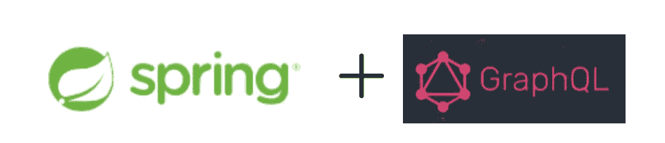

# GraphQL 的春天

> 原文：<https://medium.com/geekculture/spring-for-graphql-9833f4442908?source=collection_archive---------1----------------------->

# 介绍

GraphQL 是一种开源查询语言，由脸书创建，作为通用 REST 架构的替代方案。它允许用户请求特定的数据，从而避免了与 REST 相关的经典的[溢出](https://www.howtographql.com/basics/1-graphql-is-the-better-rest/)问题。

在本文中，我们旨在讨论 GraphQL 的 Spring，它是 GraphQL Java 团队的 [GraphQL Java Spring](https://github.com/graphql-java/graphql-java-spring) 项目的继承者。该项目正处于[的里程碑](https://github.com/spring-projects/spring-graphql/milestones) …