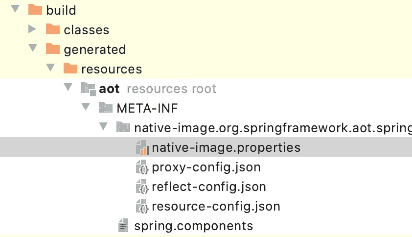

# 春季原生测试版

> 原文：<https://medium.com/geekculture/spring-native-beta-release-a70919da4762?source=collection_archive---------13----------------------->


最近，将 Spring 移植到 GraalVM 的团队发布了它的第一个主要版本 Spring Native Beta。他们与 GraalVM 的创建者一起，设法修复了编译器和 Spring 中的许多 bug。现在项目有官方支持，有自己的发布周期，可以用了。

将代码从 JVM 移植到二进制的最大障碍是使用 java 特有的特性的问题——反射、类路径处理、动态类加载等。

根据文档，常规 JVM 和本机实现之间的主要区别如下:

整个应用程序的静态分析是在构建时执行的。

未使用的组件在构建时被移除。

反射、资源和动态代理只能用附加配置来配置。

所有组件在构建时都固定在类路径中。

没有惰性类加载:可执行文件中提供的所有内容都将在加载时加载到内存中。例如，为了使 Class.forName ("myClass ")调用正常工作，需要在配置文件中包含 myClass。如果在请求动态加载类的配置文件中没有找到类，将引发 ClassNotFoundException

一些代码将在构建时运行，以正确链接组件。例如，测试。

在 sprung 本身中，反射、代理创建和惰性初始化几乎无处不在，因此所有配置都必须小心处理，因此它花了一年多的时间才发布。



在研究过程中，创建了一个新的组件 Spring AOT，它负责将您的代码转换为 Graal VM 可消化的格式。

Spring AOT 解析代码并使用它来创建配置文件，如 native-image.properties、reflection-config.json、proxy-config.json 或 resource-config.json

因为 Graal VM 支持通过静态文件进行初始配置，所以在构建期间，这些文件被放在 META-INF/native-image 目录中。

每个构建器都有不同的插件来激活 Spring AOT。对于 maven，它是 spring-aot-maven-plugin，对于 Gradle，它是 spring-aot-gradle-plugin。为了将 Gradle 插件添加到您的项目中，您只需要一行代码:

```
plugins {id ‘org.springframework.experimental.aot’ version ‘0.9.0’}
```

该插件试图配置尽可能多的组件，对所有程序组件进行初步转换以提高兼容性。

如果它不能这样做，您将需要自己添加这些数据。这可以通过更正配置文件或使用专门创建的注释来手动完成。

例如，对于使用 WebClient 实现组件的情况，您可以使用 org . spring framework . nativex . hint 中的注释来指定我们将处理的类型:

```
@TypeHint(types = Data.class, typeNames = “com.example.webclient.Data$SuperHero”)
@SpringBootApplication
public class WebClientApplication { *// …* }
```

这里我们指定我们将序列化数据类，它有一个子类 SuperHero。在构建时，将会提前为我们创建一个可以处理这种数据类型的客户端。

因为 GraalVM 不支持使用动态代理，所以创建了 [@ProxyHint](http://twitter.com/ProxyHint) 注释来支持使用 Java . lang . reflect . proxy。

你可以这样应用它，例如:

```
@ProxyHint(types = { org.hibernate.Session.class, org.springframework.orm.jpa.EntityManagerProxy.class })
```

如果您想将任何资源拉入图像，您应该使用 [@ResourceHint](http://twitter.com/ResourceHint) 注释:

```
@ResourceHint(patterns = “com/mysql/cj/TlsSettings.properties”)
```

要指定哪些类/包应该在构建或运行时显式初始化，请使用 [@InitializationHint](http://twitter.com/InitializationHint) 注释:

```
@InitializationHint(types = org.h2.util.Bits.class, initTime = InitializationTime.BUILD)
```

创建 [@NativeHint](http://twitter.com/NativeHint) 注释是为了以一种紧凑的方式将所有这些注释集合在一起:

```
@Repeatable(NativeHints.class)
@Retention(RetentionPolicy.RUNTIME)
public @interface NativeHint
```

总的来说，它看起来像这样，例如:

```
@NativeHint( 
   trigger = Driver.class,
   options = “ — enable-all-security-services”,
   types = 
     @TypeHint(types = { FailoverConnectionUrl.class // … }),
   resources = { 
     @ResourceHint(patterns =   “com/mysql/cj/TlsSettings.properties”),
     @ResourceHint(patterns = “com.mysql.cj.LocalizedErrorMessages”, isBundle = true) })
```

作为一个触发器，我们选择在类路径中出现的类应该导致配置被构建。

所有活动注释在编译时都会被考虑在内，并通过 Spring AOT 插件转换成 Graal VM 配置。

Spring Native 已经包含在发布周期中，你可以直接从 start.Spring.io 拿起模板，由于已经实现了对 JPA 和其他 spring 组件的支持，你可以马上构建一个简单的 CRUD 应用。如果您需要在构建时指定额外的 Graal VM 参数，如果通过构建包构建，您可以使用 Spring AOT 插件中的**BP _ NATIVE _ IMAGE _ BUILD _ ARGUMENTS**环境变量添加它们，或者如果您通过 native-image-maven-plugin 构建，则使用 pom.xml 中的"< buildArgs >"配置元素添加它们。

实际上，运行命令**mvn spring-boot:build-image**或 **gradle bootBuildImage** ，镜像将开始构建。值得注意的是，构建器需要超过 7 GB 的内存才能成功构建。在我的机器上，构建和上传图像不超过 5 分钟。该图像非常紧凑，只有 60 MB。应用程序在 0.022 秒内启动！这是一个不可思议的结果。越来越多的公司正在转向 K8s，应用启动以及所使用的资源在当今世界非常重要，这项技术使 Spring 成为所有类型微服务的头号框架，即使对于冷启动速度非常重要的 FaaS 实施也是如此。