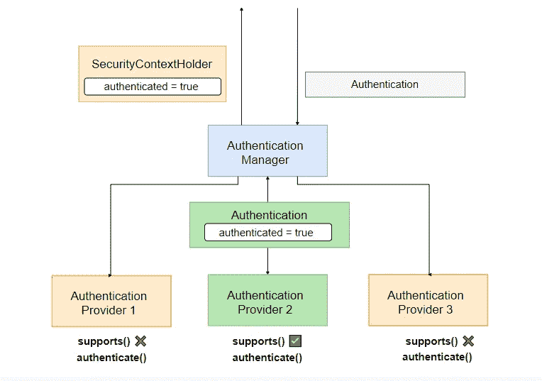
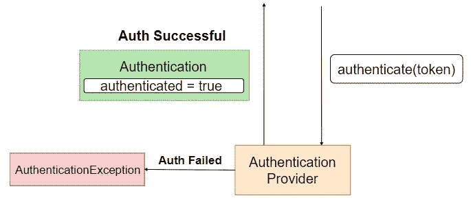
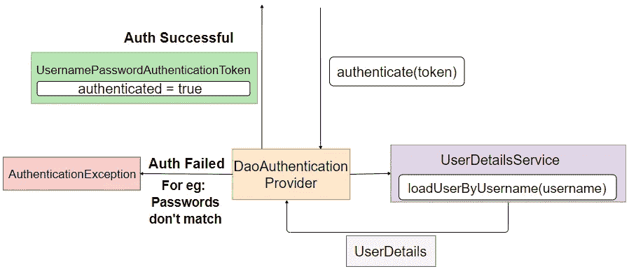
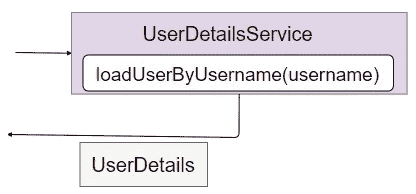
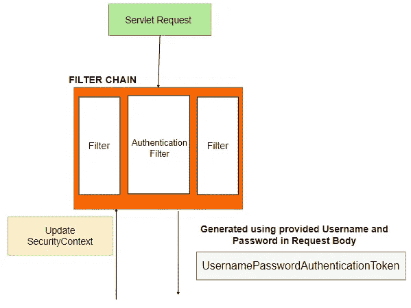
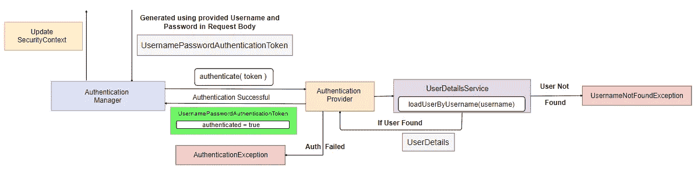
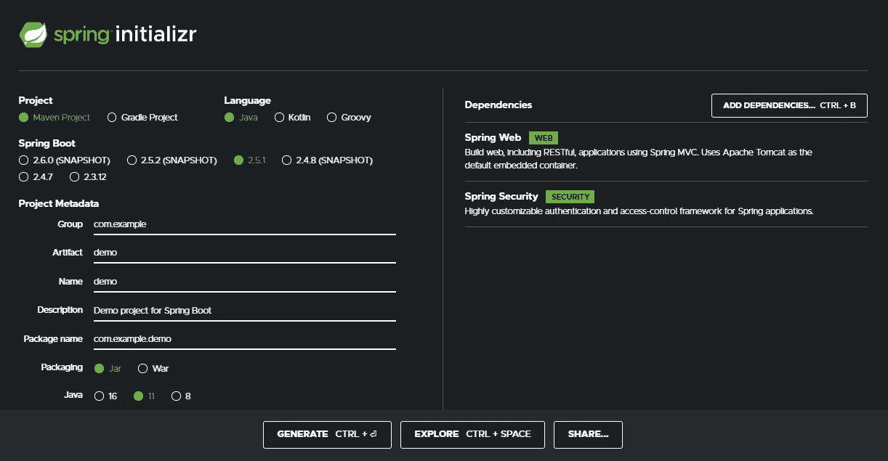
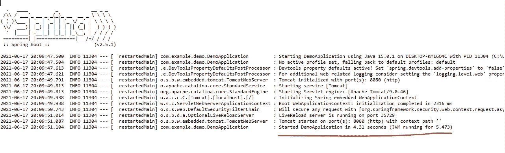
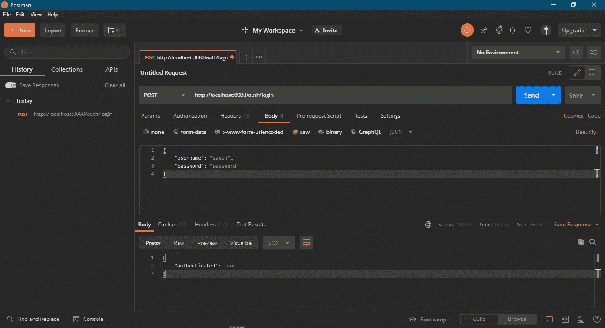
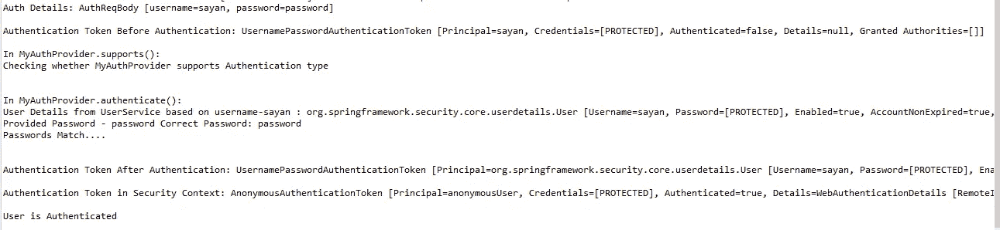

# Spring 安全认证过程:幕后的认证流程

> 原文：<https://medium.com/geekculture/spring-security-authentication-process-authentication-flow-behind-the-scenes-d56da63f04fa?source=collection_archive---------1----------------------->


Photo by [Lianhao Qu](https://unsplash.com/@lianhao?utm_source=medium&utm_medium=referral) on [Unsplash](https://unsplash.com?utm_source=medium&utm_medium=referral)

在每个应用程序中，身份验证是第一层保护。因此，认证是应用程序安全性的主要部分，在这篇文章中，我们将深入探讨 **Spring Security** 用于**认证的架构。**

> **什么是认证？**认证就是证明你是谁。例如，您的身份证用于在您的学校/学院/办公园区“验证”您的身份。

默认情况下，Spring Security 为身份验证提供了出色的支持。有点像即插即用的风格。简单的身份验证工作流非常容易设置。但是，如果您想要一个完整的定制实现，那么您需要理解身份验证流程，并且理解当服务器收到身份验证请求时，在幕后发生了什么。

# 幕后:理论

## 组件:

1.  **认证过滤器**:它是**过滤器链**中的**过滤器**，检测认证尝试并将其转发给**认证管理器**。

**2。认证**:该组件指定要进行的认证类型。它是一个接口。它的实现指定了`Authentication`的类型。例如，`UsernamePasswordAuthenticationToken`是`Authentication`接口的实现，它指定用户希望使用用户名和密码进行身份验证。其他例子还有`OpenIDAuthenticationToken`、`RememberMeAuthenticationToken`。

**3。认证管理器**:该组件的主要工作是将 authenticate()调用委托给正确的`AuthenticationProvider`。一个应用程序可以有多个`AuthenticationProvider` ，其中很少是`**DaoAuthenticationProvider**`、`**LdapAuthenticationProvider**`、`**OpenIDAuthenticationProvider**`等。).身份验证管理器通过在每个可用的 Authentication Provider 上调用 supports()方法来决定将调用委托给哪个身份验证提供者。如果 supports()方法返回 true，那么`AuthenticationProvider` 支持`**Authentication**` 类型并用于执行认证。



**AuthenticationManager**

在此图中，我们可以看到有三个身份认证提供者。其中，**身份验证提供者 2** 支持传入身份验证的类型，因为它的 supports()方法返回 true。然后，它执行身份验证，如果成功，则返回相同类型的身份验证对象，authenticated 属性设置为 true，同时返回一些其他相关属性。

**4。认证提供者**:它是一个接口，其实现处理某种类型的认证。一个`AuthenticaionProvider`有一个 authenticate 方法，它接受`Authentication`类型并对其执行身份验证。认证成功后，`AuthenticationProvider`返回一个相同类型的`Authentication`对象，该对象被作为 authenticated 属性设置为 true 的输入。如果认证失败，那么它抛出一个认证异常。下图显示了通用的 AuthenticationProvider:



AuthenticationProvider

在大多数应用程序中，我们执行用户名和密码验证，因此，在执行验证之前，我们必须获取**用户详细信息**(用户名/电子邮件、密码、角色等)..)在**用户服务**的帮助下从**“数据源”**如数据库中获取，然后对照实际数据验证所提供的数据。下图演示了 DaoAuthenticationProvider 的流程(这是 AuthenticationProvider 接口的一个实现，主要处理用户名密码验证):



DaoAuthenticationProvider

**5。UserDetailsService:** 这是一个服务，它负责从一个 **"datasource "、**很可能是一个使用**loaduserbysusername(String username)**方法的数据库中获取用户的详细信息，该方法将用户名作为一个参数。然后，它返回一个 **UserDetails** 对象，其中填充了从数据源(数据库)获取的用户数据。UserDetails 对象的三个主要字段是用户名、密码和角色/权限。



UserDetailsService

## 大局

是时候把所有东西放在一起了。我们将借助图表来了解用户名和密码认证的整个流程。这是一个相当大的图表，所以我将把它分成两部分，我们将根据我们刚刚了解到的组件，把整个流程分成详细的步骤——



Authentication Flow ( Pt. 1 )

**步骤 1** :当服务器收到认证请求，比如登录请求，首先被过滤器链中的认证过滤器拦截。

**步骤 2** :使用用户提供的用户名和密码创建一个**用户名密码认证令牌**。如上所述，**usernamepasswordtauthenticationtoken**是**身份验证**接口的一个实现，在用户想要使用用户名和密码进行身份验证时使用。有点不言自明，不是吗？

**步骤 3** :将**usernamepasswordtauthenticationtoken**传递给 **AuthenticationManager** 以便对令牌进行认证。



Authentication Flow ( Pt. 2 )

**步骤 4**:**AuthenticationManager**将认证委托给适当的 **AuthenticationProvider。**如前所述，这是通过调用 **AuthenticationProvider 上的 **supports()** 方法来完成的。**

**步骤 5:****AuthenticationProvider**调用 **UserDetailsService** 的**loaduserbysusername(username)**方法，取回包含用户所有数据的 **UserDetails** 对象。最重要的数据是密码，因为它将用于检查所提供的密码是否正确。如果没有找到具有给定用户名的用户，则抛出一个**UsernameNotFoundException**。

**步骤 6:****AuthenticationProvider**收到 **UserDetails** 后检查密码并认证用户。终于！！！。如果密码不匹配，它抛出一个**认证异常。**然而，如果认证成功，则创建一个**usernamepasswordtauthenticationtoken**，并且字段**主体**、**凭证**和**认证**被设置为适当的值。这里，主体指的是您的用户名或**用户详细信息**，凭证指的是密码，认证字段设置为 true。这个令牌被返回给**认证管理器**。

**步骤 7:** 认证成功后， **SecurityContext** 会更新当前认证用户的详细信息。可以在应用程序的几个部分使用 SecurityContext 来检查当前是否有任何用户通过了身份验证，如果是，用户的详细信息是什么。

这就是整个过程！！！！！

所以我们非常详细地研究了理论方面。现在让我们做一些动手练习，看看我们在实践中学到了什么。

# 幕后:实用

## 目标

我们将使用 Spring Boot 构建一个 REST API。我们将公开一个端点“/auth/login ”,它将用户名和密码作为请求体。认证成功后，API 将返回一个 JSON 对象，其中有一个字段——authenticated，设置为 true。

## 设置

1.  转到 [start.sring.io](https://start.spring.io/) 并创建一个 Spring Boot 项目。添加以下依赖项:

*   弹簧网
*   春天安全

你的页面应该像这样。



2.生成项目并解压缩下载的 ZIP 文件夹。

3.打开 Eclipse(或您最喜欢的 IDE)并将项目作为 Maven 项目导入。

## 编码

1.  pom.xml

```
<?xml version="1.0" encoding="UTF-8"?><project  xmlns:xsi="http://www.w3.org/2001/XMLSchema-instance"xsi:schemaLocation="http://maven.apache.org/POM/4.0.0 https://maven.apache.org/xsd/maven-4.0.0.xsd"><modelVersion>4.0.0</modelVersion><parent><groupId>org.springframework.boot</groupId><artifactId>spring-boot-starter-parent</artifactId><version>2.5.1</version><relativePath/> <!-- lookup parent from repository --></parent><groupId>com.example</groupId><artifactId>demo</artifactId><version>0.0.1-SNAPSHOT</version><name>demo</name><description>Demo project for Spring Boot</description><properties><java.version>11</java.version></properties><dependencies><dependency><groupId>org.springframework.boot</groupId><artifactId>spring-boot-starter-security</artifactId></dependency><dependency><groupId>org.springframework.boot</groupId><artifactId>spring-boot-starter-web</artifactId></dependency><dependency><groupId>org.springframework.boot</groupId><artifactId>spring-boot-starter-test</artifactId><scope>test</scope></dependency><dependency><groupId>org.springframework.security</groupId><artifactId>spring-security-test</artifactId><scope>test</scope></dependency></dependencies><build><plugins><plugin><groupId>org.springframework.boot</groupId><artifactId>spring-boot-maven-plugin</artifactId></plugin></plugins></build></project>
```

2.创建以下包——模型、rest、安全和服务。

3.在 AuthReqBody.java 和 AuthResBody.java**的**模型**包中创建两个类**。****

*   AuthReqBody.java—请求体模型

```
package com.example.demo.models;public class AuthReqBody {private String username;private String password;public AuthReqBody(String username, String password) {this.username = username;this.password = password;}public String getUsername() {return username;}public void setUsername(String username) {this.username = username;}public String getPassword() {return password;}public void setPassword(String password) {this.password = password;}@Overridepublic String toString() {return "AuthReqBody [username=" + username + ", password=" + password + "]";}}
```

*   AuthResBody.java——请求响应模型

```
package com.example.demo.models;public class AuthResBody {private final Boolean authenticated;public AuthResBody(Boolean authenticated) {this.authenticated = authenticated;}public Boolean getAuthenticated() {return authenticated;}}
```

4.在**安全**包中创建两个类**WebSecurityConfig.java**和**MyAuthProvider.java**

*   WebSecurityConfig.java—禁用 csrf 保护、启用 cors 和打开所有路由的安全配置类。

```
package com.example.demo.security;import org.springframework.context.annotation.Bean;
import org.springframework.context.annotation.Configuration;
import org.springframework.security.authentication.AuthenticationManager;
import org.springframework.security.config.annotation.web.builders.HttpSecurity;
import org.springframework.security.config.annotation.web.configuration.EnableWebSecurity;
import org.springframework.security.config.annotation.web.configuration.WebSecurityConfigurerAdapter;[@Configuration](http://twitter.com/Configuration)
[@EnableWebSecurity](http://twitter.com/EnableWebSecurity)
public class WebSecurityConfig extends WebSecurityConfigurerAdapter {

 [@Override](http://twitter.com/Override)
 protected void configure(HttpSecurity http) throws Exception {
  http.csrf()
   .disable()
   .cors()
   .and()
   .authorizeRequests().antMatchers("/**").permitAll();
 }

 [@Override](http://twitter.com/Override)
 [@Bean](http://twitter.com/Bean)
 public AuthenticationManager authenticationManagerBean() throws Exception {
  return super.authenticationManagerBean();
 }}
```

*   MyAuthProvider.java—这是我们的自定义 AuthProvider 类。在这个类中，我们覆盖了 authenticate 方法。我们通过用户名从 UserDetailsService 获取用户详细信息，并比较密码。如果密码匹配，我们将返回 usernamepasswordtauthenticationtoken，其中 authenticated 设置为 true。如果不是，我们抛出一个 RuntimeException。

```
package com.example.demo.security;import org.springframework.beans.factory.annotation.Autowired;
import org.springframework.security.authentication.AuthenticationProvider;
import org.springframework.security.authentication.UsernamePasswordAuthenticationToken;
import org.springframework.security.core.Authentication;
import org.springframework.security.core.AuthenticationException;
import org.springframework.security.core.userdetails.UserDetails;
import org.springframework.stereotype.Component;import com.example.demo.service.MyUserDetailsService;[@Component](http://twitter.com/Component)
public class MyAuthProvider implements AuthenticationProvider {[@Autowired](http://twitter.com/Autowired)
 private MyUserDetailsService userDetailsService;[@Override](http://twitter.com/Override)
 public Authentication authenticate(Authentication authentication) throws AuthenticationException {

  System.out.println("\nIn MyAuthProvider.authenticate(): "); 

  // Get the User from UserDetailsService
  String providedUsername = authentication.getPrincipal().toString();
  UserDetails user = userDetailsService.loadUserByUsername(providedUsername);
  System.out.println("User Details from UserService based on username-" + providedUsername + " : " + user);

  String providedPassword = authentication.getCredentials().toString();
  String correctPassword = user.getPassword();

  System.out.println("Provided Password - " + providedPassword + " Correct Password: " + correctPassword);

  // Authenticate 
  // If Passwords don't match throw and exception
  if(!providedPassword.equals(correctPassword))
   throw new RuntimeException("Incorrect Credentials");

  System.out.println("Passwords Match....\n");

  // return Authentication Object
  Authentication authenticationResult = 
    new UsernamePasswordAuthenticationToken(user, authentication.getCredentials(), user.getAuthorities());
  return authenticationResult;
 }[@Override](http://twitter.com/Override)
 public boolean supports(Class<?> authentication) {
  System.out.println("\nIn MyAuthProvider.supports(): "); 
  System.out.println("Checking whether MyAuthProvider supports Authentication type\n");
  return authentication.equals(UsernamePasswordAuthenticationToken.class);
 }}
```

5.在 **rest** 包中创建一个类**AuthController.java**

在这个类中，我们定义了 POST“/auth/log in”端点的处理程序。我们使用来自请求体的数据创建一个 usernamepasswordtauthenticationtoken，并将其传递给 AuthenticationManager 的 authenticate 方法。

```
package com.example.demo.rest;import org.springframework.beans.factory.annotation.Autowired;
import org.springframework.security.authentication.AuthenticationManager;
import org.springframework.security.authentication.UsernamePasswordAuthenticationToken;
import org.springframework.security.core.Authentication;
import org.springframework.security.core.context.SecurityContextHolder;
import org.springframework.web.bind.annotation.PostMapping;
import org.springframework.web.bind.annotation.RequestBody;
import org.springframework.web.bind.annotation.RequestMapping;
import org.springframework.web.bind.annotation.RestController;import com.example.demo.models.AuthReqBody;
import com.example.demo.models.AuthResBody;[@RestController](http://twitter.com/RestController)
[@RequestMapping](http://twitter.com/RequestMapping)("/auth")
public class AuthController {[@Autowired](http://twitter.com/Autowired)
 private AuthenticationManager authManager;

 [@PostMapping](http://twitter.com/PostMapping)("/login")
 public AuthResBody authenticate([@RequestBody](http://twitter.com/RequestBody) AuthReqBody authReqBody) {
  System.out.println("Auth Details: " + authReqBody);

  UsernamePasswordAuthenticationToken token = new 
    UsernamePasswordAuthenticationToken(
      authReqBody.getUsername(), 
      authReqBody.getPassword());

  System.out.println("\nAuthentication Token Before Authentication: " + token);

  Authentication authResult = authManager.authenticate(token);

  System.out.println();
  System.out.println("Authentication Token After Authentication: " + authResult);
  System.out.println();

  System.out.println("Authentication Token in Security Context: " + SecurityContextHolder.getContext().getAuthentication());

  System.out.println();
  if(authResult.isAuthenticated())
   System.out.println("User is Authenticated");

  return new AuthResBody(true);
 }}
```

6.在**服务**包中创建一个类**MyUserDetailsService.java**

在这个类中，我们覆盖 loadUserByUsername 方法并返回一个 UserDetails 对象。在这个例子中，我们返回一个硬编码的用户，但是这里是您从数据库中获取用户的地方。如果用户名不正确，我们抛出一个 UsernameNotFoundException。

```
package com.example.demo.service;import java.util.ArrayList;import org.springframework.security.core.userdetails.User;
import org.springframework.security.core.userdetails.UserDetails;
import org.springframework.security.core.userdetails.UserDetailsService;
import org.springframework.security.core.userdetails.UsernameNotFoundException;
import org.springframework.stereotype.Service;[@Service](http://twitter.com/Service)
public class MyUserDetailsService implements UserDetailsService {public MyUserDetailsService() {
 }[@Override](http://twitter.com/Override)
 public UserDetails loadUserByUsername(String username) throws UsernameNotFoundException {
  if(!username.equals("sayan"))
   throw new UsernameNotFoundException("User with username - " + username + " not found");
  return new User("sayan", "password", new ArrayList<>());
 }}
```

## 测试

运行**DemoApplication.java**(作为 Java 应用程序)。

您的控制台应该是这样的。



打开邮递员或任何其他客户。使用以下 JSON 请求体向**http://localhost:8080/auth/log in**发出 POST 请求:

```
{"username": "sayan","password": "password"}
```

您应该会收到以下响应:

```
{"authenticated": true}
```



您的控制台应该显示所有这些信息:



它显示

*   验证前后的 usernamepasswordtauthenticationtoken 数据，
*   用户详细信息数据
*   安全上下文数据等..

尝试发送一个错误的用户名，然后发送一个正确的用户名+错误的密码，并检查响应。

在这里获取完整源代码—[https://github . com/senshi ii/Spring-Security-authentic ation-Flow](https://github.com/senshiii/Spring-Security-Authentication-Flow)。

不要忘记启动存储库😉❤

## **耶！！！！您已经成功地实现了 Spring Security 的认证流程。恭喜你！**

# 结论

唷！！那已经很多了..恭喜感谢阅读到最后。希望你喜欢我的文章。一定要考虑喜欢和分享这篇文章，并在评论中放弃你诚实的评论。如果你有任何疑问，请留言。下次见。❤

# **支持**

如果你喜欢我的博客，并且对你有所帮助，请考虑帮我买一杯咖啡给我，☕。这对月球来说意味着什么🌙回到我身边。谢谢❤

## **我的其他帖子**

1.  [揭秘 React App 的文件夹结构](/swlh/demystifying-the-folder-structure-of-a-react-app-c60b29d90836) **( 58k+ views )**

2. [React Redux 深潜:React with Redux 中的状态管理](https://javascript.plainenglish.io/react-redux-deep-dive-state-management-in-react-with-redux-b9af8b039bcc)