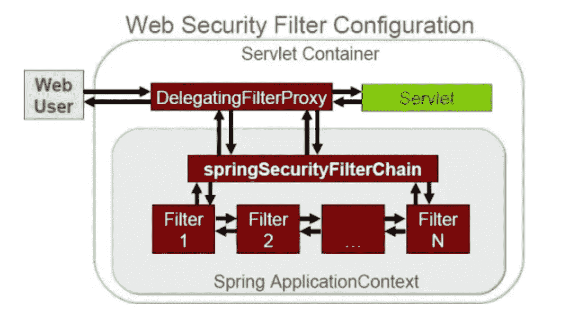

# 运动中的弹簧安全—第 1 部分

> 原文：<https://medium.com/geekculture/spring-security-in-motion-part-1-8fc2644244f?source=collection_archive---------3----------------------->

## 介绍

在当今互联的世界，开发安全的应用程序已经成为程序员和组织的首要关注点。不安全的编码实践会导致应用软件中代价高昂的漏洞，从而导致严重的损害。

本文介绍了如何在应用程序中集成 spring 安全性，从初始化到定制配置。

source: [https://www.dineshonjava.com/spring-security-xml-namespace-configuration-example/](https://www.dineshonjava.com/spring-security-xml-namespace-configuration-example/)