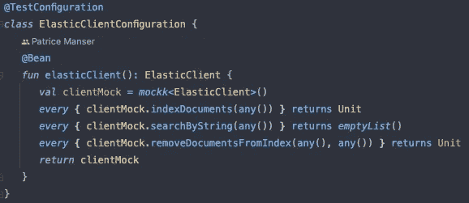

# Kotlin 的春季测试配置

> 原文：<https://medium.com/geekculture/spring-testconfigurations-with-kotlin-b3b8d3ae5236?source=collection_archive---------6----------------------->



这个星期，我不得不把 Elasticsearch 添加到我的项目中。由于 Elasticsearch 的客户端需要一个正在运行的服务器来建立连接和发出请求，我的项目现在依赖于其他基础设施。这并不是一个大问题，因为我可以针对使用客户端的测试来模拟客户端。

稍后，我添加了在应用程序启动时初始化 Elasticsearch 索引的逻辑。这是问题变得明显的时候。因为这个启动函数调用客户端的函数，所以我需要在每个测试中模拟客户端，这对于一些测试来说是可行的，但是当你有几百个测试的时候就变得非常混乱了。😅。因为这个原因，我开始使用 Spring TestConfigurations。

# 什么是测试配置？

根据 [Reflectoring.io](https://reflectoring.io) :

> @TestConfiguration 注释是**在 Spring Boot 应用程序**中编写组件单元测试的有用工具。它允许我们在 Spring 应用程序上下文中定义额外的 bean 或覆盖现有的 bean，以便为测试添加专门的配置。

具体到我们的用例，我们可以覆盖一个现有的测试 bean，它实际上并不使用真正的实现。我们可以定义一次 mock 及其行为，并且可以在我们想要的每个测试类上使用这个配置。

# 创建测试配置

首先，我们需要创建一个新文件来存放我们的配置。

这里我们用`@TestConfiguration`注释配置类，将它从组件扫描中排除，并让 Spring 知道我们想要定义一个新的配置。

之后，我们定义了一个新的 elasticClient bean，它是一个标准的 Kotlin 函数，返回我们在其中定义的 mock。唯一特别的是，你必须用`@Bean`来注释它。注意，这个函数的名称需要与您想要从另一个类注入的 bean 的名称相同。

# 如何使用配置

首先打开您想要应用这个配置的测试。这个测试可能看起来像这样:

正如你所看到的，ElasticSearchAdapter 被嘲笑了，它在最初的实现中有一个`save`方法，这个方法调用依赖于外部基础设施的 elasticClient 的方法。

标准文档库的最小实现如下所示:

由于`onStartup()`函数甚至在`BeforeEach()`函数之前运行，我们仍然使用原始的 beans 来代替我们的模拟。这自然会导致测试失败。

这个问题的解决方法真的很简单。我们使用上面创建的配置，并将其应用到每个测试中。一个简单的例子是这样的:

我们唯一添加的是`@Import`注释。这确保了我们的配置在 onStartupEvent 函数之前被加载，bean 被覆盖。

最后要做的事情是将下面一行添加到您的`src/test/resources/application.properties`文件中。

请注意，将它放在测试属性中而不是主属性中非常重要，因为我们不想在主上下文中覆盖 beans。

```
*spring.main.allow-bean-definition-overriding*=*true*
```

这确保了我们可以用模拟的 bean 覆盖现有的 bean。

这导致我们再次进行绿色测试，因为我们测试中的 mock 现在可以用它自己的特定行为覆盖配置。

# 反射

## 什么进展顺利

Java 有很多很好的资源，所以我很容易理解这个概念。这种配置的实际实现也非常简单。

## 什么需要改进

真正需要时间的是理解为什么测试会失败。首先，我认为这可能是因为我的项目中有两个“ApplicationReadyEvent”函数，但这在 Spring 中是允许的。在阅读了 Spring 的日志后，很明显，它与 ElasticClient 有关。尤其是它与服务器的连接(显然，服务器没有运行)。下次我会先读日志，而不仅仅是异常的第一部分。