# SpringBoot:使用 OAuth2 和 Google 进行 API 认证

> 原文：<https://medium.com/geekculture/springboot-api-authentication-using-oauth2-with-google-655b8759f0ac?source=collection_archive---------0----------------------->

当我们谈论设计和公开 REST APIs 时，防止对敏感数据的不必要的访问是至关重要的，所以在今天的文章中，我将给出一个实际的例子，说明如何利用 Google 的 OAuth2 支持来实现认证。

Photo by [Matthew Henry](https://unsplash.com/@matthewhenry?utm_source=medium&utm_medium=referral) on [Unsplash](https://unsplash.com?utm_source=medium&utm_medium=referral)

在我们开始之前，你可以在这里找到完整的****。****

**作为补充说明，我为与谷歌云控制台步骤相关的 gif 尺寸较小(回购中的尺寸较大)而道歉，但这似乎是在浏览器和移动设备上实现相同结果的唯一方式(在我的 iPhone 上，Medium 应用程序崩溃了)。**

**好，我们开始吧！**

# **背景**

**当谈到保护 API 时，我们主要讨论认证和授权，这两者通常是相辅相成的。虽然有多少系统就有多少专有方法，但它们在很大程度上是一些主要方法的变体，其中之一就是 [OAuth2](https://oauth.net/2/) (或 OAuth 2.0)。**

****什么是 OAuth2？****

**长话短说，这是一种标准，旨在允许网站或应用程序代表用户访问其他 web 应用程序托管的资源。它提供同意的访问，并限制客户端应用程序可以代表用户对资源执行的操作，而不会共享用户的凭据。简化的 OAuth2 流程如下所示:**

**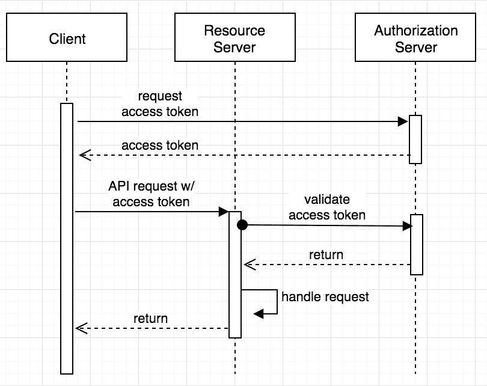**

**OAuth2 flow as pictured by [Okta Developer Blog](https://developer.okta.com/blog/2018/04/02/client-creds-with-spring-boot)**

> **你可以查看[这个链接](https://auth0.com/intro-to-iam/what-is-oauth-2/)来了解更多关于 OAuth2 的信息。**

**目前，谷歌、脸书或 Twitter 等科技巨头正在提供授权服务器，你可以根据他们的用户数据库实现身份验证和与识别个人账户相关的一切，而无需自己存储和管理这些细节。**

**你可能在某个时候见过这样的东西:**

**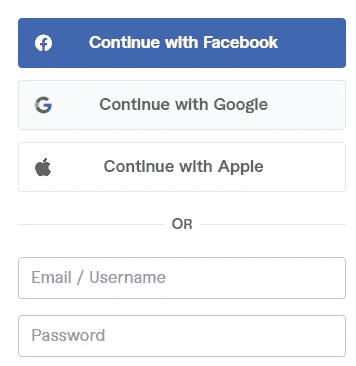**

**Fiverr’s login pop-up**

**但是幕后发生了什么呢？**

**例如，如果你使用 Google 登录，web 应用程序会将你重定向到 Google 的登录页面，在那里你需要提供你的 Google 帐户凭证(如果你还没有登录的话)。如果凭据正确，您将被重定向回接收访问令牌的 web 应用程序。web 应用程序将在每次请求时将这个访问令牌发送到其后端，后端将根据 Google 对其进行验证，以确保它没有被更改或过期。**

# **问题是**

**假设我们构建了一个 web 应用程序，用户可以通过上传收据的照片来跟踪他们每月的支出。我们希望允许我们的用户使用他们的 Google 帐户登录，我们希望确保我们的后端 API 能够通过验证每个请求上的访问令牌来处理身份验证。**

**我们如何构建我们的后端 API 来验证针对 Google 的令牌？**

# **解决方案**

**这个解决方案意味着利用 Google 的 OAuth2 支持。如果您记得在 OAuth2 流程图中，我们有一个授权服务器和一个资源服务器。在我们的情况下，谷歌将是授权服务器，负责处理用户认证和生成访问令牌，我们的后端将是资源服务器，负责验证对谷歌的访问令牌，并允许我们的用户创建，阅读，更新或删除他们的每月收据。**

## **第一步。配置 Google OAuth2**

****1.1 创建新项目****

**在[谷歌云控制台](https://console.cloud.google.com/getting-started)中，我们创建了一个新项目:**

**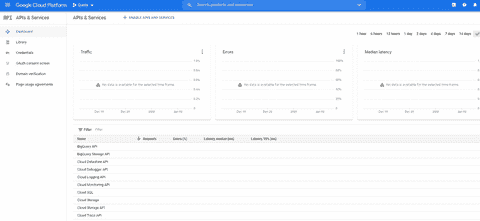**

****1.2 配置同意屏幕****

**接下来，我们需要配置同意屏幕，从下拉列表中选择我们新创建的项目，然后单击 ***OAuth 同意屏幕。*****

**我们为**用户类型**部分选择**外部**,因为我们希望使用不一定属于某个组织的 Google 帐户。**

**应用程序信息部分并不真正相关，但你可以指定应用程序的名称，也许上传一个标志和其他细节。**

**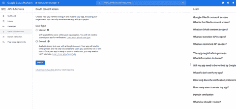**

****1.3 设置范围****

**对于我们的用例，我们需要的唯一范围是:`openid`、`email`和`profile`。**

****重要提示**:我们添加了`openid`作为范围，因为我们想使用 OAuth2 上面的薄层。这一层称为 OpenID Connect，它添加了当前登录者的登录和个人资料信息。因为我们仍在 OAuth2 上下文中，所以我不会深入讨论更多细节，但您可以在此处****和 [**处**](https://developer.okta.com/blog/2019/10/21/illustrated-guide-to-oauth-and-oidc) **找到关于此主题的更多信息。********

****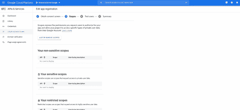****

******1.4 设置测试用户******

****最初，我们希望在处理真实客户之前，检查我们的后端是否能够与一组虚拟用户一起工作，因此我们需要添加所谓的 ***测试用户。*******

****为了简单起见，我添加我的谷歌帐户主要用于开发目的，但你可以添加任何你想测试的谷歌帐户，当然，只要你知道证书。****

****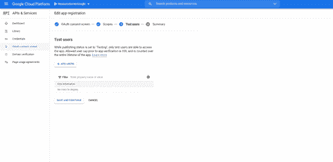****

******1.5 创建 OAuth 客户端******

****为了创建 OAuth 客户端，我们从左侧面板中选择 ***凭证*** ，并单击 ***创建凭证。*******

*******OAuth 客户端 ID*** 用作凭证类型， ***Web 应用*** 用作应用类型。****

> ****注意:最后会显示一个包含客户端 id 和密码的弹出窗口。复制这些价值观，不要与他人分享。****

****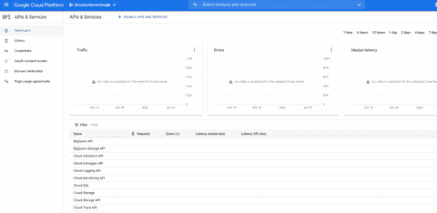****

******1.6 邮递员做前端******

****因为我们的重点是后端，完全忽略了前端部分，所以我们需要一种模拟 Google 登录并获得有效访问令牌的方法。为此，我们将使用 [Postman](https://www.postman.com/) ，并且我们需要对 OAuth 客户端做一些小的调整。****

****我们从左侧面板中选择 ***凭证*** ，并从 ***OAuth 2.0 客户端 id***表中打开我们新创建的客户端。****

****我们添加[https://www.getpostman.com/oauth2/callback](https://www.getpostman.com/oauth2/callback)为 ***授权重定向 URIs*** 并点击保存。****

****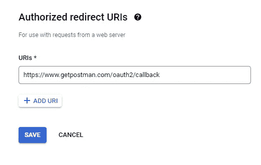****

****Add correct authorized redirect URI for Postman callback****

## ****第二步。创建资源服务器****

****在这一步中，我们将后端配置为资源服务器。****

******2.1 添加 Maven 依赖******

****下一个 Maven 依赖项被添加到 **pom.xml:******

******2.2 配置应用程序属性******

****下面的配置被添加到`resources`文件夹下的 **application.yml** 文件中:****

****Configuring application properties****

> ****您需要将**<YOUR _ CLIENT _ ID>**和**<YOUR _ CLIENT _ SECRET>**占位符替换为您自己的客户端 ID 和机密。****

*****如果您使用的是 application.properties 而不是 YAML 文件，这些属性应该是可用的。*****

******2.3 配置弹簧安全******

****我们需要做的最后一件事是配置 Spring Security 作为资源服务器:****

****Spring Security configuration****

## ****第三步。测试****

****为了能够从 Postman 生成访问令牌，我们需要配置它，以便与我们的 OAuth 客户端一起工作。****

*******打开邮递员*** > ***新请求*** > ***授权*** > ***选择 OAuth 2.0*******

****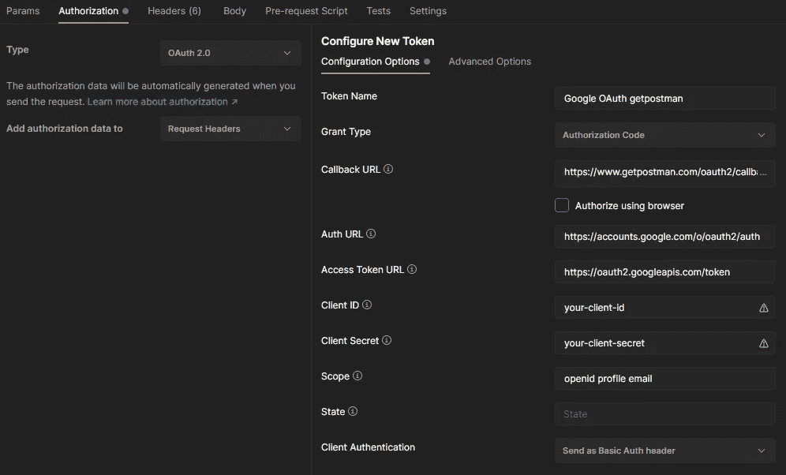****

****Configuring Postman****

****我们把[https://www.getpostman.com/oauth2/callback](https://www.getpostman.com/oauth2/callback)作为 ***回调 URL*** 以及我们正确的客户端 id 和秘密。****

****单击 ***获取新的访问令牌*** 按钮应该会打开一个弹出窗口，我们需要在这里为我们的一个测试用户提供凭证。如果凭据有效，我们应该会看到如下内容:****

****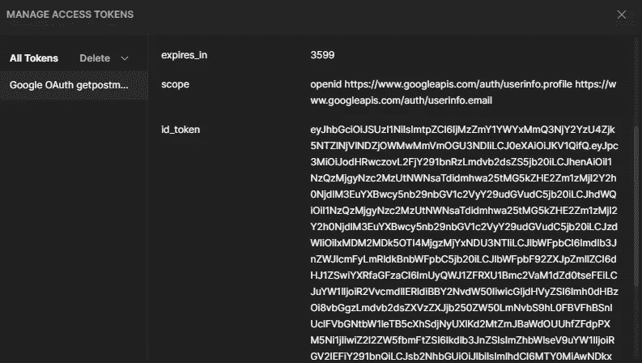****

*******id_token*** 的值要复制因为这是我们需要的生成的访问令牌。****

****接下来，我们尝试在没有这个令牌的情况下对我们的一个后端端点执行一个请求，看看会发生什么:****

****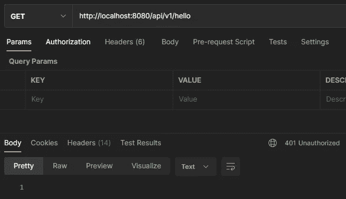****

****Request without token****

****如您所见，我们得到了预期的 401，因为我们没有为令牌提供授权头。****

****将令牌作为`Bearer Token`添加到我们的请求中，我们得到了预期的输出:****

****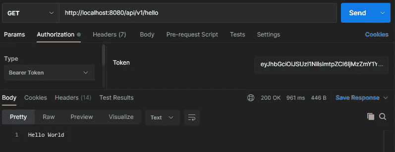****

****Request with token as value for Authorization header****

****就是这样！****

# ****结论****

****请始终记住，这种方法可能适合也可能不适合您的项目环境或需求，我不能说没有其他方法可以做得不同或更好。我真的希望你喜欢它，并从中获得乐趣。****

****注意安全，记住你可以在这里找到 [**代码**](https://github.com/georgeberar/medium/tree/main/resource-server-oauth2-google) 。****