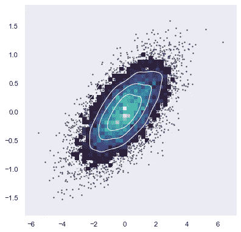
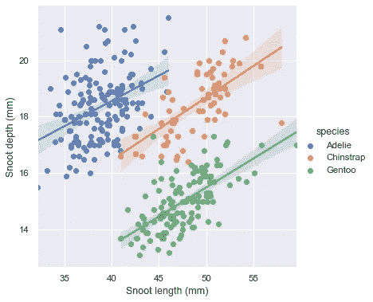

# SPSS 用户，是时候改用 Python 了

> 原文：<https://medium.com/geekculture/spss-users-its-time-to-switch-to-python-3c0ec48861f9?source=collection_archive---------18----------------------->


Photo by [Árpád Czapp](https://unsplash.com/@czapp_arpad?utm_source=medium&utm_medium=referral) on [Unsplash](https://unsplash.com?utm_source=medium&utm_medium=referral)

当我开始攻读博士学位时，SPSS 是进行数据分析的唯一途径，我接受了随之而来的所有缺点。我不太懂统计学，但我一直在努力跟上并做到最好。我听说过 R，但是学习一门只对数据分析有益的编程语言的想法并没有吸引我。我希望在我的领域有一个更好的选择，但努力寻找任何东西。直到我遇到了一个使用 Python 的人。他们在数据分析方面的技能远远超过了我，他们使用 Python 创建了神经网络、医院仪表盘等等。我想我会问他们是否有一种方法来做数据分析，因为我知道它在 SPSS 中。像独立 t 检验这样简单的东西。他们告诉我事情就这么简单:

```
import numpy as np
import statistics as statsdf = pd.read('your_csv_name.csv')stats.ttest_ind(df[column_name],df[column_name])
```

这将输出一个独立样本 T 检验；所选列的 t 统计量和 p 值。简单易用让我震惊，从那以后我再也没有回头。对于熟悉 Python 的人来说，这已经是旧闻了。然而，对于一个只习惯于 SPSS 的人来说，这改变了我对数据分析的看法。

当它在 20 世纪 60 年代末被首次引入时，SPSS 是并且仍然是一个伟大的工具。它有自己的位置，因为它允许一大堆验证数据集的方法。我认为这也是一个非常有价值的工具，我个人发现它帮助我理解了如何进行主成分分析来确定调查结果中的因素。

虽然 SPSS 将永远在我的数据和统计旅程中占有一席之地，但自从切换到使用 Python 以来，我在我的数据分析中找到了以前认为不可能的自由。不可怕，不太难，值得。当谈到数据科学时，Python 是最常用的语言，可以用于一系列领域。那么，是什么让 Python 成为一个更好的选择，尤其是来自 SPSS 的时候？

1.  **免费的**

虽然我很幸运，我的大学免费提供 SPSS，但如果没有它，我每个月将不得不支付 100 多美元。这还不包括订阅 Laerd 这样的网站，这是一个在 SPSS 中进行分析的在线指南，也不包括如何使用 SPSS 的书籍。Python 是免费的，所有的包都是免费的。

2.**大型网络社区和资源**

我发现因为 Python 被广泛使用，所以你可以找到无止境的社区帮助。人家提供的资源和套餐简直是天赐良机。SPSS 的信息很少，通常需要付费。我还发现，当我开始在 SPSS 中扩展我的数据分析时，我需要更多的工具和资源。当将这种体验与 Python 进行比较时，因为您可以设计您需要的分析并获得帮助，所以它更加灵活。

3.**数据可视化**

我发现 SPSS 最让我恼火的是它在处理数据时是多么的不灵活。您确实可以选择数据输出，但是当涉及到干净、连贯地显示数据集时，SPSS 输出就没有吸引力了。使用 Python 来导入包以使数据集看起来更好，就像:

```
**import** **numpy** **as** **np**
**import** **seaborn** **as** **sns**
**import** **matplotlib.pyplot** **as** **plt**
sns.set_theme(style="dark")

*# Simulate data from a bivariate Gaussian*
n = 10000
mean = [0, 0]
cov = [(2, .4), (.4, .2)]
rng = np.random.RandomState(0)
x, y = rng.multivariate_normal(mean, cov, n).T

*# Draw a combo histogram and scatterplot with density contours*
f, ax = plt.subplots(figsize=(6, 6))
sns.scatterplot(x=x, y=y, s=5, color=".15")
sns.histplot(x=x, y=y, bins=50, pthresh=.1, cmap="mako")
sns.kdeplot(x=x, y=y, levels=5, color="w", linewidths=1)
```



Image by [seaborn](https://seaborn.pydata.org/examples/layered_bivariate_plot.html) on [seaborn](https://seaborn.pydata.org/index.html)

当导入像 matplotlib 和 seaborn 这样的包时，你的数据可以有一系列的样式、颜色和主题。你甚至可以创造自己的风格，并在整个研究过程中使用它。我甚至看到有人用不同口袋妖怪类型的颜色来绘制条形图。SPSS 就是没有这些选项。



Image by [seaborn](https://seaborn.pydata.org/examples/layered_bivariate_plot.html) on [seaborn](https://seaborn.pydata.org/index.html)

4.**数据输出**

随着我对 Python 的学习和理解的增加，我对如何构建函数的理解也增加了。函数在编码中并不新鲜，但是对于一个完全不熟悉编码的人来说，我喜欢函数。我可以决定分析数据集的哪一部分，以什么方式分析，我需要知道什么来验证数据，让它在函数的不同部分运行，以及我刚才讨论的数据可视化。假设我想在 Python 中运行一个单向 Anova:我有一个函数，它给出我正在比较的东西的描述性统计数据，F 统计数据和 p 值，如果 p 值失败，那么它将进入使用 Tukey 测试的事后分析。然后，该函数将所有这些输出到我的编码环境中，并说明为什么它在第一个 p 值处停止或继续进行事后分析，将所有表格导出到 excel 中，并将数据可视化到 png 文件中。

然后，我可以再次运行它，因为它是一个函数。如果我的同事希望我以某种方式报告数据，我可以根据需要重写输出，并以我想要的任何方式导出。所有这些都是用 Python 中的几行代码完成的。

综上所述，Python 值得学习曲线。我觉得很多人害怕学习 Python 的部分原因是因为它是一种编程语言。当你看到一段代码时，那是很可怕的，特别是如果你来自一个不需要编码的领域。像心理学、教育、政府等等你可能认为这是一项你不需要的技能。我认为你有。学 python 只需要一台电脑，能上网，对这个编码原理有个基本的了解:If ->This: Then -> That。如果你理解了这个概念，那么学习 Python 就是那么容易。