# SQL HackerRank:访谈

> 原文：<https://medium.com/geekculture/sql-hackerrank-interviews-1f79dfa0a971?source=collection_archive---------2----------------------->

硬连接:高级 SQL 连接


问题陈述:萨曼莎通过编码挑战和竞赛采访了许多来自不同大学的候选人。编写一个查询来打印 contest_id、hacker_id、名称以及按 contest_id 排序的每个竞赛的 total_submissions、total_accepted_submissions、total_views 和 total_unique_views 的总和。如果四项总和都是 **0** ，则从结果中排除比赛。

**注:**一个特定的大赛可以在多个学院进行候选人筛选，但每个学院只举办 **1 次**筛选赛。

[链接](https://www.hackerrank.com/challenges/interviews/problem)到 HackerRank 问题。

**输入格式**

下表包含面试数据:

*   contests:contest _ id 是竞赛的 id，hacker_id 是创建竞赛的黑客的 id，name 是黑客的名字。

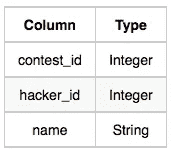

*   colleges:college _ id 是学院的 id，contest_id 是 Samantha 用来筛选候选人的竞赛的 id。

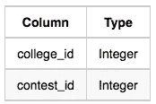

*   challenges:challenge _ id 是 challenge 的 id，它属于 Samantha 忘记了其竞赛 id 的竞赛之一，college_id 是向候选人提供挑战的学院的 id。

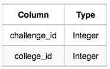

*   view _ Stats:challenge _ id 是质询的 id，total_views 是候选人查看质询的次数，total_unique_views 是唯一候选人查看质询的次数。

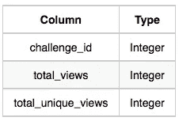

*   submission _ Stats:challenge _ id 是挑战的 id，total_submissions 是挑战的提交次数，total_accepted_submission 是获得满分的提交次数。

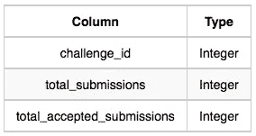

**解决方案及其演练** :-

整体工作流程如下所示:

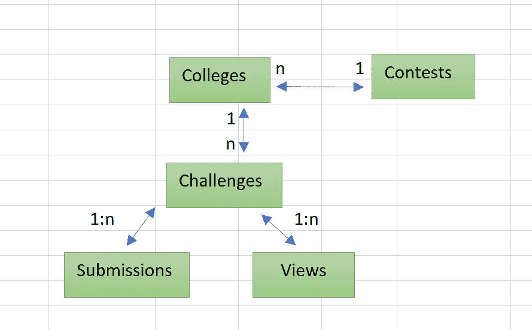

Relationship Diagram

竞赛、大学和挑战表的样本数据集:

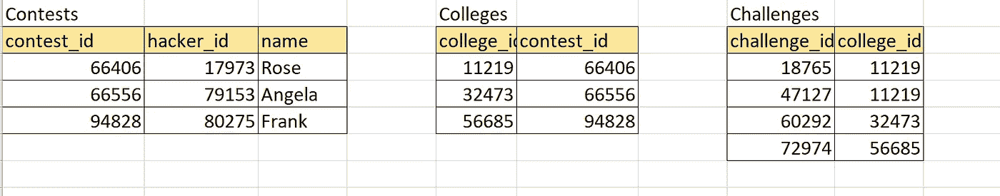

Sample Dataset 1

View_Stats 和 Submission_Stats 表的样本数据集:

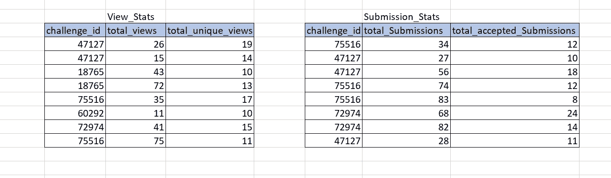

Sample Dataset 2

**第一步:**我们来拿竞赛 _id: 66406。我们想得到所有举办过 Contest_id: 66406 的大学。

只有学院 _id : 11219 举办过大赛 _id: 66406。

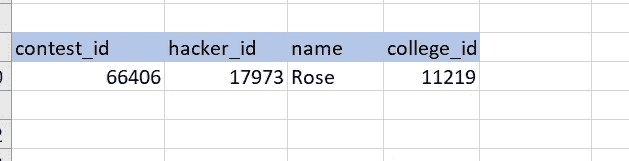

Part 1

查询:-

```
SELECT con.contest_id, con.hacker_id, con.name, col.college_id 
FROM Contests con
inner join Colleges col on con.contest_id = col.contest_id
```

**第二步:**

现在 college_id : 11219 有两个挑战，挑战 id 为 18765 和 47127

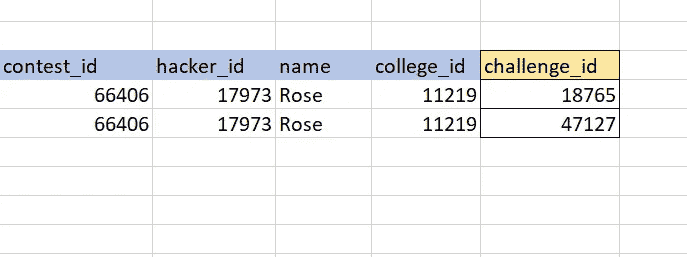

Part 2

查询:-

```
SELECT con.contest_id, con.hacker_id, con.name, ch.challenge_id 
FROM Contests con
inner join Colleges col on con.contest_id = col.contest_id
inner join Challenges ch on col.college_id = ch.college_id
```

**第 3 步:**按 challenge_id 查找总浏览量和总提交量

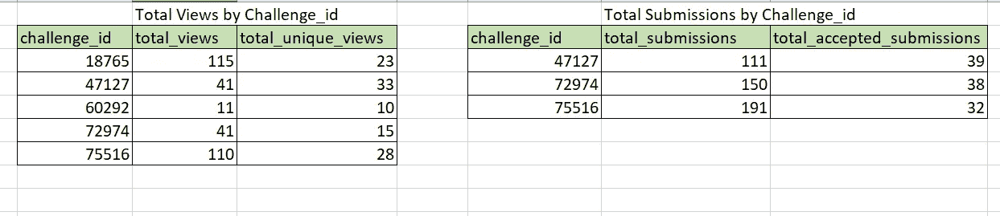

Part 3-a

在我们的示例中，挑战 id 为 18765 和 47127

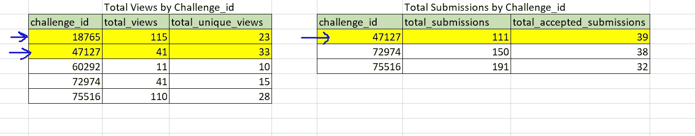

Part 3-b

现在我们必须将这个结果与第二步的结果结合起来。


Part 3-c

查询:-

```
WITH Sub_stats_cte as
(
select challenge_id, SUM(total_Submissions) as total_submissions, SUM(total_accepted_Submissions) as total_accepted_submissions 
from Submission_Stats group by challenge_id 
), View_stats_cte as
(
select challenge_id, SUM(total_views) as total_views, SUM(total_unique_views) as total_unique_views 
from View_Stats group by challenge_id 
)
SELECT con.contest_id, con.hacker_id, con.name, ch.challenge_id, total_submissions, total_accepted_submissions
 total_views, total_unique_views
FROM Contests con
inner join Colleges col on con.contest_id = col.contest_id
inner join Challenges ch on col.college_id = ch.college_id
left join Sub_stats_cte c1 ON ch.challenge_id = c1.challenge_id
left join View_stats_cte c2 ON ch.challenge_id = c2.challenge_id
```

**第 4 步:**汇总结果

现在，我们需要按竞赛 id 排序的每个竞赛的 total_submissions、total_accepted_submissions、total_views 和 total_unique_views 的总和。

total _ views = 115+41 = 155
total _ unique _ views = 23+33 = 56
total _ submissions = NULL(0)+111 = 111
total _ accepted _ submissions = NULL(0)+39 = 39

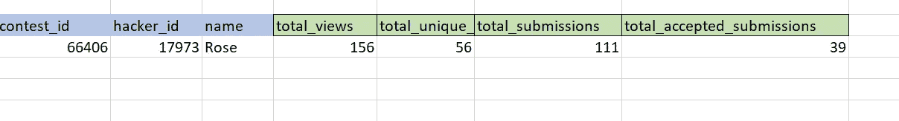

Part 4

查询:-

```
WITH Sub_stats_cte as
(
select challenge_id, SUM(total_Submissions) as total_submissions, SUM(total_accepted_Submissions) as total_accepted_submissions 
from Submission_Stats group by challenge_id 
), View_stats_cte as
(
select challenge_id, SUM(total_views) as total_views, SUM(total_unique_views) as total_unique_views 
from View_Stats group by challenge_id 
)
SELECT con.contest_id, con.hacker_id, con.name, ISNULL(SUM(total_submissions),0) total_submissions, 
ISNULL(SUM(total_accepted_submissions),0) total_accepted_submissions,
ISNULL(SUM(total_views),0) total_views, ISNULL(SUM(total_unique_views),0) total_unique_views
FROM Contests con
inner join Colleges col on con.contest_id = col.contest_id
inner join Challenges ch on col.college_id = ch.college_id
LEFT JOIN Sub_stats_cte c1 ON ch.challenge_id = c1.challenge_id 
LEFT JOIN View_stats_cte c2 ON ch.challenge_id = c2.challenge_id
GROUP BY con.contest_id, con.hacker_id, con.name
HAVING SUM(total_submissions)>0
OR SUM(total_accepted_submissions)>0
OR SUM(total_views)>0
OR SUM(total_unique_views)>0
ORDER BY contest_id;
```

*注意:如果四个和都是* ***0*** *，我们必须从结果中排除这场比赛。这就是我们使用 HAVING 子句的原因。*

**下面是对给定数据集的上述查询的结果。**

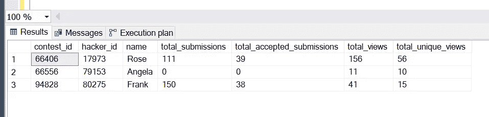

我准备了下面的脚本，如果有人想尝试这个问题以及样本数据集。这将消除从零开始创建虚拟数据集的麻烦:D

```
with Contests as
(
select 66406 as contest_id, 17973 as hacker_id,'Rose' as name union all
select 66556 as contest_id, 79153 as hacker_id,'Angela' as name union all
select 94828 as contest_id, 80275 as hacker_id,'Frank' as name 
), Colleges as
(
select 11219 as college_id, 66406 as contest_id union all
select 32473 as college_id, 66556 as contest_id union all
select 56685 as college_id, 94828 as contest_id
), Challenges as 
(
select 18765 as challenge_id, 11219 as college_id union all
select 47127 as challenge_id, 11219 as college_id union all
select 60292 as challenge_id, 32473 as college_id union all
select 72974 as challenge_id, 56685 as college_id 
), View_Stats as
(
select 47127 as challenge_id, 26 as total_views, 19 as total_unique_views union all
select 47127 as challenge_id, 15 as total_views, 14 as total_unique_views union all
select 18765 as challenge_id, 43 as total_views, 10 as total_unique_views union all
select 18765 as challenge_id, 72 as total_views, 13 as total_unique_views union all
select 75516 as challenge_id, 35 as total_views, 17 as total_unique_views union all
select 60292 as challenge_id, 11 as total_views, 10 as total_unique_views union all
select 72974 as challenge_id, 41 as total_views, 15 as total_unique_views union all
select 75516 as challenge_id, 75 as total_views, 11 as total_unique_views
), Submission_Stats as
(
select 75516 as challenge_id, 34 as total_Submissions, 12 as total_accepted_Submissions union all
select 47127 as challenge_id, 27 as total_Submissions, 10 as total_accepted_Submissions union all
select 47127 as challenge_id, 56 as total_Submissions, 18 as total_accepted_Submissions union all
select 75516 as challenge_id, 74 as total_Submissions, 12 as total_accepted_Submissions union all
select 75516 as challenge_id, 83 as total_Submissions, 8 as total_accepted_Submissions union all
select 72974 as challenge_id, 68 as total_Submissions, 24 as total_accepted_Submissions union all
select 72974 as challenge_id, 82 as total_Submissions, 14 as total_accepted_Submissions union all
select 47127 as challenge_id, 28 as total_Submissions, 11 as total_accepted_Submissions
), Sub_stats_cte as
(
select challenge_id, SUM(total_Submissions) as total_submissions, SUM(total_accepted_Submissions) as total_accepted_submissions 
from Submission_Stats group by challenge_id 
), View_stats_cte as
(
select challenge_id, SUM(total_views) as total_views, SUM(total_unique_views) as total_unique_views 
from View_Stats group by challenge_id 
)
SELECT con.contest_id, con.hacker_id, con.name, ISNULL(SUM(total_submissions),0) total_submissions, 
ISNULL(SUM(total_accepted_submissions),0) total_accepted_submissions,
ISNULL(SUM(total_views),0) total_views, ISNULL(SUM(total_unique_views),0) total_unique_views
FROM Contests con
inner join Colleges col on con.contest_id = col.contest_id
inner join Challenges ch on col.college_id = ch.college_id
LEFT JOIN Sub_stats_cte T1 ON ch.challenge_id = T1.challenge_id 
LEFT JOIN View_stats_cte T2 ON ch.challenge_id = T2.challenge_id
GROUP BY con.contest_id, con.hacker_id, con.name
HAVING SUM(total_submissions)>0
OR SUM(total_accepted_submissions)>0
OR SUM(total_views)>0
OR SUM(total_unique_views)>0
ORDER BY contest_id;
```

如果你觉得这篇文章很有帮助，请与你的朋友和同事分享。如果还有其他问题，可以在[*Linkedin*](https://www.linkedin.com/in/shefali-bisht/)*上找我。*