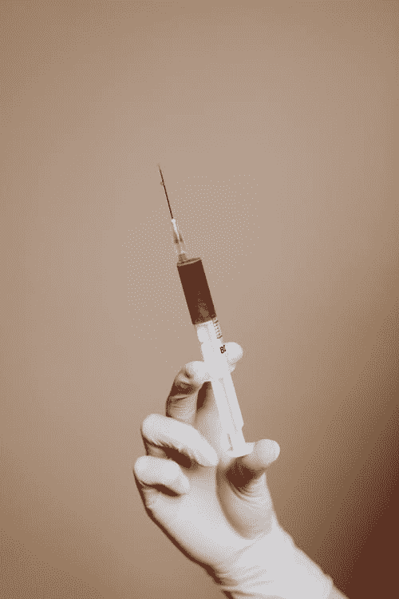

# SQL 注入

> 原文：<https://medium.com/geekculture/sql-injection-f653d46312a?source=collection_archive---------14----------------------->

Photo from [Pexels.com](https://www.pexels.com/it-it/foto/persona-mano-medicina-scienza-4040548/) by [Karolina Grabowska](https://www.pexels.com/it-it/@karolina-grabowska)

## 代码注入是好是坏？

在进入主题之前，请允许我感谢大家多次阅读和访问这篇关于 **SQL 技巧**的文章: