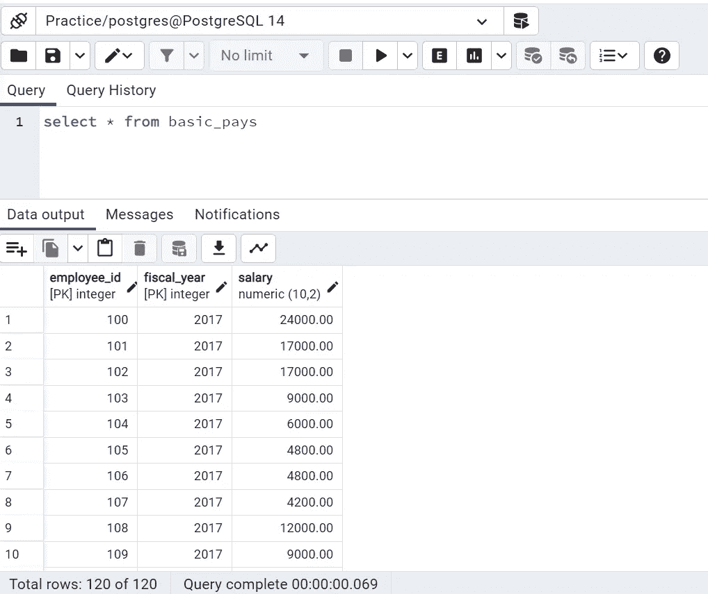
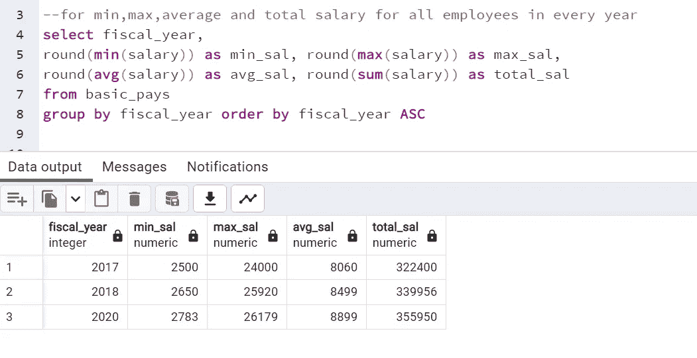
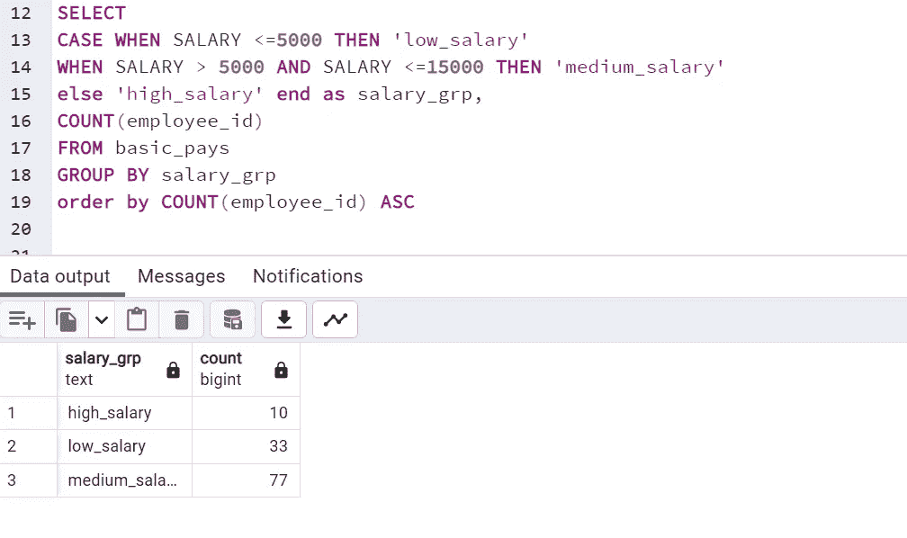
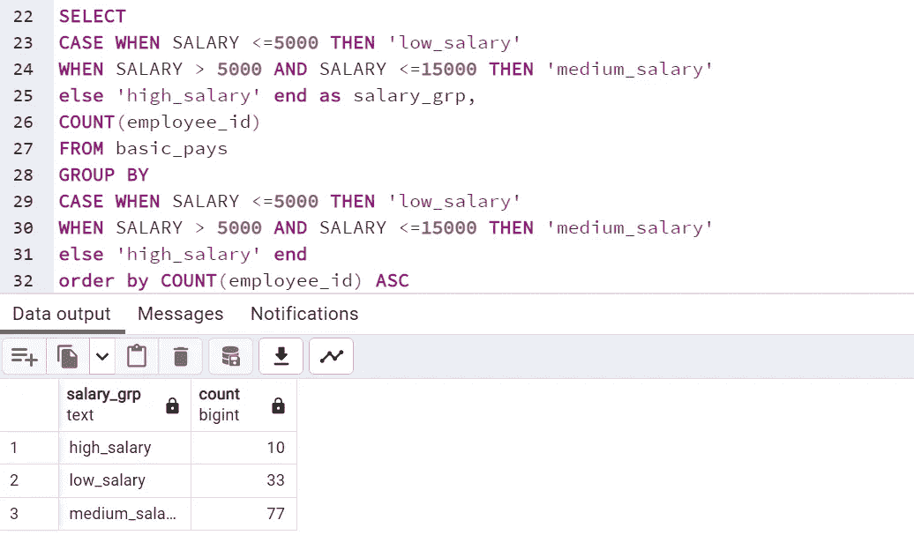
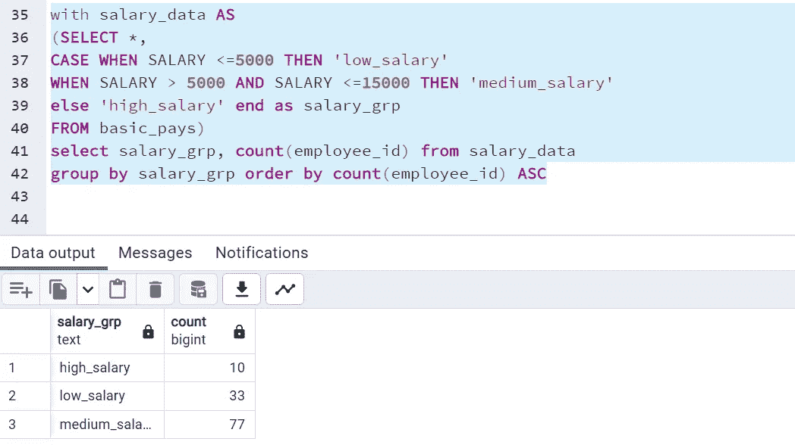

# SQL 面试问题 1:按不在表的现有列中的表达式分组。

> 原文：<https://medium.com/geekculture/sql-interview-question-1-grouping-by-expression-which-is-not-in-existing-columns-of-table-900f13882b73?source=collection_archive---------2----------------------->

## SQL 面试问题系列中的第一名

## 最常见的 SQL 面试查询和概念#SQL #RDBMS


Photo by [John Schnobrich](https://unsplash.com/@johnschno?utm_source=unsplash&utm_medium=referral&utm_content=creditCopyText) on [Unsplash](https://unsplash.com/s/photos/data-analysis?utm_source=unsplash&utm_medium=referral&utm_content=creditCopyText)

你好。！

SQL 是数据分析专业人员必备且最重要的工具。在参加分析行业各种角色和职位的面试时，我们都会遇到测试我们的 SQL 知识以及编写复杂 SQL 查询和数据库设计的熟练程度的面试。所以，我打算写一些关于我在 SQL 中的面试经历、我被问到的问题以及大多数人在面试时遇到的问题的文章。

从第 1 篇文章开始，我将共享一个查询，通过使用分组表达式从表中获取记录，该表达式不存在于表的列中。通读这篇文章，你会有更多的了解。所以让我们开始吧，

我使用了一个表 *basic_pays* ，总共有 120 条记录，列 ***employee_id、财政年度、薪水*** ，并在 PostgreSQL 上运行我的查询。下面是表中的 *Select ** 查询的片段。



Credits: By Author

现在，在这个表中，通过列引用对记录进行分组变得更加容易。例如，如果我们想查看在不同的*财政年度给所有员工的 ***最低、最高、平均或总工资*** ，我们可以简单地编写下面的查询**，使用*聚合函数将其按财政年度分组。****

**

*Credits: By Author*

*但问题是，如果我被要求将我的工资分为 3 类，即低、中、高范围，并计算在这些范围内获得工资的员工人数。让我们先定义范围，*

```
***Low_salary:** salary ≤ 5000
**Medium_salary:** 5000 <salary ≤ 15000
**High_salary:** salary≥15000*
```

****对于这类问题，首先我们需要创建所需的表达式，然后在 group by 子句中应用它。对于创建表达式，我们可以有多种方法。****

*1。 **方法 1:** 在第一种方法中，我们通过使用**中的 **CASE** 语句创建列表达式 ***salary_grp*** ，选择**语句本身并拉入我们需要的薪金范围，然后在此基础上，我们通过使用 group by 子句中的 *salary_grp* 对结果进行分组，以找到每个薪金范围内的雇员数。请参见下面的查询以了解相关信息，*

**

*By Author*

*但是有些数据库不提供这种功能，也就是说，它们不允许在 group by 子句中直接使用别名表达式，如 ***salary_grp*** 。因此，在这种情况下，我们需要将 select 语句中使用的相同表达式复制到 group by 子句中，它将以相同的方式工作，并将产生三个薪金范围的雇员计数。下面是相同的片段，*

**

*Credits: By Author*

*2。 **方法二:**利用**常用表表达式**借助 ***借助*** 子句。首先，我们借助带有 子句的 ***创建一个表 *salary_data* ，并使用其输出表 *salary_data* 获取我们想要的结果。下面是代码片段，****

**

*Credits: By author*

*你可以在我的 GitHub 页面上找到所有这些问题:*

*[https://github.com/sdeeksha07/SQL-Case-Statement/tree/main](https://github.com/sdeeksha07/SQL-Case-Statement/tree/main)*

*您可以自己尝试这些查询。希望这篇文章已经明确了你的一些概念。*

*感谢阅读！！*

*如有任何疑问，请通过 LinkedIn、Twitter 或电子邮件联系我。*

***【sdeevi07@gmail.com】邮箱:***

****碎碎念:***[***https://twitter.com/sdeeksha07***](https://twitter.com/sdeeksha07)*

****领英:***[***https://www.linkedin.com/in/sdeeksha07/***](https://www.linkedin.com/in/sdeeksha07/)*

***不断学习，不断练习！！***