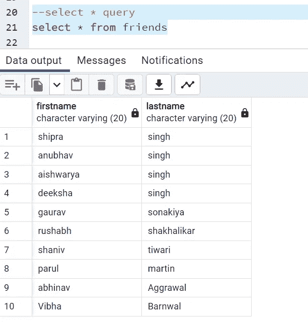
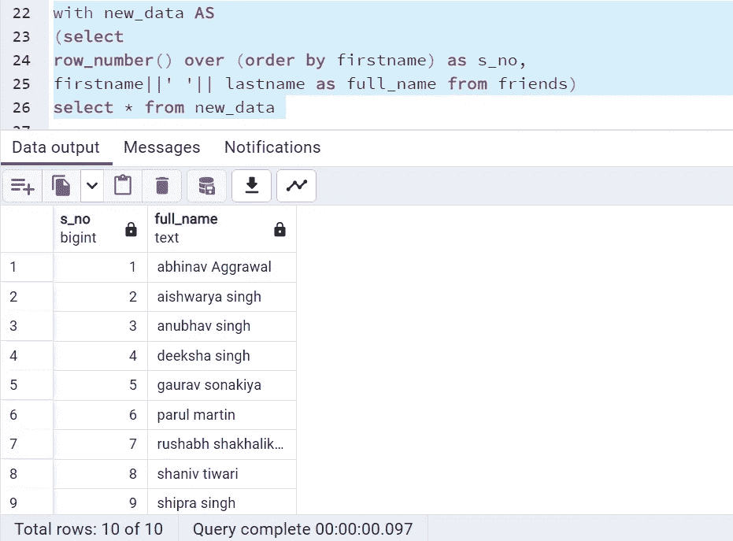
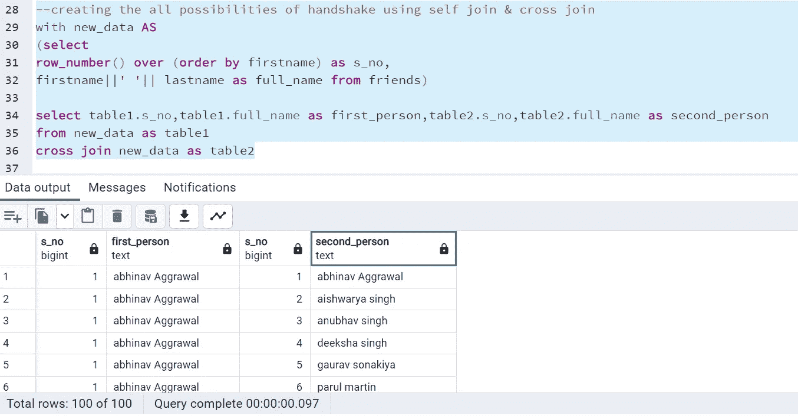
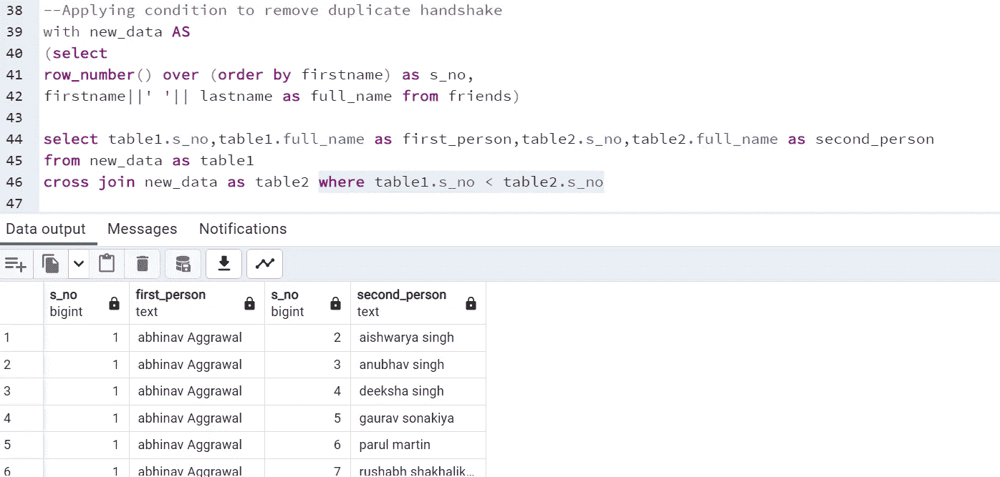
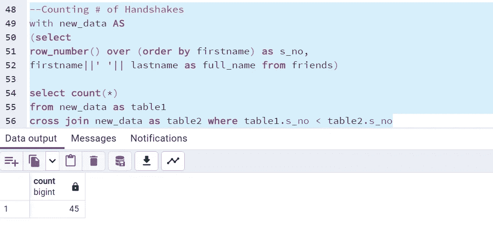
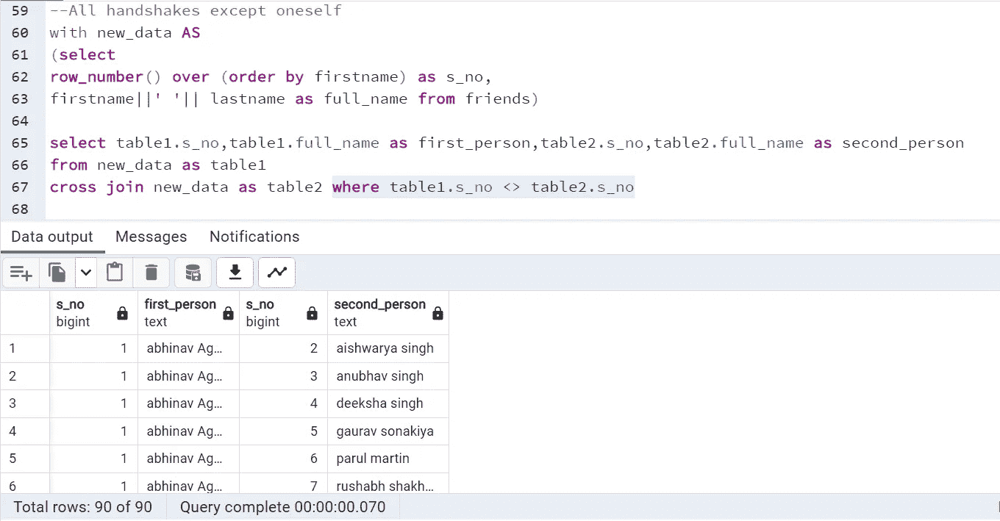
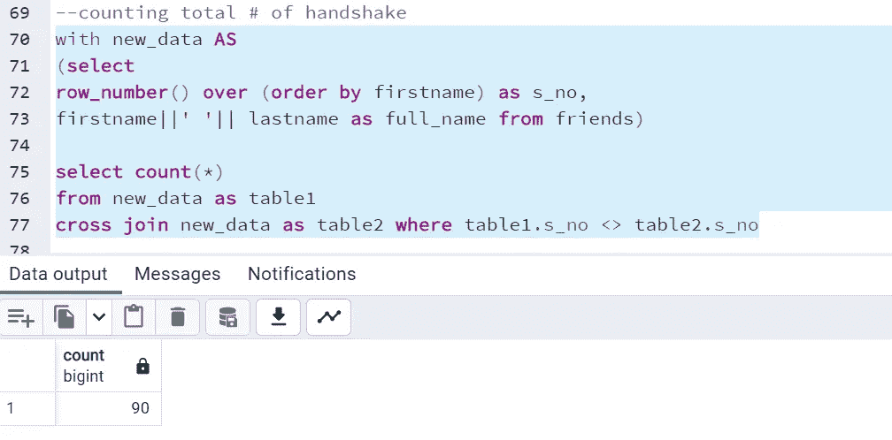

# SQL 面试问题 2:计算一组人之间握手的次数/两个队之间比赛的次数——自加入和交叉加入的用例

> 原文：<https://medium.com/geekculture/sql-interview-question2-counting-number-of-handshakes-between-group-of-peoples-number-of-matches-537fd51a3d15?source=collection_archive---------7----------------------->

## SQL 面试问题系列中的第二名

## 最常见的 SQL 面试查询和概念#SQL #RDBMS

Photo by [Sunder Muthukumaran](https://unsplash.com/@sunder_2k25?utm_source=unsplash&utm_medium=referral&utm_content=creditCopyText) on [Unsplash](https://unsplash.com/s/photos/sql-query?utm_source=unsplash&utm_medium=referral&utm_content=creditCopyText)

嘿！！

在本文中，我们将探讨 SQL 面试中面试官最喜欢问的一个问题。我在面试中也被问到同样的问题。让我们开始吧，但是首先看看问题陈述。

> **问题陈述:计算表中给出的一群人握手的次数:**
> 
> ***案例 1:编写一个查询来计算握手的次数，这样一个人只和另一个人握手一次。***
> 
> ***情况 2:编写查询，使每个人与他人握手两次(除了与自己)。***

***数据:*** 我已经创建了一个表，其中包含朋友表中我的几个朋友的名字和姓氏。除此之外，没有提供其他信息。[您也可以使用 GitHub 链接中的查询在本地机器上创建相同的表。](https://github.com/sdeeksha07/SQL-Self-Join-Use-Cases/tree/main)

让我们开始查询这个表。Select *语句将给出两列，即名字和姓氏。总共有 10 行。

Credits: By Author

**解决案例 1:**

如前所述，一个人只和另一个人握手一次，例如 Abhinav 和 vibha 握手或者 vibha 和 Abhinav 握手都是一回事。所以我们必须避免这种情况。

**步骤 1.1:** 为使该表更简单，首先给所有人分配一个唯一的序列号。我们可以通过使用***row _ number*****窗口函数来实现。**

还有**、**既然我们要在自连接中两次使用这个表，我们可以借助 ***和*** 子句将它赋给一个***【CTE(通用表表达式)】*** 。所以从下面的查询中你可以看到，我已经创建了一个名为 ***new_data*** 的新表，给每个记录分配序列号为 ***s_no*** ，还有两个字段(名字，姓氏)连接为 ***full_name*** 。***|*|**用于串联。

步骤 1.2: 正如你所知道的，两个表中的任何连接都是带有特定条件的简单的交叉连接。因此，最好从这里开始，即应用交叉连接条件，然后放置一些条件。因为我们使用同一个表进行自连接，所以我们需要给它们不同的别名。参见下面来自交叉连接的查询。它将创建 10*10= 100 行组合所有数据。

但是人 1 和 1 握手没有意义，对吧？我们需要做点什么。

**步骤 1.3:** 那么让我们把我们的条件放在这里。参见下面查询中的**中高亮显示的部分*where*子句。仅考虑表 1 中的 ***序列号小于序列号 2 的那些行，将导致仅一次握手*** 。**

**步骤 1.4:** 要计算记录数，只需 count(*)，而不是从表中取出所有列。它将总共返回 45 次握手。

这些都是案例 1 的问题陈述。

**解决案例 2:** 在这里我们要考虑除自己以外的所有握手案例。因此，从**步骤 1.2** 开始，在交叉连接之后，我们只需对 where 条件做一点更改。请参见下面查询中突出显示的部分，我们正在考虑两个表中序列号不同的所有记录。< >用于不相等。

要计算行数，因为它返回总共 90 行，请参见下面的代码片段。

所以我们已经讨论了查询的两种情况。你可以创建自己的板球或足球队表，并计算他们之间的比赛次数，而不是取我朋友的名字。编写查询逻辑基本相同。

[*我在依恋。我的 Github 页面上的 sql 文件。你可以在附加链接上找到它。*](https://github.com/sdeeksha07/SQL-Self-Join-Use-Cases)

希望这篇文章澄清了你的一些概念。

谢谢你阅读它。

除此之外，你可以在 YouTube 上通过 Thoufiq 观看这个视频。

如有任何疑问，请通过 LinkedIn、Twitter 或电子邮件联系我。

***邮箱:sdeevi07@gmail.com***

***碎碎念:***[***https://twitter.com/sdeeksha07***](https://twitter.com/sdeeksha07)

***领英:***[**【https://www.linkedin.com/in/sdeeksha07/】T42**](https://www.linkedin.com/in/sdeeksha07/)

**坚持学习，坚持练习！！**