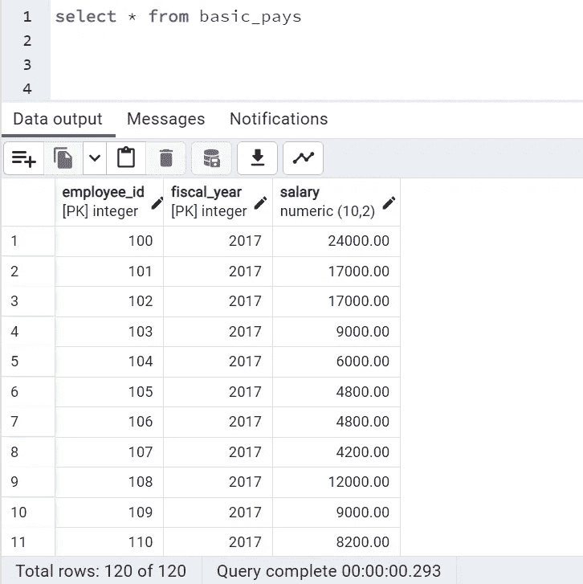
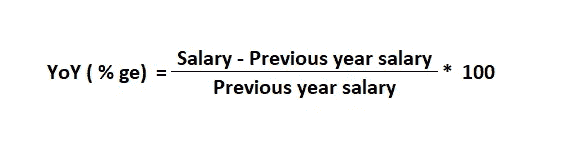
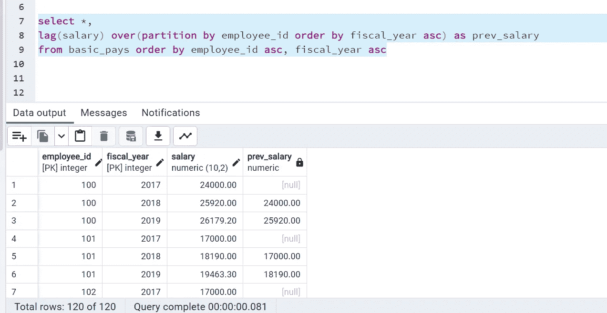
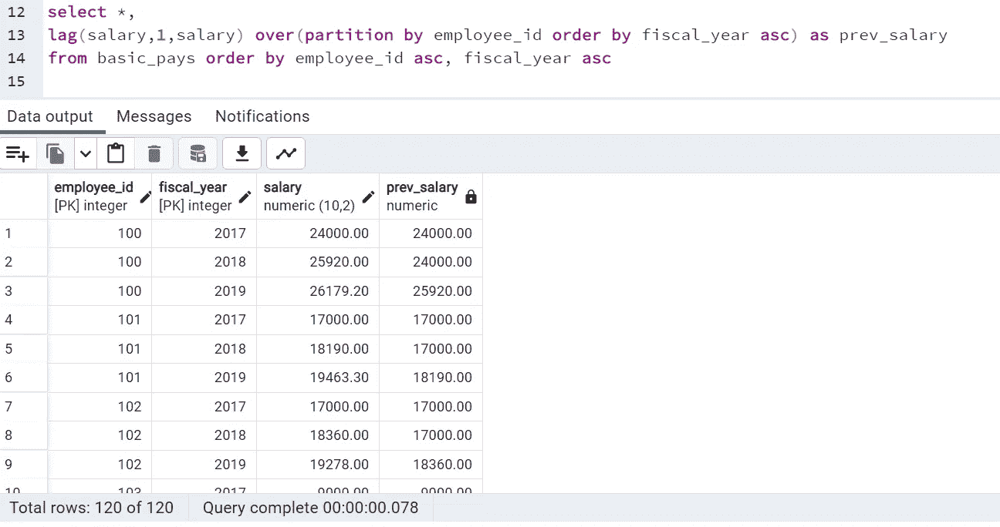
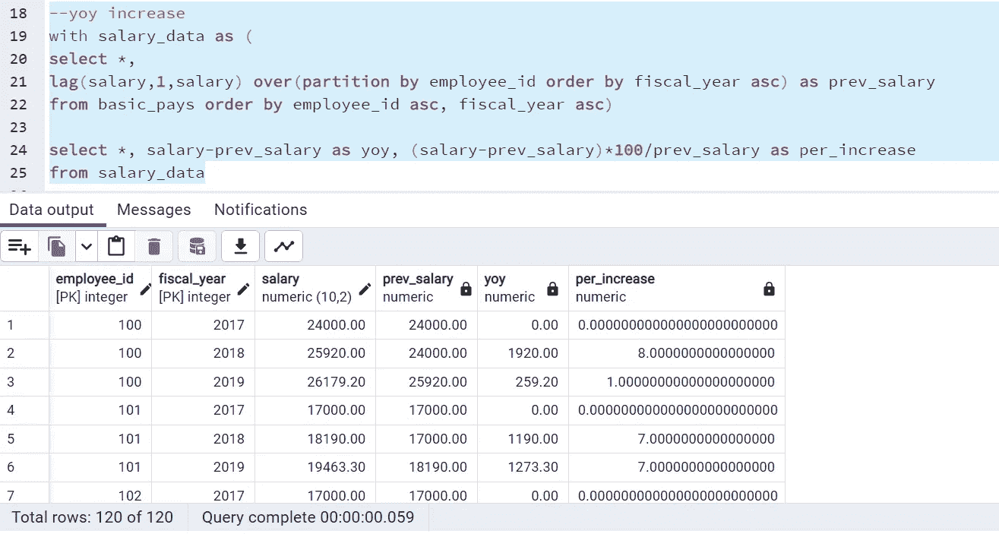
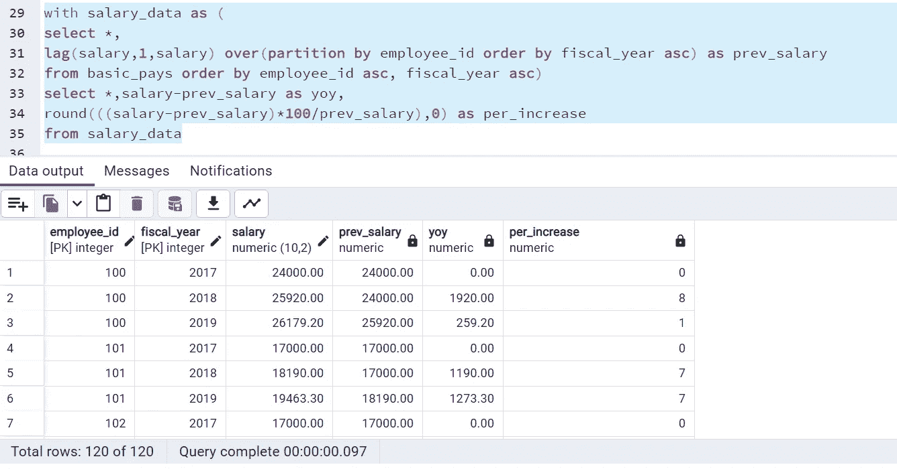
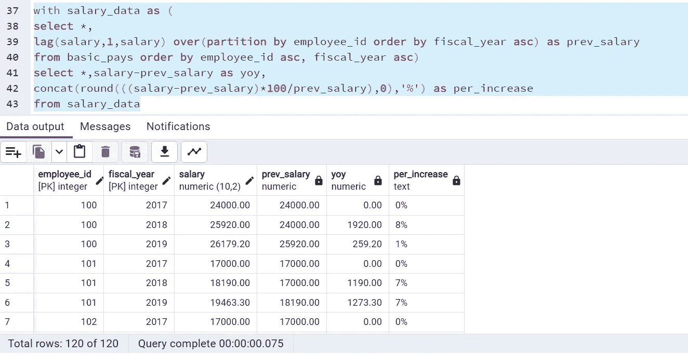

# SQL 面试问题 4:查找员工工资的同比增长 Lag()窗口函数的用例

> 原文：<https://medium.com/geekculture/sql-interview-question4-finding-year-on-year-yoy-increase-in-salaries-of-employees-use-case-of-7846315cc297?source=collection_archive---------6----------------------->

## SQL 面试问题系列中的第 4 名

## 最常见的 SQL 面试查询和概念#SQL #RDBMS


Photo by [Rubaitul Azad](https://unsplash.com/@rubaitulazad?utm_source=unsplash&utm_medium=referral&utm_content=creditCopyText) on [Unsplash](https://unsplash.com/s/photos/sql-query?utm_source=unsplash&utm_medium=referral&utm_content=creditCopyText)

你好。！

在我最近的产品分析师职位面试中，我被问了许多基于窗口函数的 SQL 问题，如 row_number()、rank()、dense_rank()、lead()、lag()、first_value()、last_value()等。因此，在今天的文章中，我将基于 lag()函数的使用来解决一个问题，在接下来的 3-4 篇文章中，我也将写其他问题。所以，让我们直接进入今天的问题陈述。

> **问题陈述:我们有员工连续三年的工资数据。找出每个员工的工资增长百分比。**

数据:我使用一个表 *basic_pays* ，总共有 120 条记录，列 ***employee_id、财政年度、薪水*** ，并在 PostgreSQL 上运行我的查询。下面是表中的 *Select ** 查询的片段。



Credits: By Author

当我们说“同比增长”时，它的意思是，相对于去年的工资，今年的工资增长了多少。下面是相同的计算公式。



Credits: By Author

***现在，为了访问当前行的前一条记录，我们必须使用 lag() window 函数。Lag()函数提供对当前行指定物理偏移量的前一行数据的访问。*语法是，**

```
LAG( expression, offset, default) Over(PARTITION BY ……… ORDER BY......)

Expression: Value which we want to return
Offset: The number of rows back from current row, which we want to access. By default, it is 1.
dafault: When Preceding row is not defined, deafult will be returned. If not mentioned, NULL will be returned for the first row, since they don't have any preceeding rows.
```

让我们在 SQL 中实现它，



Credits: By Author

在这段代码中，由执行的第一个**分区将数据划分到雇员组中。**

**Order by** 子句按财政年度的升序对数据进行排序。

**Lag()** 函数在 **prev_salary** 列中取当前行的上年薪资。

**注意:因为没有提到默认值，并且每个雇员的第一行没有前面的行，所以在每个雇员的第一行返回 NULL。同样，默认情况下，偏移为 1。**

假设第一年，以前的工资与现在的工资相同，工资没有增长，即增长 0%。**因此，在默认值中填充薪金，**



Credits: By author

请注意，对于第一行，薪金与 prev_salary 相同。

现在，为了找到 YoY，使用一个公共表表达式(CTE)作为 salary_data 并执行我们的计算，



Credits: By Author

但是 per_increase 有这么多零似乎不太好，所以我将它四舍五入&还将它与%ge 值连接起来，这样就可以看到它增加了一个百分比。



Credits: By Author



Credits: By Author

这是关于使用 lag()窗口函数来查找工资的同比增长。同样，如果我们清楚这些函数的用法概念，我们可以解决许多问题。

希望对你有所帮助。

如有任何疑问，请通过 LinkedIn、Twitter 或电子邮件联系我。

***邮箱:sdeevi07@gmail.com***

【https://twitter.com/sdeeksha07】*碎碎念:*[](https://twitter.com/sdeeksha07)

****领英:***[***https://www.linkedin.com/in/sdeeksha07/***](https://www.linkedin.com/in/sdeeksha07/)*

***坚持学习，坚持练习！！***