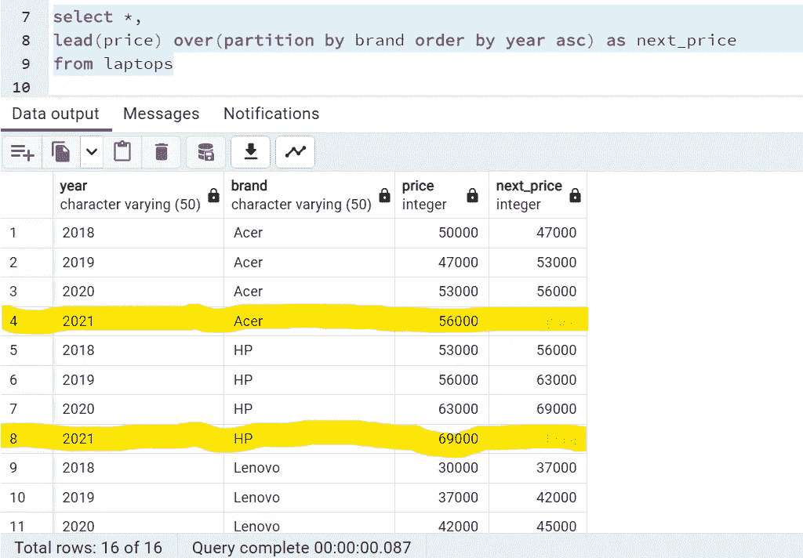
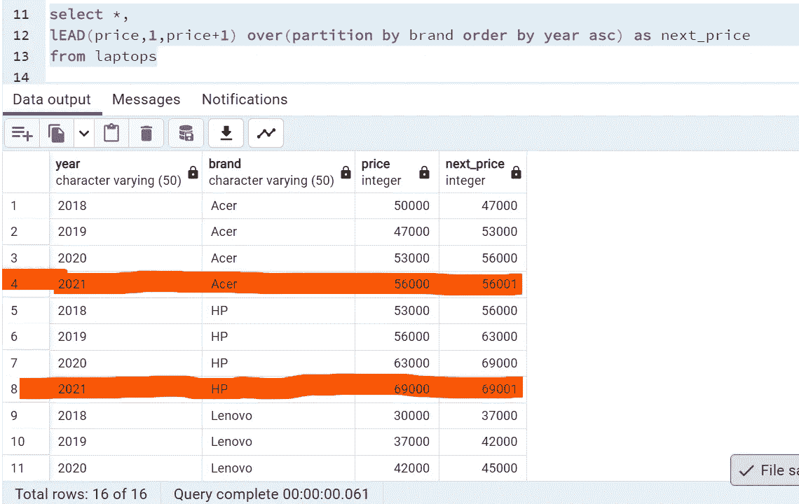
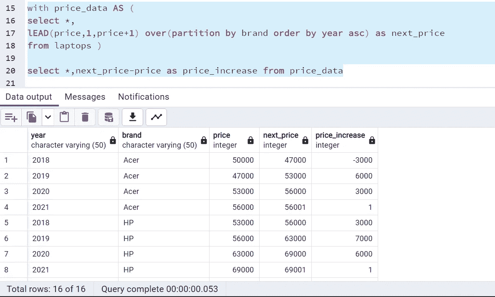
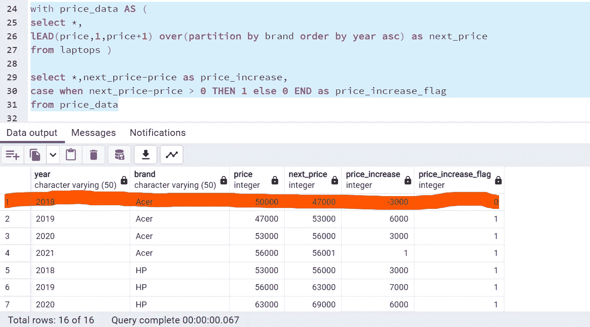
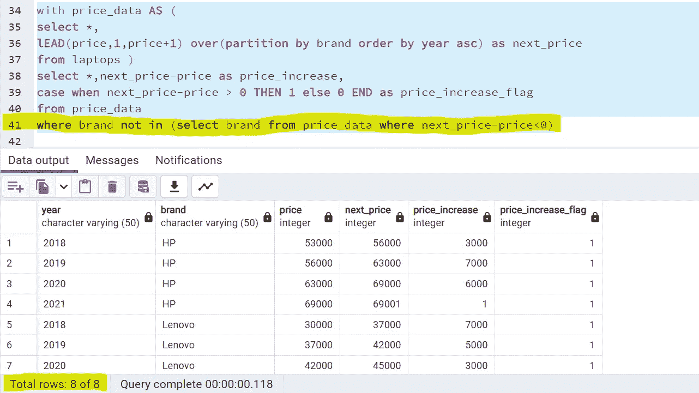
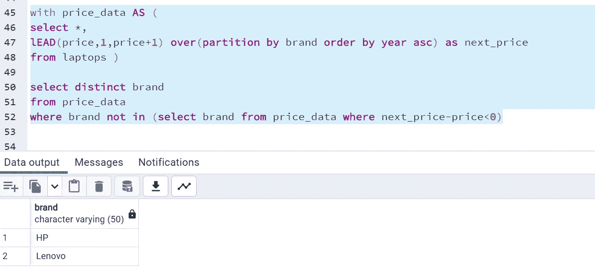

# SQL 面试问题 5:寻找笔记本电脑价格逐年上涨的品牌 Lead()窗口函数的使用案例

> 原文：<https://medium.com/geekculture/sql-interview-question5-finding-brands-with-increasing-prices-of-laptops-every-year-use-case-of-a2b46b9c7692?source=collection_archive---------8----------------------->

## SQL 面试问题系列中的第 5 名

## 最常见的 SQL 面试查询和概念#SQL #RDBMS


Photo by [Caspar Camille Rubin](https://unsplash.com/@casparrubin?utm_source=unsplash&utm_medium=referral&utm_content=creditCopyText) on [Unsplash](https://unsplash.com/s/photos/sql?utm_source=unsplash&utm_medium=referral&utm_content=creditCopyText)

大家好！！

这是 SQL 面试问题系列中的下一个面试问题。

> **问题陈述:今天的问题陈述是找出这些年来价格不断上涨的笔记本电脑品牌。**

**数据:**我们有一个名为 ***笔记本电脑*** 的表，有 3 列年份、品牌和价格，总共 16 条记录。数据是连续 4 年的，有 4 个不同的品牌和他们的价格。见下图选择*查询查看其详细信息:


Credits: By Author

现在，既然问题是找到明年的价格上涨。我们应该使用 ***lag()*** 或 ***lead()*** 窗口函数，这样我们就可以访问当前行的前一行或后一行的数据。让我们继续使用 ***lead()*** 函数来访问当前行中后续行的数据。**的语法为***的功能是:*

```
*Lead( expression, offset, default) Over(PARTITION BY ……… ORDER BY......)

Expression: Value which we want to return
Offset: The number of rows next from current row, which we want to access. By default, it is 1.
dafault: When succeeding row is not defined, specified deafult will be returned. If not mentioned, NULL will be returned for the last row, since they don't have any succeeding rows.*
```

*使用 lead()函数创建一个新列 *next_price，**

**

*Credits: By Author*

*这里发生了三件事:*

1.  ****partition by*** 子句将首先按每个品牌对数据进行分区。*
2.  ****Order by*** 将按日期升序排列数据。*
3.  ****【价格】*** 然后将填充当前行中下一行的数据。*

*因为对于所有品牌，2021 年的数据没有后续行，所以 *next_price* 将作为 NULL 返回，因为默认值中没有提到任何内容。*

*假设每个品牌明年的价格(2022 年)都将高于 2021 年的价格。让我们在其中加 1，并把它作为默认值，*

**

*Credits: By Author*

*下一步是使用带有 子句的 ***将它放在 CTE，并获取***price _ increase***列中每条记录的价格差。****

**

*Credits: By Author*

*主要任务是只获取那些价格一直上涨的品牌。为了前任。对于宏碁品牌，价格从 2018 年到 2019 年下降，然后上升，因此我们需要忽略该品牌，而对于惠普，价格在 4 年内一直上升，因此惠普应该在产量方面有所增长。*

*这里的逻辑是，我们可以创建一个 0，1 的标志，将 0 分配给价格下降的记录，而将 1 分配给价格上升的记录。让我们使用 ***case*** 语句来实现这一点，*

**

*Credits: By Author*

*现在，要删除这些品牌(注意:我们必须忽略具有单个 0 标志的整个品牌)，请将条件放在 ***where*** 子句中，*

**

*我们这里只剩下 2 个品牌，8 个记录。要看这些品牌，*

**

*Credits: By Author*

*所以这都是关于使用 lead()函数来查看每年笔记本电脑价格的增长。*

*你可以在我的 GitHub 页面链接上找到这些问题。*

*[](https://github.com/sdeeksha07/SQL-LEAD-AND-LAG-FUNCTION-USE-CASES/tree/main) [## GitHub-sdeeksha 07/SQL-领先和滞后-功能-用例

### 此时您不能执行该操作。您已使用另一个标签页或窗口登录。您已在另一个选项卡中注销，或者…

github.com](https://github.com/sdeeksha07/SQL-LEAD-AND-LAG-FUNCTION-USE-CASES/tree/main) 

希望对你有所帮助。

如有任何疑问，请通过 LinkedIn、Twitter 或电子邮件联系我。

***邮箱:sdeevi07@gmail.com***

【https://twitter.com/sdeeksha07】*碎碎念:*[](https://twitter.com/sdeeksha07)

****领英:***[***https://www.linkedin.com/in/sdeeksha07/***](https://www.linkedin.com/in/sdeeksha07/)*

***坚持学习，坚持练习！！****