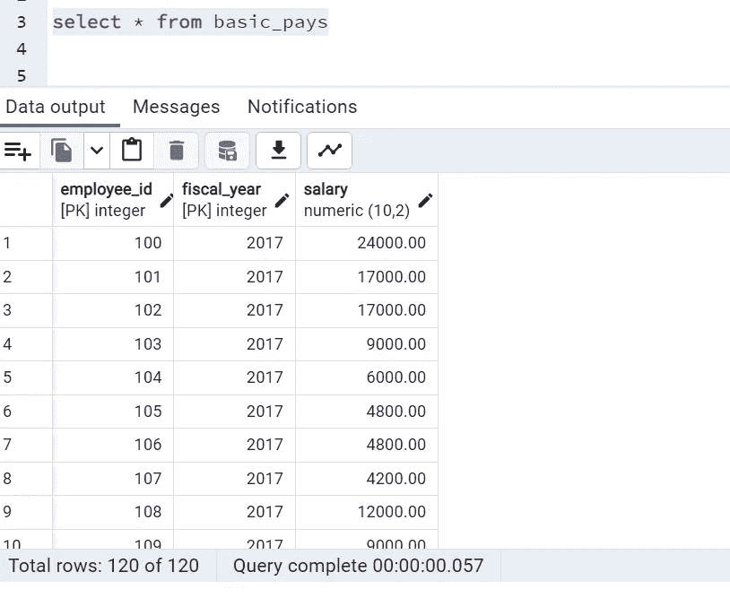
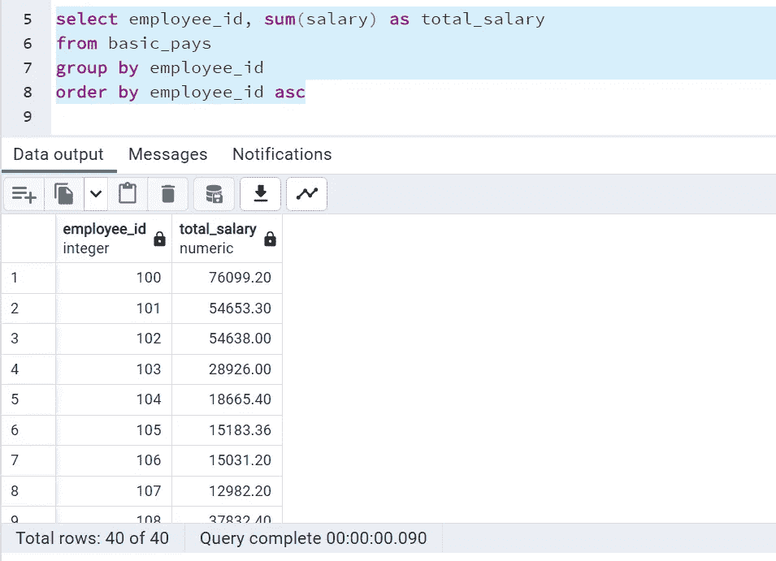
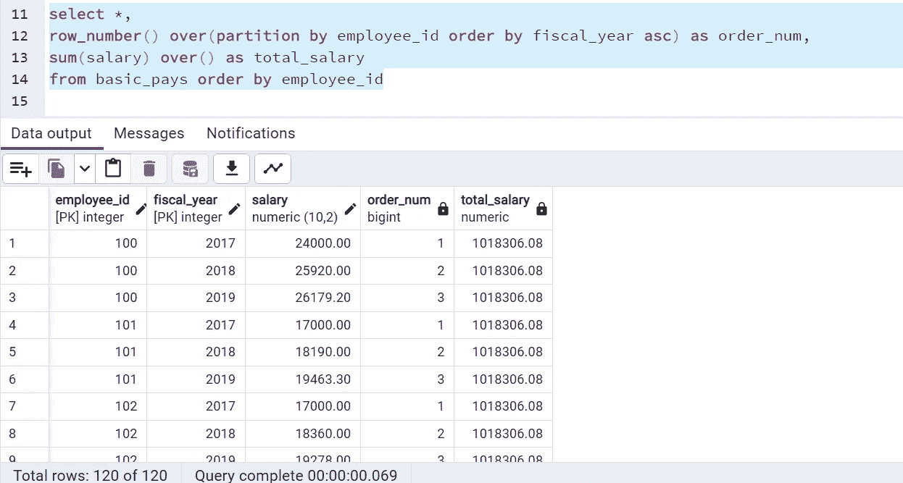
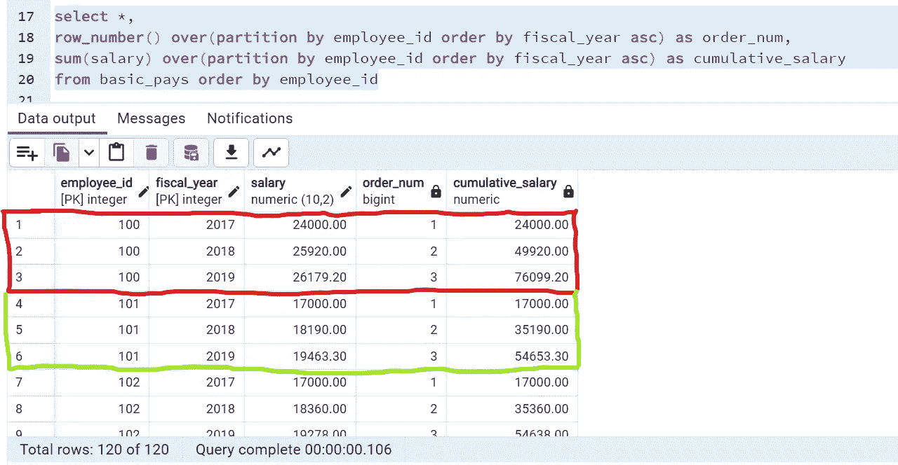

# SQL 面试问题 6:寻找累计总和—Sum()OVER()聚合窗口函数的用例

> 原文：<https://medium.com/geekculture/sql-interview-question6-finding-cumulative-sum-use-case-of-sum-over-aggregate-window-dfe379d39f63?source=collection_archive---------7----------------------->

## SQL 面试问题系列中的第 6 名

## 最常见的 SQL 面试查询和概念#SQL #RDBMS

Photo by [Kevin Ku](https://unsplash.com/es/@ikukevk?utm_source=unsplash&utm_medium=referral&utm_content=creditCopyText) on [Unsplash](https://unsplash.com/s/photos/database?utm_source=unsplash&utm_medium=referral&utm_content=creditCopyText)

你好。！

在本系列的前两篇文章中，我们介绍了用更简单的方式解决复杂查询的窗口函数的用例。接下来，今天我们将使用 ***SUM() OVER()聚合窗口函数*** 解决另一个查询。今天的问题陈述很简单，如果我们清楚窗口函数的概念，它将在一个查询中完成。

> **问题陈述:我们有员工连续三年的工资数据。按年计算每个雇员的工资总额。**

**数据:**我正在使用一个表 *basic_pays* 总共有 120 条记录，列 ***employee_id，fiscal_year，salary*** 并在 PostgreSQL 上运行我的查询。下面是表中的 *Select ** 查询的片段。

Credits: By Author

直观地说，如果我们想要每个员工的工资总额，我们可以使用简单的 ***sum()*** 作为聚合函数，并使用 ***group by*** 函数对每个员工进行分组。

Credits: By Author

sum 函数在这里做什么，它对 3 年的 3 行集合进行操作，并在按每个雇员分组的单个行中聚合输出。

但是问题陈述是要找到工资的累计总和而不是总工资。因此，我们不希望在一行中汇总所有的工资，而是希望进行累计。这里使用带有 over()子句的 ***sum()函数作为窗口函数*** 将完成我们的工作，即它不会将输出聚集在一行中。让我们这样做，不要在 over()子句中提及任何内容，

***由于我们没有在 over()子句*** 中提及任何内容，所以它将合计 120 条记录的总工资，并将其与个人工资一起显示。但是我们需要累积的总和，所以我们必须按员工对其进行划分，并按年份的升序按子句 进行排列。请参见以下查询:

Credits: By Author

从突出显示的部分，我们可以看到，对于每个员工，我们在每一行中都有按年的*累积 _ 薪资*，即当前薪资和以前总薪资的总和等等。

所以这一切都是为了找到运行总数。在我最近的一次采访中，有人问我这个问题。所以希望它也能对你有所帮助。

如有任何疑问，请通过 LinkedIn、Twitter 或电子邮件联系我。

***邮箱:sdeevi07@gmail.com***

***碎碎念:***[***https://twitter.com/sdeeksha07***](https://twitter.com/sdeeksha07)

***领英:***[***https://www.linkedin.com/in/sdeeksha07/***](https://www.linkedin.com/in/sdeeksha07/)

**坚持学习，坚持练习！！**