# SQL 面试问题 7:根据不同的 SQL 连接解释结果-必须了解基本概念

> 原文：<https://medium.com/geekculture/sql-interview-question7-interpreting-results-on-the-basis-of-different-sql-joins-must-know-bce8a6291cff?source=collection_archive---------8----------------------->

## SQL 面试问题系列中的第 7 名

## 最常见的 SQL 面试查询和概念#SQL #RDBMS

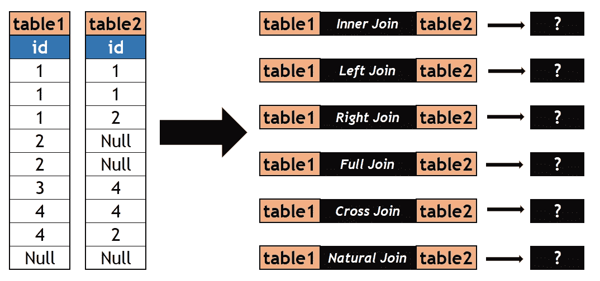

Credits: By Author

大家好！！

在我最近的一次面试中，我测试了对 SQL 连接的基本理解。面试官给我提供了两个表，每个表中只有一列，并要求我填写结果输出，如果我们在这两个表之间应用不同类型的连接。由于有许多重复值和空值，开始时很吓人，但是使用连接的基本概念，问题就解决了。所以，在今天的文章中，我想分享一下。请参见下面的问题陈述:

> 问题陈述:给定两个表 table1 & table2，其中有一些重复的&空条目，如果我们在它们之间应用不同类型的连接，输出会是什么？

**数据:我们有两个只有一个列 id 的表 table1 和 table2。参见下面的选择*查询:**

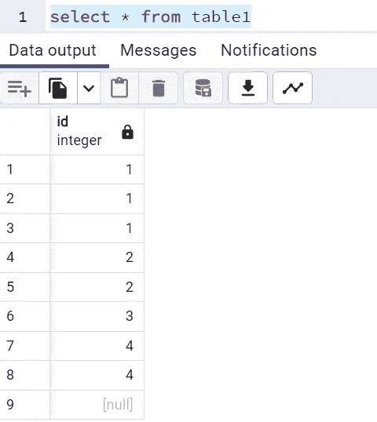

Credits: By Author

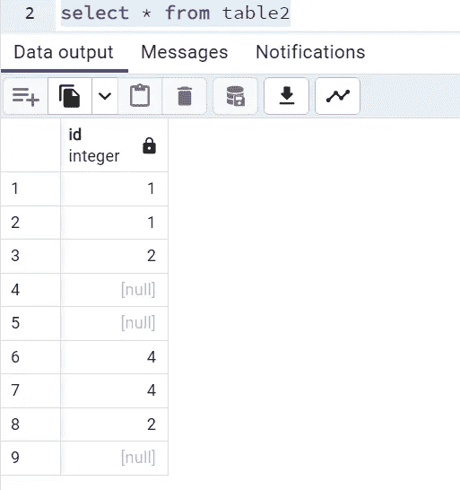

Credits: By Author

现在，我们将逐一查看每个连接，并尝试理解每个连接中涉及的结果输出和逻辑。

1。 ***内部连接:*** 返回两个表之间匹配的行。请参见下面的代码片段，了解它是如何工作的，

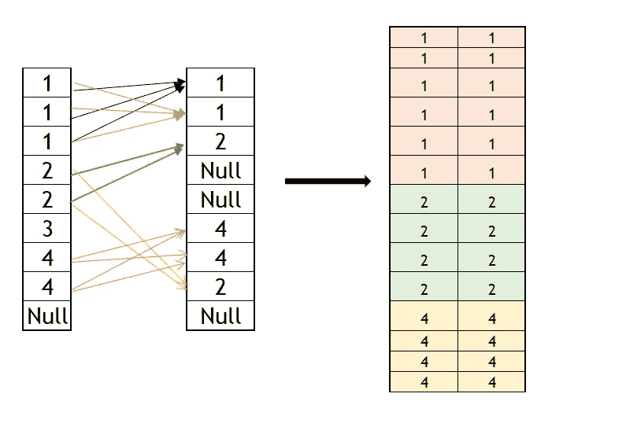

Credits: By Author

> 在运行查询时，总共会产生 14 条记录。 ***不要与两个表中的 NULL 匹配混淆，因为 NULL 没有定义，所以它不能与任何甚至不是 NULL 的东西混为一谈。***

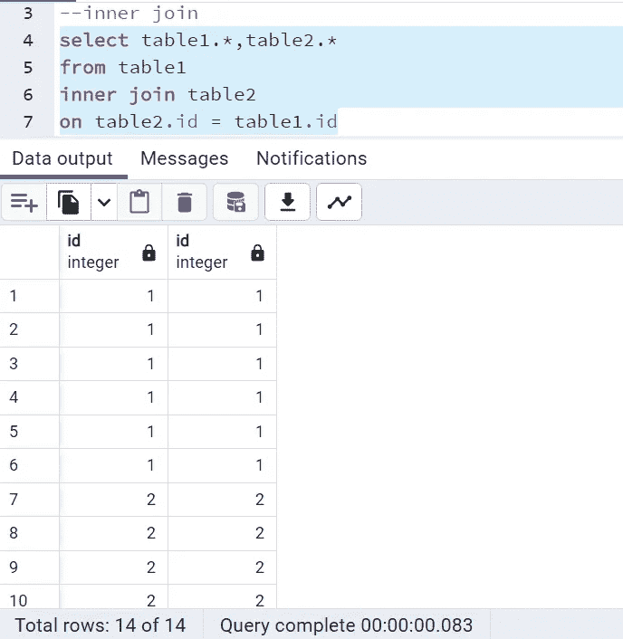

Credits: By Author

2。 **Left Join:** 将返回两个表中所有匹配的记录，如果没有找到与右表匹配的记录，还会返回左表中右表条目为空的其他记录。在执行左连接条件时，将返回总共 16 条记录，输出将是上面在与左表中另外两条不匹配记录的内部连接中获得的所有输出，即 3 个& NULL。对应于这两条记录的右表条目为空，因为它们不匹配。

Credits: By Author

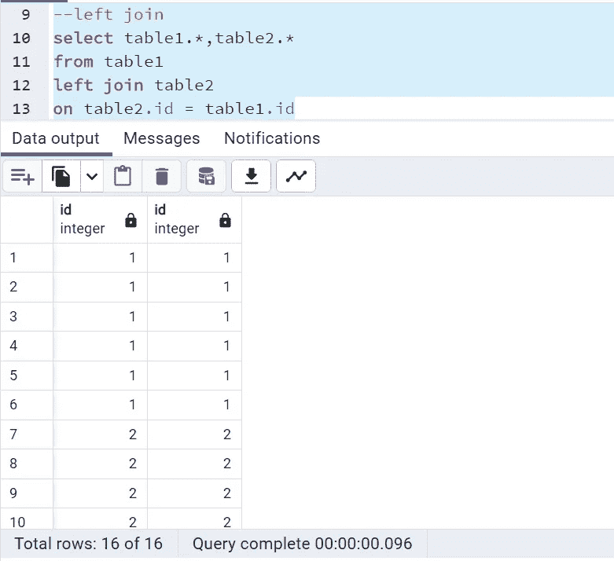

Credits: By Author

3。 **右连接:**如果没有找到匹配，将返回两个表中所有匹配的记录，右表中有多余的记录，左表中有空条目。因此，在这个连接中，总共将返回 17 个记录，即 14 个具有内部连接的记录加上右表中有 3 个空值，左表中有空条目。

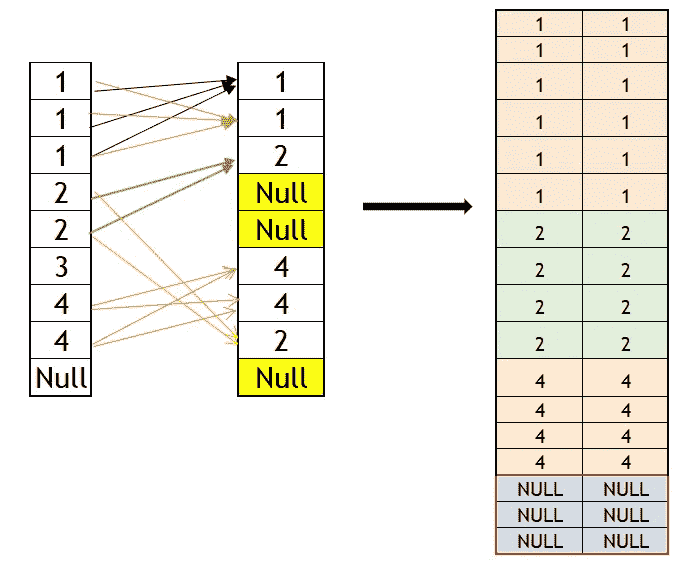

Credits: By Author

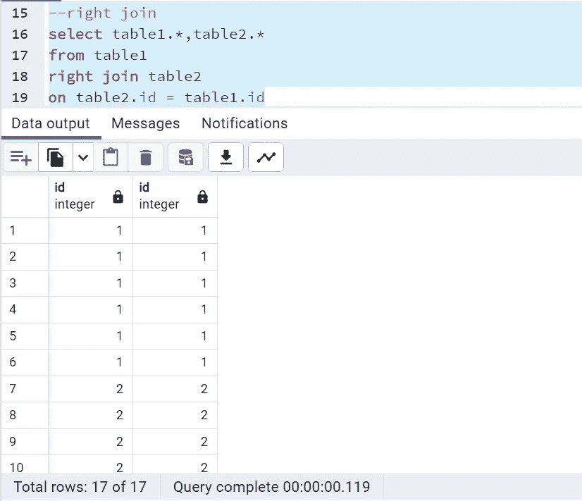

Credits: By Author

4。 **交叉连接:**将导致两个表的行的叉积，即表 1 中的每一行都将与表 2 中的每一行配对。返回的记录总数将是 9*9=81。执行连接操作时，交叉连接从不需要条件。参见下面的查询:

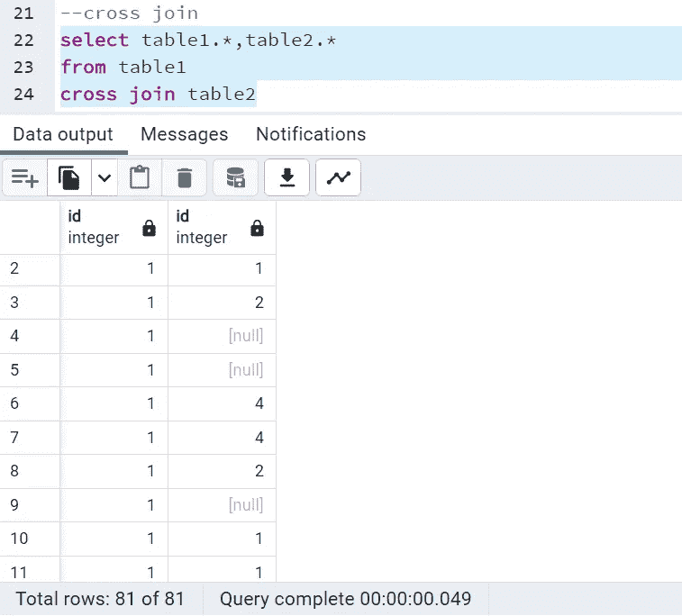

Credits: By Author

5。 **全外连接:**全连接是左右连接的组合。在运行该连接条件的查询时，它将产生两个表之间的所有匹配行，而左&右表中的其他行在两个表中都没有匹配记录。所以对于表 1 和表 2 的数据，

> ***内部连接导致 14 条记录***
> 
> ***左表有额外的 2 个值即 3 个& NULL***
> 
> ***右表多了 3 个空值***
> 
> ***所以总记录会是 14+2+3=19***

参见下面的查询:

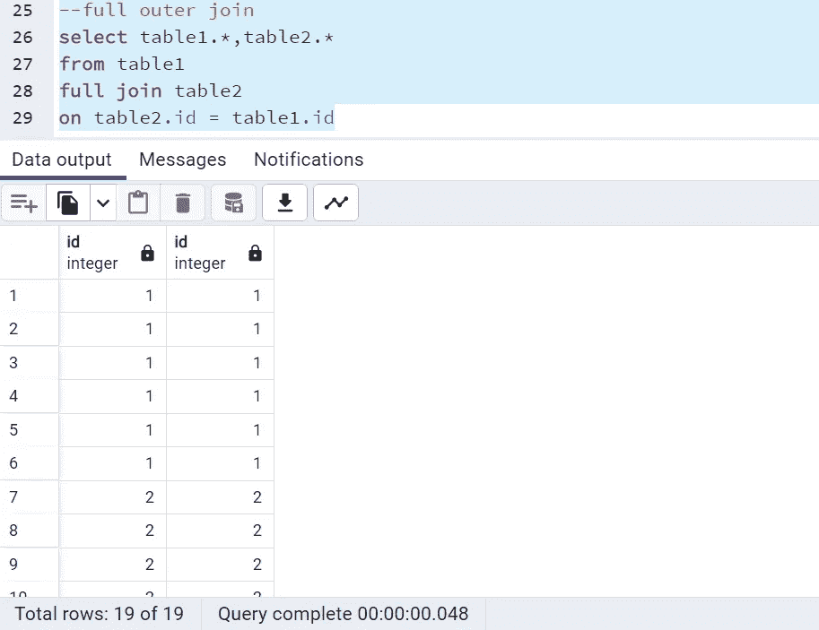

Credits: By Author

6。 **自然连接:**在这种连接中，连接基于相同的列名和数据类型。它从不需要条件来执行连接操作。此外，不建议使用太多，并且没有得到许多 RDBMS 的支持。

> **如果两个表中的列名相同，将产生类似于内部连接的结果。**
> 
> **而如果列名不相似，将导致类似交叉连接的输出。**

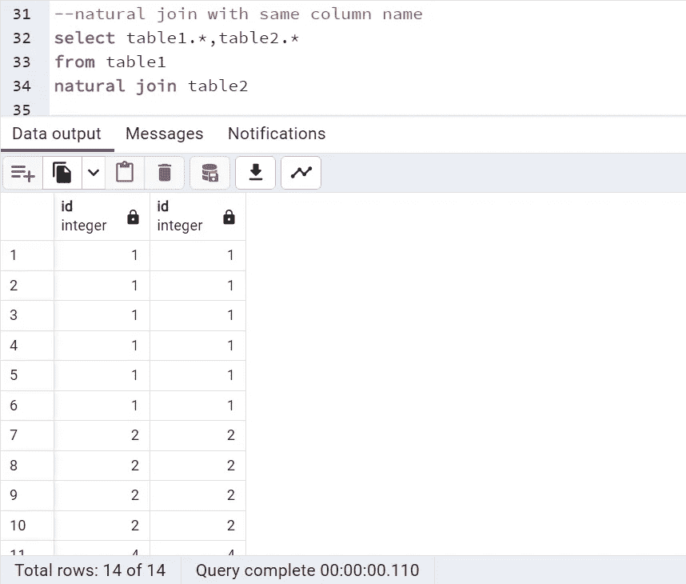

Credits: By Author

为了检查具有不同列名的自然连接，让我们看一个有 2 条记录和不同列名的表 3。

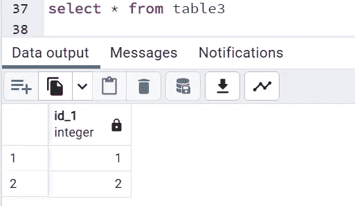

Credits: By Author

在执行自然连接时，将获得总共 9*2=18 行，类似于交叉连接。

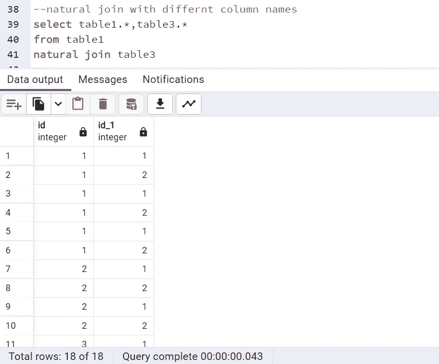

Credits: By Author

一切都是为了这篇文章。你可以在我的 GitHub 页面链接上找到这些问题:

 [## SQL-Self-Join-Use-Cases/主 sdeeksha 07/SQL-Self-Join-Use-Cases 处的 SQL 连接条件

### 在 GitHub 上创建一个帐户，为 sdeeksha 07/SQL-Self-Join-用例开发做贡献。

github.com](https://github.com/sdeeksha07/SQL-Self-Join-Use-Cases/blob/main/SQL%20Join%20Condition) 

为了更好地理解，你可以通过 Thoufiq 在 YouTube 上观看这个教程。

在我最近的一次采访中，有人问我这个问题。所以希望它也能对你有所帮助。

如有任何疑问，请通过 LinkedIn、Twitter 或电子邮件联系我。

***邮箱:sdeevi07@gmail.com***

***推特:***[***https://twitter.com/sdeeksha07***](https://twitter.com/sdeeksha07)

【https://www.linkedin.com/in/sdeeksha07/】*领英:* [***领英:***](https://www.linkedin.com/in/sdeeksha07/)

**坚持学习，坚持练习！！**