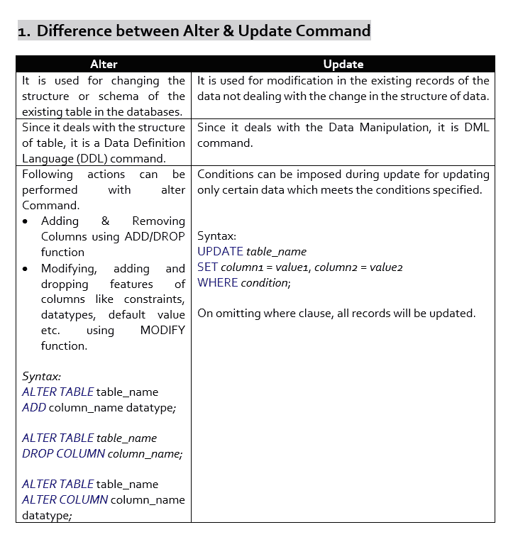
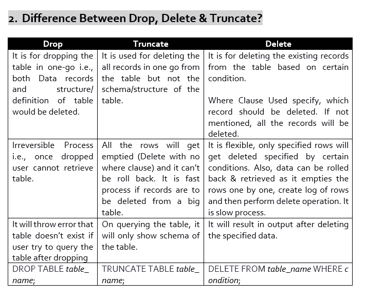
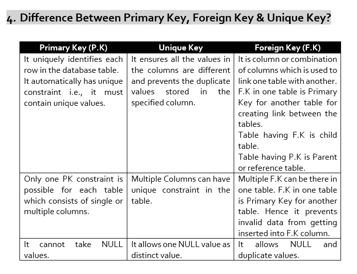
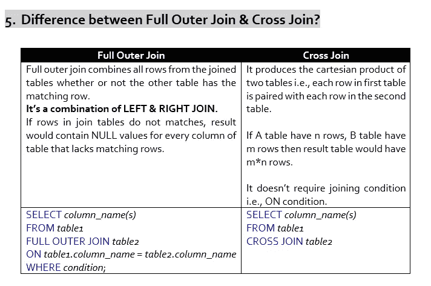
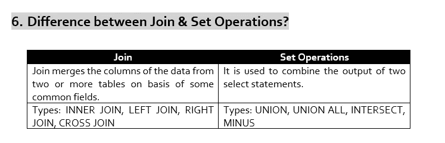
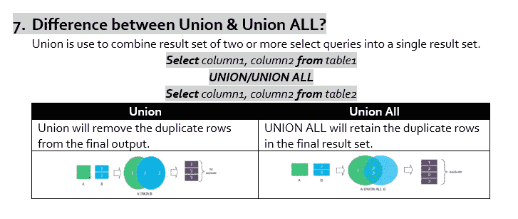
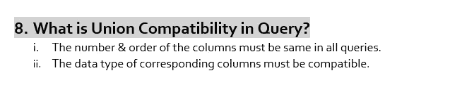
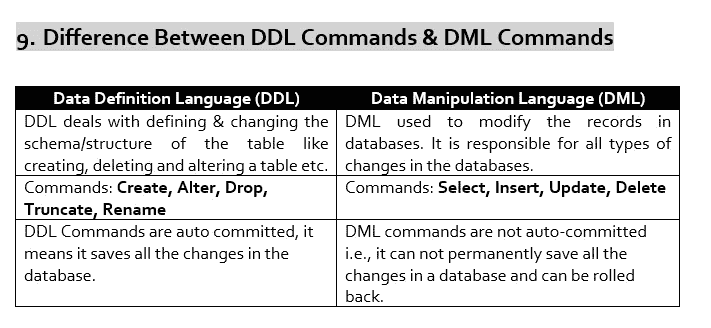
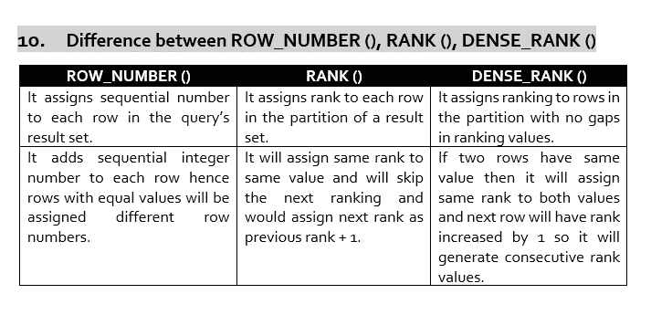

# SQL 面试问题 3:基于命令功能差异的问题

> 原文：<https://medium.com/geekculture/sql-interview-questions-based-on-difference-between-functionalities-of-commands-b0bf2c6f76a5?source=collection_archive---------8----------------------->

## SQL 面试问题系列中的第三名

## 最常见的 SQL 面试概念#SQL #RDBMS

Photo by [Rubaitul Azad](https://unsplash.com/@rubaitulazad?utm_source=unsplash&utm_medium=referral&utm_content=creditCopyText) on [Unsplash](https://unsplash.com/s/photos/sql?utm_source=unsplash&utm_medium=referral&utm_content=creditCopyText)

大家好！！

在一些公司的技术回合中接受采访时，当我在 Notepad++上解决 SQL 查询时，面试官一直问我我正在尝试做什么，我正在放置什么逻辑，如果我这样做会发生什么，例如，为什么我放置 row_number()而不是 rank()窗口函数，使用两者会在结果输出中产生什么差异，为什么我要做交叉连接而不是完全外部连接这样的问题。

因此，在今天的文章中，我将写 10 个主要问题，这些问题是基于看似相似但工作方式不同的命令之间的功能差异而提出的。这 10 个基本区别是:

1.  **Alter&Update 命令的区别？**
2.  **区别降，删除&截断？**
3.  **与&的区别在哪里？**
4.  **主键、外键的区别&唯一键？**
5.  **全外连接的区别&交叉连接？**
6.  **加入&集合操作的区别？**
7.  **工会的区别&工会所有？**
8.  **什么是查询中的联合兼容性？**
9.  **DDL 命令的区别& DML 命令？**
10.  **ROW _ NUMBER()、RANK()、DENSE_RANK()的区别？**

让我们一个一个来看。

Credits: By Author

Credits: By Author

Credits: By Author

Credits: By Author

Credits: By Author

Credits: By author

Credits: By Author

Credits: By Author

Credits: By Author

所以，所有这些都是我在 SQL 访谈中被问到的主要区别。希望它能帮助你把注意力集中在从面试角度来看很重要的概念上。

感谢阅读！！

如有任何疑问，请通过 LinkedIn、Twitter 或电子邮件联系我。

**【sdeevi07@gmail.com】邮箱:**

***碎碎念:***[***https://twitter.com/sdeeksha07***](https://twitter.com/sdeeksha07)

***领英:***[***https://www.linkedin.com/in/sdeeksha07/***](https://www.linkedin.com/in/sdeeksha07/)

**不断学习，不断练习！！**