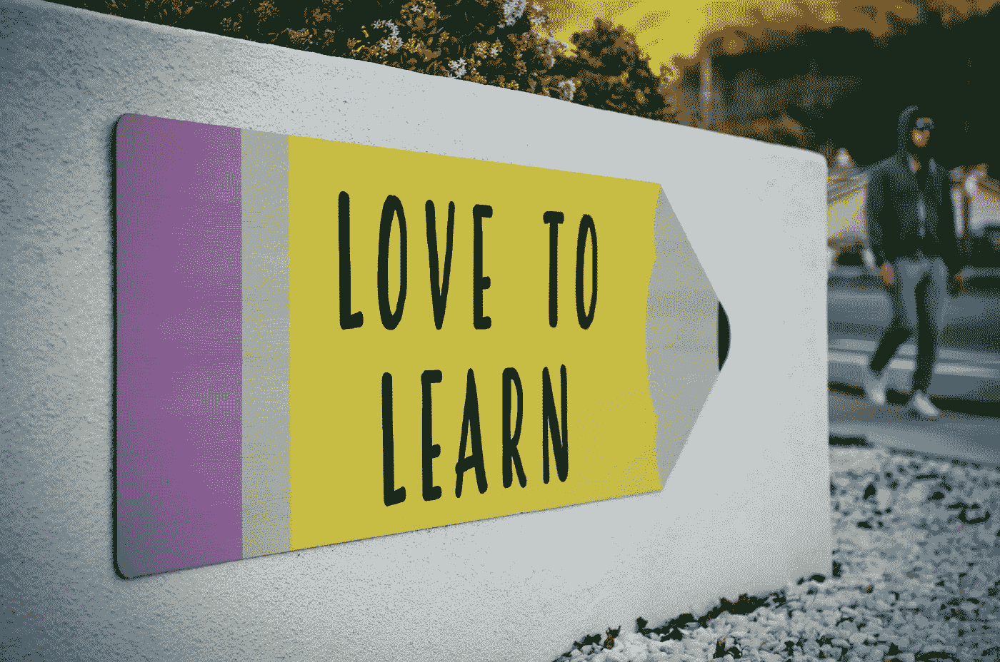

# 30 天免费 SQL 学习计划

> 原文：<https://medium.com/geekculture/sql-study-plan-for-30-days-from-scratch-for-free-cb8df85230f4?source=collection_archive---------4----------------------->

## 初学者的 SQL 之旅

SQL 是数据科学的核心。虽然它不仅仅是数据科学的一个方面，但它也构成了数据科学的一大部分。要从数据库中获取数据，您需要编写查询。通过编写简单、简洁的 SQL 代码，可以为您的数据模型带来许多好处。一个好处是，当您的查询写得很好时，它可以使您的模型运行得更快更有效。其次，它可以帮助您组装复杂的数据集和计算重要的业务指标。第三，当代码写得有效时，它可能有助于扩展您的业务，降低您的技术债务。

学习 SQL 有很多入门方法。我制定了一个 30 天的计划，从零开始免费使用 SQL。

Photo by [Tim Mossholder](https://unsplash.com/@timmossholder) on [Upslash](https://unsplash.com/photos/WE_Kv_ZB1l0)

**第一周:基本概念**

在第一阶段，您可以在 [sqlbolt](https://sqlbolt.com/) 和 [sqlzoo](https://sqlzoo.net/wiki/SQL_Tutorial) 上从基本的 SQL 数据库概念开始。你可以在上面完成所有的互动课程。完成这些教程后，您将能够

1.  查询数据库
2.  基于某些条件查询数据库
3.  了解聚合函数
4.  创建、更改、删除和丢弃表
5.  执行基本连接

**第 2 周:Join 和 Window 函数**

在下一阶段的学习中，您可以从 [w3schools](https://www.w3schools.com/sql/) 中了解更多关于 joins 的知识。之后，你可以在 [udacity](https://www.udacity.com/course/sql-for-data-analysis--ud198) 上开始 SQL 课程。

也可以从 YouTube 频道学习概念——[kudvenkat](https://www.youtube.com/watch?v=wW4xcQ3FFp4&list=PL08903FB7ACA1C2FB&index=13)、 [Ankit Bansal](https://www.youtube.com/playlist?list=PLBTZqjSKn0IeKBQDjLmzisazhqQy4iGkb) 、[破解概念](https://www.youtube.com/channel/UC43CDA3m7Nwfdj8B9SAZQ4A/videos)、 [techTFQ](https://www.youtube.com/c/techTFQ/playlists) 。

第三周:开始练习

在学习的第三阶段，您可以在[模式分析](https://mode.com/sql-tutorial/) SQL 教程中开始练习中级和高级 SQL 问题。它有一个名为“SQL 分析培训”的部分，包含实际的 SQL 问题，并有一系列真实的 SQL 问题。你也可以从 [HackerRank](https://www.hackerrank.com/domains/sql) 那里练习。它提供了一系列按难度划分的 SQL 问题。

**第四周:练习面试问题**

最后一步是将你学到的知识运用到面试问题中。您可以练习以下面试问题:

1- [**Leetcode**](https://leetcode.com/problemset/database/) :它提供了各种基于难度级别的 SQL 问题和公司中询问的技术问题。

2-[**Strascratch**](https://www.stratascratch.com/blog/categories/sql/):它还提供了各种大型科技公司正在询问的 SQL 问题。提供的数据库是 MySQL 或 PostgreSQL。

3- [**SQLPad**](https://sqlpad.io/) :还提供多种真实 SQL 面试问题。每个代码问题都有一个视频讲座，解释正在测试的想法(或概念)。此外，您可以在这里检查数据集并输入 PostgreSQL 和 MySQL 代码。

4-[**DataLemur**](https://datalemur.com/)**:**它免费提供 50+真实 FAANG SQL 面试问题。每个问题都有多个提示，完整的解决方案和一个活跃的讨论板！

SQL 是数据科学角色最重要的技能之一。虽然您可能认为了解 SQL 基础知识就足够了，但是您可以了解基础知识，然后仍然编写糟糕的代码。您必须定期练习和修改查询，以使它们更有效。

Diksha Mohnani 是一名商业分析师、作家、舞蹈家和创业爱好者。她目前在沃尔玛担任商业分析师。她热衷于将技术知识与她的创造力和领导技能结合起来，打造出优秀的产品。