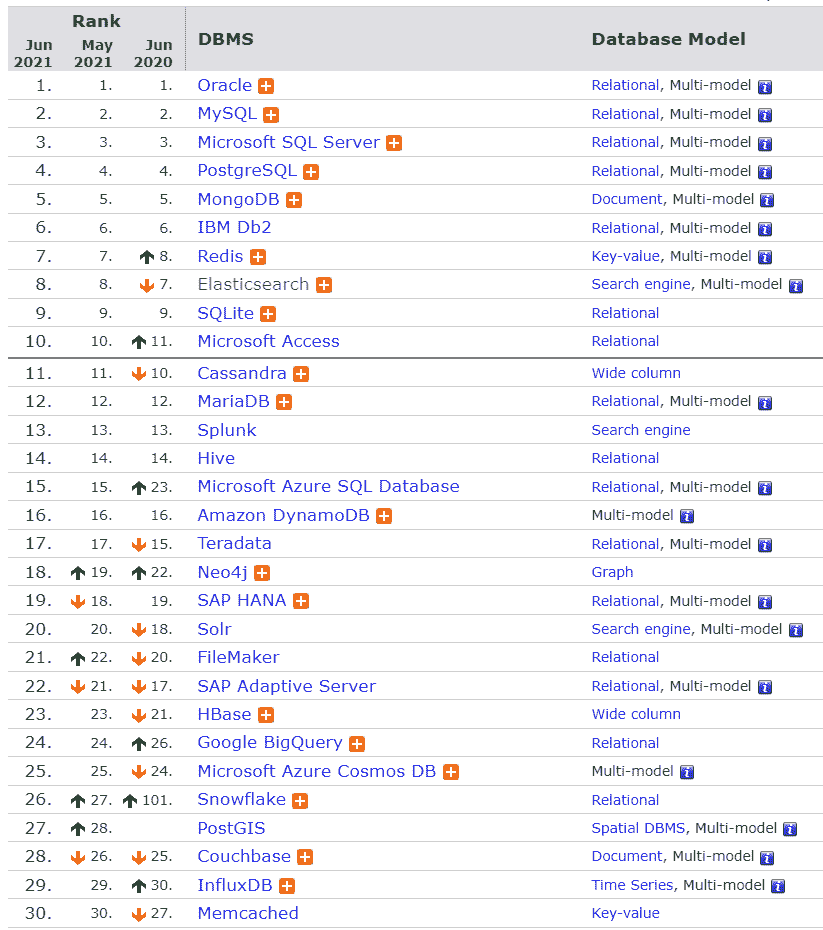

# SQL 与 NoSQL

> 原文：<https://medium.com/geekculture/sql-vs-nosql-92fa8ec1758b?source=collection_archive---------14----------------------->

## 两者的不同之处在于它们的构建方式、存储的信息种类以及存储方式。

在数据库领域有两种主要的解决方案:SQL 和 NoSQL——或者关系数据库和非关系数据库。两者的不同之处在于它们的构建方式、存储的信息种类以及存储方式。

关系数据库是结构化的，有预定义的模式，就像存储电话号码和地址的电话簿。非关系数据库是非结构化的、分布式的，并且具有动态的模式，就像保存从个人地址和电话号码到他们的脸书“喜好”和在线购物偏好的所有内容的文件夹。

# 结构化查询语言

关系数据库以行和列的形式存储数据。每行包含一个实体的所有信息，列是所有独立的数据点。

# NoSQL

以下是最常见的 NoSQL 类型:

## 键值存储

数据存储在一个键值对数组中。“键”是一个属性名，它链接到一个“值”

例如:Redis 和 Memcached。

## 文档数据库

在这些数据库中，数据存储在文档中，而不是存储在表中的行和列中，并且这些文档被分组到集合中。每个文档可以有完全不同的结构。

例:MongoDB。

## 宽列数据库

列数据库有列族，而不是“表”，列族是行的容器。与关系数据库不同，我们不需要预先知道所有的列，每行也不需要有相同的列数。因此，列数据库最适合分析大型数据集。

例:卡桑德拉和 HBase。

## 图形数据库

这些数据库用于存储数据，这些数据的关系最好用图形来表示。数据保存在具有节点(实体)、属性(关于实体的信息)和线(实体之间的连接)的图形结构中。

例:Neo4J。

## 搜索引擎数据库

它们用于搜索和分析非结构化数据。

例如:弹性搜索、Splunk 和 Solr

## 多模型数据库

多模型数据库是一种数据库管理系统，旨在支持单个集成后端的多个数据模型。

例如:DynamoDb 和 CosmosDb

## 时间序列数据库

它们针对运营监控、应用指标、物联网传感器数据和实时分析等领域的时序数据的快速、高可用性存储和检索进行了优化。

例如:涌入 DB

# SQL 和 NoSQL 的区别

## 储存；储备

SQL 将数据存储在表中，其中每行代表一个实体，每列代表关于该实体的一个数据点；例如，如果我们在一个表中存储一个汽车实体，不同的列可能是“颜色”、“品牌”、“型号”等等。

NoSQL 数据库有不同的数据存储模型。主要的有键值、文档、图表和列。

## (计划或理论的)纲要

在 SQL 中，每条记录都符合一个固定的模式，这意味着在数据输入之前必须决定和选择列，并且每行每列都必须有数据。该模式可以在以后修改，但是它涉及到修改整个数据库和脱机。

而在 NoSQL，图式是动态的。可以动态添加列，并且每个“行”(或等效行)不必包含每个“列”的数据

## 询问

SQL 数据库使用 SQL(结构化查询语言)来定义和操作数据，功能非常强大。

在 NoSQL 数据库中，查询集中在一组文档上。有时候也叫 UnQL(非结构化查询语言)。不同的数据库使用 UnQL 的语法不同。

## 可量测性

在大多数情况下，SQL 数据库是垂直可伸缩的，即通过增加马力(更高的内存、CPU 等)。)的硬件，这可能会变得非常昂贵。跨多个服务器扩展关系数据库是可能的，但这是一个具有挑战性且耗时的过程。

另一方面，NoSQL 数据库是水平可扩展的，这意味着我们可以在我们的 NoSQL 数据库基础设施中轻松添加更多的服务器来处理大流量。任何廉价的商用硬件或云实例都可以托管 NoSQL 数据库，因此比垂直扩展更具成本效益。许多 NoSQL 技术也自动跨服务器分发数据。

## 酸性合规性(原子性、一致性、隔离性、耐久性)

绝大多数关系数据库都是 ACID 兼容的。因此，当谈到数据可靠性和执行事务的安全保证时，SQL 数据库仍然是更好的选择。

大多数 NoSQL 解决方案为了性能和可扩展性而牺牲了 ACID 合规性。

# 用哪个？

就数据库技术而言，没有放之四海而皆准的解决方案。这就是为什么许多企业依赖于关系和

满足不同需求的非关系数据库。尽管 NoSQL 数据库因其速度和可伸缩性而越来越受欢迎，但仍然存在高度结构化的 SQL 数据库性能更好的情况；选择正确的技术取决于使用案例。

## 使用 SQL 数据库的原因

1.  我们需要确保酸性合规性。ACID 合规性通过准确规定事务与数据库的交互方式，减少了异常并保护了数据库的完整性。通常，NoSQL 数据库为了可伸缩性和处理速度而牺牲了 ACID 遵从性，但是对于许多电子商务和金融应用程序，ACID 遵从性数据库仍然是首选。
2.  您的数据是结构化的，不会改变。如果您的企业没有经历需要更多服务器的大规模增长，并且您正在处理一致的数据，那么可能没有理由使用旨在支持各种数据类型和高流量的系统。

## 使用 NoSQL 数据库的理由

1.  当存储大量数据时，这些数据通常很少甚至没有结构。NoSQL 数据库对我们可以保存在一起的数据类型没有限制，并允许我们根据需要的变化添加不同的新类型。使用基于文档的数据库(如 MongoDB 和 ElasticSearch)，您可以将数据存储在一个地方，而无需事先定义它们的“类型”。
2.  充分利用云计算和存储。基于云的存储是一种非常节省成本的解决方案，但需要数据能够轻松地分布在多个服务器上以进行扩展。在现场或云中使用商用(价格合理、体积较小)硬件可以省去额外软件的麻烦，而且像 Cassandra 这样的 NoSQL 数据库被设计为开箱即可跨多个数据中心扩展，没有很多麻烦。
3.  快速开发:NoSQL 对于快速开发非常有用，因为它不需要提前准备。如果您正在进行系统的快速迭代，需要频繁更新数据结构，并且在版本之间没有太多停机时间，那么关系数据库会降低您的速度。

# 流行

来源:[数据库引擎](https://db-engines.com/en/ranking)

截至 2021 年 6 月，前 30 个最常用的数据库中有 18 个是关系数据库。

Oracle、MySQL 和 SQL Server 是最常用的 SQL/关系数据库，而 MongoDB、Redis 和 Elasticsearch 是最常用的 NoSQL 数据库。