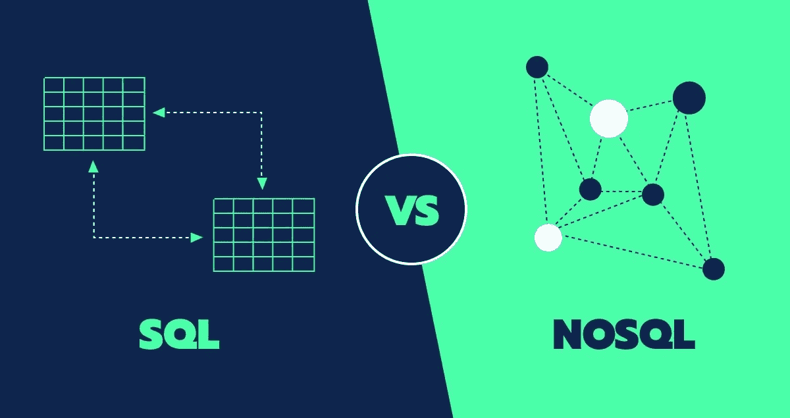

# SQL 与 NoSQL 数据库

> 原文：<https://medium.com/geekculture/sql-vs-nosql-database-c6bbfc73db54?source=collection_archive---------7----------------------->



SQL Vs NoSQL Database

有两种主要类型的数据库:SQL(关系型)和 NoSQL(非关系型)。选择正确的数据库可以简化您的应用程序。本文将帮助您理解这两个数据库之间的区别，并帮助您为您的应用程序选择正确的数据库。

# SQL —关系数据库

*   SQL 指的是像 excel 一样以行和列存储数据的关系数据库。
*   SQL 数据库只能存储结构化数据。

```
Database --> Tables(s)
```

# SQL 数据库示例

*   Db2
*   关系型数据库
*   一种数据库系统
*   Oracle 数据库
*   Microsoft SQL Server

# NoSQL —非关系数据库

*   NoSQL 指的是以非表格形式存储数据的非关系数据库，如文档(JSON)、键值、图形或宽列存储。
*   NoSQL 数据库可以存储结构化、半结构化和非结构化数据。

```
Database --> Collection(s) --> Objects(s)
```

# NoSQL 数据库示例

*   雷迪斯
*   MongoDB
*   弹性搜索

# NoSQL 比 SQL 快吗？

*   SQL 数据库是标准化的数据库，其中的数据被分解成不同的逻辑表，以避免数据冗余和数据重复。在这种情况下，SQL 数据库在连接、查询、更新等方面比 NoSQL 数据库更快。
*   NoSQL 数据库是专门为非结构化数据设计的，这些数据可以是面向文档的、面向列的、基于图形的等等。在这种情况下，特定的数据实体存储在一起，而不是分区。因此，与 SQL 数据库相比，NoSQL 数据库在单个数据实体上执行读或写操作更快。

# 在以下情况下使用 SQL 数据库

*   您正在处理结构不经常变化的数据。
*   对于事务管理用例。
*   您有复杂的连接和相关数据(复杂的查询更容易用 SQL 编写，计算也很快)。
*   您的数据库数据可以放在一台机器上，而不需要纵向扩展。

# 使用 NoSQL 数据库，如果

*   您经常修改数据库，但不确定模式设计。
*   适用于图形数据和实时应用，如物联网、游戏等。
*   如果系统中的大多数查询是过滤、条件、分组或排序；意思是当你有简单的查询时。

# 结论

*   SQL 和 NoSQL 之间的数据库的选择不能根据它们之间的差异，而是根据项目需求。如果你不确定模式或创建实时物联网或游戏应用程序，请使用 NoSQL else SQL。

感谢阅读。如果你发现这篇文章有用，别忘了**鼓掌**和**与你的朋友和同事分享。如果你有任何问题，请随时联系我。**与我联系👉**[**LinkedIn**](https://linkedin.com/in/hiteshmishra708)**，**[**Github**](https://github.com/hiteshmishra708)**:)****