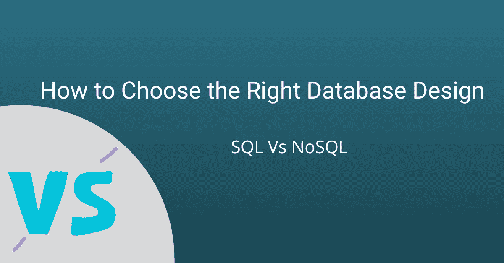
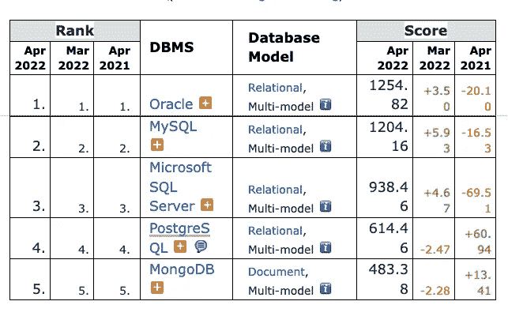

# SQL 与 NoSQL —如何选择合适的数据库设计

> 原文：<https://medium.com/geekculture/sql-vs-nosql-how-to-choose-the-right-database-design-1fccd8c6d7?source=collection_archive---------6----------------------->

# **简介:**

在当今的发展中国家，通常使用两种类型的数据库，即 SQL 和 NoSQL。在开发你的项目时，你一定遇到过很难决定选择哪一个的情况。因此，在本文中，我们将介绍这两种数据库之间的差异，这样下次您开始一个项目时，选择正确的数据库就不再是一个挑战。

正确的数据库可以简化您的应用程序，而错误的选择会使它变得复杂。SQL 数据库曾经是大多数组织的首选，因为它们能够保护数据并提供完整性。但是，随着云技术和互联网的发展，数据量变得越来越大，许多组织现在都在使用 NoSQL 数据库。与 SQL 相比，NoSQL 可以更轻松地管理非结构化数据。

虽然许多信息技术部门继续维持更传统的工作负载以及他们的现代应用程序，但在决定选择哪个数据库(NoSQL 或 SQL)时可能会感到困惑。两者都有优点和缺点，但是它们构造、保存和管理数据的方法是不同的。一个组织只有了解两种数据库的用例，才能在选择数据库类型方面做出更好的决策。

截至 2022 年 4 月，领先的 6 个数据库系统中有 5 个是 SQL 数据库。其中前 4 名是

*   神谕
*   关系型数据库
*   SQL Server
*   一种数据库系统

# **什么是 SQL？**

关系数据库或 SQL 数据库根据传统的格式存储数据(每个数据库都包括许多表)。在这个数据库中，数据通常以行和列的形式表示。例如，在“学校”数据库中，您可能有学生、职员和餐馆注册号码的表。

# **什么是 NoSQL？**

在初级水平上，NoSQL 不仅仅意味着 SQL。因此，它不代表单个数据库；相反，它代表了多种技术。这些数据库在本质上是非常不同的。随着各种选项的出现，如 MongoDB、Amazon DynamoDB 和 Apache HBase，NoSQL 数据库最近变得流行起来。

*   NoSQL 数据库不使用 SQL
*   在 NoSQL 数据库中，数据通常不是以表格的形式存储的
*   NoSQL 数据库通常不需要正式的数据模式(这有助于使它们比 SQL 数据库更加灵活)
*   关系通常对 NoSQL 数据库并不重要
*   与 SQL 数据库不同，NoSQL 数据库不需要正式定义的模式，因此更加灵活。

# **如何在 SQL 和 NoSQL 之间选择合适的数据库设计？**

## **1)数据结构**

决定数据库的一个非常重要的因素是我们数据的外观。通常，SQL 数据库适用于主要是结构化的数据。

此外，它还是面向交易的应用程序(如 CRM 工具和在线购物平台)的理想数据库。

SQL 数据库包含代表不同实体(例如，学生)的行和描述这些实体(例如，学生的姓名、学号、获得的分数等)的列。).

当我们需要 ACID 属性(原子性、一致性、隔离性、持久性)时，SQL 是最合适的选择。ACID 是确保数据库事务完整性和可靠性的原则。当我们需要处理非常结构化的数据和 ACID 合规性时，SQL 是一个非常好的选择。

如果我们不清楚数据要求，或者我们的数据结构不合理，NoSQL 可能更合适。与 SQL 数据库不同，在 NoSQL 数据库中存储数据之前，我们不需要定义模式。数据可以以图表、键值对或面向文档的方式高效地动态存储。

**使用 NoSQL，您可以:**

*   您不必预先定义文档的结构
*   您可以创建新字段，而无需更改现有字段。
*   使用 NoSQL 时，您可以存储具有独特结构的文档
*   维护许多具有独特结构的数据库

NoSQL 数据库非常适合存储博客、社交媒体网站和应用上的帖子以及不容易放入表格的非结构化数据等内容。

## **2)查询数据**

接下来，我们必须决定从数据库中查询数据的频率和速度。事实上，您的数据得到了良好的管理和结构化，这使得 SQL 在搜索数据时非常高效。

在 NoSQL 的开发过程中，开发人员更关注可伸缩性和灵活性，而不是有效地从数据库中查询数据。NoSQL 提供了非常好的灵活性和可伸缩性，这对用户来说是一个巨大的优势，但在查询数据方面，SQL 要好得多。查询 NoSQL 数据库通常成本较高，效率较低。

您计划经常从数据库中查询数据吗？谁将负责运行这些查询？这些因素将决定是选择 SQL 还是 NoSQL。

## **3)缩放比例**

扩展 SQL 数据库意味着提高单台服务器的处理能力，这就是所谓的垂直扩展。纵向扩展数据库并不是一件容易的事情，因为它们最初是为在单个服务器上运行而开发的。

另一方面，NoSQL 数据库很容易扩展，可以水平扩展，也就是说，随着数据库的增长，我们可以增加服务器的数量。由于 NoSQL 数据库没有结构，它们能够水平伸缩，从而可以轻松管理大量数据。与 SQL 相比，NoSQL 中的每个对象都是独立的，这使得多个对象可以保存在不同的服务器上，它们之间没有任何联系。

这使得 NoSQL 数据库成为处理大量数据的首选，因为添加更多的服务器比增加单个服务器的容量来构建稳定的系统更好。

如果你想通过一个例子来理解它，你可以通过想象社会中的一座建筑来理解它。如果来社会上居住的家庭数量增加，增加楼层数好还是增加建筑物数好？如果你从长远考虑，那么增加建筑物的数量将是一个更好的选择，以提供一个稳定的结构。

## **4)标准化**

SQL 语言用于构建复杂的查询，以管理和查询 SQL 数据库中的数据。SQL 非常容易实现，甚至那些没有技术背景的人也可以使用它，这就是为什么它是一种广泛使用的语言。SQL 是标准化的，这就是为什么任何人学习它都很容易。

NoSQL 缺乏标准化，因此它有许多不同的方法来存储和使用数据，这使得它难以学习和执行复杂的查询。由于没有标准语言，NoSQL 不适合执行复杂的查询。

SQL 数据库中的标准化有助于执行复杂的查询，但也使它受到限制，因为我们必须预先定义模式，并且频繁地更改模式非常困难。

举个例子，一个程序员新手可以学习 MongoDB 和 Apache HBase，这两个都是很好的 NoSQL 数据库。然而，如果一个程序员最初学习 MongoDB，他们可能仍然会与 Apache HBase 斗争，因为 NoSQL 缺乏标准。即使你学会了其中的任何一种，你在学习另一种时仍然会有问题，因为 NoSQL 缺乏标准化。

## **5)社区支持**

在 NoSQL 数据库出现之前，关系数据库已经在市场上存在了很长一段时间，因为 NoSQL 是在 2000 年初介绍给用户的。SQL 社区非常大，当用户面临问题时，所有的 SQL 数据库供应商都会提供良好的支持。你可以在网上找到很多论坛，专家在那里与用户分享他们的知识。

此外，NoSQL 数据库也开始看到同样的增长，但他们中的许多人仍然依赖开源社区的支持。SQL 的程序员从来不会碰到解决不了的问题，但是有了 NoSQL，有时用户很难解决问题。

## **6)正常化**

为了防止数据库中的数据重复，使用了规范化。通过这种方法，可以防止重复数据被反复存储。随着数据库的出现，数据的重复已经成为一个关键问题。因此，它是关系数据库中一个极其严格的约束。

显然，将存储在不同表中的记录连接成一个逻辑单元需要时间。此外，标准化过程需要额外的时间和资源来创建、更新和维护索引文件。有些人反对标准化，认为在引入 SQL 数据库的时候，存储数据的成本非常高，因此需要一种技术来减少冗余数据。

但是，与当时相比，目前存储数据的成本非常低，因此 NoSQL 数据库的开发人员认为没有必要引入标准化。由于目前可用的存储和内存成本较低，一些数据冗余可以忽略。

支持 NoSQL 的人还指出，某种程度的数据冗余可以提高从数据库中查询数据的速度，从而使这个过程变得高效。

我们希望在考虑了这些要点之后，你能够为你的下一个项目选择正确的数据库。如果你想了解更多关于 SQL vs NoSQL 的知识，你可以看看这个 [**来源**](https://www.interviewbit.com/blog/sql-vs-nosql/) 关于 SQL 和 NoSQL 的主要区别

## **总结:**

以下是为您的项目选择合适的数据库时应该记住的一些要点的总结:

## **什么时候使用 NoSQL？**

*   如果数据量很大或者是非结构化的，那么在这种情况下应该首选 NoSQL。
*   如果用户对 oops(即面向对象的编程)感到满意，那么 NoSQL 就是理想的数据库。
*   如果您的应用程序非常大，伸缩性是一个问题，那么 NoSQL 应该是首选。
*   万一你想有一个功能强大又不太贵的架构。
*   如果您不希望有一个预定义的模式，并且希望经常更改结构，那么 NoSQL 也是首选。
*   就可伸缩性和灵活性而言，NoSQL 是更好的选择。

## **什么时候使用 SQL？**

*   如果您希望获得良好的社区支持，那么 SQL 是您的最佳选择。
*   对于执行复杂的查询操作，SQL 应该是首选。
*   当我们需要 ACID 属性时，SQL 是最合适的选择
*   如果您想要数据的一致性，并且您的应用程序不需要频繁和大的更改，那么您可以选择 SQL 数据库。
*   另外，请记住 SQL 数据库使用结构化查询语言，标准化也是存在的。

# **结论**

因此，通过适当的研究，根据需要和期望的结果选择正确的 DBMS 是可行的。如今，软件开发需要同时使用 SQL 和 NoSQL，因为两者各有优缺点。SQL 数据库可以受益于 NoSQL 的质量和能力，而 NoSQL 数据库可以包括来自 SQL 数据库的元素。您团队的需求应该决定您选择哪个数据库，即您是选择 NoSQL 数据库还是 SQL 数据库。

一些人错误地认为同时使用这两种技术是无效的。事实上，在一起使用时，两个数据库的优势可以结合起来。许多公司使用这两种数据库运行基于云的基础设施。