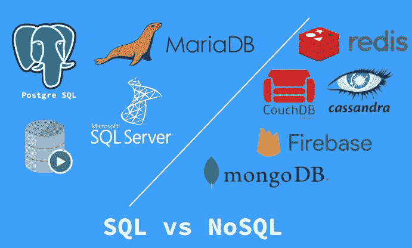

# SQL vs NoSQL:选择哪个数据库？

> 原文：<https://medium.com/geekculture/sql-vs-nosql-which-database-to-choose-347839f4513f?source=collection_archive---------26----------------------->

## 在一个有如此多类型数据库可用的时代，很难为您的项目选择最好的一个。在本文中，我们将首先了解哪种数据库最适合您的项目需求。

Comparisons with Example

在本文中，我们将**主要关注 NoSQL** 及其工作原理，因为它通常是在时间紧迫的情况下快速开发的最佳选择，或者是在解决方案或产品需要不断扩展、快速查询、允许频繁应用程序更改(这意味着不断更改数据库及其组件)的情况下。

# 什么是 NoSQL 数据库？

NoSQL 数据库(**又名“不仅是 SQL”**)是非表格的，存储数据的方式不同于关系表。基于数据模型，NoSQL 数据库有多种类型。主要类型有文档、键值、宽列和图形。

这些数据库以不同于关系表的格式存储数据。它们提供了灵活的模式，可以在大量数据和高用户负载的情况下轻松扩展。

一个常见的误解是 NoSQL 数据库或非关系数据库不能很好地存储关系数据。NoSQL 数据库可以存储关系数据，只是存储方式与关系数据库不同。

事实上，与 SQL 数据库相比，许多人发现在 NoSQL 数据库中建模关系数据比在 SQL 数据库中更容易，因为相关数据不必在表之间拆分。

随着存储成本的快速降低，应用程序需要存储和查询的数据量增加了。这些数据以各种形式和大小出现——结构化的、半结构化的和多态的——并且预先定义模式是不可能的。

NoSQL 数据库允许开发人员存储大量的非结构化数据，这给了他们很大的灵活性。

# 那么什么是 SQL 数据库呢？

现在我们已经了解了 NoSQL 数据库，让我们将它们与传统上最流行的数据库进行对比:由 SQL(结构化查询语言)访问的关系数据库。当与关系数据库交互时，可以使用 SQL，在关系数据库中，数据存储在具有固定列和行的表中。

SQL 数据库在 20 世纪 70 年代初开始流行。当时，存储非常昂贵，因此软件工程师对他们的数据库进行了标准化，以减少数据重复。

在 20 世纪 70 年代，许多软件工程师开始使用瀑布软件开发模型。他们详细地计划他们的项目，一路上创建复杂的实体关系图，这阻止了软件工程师在开发周期中适应需求的变化。结果，项目经常超出预算，超过期限，并且不能满足用户的需求。

# NoSQL 数据库有哪些类型？

与关系数据库相比，NoSQL 数据库有许多优点。NoSQL 数据库具有灵活的数据模型，可水平扩展，查询速度极快，并且易于开发人员使用。

随着时间的推移，出现了四种主要类型的 NoSQL 数据库:文档数据库、键值数据库、宽列存储和图形数据库。让我们检查每一种类型。

*   **文档数据库**将数据存储在像 JSON (JavaScript 对象符号)对象这样的文档中。每个文档都包含成对的字段和值。这些值通常可以是各种类型，包括字符串、数字、布尔值、数组或对象。它们的结构通常与开发人员在代码中工作的对象一致。由于其多种多样的字段值类型和强大的查询语言，文档数据库非常适合各种各样的用例，并且可以用作通用数据库。它们可以横向扩展以容纳大量数据。 **MongoDB** 和 **Cloud FireStore** 是流行的文档数据库。
*   **键值数据库**是一种更简单的数据库，其中每一项都包含键值。值通常只能通过引用其键来检索，因此学习如何查询特定的键-值对通常很简单。键值数据库非常适合需要存储大量数据，但不需要执行复杂的查询来检索数据的用例。常见的用例包括存储用户偏好或缓存。 **Redis** 和 **DynamoDB** 是流行的键值数据库。
*   **宽列存储**在表格、行和动态列中存储数据。与关系数据库相比，它提供了很大的灵活性，因为不要求每行都有相同的列。许多人认为宽列存储是二维键值数据库。当您需要存储大量数据并且可以预测您的查询模式时，宽列存储非常有用。宽列存储通常用于存储物联网数据和用户档案数据。Cassandra 和 HBase 是两家最受欢迎的宽栏商店。
*   **图形数据库**在节点和边中存储数据。节点通常存储关于人、地点和事物的信息，而边存储关于节点之间关系的信息。它们可以在各种需要发现数据模式的场景中平稳运行，如社交网络、欺诈检测和推荐引擎用例。 **Neo4j** 和 **Janus Graph** 是图形数据库的例子。

# NoSQL 数据库如何工作

从设计角度理解 NoSQL 数据库的吸引力的一种方法是，在一个使用地址数据的过于简单的例子中，看看 SQL 和 NoSQL 数据库的数据模型可能是什么样子。

**SQL 案例→** 对于 SQL 数据库，为地址建立数据库始于格式的逻辑构造，并期望要存储的记录保持不变。在分析了预期的查询模式之后，SQL 数据库可能会优化两个表中的存储，一个表用于基本信息，另一个表用于客户信息，姓氏是这两个表的关键字。

**NoSQL 案→** 在上面 NoSQL 数据库的类型部分，描述了四种类型，每种类型都有自己的数据模型。

每种类型的 NoSQL 数据库都是根据特定的客户情况设计的，而且每种数据库的组织方式都有技术上的原因。最简单的描述类型是文档数据库，在这种数据库中，将基本信息和客户信息组合在一个 JSON 文档中是很自然的。

# TL；速度三角形定位法(dead reckoning)

## 告诉我 SQL 和 NoSQL 的主要区别

# 这一切都很好！但是它有哪些弊端是我在入门前应该了解的？

*   NoSQL 数据库最常被提及的缺点之一是它们**不支持跨多个记录的 ACID(原子性、一致性、隔离性、持久性)事务**。然而，对于许多应用来说，这是一个可接受的要求。
*   由于 NoSQL 的数据库是针对面向查询的数据进行优化的，而不是为了减少数据重复，因此它们可能比 SQL 数据库更大。存储目前非常便宜，大多数人认为这是一个小缺点，一些 NoSQL 数据库也支持压缩以减少存储空间。
*   根据您选择的数据库类型，您可能无法获得单一数据库的全部优势。例如，图形数据库很适合分析数据，但可能无法为日常操作提供必要的工具。

> SQL 和 NoSQL 数据库在不同的应用程序和场景中都有自己的用例，因此您可能需要选择多个数据库来支持您的应用程序。

希望它能帮助你找到你要找的信息。😃😃

在 LinkedIn[LinkedIn](https://www.linkedin.com/in/1220atul/)和 GitHub 上与我联系了解更多信息。