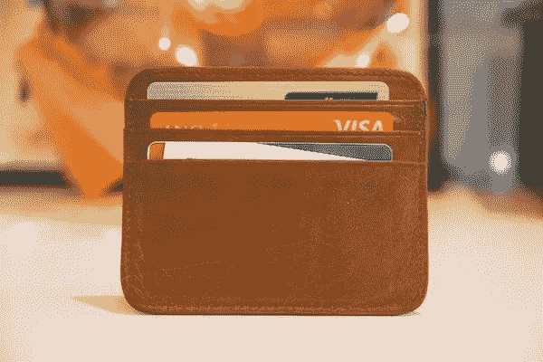

# Square 总法律顾问提供成功经验

> 原文：<https://medium.com/geekculture/square-general-counsel-offers-lessons-for-success-3ed7f98e1887?source=collection_archive---------12----------------------->

Photo by [Stephen Phillips — Hostreviews.co.uk](https://unsplash.com/@hostreviews?utm_source=unsplash&utm_medium=referral&utm_content=creditCopyText) on [Unsplash](https://unsplash.com/s/photos/credit-card?utm_source=unsplash&utm_medium=referral&utm_content=creditCopyText)

Sivan Whiteley 是金融科技支付公司 Square 的总法律顾问。她是一个出色的律师，承担着众多具有挑战性的职责。作为 Square 法律部门的负责人，她面临着许多复杂的法律、监管和业务问题。怀特利还驾驭着管理一家科技公司的大型法律部门的需求。尽管规模庞大，该公司保留了许多创业文化的特征。

Square 由杰克·多西于 2009 年创立，是全球最大的金融科技公司之一。Square 最初的灵感来自于多尔西和他的联合创始人观察一个沮丧的小企业主。业主无法处理销售，因为他缺乏接受信用卡付款的技术。该公司的第一款产品是 Square Reader，这是一款连接移动设备音频插孔的信用卡处理工具。Square 的销售点系统为小型和大型企业提供无缝的商户处理。

如今，Square 的一些主要竞争对手包括 PayPal、Shopify 和 Clover。多尔西还担任 Twitter 的首席执行官，该公司是他在 2006 年创建的。

## **Square 用两个连续的女 GC 打破了模式**

Sivan 就读于加州大学圣地亚哥分校，本科时主修政治学和经济学。然后她去了哈佛法学院。怀特利在一家律师事务所开始了她的职业生涯，她的第一个内部法律角色是在易贝。然后，她在 Better Place 担任了[公司的副总法律顾问](https://corporatecompliancehq.org/what-does-an-associate-general-counsel-do/)，Better Place 是一家为电动汽车开发电池充电服务的初创公司。

Photo by [Nathan Dumlao](https://unsplash.com/@nate_dumlao?utm_source=unsplash&utm_medium=referral&utm_content=creditCopyText) on [Unsplash](https://unsplash.com/s/photos/harvard-law-school?utm_source=unsplash&utm_medium=referral&utm_content=creditCopyText)

Square 之前的总法律顾问希拉里·史密斯也毕业于哈佛法学院。当史密斯在 2016 年加入 Square 时，她获得了 800 万美元的薪酬包。史密斯于 2018 年卸任，但在担任 Square 总法律顾问期间，史密斯在推出 Cash App 上的比特币交易方面发挥了举足轻重的作用，Cash App 是 Square 于 2013 年开发的移动支付服务。比特币交易一直是 Square 的巨大利润来源。2021 年第二季度，Square 从比特币交易中获利 5500 万美元。2021 年第一季度，Square 通过处理比特币交易产生了 7500 万美元的收入。

## **Square 的法律部门如何以不同的方式做事**

与许多其他公司不同，Square 的法律部门在决策和制定公司战略过程中发挥着关键作用。怀特利与其他首席执行官密切合作，包括首席执行官杰克·多西和首席财务官阿姆里塔·阿胡佳。

“杰克很久以前就给我们起名为‘法律顾问团队’，这不是一个空洞的名字，他相信这个职能是作为顾问，从一开始或者当有人有想法的时候就在房间里的人，”怀特利说。当你转移资金时，一切都受到监管，所以作为一名律师，这是一个令人兴奋的地方，因为你不只是在房间里，因为你是被迫在房间里，或者因为你是一个复选框:他们希望你在那里。"

在她的领导下，Square 的法律部门专注于提高某些法律流程的自动化程度。例如，Whiteley 希望使用人工智能技术来自动起草保密协议、弃权书和其他相对标准化的合同。

## **Square 向其他行业扩张**

Square 总部位于旧金山，于 2015 年在纽约证券交易所上市。它目前的市值约为 1200 亿美元。如今，Square 的销售点软件已在全球多个国家推出，可以接受不同货币的支付，包括澳元和日元。

虽然 Square 最出名的是其点对点支付，但该公司正在向投资和银行服务领域大步迈进。Square 最近宣布收购 Afterpay Limited，这是一个开创性的“现在购买，以后支付”平台。一旦 Square 将 Afterpay 引入 Cash 应用程序，分期付款购买的客户就可以在应用程序中管理自己的账户。

尽管 Square 主要是一家金融服务公司，但它已经涉足其他业务领域。Square 于 2014 年收购了食品配送公司 Caviar。Square 后来在 2018 年以 4.1 亿美元的价格向 DoorDash 出售了鱼子酱。它还涉足音乐行业。2021 年 3 月，Square 达成协议，收购 Jay-Z 旗下音乐流媒体公司 Tidal 的多数股权。

## **一名 GC，他还监督多样性倡议**

因此，作为 Square 的总法律顾问，Whiteley 负责监管广泛的商业行业。她必须掌握影响 Square 业务各个领域的最新法律、商业和监管发展。

除了参与 Square 的法律和业务职能之外，她还参与多元化计划。“我发现，真正分散的是，人们带来了一个多元化的群体，但不是谁在真正处理你的问题。我们正在做一项审计，看看每个人开了多少小时的账单，”Whiteley 评论道。“即使在会议中，如果你有一群不同的人过来开会，当你注意谁在发言时，情况还是一样的。”