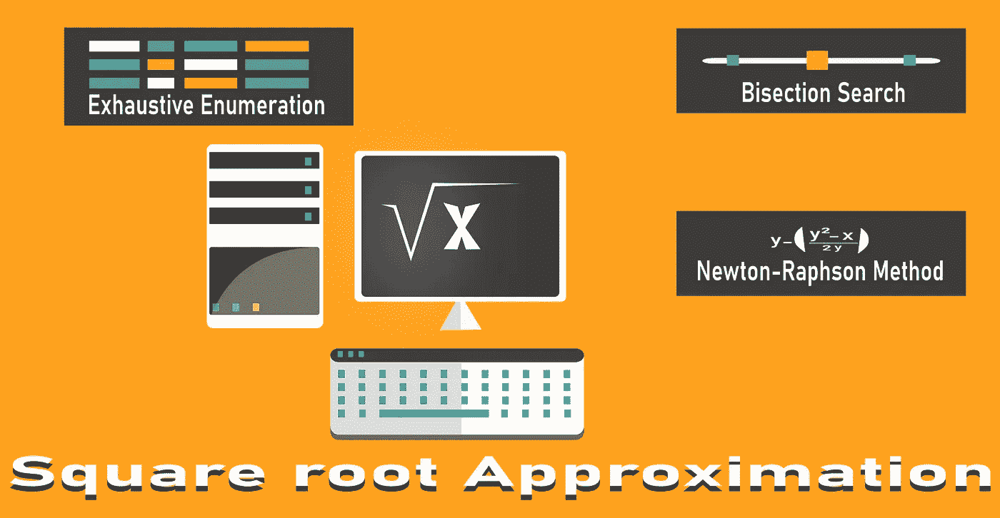

# 平方根近似技术

> 原文：<https://medium.com/geekculture/square-root-approximation-techniques-fcfd46ed0e5c?source=collection_archive---------0----------------------->

Square Root Approximation Techniques

在这篇文章中，让我们看看一些平方根近似算法和技术。我们将从一个基本的暴力方法开始，并逐步提高其效率和复杂性。

在现实世界中，我们永远不需要编写算法来计算一个数的平方根，因为它是由几乎所有主流编程语言的基本数学包/模块来处理的。