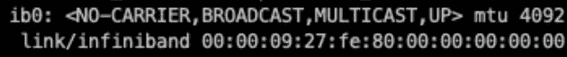

# Mellanox ConnectX-6 Infiniband 上的 SRIOV:奋斗与学习

> 原文：<https://medium.com/geekculture/sriov-on-mellanox-connectx-6-infiniband-struggles-learnings-26fd49db6fc2?source=collection_archive---------4----------------------->

我在将虚拟机连接到 infiniband 分配的虚拟功能的过程中获得的重要经验。


Image courtesy [Flat Icons](https://www.flaticon.com/free-icon/network_660502?term=network&related_id=660502)

按照[文档](https://docs.nvidia.com/networking/pages/viewpage.action?pageId=39279752#SingleRootIOVirtualization(SRIOV)-ConfiguringSR-IOV(InfiniBand))在带有 Mellanox Infiniband 卡的系统上配置 SRIOV，除了虚拟机& infiniband 之间的连接因为虚拟功能状态为 down 而无法工作之外，一切都按预期工作。

```
[root@mymy858 ~]# ibstat
CA 'mlx5_0'
        CA type: MT4124
        Number of ports: 1
        Firmware version: 20.28.4512
        Hardware version: 0
        Node GUID: 0x000000
        System image GUID: 0xbbbbbb
        Port 1:
                State: Down
                Physical state: LinkUp
                Rate: 10
                Base lid: 65535
                LMC: 0
                SM lid: 1
                Capability mask: 0x22221
                Port GUID: 0x000000
                Link layer: InfiniBand
```

在虚拟机中，如果您运行`ip a`，您可能会注意到在虚拟机内部看到的 ib0 链接上的`<NO-CARRIER>`。



## 发现的问题

*   在此环境中，多个子网管理器(opensm)在不同的系统上运行。
*   其中一些子网管理器没有配置默认的`priorities`
*   我们不知道哪个子网管理器是主管理器，也不知道它是否启用了`virtualisation`？

## 学习

*   不要配置多个子网管理器。默认情况下，mellanox 交换机上带有一个 SM。将此 SM 作为您的主要 SM。您可以通过交换机 UI 将该 SM 的优先级设置为 15(最大值)。
*   确定有多少 SM 正在运行。运行`ibdiagnet`来找出正在运行的 SM 的数量以及哪个具有最高优先级。您将在`ibdiagnet`的输出中找到这些信息。

```
Master SM: Port=0 LID=1 GUID=0x0abcdefghijkl devid=123456 Priority:14 Node_Type=SW Node_Description=MF0;switch-bkbkbk:MSB0012/U1
Standby SM : No Standby SM
```

*   在大多数情况下，最好只让一个 SM 运行，最好是在交换机上。
*   通过 mellanox 交换机控制台执行以下命令，在交换机上运行的 SM 上启用虚拟化。

```
ib sm virt enable
```

最后，虚拟功能链路启动，虚拟机到 infiniband ib0 的连接正常🍪

```
[root@mymy858 ~]# ibstat
CA 'mlx5_0'
        CA type: MT4124
        Number of ports: 1
        Firmware version: 20.28.4512
        Hardware version: 0
        Node GUID: 0x000000
        System image GUID: 0xbbbbbb
        Port 1:
                State: Active
                Physical state: LinkUp
                Rate: 100
                Base lid: 11
                LMC: 0
                SM lid: 1
                Capability mask: 0x22221
                Port GUID: 0x000000
                Link layer: InfiniBand
```

# 摘要

我希望这篇文章能为陷入这种困境的人提供有用的指导。如果您对 infiniband 上的 SRIOV 有任何疑问，请随时发表评论。

祝你好运。

— — — — — —